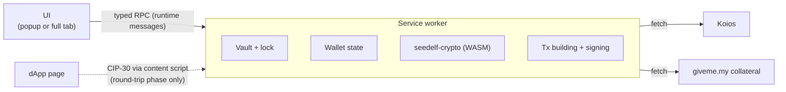

# Architecture

Keep it light: a small Manifest V3 extension, the Seedelf crypto and transaction building we already have in Rust (compiled to WebAssembly), and Koios for chain data. Nothing else unless it earns its place.

## Shape

- **Service worker:** owns everything that matters.
  - While unlocked, it holds the decrypted secret. It is the only place secrets ever exist.
  - It also holds wallet state, builds and signs transactions, and makes all network calls.
- **UI:** renders state and sends the user's actions to the service worker. It never holds keys. The only secret it ever sees is the recovery phrase, while the user writes it down or types it in during onboarding.
- **Content scripts:** v1 has none. They arrive with the contract round trip, to offer CIP-30 on one-time accounts.
  - This matters for security: v1 injects nothing into web pages.
  - v1 only needs host permissions for Koios and giveme.my, not `<all_urls>`.

## Service worker

- **The worker owns the state and the UI mirrors it.** The UI takes a snapshot on open (the `status` request), then refreshes whenever the worker broadcasts `state-changed`, for example on auto-lock. This is Lace's model, minus its framework.
  - The wallet states are `no-wallet`, `locked` and `unlocked` (`extension/src/background/wallet.ts`).
  - The worker runs state changes one at a time, so two pages can't race each other past the unlock back-off.
- **Chrome kills an idle worker after about 30 seconds.** State must reload from storage on every wake-up. The worker's timers don't survive either, so auto-lock uses `chrome.alarms`.
  - Register event listeners synchronously, before the first `await`, or the event that woke the worker is lost.
- **The worker is an ES module** (`"type": "module"` in the manifest).
  - Static imports of the extension's own files are fine. The build emits `sw.js` plus a shared chunk.
  - Dynamic `import()` and top-level `await` are not allowed in service workers, so WASM initializes lazily: `loadWasm()` in `extension/src/background/wasm.ts`.
  - Lace's classic-worker `importScripts` preloading isn't needed.
- **Staying unlocked across restarts (built in chunk 5).** A worker restart loses everything held in memory, including the unlocked keys. The popup can't hold the keys either, because it closes as soon as the user clicks away.
  - On unlock, the vault's entropy goes into `chrome.storage.session` (`seedelf.entropy`), along with the time of the last activity (`seedelf.lastActivity`). That storage is in memory only, never written to disk, cleared when the browser closes, and not readable by content scripts.
  - A restarted worker re-derives the keys from there, unless the auto-lock deadline has passed, in which case it locks.
  - **Lock** (manual or auto-lock) clears the key from session storage as well as from memory.
  - The result: the wallet stays unlocked until auto-lock or browser close, instead of asking for the password after every idle restart.

## Crypto

- **Seedelf cryptography comes from [seedelf-crypto](../../seedelf-crypto/), compiled to WebAssembly with `wasm-bindgen`.**
  - This is the same prover the CLI already runs against the on-chain verifier.
  - It covers register creation, re-randomization, the ownership check and Schnorr proofs.
  - One implementation, so there are no byte-for-byte parity problems.
- **One WebAssembly crate for the wallet:** [seedelf-web-wallet/wasm](../wasm/) (`seedelf-wasm`), a Cargo workspace member.
  - It exposes only what the extension needs, for both crypto and [transaction building](#transaction-building).
  - `build.sh` produces an ES module with the `wasm-release` cargo profile: about 1.2 MB, 419 KB gzipped (see [Transaction building](#transaction-building)).
  - Its tests check the output against native Rust byte for byte.
- **Build settings:**
  - `getrandom` 0.2 with the `js` feature, set in the wasm crate.
  - `CC_wasm32_unknown_unknown=clang`, because `blst` is C code.
  - `AR_wasm32_unknown_unknown=llvm-ar`, which is `llvm-ar-18` on Ubuntu.
  - `wasm-bindgen-cli` pinned to the crate's `wasm-bindgen` version.
- **The manifest CSP needs `script-src 'self' 'wasm-unsafe-eval'`** to load WebAssembly.
- **Recovery phrases (BIP39) are handled in Rust too:** generation, validation and the Seedelf key derivation. See [keys-and-accounts.md](keys-and-accounts.md#seedelf-key-derivation).
- **Everything else uses small, audited JS libraries:**
  - `@noble/hashes` (Argon2id, BLAKE2b)
  - `@noble/ciphers` (ChaCha20-Poly1305)

## Transaction building

**Decided: Rust (Pallas 0.33), compiled to WebAssembly.**

- **One implementation.** The CLI already builds every Seedelf transaction with Pallas: registers, reference-script spends, the fee and ex-unit loop, and the collateral-service witness. Offline integration tests cover it. Reusing it gives the same single implementation as the crypto.
- **The rejected option was a TypeScript library.** Lace's `TransactionBuilder` has no reference inputs, so we would have had to port the Seedelf logic by hand.

**Status (chunk 13):** every v1 transaction is built on it: move-in, creating a seedelf, transfer, withdraw, removing a seedelf, a send from the Cardano account, and staking (delegate, vote, withdraw rewards, stop).

- **`seedelf-core` compiles to WebAssembly.** The one blocker was `seedelf-koios` setting `connect_timeout` (and `timeout`) on its HTTP client; `reqwest`'s browser build has neither, so both are gated with `#[cfg(not(target_arch = "wasm32"))]`.
- **The WebAssembly module is about 1.3 MB** (439 KB gzipped since chunk 13's staking; it was 424 KB). It's loaded from the extension itself, so this only costs a moment on the worker's first start.
  - `build.sh` uses the workspace's `wasm-release` profile: `opt-level = "z"`, LTO, one codegen unit, stripped. It halved the module (it was 2.3 MB, 582 KB gzipped) at the same speed. The BLS arithmetic is blst's C, and a proof takes about 1.8 ms either way.
  - `wasm-opt` was measured on top and left out: it made the file 9 % smaller but its gzipped size 6 % larger, and the Web Store's download is a zip.
  - `wasm/bench.mjs` measures the size and the speed of a build.
- **Network-free builders** live in [`seedelf-core/src/build.rs`](../../seedelf-core/src/build.rs). A builder takes chain data the caller already has (protocol parameters, UTxOs as Koios returns them, deserialized into the same `seedelf-koios` types) and returns an unsigned transaction.
  - `external_sweep`: the CLI's `external sweep`, now a thin `run()` around it. Its offline tests pass unchanged.
  - `move_in` and `account_send`: the web wallet's move-in and its send from the Cardano account (see [flows.md](flows.md#move-in-cardano-account--seedelf)). Both are one account payment to a `Payee`: into Seedelf (deposits, tokens 20 to an output) or to a key address (one output). They share the UTxO choice and the change, and may spend any UTxO they're given: the web wallet leaves out its collateral and the UTxOs the user locked ([coin control](#chain-data), chunk 12). Until then they never spent a pure 5 ₳ UTxO, as the CLI's `collect_address_utxos` doesn't.
  - `mint`: the CLI's `util mint`, now a thin `run()` around it, and the web wallet's stealth [Create a seedelf](flows.md#create-a-seedelf).
  - `transfer` and `transfer_from`: the CLI's `transfer`, now a thin `run()` around them, and the web wallet's [Send to a seedelf](flows.md#transfer-seedelf--any-seedelf) (chunk 9).
    - Each payment goes under a fresh re-randomization of the recipient's register, as found on chain with their seedelf.
    - `is_payable` refuses a register that a payment would be lost under: points that don't decode, torsion points, or the identity. `is_valid` alone lets the identity through, and anyone can prove the zero key behind it. Both mints use it too.
  - `sweep`, `sweep_from` and `sweep_all`: the CLI's `sweep`, now a thin `run()` around them, and the web wallet's [Withdraw](flows.md#send-to-an-address) (chunk 10). `is_payable_address` accepts only a Shelley address on this network with no script in it, as the CLI always has.
  - `remove`: the CLI's `remove` and the web wallet's [Remove a seedelf](flows.md#remove-a-seedelf). It spends the UTxO holding exactly one seedelf and burns it (`ScriptSpend::mint` with −1).
  - `account_mint`: a seedelf paid by the Cardano account (chunk 8b; the CLI's `create`, still inline in the CLI).
    - Key inputs pay: pure ADA first.
    - The collateral is the web wallet's set-aside one when it has one (never an input), otherwise one of the account's own UTxOs. If it holds tokens, the collateral return gives them back.
    - It's drafted and finalized like a script spend, but only the policy runs: no proofs, no one-time key, no giveme.my.
  - `account_staking` (chunk 13): a staking transaction from the Cardano account, an account payment to `Payee::Nobody`: its inputs pay the fee and any deposit, and everything else is change to `0/0`.
  - **Certificates and withdrawals are patched in** ([`seedelf-core/src/staking.rs`](../../seedelf-core/src/staking.rs), chunk 13). `pallas-txbuilder` can stage neither (0.33 and 1.4 both write `None` for them), so the transaction is built as usual, then `Staking::patch` decodes the body, sets them, encodes it again, and puts the new body hash into the `BuiltTransaction`. Signing always comes after the patch, so `BuiltTransaction::sign` signs the right hash; a patch after signing is refused. Pricing patches each draft too, and counts the stake key's witness.
    - `Staking::of(key, action, state, key_deposit)` gives the certificates an action needs: `StakeRegDeleg` or `VoteRegDeleg` (register and delegate in one certificate) for an unregistered key, `StakeDelegation` or `VoteDeleg` for a registered one, `UnReg` with the deposit paid to stop. A withdrawal takes the whole reward balance; it's refused while the vote isn't delegated (Conway's rule since its second phase).
    - `Staking::withdraw` rides along with `move_in`, `account_send` and `account_mint`: the rewards count towards what the inputs pay, value being inputs + withdrawal + refund = outputs + fee + deposit.
    - Pool IDs (bech32 or hex) and DRep IDs (CIP-129 as Koios gives them, or CIP-105's `drep1…` and `drep_script1…`) are read there too, and written back the way Koios names them.
    - Checked on preprod without spending anything ([`tests/fixtures/probe-staking.mjs`](../extension/tests/fixtures/probe-staking.mjs)): every kind of staking transaction decodes on the node's Conway decoder, and an account-paid mint with a withdrawal passes the real seedelf policy at the same budget as without (72,835 memory, 21.4M steps).
  - Shared pieces: `deposit_outputs` (contract outputs under fresh re-randomizations, tokens 20 to an output), and `settle_fee`, which signs each draft with one throwaway key per signer and reprices until the fee covers the signed size.
  - **The least ADA a payment can carry** has a function per kind: `minimum_deposit` (a move-in), `minimum_address_payment` (a withdrawal or a send) and `minimum_seedelf_payment` (a transfer), each the same sum the builder checks. The builders still refuse less, as the CLI expects; the web wallet's WebAssembly raises a smaller amount to it (so "0" with tokens sends only that) and reports the least as `minimum` (chunk 12).
- **Script spends share one shape, `ScriptSpend`** (chunk 8). Mint, transfer, sweep and remove are all built on it.
  - The change goes back into the contract under fresh copies of the payer's register, or, with `change_to(addr)`, to a key address: that's how `sweep_all` sends everything, and how a removal pays an address.
  - Owned contract inputs, each unlocked by a Schnorr proof bound to the one-time key's hash. The proofs come from a closure, so core never holds the Seedelf secret.
  - giveme.my's collateral UTxO, returned minus 3/2 of the fee. The scripts are read from reference inputs. The one-time key and giveme.my's key are the required signers.
  - **Two phases.** `draft()` gives every redeemer the transaction's maximum budget, for Ogmios to evaluate. `finalize(budgets)` puts in the measured budgets and settles an even fee. The fee covers the size with both signatures, the budgets at the protocol's prices, and 15 lovelace per reference-script byte.
  - **Budgets are matched to redeemers by purpose and index** (`Budgets::from_ogmios`), never by their order in the answer. Ogmios happens to list spends by index, then the mint, which is what the CLI's old `split_last` relied on.
  - Ogmios's errors become plain words: which script refused, or "these UTxOs aren't on chain anymore" (Ogmios reports inputs it can't find as extraneous redeemers, code 3110).
  - **Picking inputs** (`select_script_inputs`): first the UTxOs holding the tokens being sent (the biggest holdings of each first, until there's enough), then pure-ADA UTxOs, largest first, then other token UTxOs, one at a time, until the fee and valid change fit. The fee is guessed from budgets Ogmios measured on preprod (a spend: 76,043 memory and 338M steps; the mint: 72,836 memory and 21M steps).
  - The shape matches a real CLI mint on preprod field for field, and a draft for the test phrase's UTxOs passes both real scripts under preprod Ogmios.
- **Ogmios through Koios:** `POST /ogmios` with `evaluateTransaction`. A failed evaluation comes back as HTTP 400 with a JSON-RPC `error`. The extension's client and `seedelf-koios`'s `evaluate_transaction` now pass that answer on instead of a bare status.
- **Protocol parameters** are parsed by `ProtocolParameters::from_koios`, so the extension passes Koios's `epoch_params` row through WebAssembly unchanged.
- **Signing stays in WebAssembly.**
  - Move-in and send: `buildMoveIn(account, key, requestJson)` and `buildAccountSend(account, requestJson)` check that every UTxO sits at the address its `role/index` derives, build with `move_in` or `account_send`, and sign once per distinct payment key.
  - Staking: `buildStaking(account, requestJson)` builds with `account_staking` from the action and the stake key's standing (`account_info`, fresh from the worker), and signs with the payment keys and the stake key (`2/0`). A move-in, a send or an account-paid mint given a `withdrawal` (the reward balance) signs with the stake key too. `poolId` and `drepId` read and normalize IDs for the worker.
  - Script spends: `draftMint`, `draftTransfer`, `draftWithdraw` or `draftRemove`, then the matching `finish…`, then `signScriptSpend` at Send. `signScriptSpend` checks giveme.my's signature against its public key over the transaction id before adding it. giveme.my checks a transaction against the chain before it signs, and refuses one whose inputs it can't find ("Transaction Fails Validation").
  - Keys never reach JavaScript.
- **The one-time key is derived, not drawn** (web wallet only). It is HKDF-SHA-256 with the Seedelf scalar as the key material, the salt `seedelf-one-time-key-v1`, and a random 32-byte seed as the info.
  - **Why:** Chrome stops an idle worker after about 30 seconds, and reading a review can take longer. The unsigned transaction and the seed wait in `chrome.storage.session`, and Send re-derives the key inside WebAssembly, even in a restarted worker.
  - **Is it safe to store the seed?** The seed gives nothing without the Seedelf key, and session storage already holds the vault entropy while unlocked.
  - A new seed per spend means a new key per spend (privacy rule 1). The CLI still draws its one-time keys at random.

- **In the worker, `script-spend.ts` holds the flow every Seedelf spend shares:** read the whole contract and the protocol parameters, draft → Ogmios → finish, keep the unsigned transaction and its seed in session storage until Send, then giveme.my → `signScriptSpend` → submit → the pending watch. `mint.ts`, `transfer.ts` and `withdraw.ts` use it.
  - Transactions signed at review (an account-paid mint, a send, a staking transaction) are kept without a seed, and Send only submits them. `account.ts` reads the Cardano account for them and for a move-in: three requests (`account_addresses`, then `credential_utxos` for its payment keys, with `epoch_params` alongside), and `account_info` alongside too when the user spends rewards or it's a staking build. `destination.ts` reads a withdrawal's or a send's destination. `staking.ts` holds the staking reads and builds.

**In the CLI,** every script spend ends in `seedelf-cli/src/commands/spend.rs`: prove, evaluate, finish, giveme.my, sign, submit. Only `create` and `fund` still build inside their `run()`s; the web wallet doesn't need them.

**Tests guard it.** The CLI's offline integration tests (`seedelf-cli/tests/cli/`) check value conservation, min-UTxO and valid change registers for each command, and `seedelf-core/tests/build_test.rs` checks the builders directly.

## Networks

**Preprod first. Mainnet is a build flag.**

**Default builds are preprod-only:**

- Only the preprod hosts are in the manifest's host permissions.
- There is no network switch.
- The UI shows a permanent **PREPROD** badge.

**Setting the flag** (for example `VITE_ENABLE_MAINNET=true`) makes three changes:

- It adds the mainnet hosts to the manifest.
- It makes mainnet the default.
- It adds a network switch in settings, so preprod stays available for testing.

**One network value drives everything network-specific.** The Rust side already takes a `network_flag` everywhere (`true` = preprod), and the WebAssembly API passes it through. This is how the CLI's `--preprod` works.

| | Preprod | Mainnet |
|---|---|---|
| Koios | `https://preprod.koios.rest/api/v1` | `https://api.koios.rest/api/v1` |
| Collateral service | `https://www.giveme.my/preprod/collateral/` | `https://www.giveme.my/mainnet/collateral/` |
| Contract config | `get_config(variant, true)` | `get_config(variant, false)` |
| Addresses | `addr_test…` | `addr…` |

- **The contract config** covers reference UTxOs, the collateral UTxO and the shared staking hash. These differ per network. The script hashes are the same on both.
- **Cached chain data is kept per network.** The vault is shared, because keys don't depend on the network. The CLI works the same way.
- **Addresses are checked against the active network** before anything is sent. This mirrors the CLI's `is_on_correct_network`.
- **Preprod status on 2026-09-23:**
  - The wallet and seedelf reference scripts are live and unspent.
  - The collateral UTxO is live, and the giveme.my preprod endpoint is up.
  - The wallet contract holds 25 UTxOs.

## Chain data

**Koios, same as the CLI.** Balances were built in chunk 6: `extension/src/background/koios.ts` (the client), `chain.ts` (pure helpers) and `balances.ts` (the service).

**What one balance reading asks Koios** (four requests: the contract's and the stake key's alongside the account's two, which run one after the other):

| Request | For |
|---|---|
| `credential_utxos` with the wallet contract's script hash | Every UTxO in the contract, or only those after the last block seen (below), to find the owned ones |
| `account_addresses` with the Cardano account's stake address (`_empty: true`) | Every address that has used the stake key, including empty ones, for discovery |
| `credential_utxos` with the account's payment key hashes in range (chunk 12) | Every UTxO under those keys, whatever the address's staking part. At most 75 keys a request (Koios's public tier refuses bodies over 5,120 bytes), so an account with more than about 35 used addresses takes more than one. |
| `account_info` with the stake address (chunk 13) | Whether it's registered, its pool, its vote delegation, its rewards and its deposit. No row means never registered. The pool's ticker comes from what the session has read, the pool list on the device, or one `pool_info` a session. |

- **Paging:** 1000 rows a page, in a fixed order (`order=tx_hash.asc,tx_index.asc`), until a short page.
- **Retries:** a rate limit (429), a server error (5xx) or a network failure is retried twice, after 1 s and 3 s. Anything else fails at once with Koios's status.
- **Finding owned UTxOs:** keep the contract UTxOs whose inline datum is a register (constructor 0, two 48-byte fields) with `generator^x == public_value`. This is `is_owned`, the same method the CLI's `balance` uses, run in WebAssembly. Points that don't decode or aren't torsion-free count as not owned.
  - As in the CLI, a UTxO holding a seedelf isn't counted in the balance. It's listed as a seedelf, with the ADA locked with it.
  - The query goes by payment credential, so it finds contract UTxOs with and without a staking part. Older outputs on preprod carry the shared Seedelf stake key; the current CLI writes none.
  - **The contract is read in full only when due (chunk 12, `contract-scan.ts`).** A full read costs a request per 1,000 contract UTxOs, and Koios's public tier allows 5,000 requests a day, so it happens after an unlock, every 30 minutes, and after the network refuses a spent input (`SpentInputError`).
    - In between, a read asks only for the UTxOs in blocks after the last one seen (`credential_utxos?block_height=gt.N`, re-reading 2 blocks), usually a single request.
    - What's kept, in `chrome.storage.session`, is this wallet's own UTxOs, each seedelf's UTxO (for Send's lookup) and the height: never the whole contract.
    - The wallet's own spends drop out as it makes them (`spent.ts`). A spend made with the same phrase elsewhere, or a rollback, shows at the next full read.
    - The balance, Send's lookup and every Seedelf spend's build read through it, so opening Send after Home costs one small request, not another full read.
- **Discovering the Cardano account:** walk the receive chain (`0/i`) and the change chain (`1/i`) from index 0 until 20 addresses in a row are unused. "Used" means Koios lists the address under the account's stake key.
  - **The account's UTxOs are everything under its payment keys** in that range (`account.ts`), whatever the address's staking part: a base address, an enterprise address with none, or our key paired with someone else's stake key. It's the user's money either way, and the wallet spends it. (Until chunk 12 it asked by stake key and kept only its own base addresses, so it missed both.)
  - Asking by payment key also leaves out what anyone can pair with our stake key: their own payment key or a script. The well-known `abandon … art` test phrase has exactly such a script UTxO on preprod.
  - WebAssembly checks each UTxO before signing: its address must be a Shelley address on this network whose payment part is the key at the path given. A script, even one whose hash matched, is refused.
- **Tokens** show the name as text when it decodes as UTF-8 (after dropping a CIP-68 label such as `0014df10`), otherwise as hex, with the decimals Koios reports. No token images are fetched: they would reveal holdings to more servers, and the page CSP allows only the extension's own images.
- **When it reads the chain:** when Home opens, if the last reading is over a minute old, and on **Refresh**. There's no background polling. The reading is cached per network in `chrome.storage.session` (it says which contract UTxOs are the user's, so it never goes to disk) and wiped on lock.
- **Transactions (chunks 7 and 8):** `epoch_params`, `ogmios` (`evaluateTransaction`; a 400 carries Ogmios's reason), `submittx` and `tx_status`.
  - `submittx` is retried only when Koios answers that it couldn't reach its own node (`TxSubmitConnectionError`), which means nothing was sent. Any other failure isn't retried: a second submit of a transaction that did go through would fail and hide that it did.
  - "A UTxO it spends is already spent" (`BadInputsUTxO`) gets its own message: review it again after a refresh.
- **A Koios backend that's behind (chunk 11b):** Koios's gateway balances several backends, and one can lag. Found live on preprod: an answer with the account as it was two transactions and 20 minutes earlier, right after `tx_status` called the newest one confirmed.
  - The worker remembers the inputs of every transaction it submits (`spent.ts`, in `chrome.storage.session`, wiped on lock).
  - A balance reading or a build whose answer lists one of them is read again, up to three more times, 3 s apart.
  - What's spent is left out either way, so a stale answer can't be built on.
- **Activity (chunk 12, `activity.ts`):** the Seedelf history makes no requests (sends are written at submit, arrivals come from the contract scan), sealed in the private store. The Cardano account's comes from `account_txs` (newest first, 20 a page; after the newest block read, to catch up) and one `tx_info` a page, with only inputs, outputs and assets turned on (about 2 KB a transaction). The pages stay in `chrome.storage.session`; the account's addresses come from the last balance reading.
- **Coin control (chunk 12, `coin-control.ts`):** the UTxOs the user locked, per side, and the Cardano account's collateral. None of it asks Koios anything: the UTxOs screen and the locked amounts read the last balance reading's UTxOs (`seedelf.accountUtxos.<network>`) and the contract scan's.
  - **Locked** UTxOs are left out before WebAssembly sees the UTxOs, in `readAccount` (a move-in, a send, an account-paid mint) and `readContract` (every Seedelf spend). The balance still counts them, and reports them apart (`locked` on each side), fresh on every request. A seedelf's UTxO can't be locked, and the collateral is reclaimed, not unlocked.
  - **The collateral** is one pure-ADA 5 ₳ UTxO under the account: the one the user chose, or else the oldest the account holds, unless the user reclaimed it. It's always left out of payments, and passed to `draftAccountMint` as the mint's collateral. Setting one with none to take is a send of 5 ₳ to the account's own `0/0` (`SendService.buildCollateral`); its output 0 is the collateral from Send on, and it's "waiting" until a reading has it, for up to 10 minutes.
  - The choices are a private record (`coins.<network>`), sealed like Contacts: which Seedelf UTxOs are the user's is exactly what the contract hides.
- **Staking (chunk 13, `staking.ts`):** only the columns shown are asked for (PostgREST `select`).
  - The pool list: `pool_list?pool_status=eq.registered` (live pools only), 1,000 a request (559 on preprod, 2,891 on mainnet on 2026-09-24), with `totals` (the supply) and `epoch_params` (`optimal_pool_count`) for saturation: stake × k / supply. It's the same for everyone, so it's kept in `chrome.storage.local` for a day.
  - A pool's details: `pool_info`, fresh each time (live stake, saturation, pledge, delegators, blocks, retiring).
  - A DRep: `drep_info` and `drep_metadata` with `select=drep_id,meta_json->body->givenName`: the name only, never the image, which could be anywhere.
  - A build: the account (three requests) and `account_info`. Submit refusals in plain words: `WithdrawalsNotInRewards` (an epoch paid more between Review and Send), `NotDelegatedToDRep`, a pool or DRep that's gone, an account whose staking changed.
- **ADA Handles (chunk 10):** `asset_nft_address` for the handle policy (`f0ff48bb…`, the same on preprod), the plain name and then the CIP-68 one. Only when the user types `$name` as a withdrawal's or a send's destination, and again at Review.
- **A send from the Cardano account (chunk 12):** Review reads the destination (a handle: one or two requests) and the account (three); Send is one `submittx`. The pending watch then asks `tx_status`, as for every transaction.
- **Finding a recipient (chunk 9):** the contract as the scan has it; the UTxO holding the seedelf is picked in the extension. Koios is never asked about the recipient's token.
- **Collateral for Seedelf spends comes from the giveme.my service**, exactly as in the CLI (`seedelf-koios`). See [privacy.md](privacy.md).
- **All requests come from the user's IP.** The IP-tracking caveats in the root [README](../../../README.md#de-anonymizing-via-ip-tracking) apply. The extension adds no analytics or telemetry.

## Storage

**Permissions:** `storage` and `alarms`, plus the host permissions for the enabled network's Koios and giveme.my.

| Where | Key | What |
|---|---|---|
| `chrome.storage.local` | `seedelf.vault` | The encrypted vault: a single SecretBox blob, see [keys-and-accounts.md](keys-and-accounts.md#password-and-vault) |
| `chrome.storage.local` | `seedelf.unlockFailures` | `{ count, lastFailureAt }` for the unlock back-off |
| `chrome.storage.session` | `seedelf.entropy` | The vault entropy, only while unlocked |
| `chrome.storage.session` | `seedelf.lastActivity` | When the user last did something, for auto-lock |
| `chrome.storage.session` | `seedelf.balances.<network>` | The last balance reading, only while unlocked |
| `chrome.storage.session` | `seedelf.contract.<network>` | This wallet's contract UTxOs, each seedelf's UTxO and the last block seen (`contract-scan.ts`), only while unlocked |
| `chrome.storage.session` | `seedelf.accountAddresses.<network>`, `seedelf.accountActivity.<network>` | The account's stake address and addresses (from the balance reading), and its Activity pages, only while unlocked |
| `chrome.storage.session` | `seedelf.accountUtxos.<network>` | The account's UTxOs with their key paths, from the balance reading, for the UTxOs screen and what's locked; only while unlocked |
| `chrome.storage.local` | `seedelf.preferences` | The user's settings: `spendRewards` (chunk 13). Not sealed: nothing in it is about money. Deleted with the wallet. |
| `chrome.storage.local` | `seedelf.pools.<network>` | Every live pool, for a day (chunk 13). The same for everyone, so it says nothing about the user. |
| `chrome.storage.session` | `seedelf.poolRefs.<network>`, `seedelf.stake.built` | The tickers of pools read this session (the user's among them), and the staking transaction built last; only while unlocked |
| `chrome.storage.local` | `seedelf.private.<record>` | **Sealed** private records: `contacts`, `history.<network>` (the Seedelf history), and `coins.<network>` (the locked UTxOs and the collateral). See below. |

- **Private records** (`private-store.ts`, chunk 12) are what the wallet keeps on disk that says something about its user.
  - Each one is JSON sealed with XChaCha20-Poly1305 under a random 24-byte nonce, with the record's key as associated data.
  - The key is HKDF-SHA-256 of the vault's entropy (salt `seedelf-web-wallet-private-store-v1`, info `records`), derived only while unlocked and zeroed after use (`Wallet.withStoreKey`). So a record can't be read while locked, or by anyone without the phrase.
  - Removing the wallet deletes them all.

- **Decrypted secrets live only in service-worker memory and `chrome.storage.session`** (see above).
- **They are wiped on lock.** Lace keeps the last verified password in memory after use (`packages/contract/authentication-prompt/src/store/auth-secret-accessor.ts`), and we don't.
- **Auto-lock** after 15 minutes without activity.
  - While unlocked, the UI reports activity (a key press or a click) to the worker, at most every 30 seconds.
  - A `chrome.alarms` alarm checks once a minute, and every request checks too.
  - A settings screen for the delay can come later.
- **Failed unlocks** trigger an exponential back-off: 1 s, 2 s, 4 s and so on, capped at 60 s (Lace's values).
  - Unlike Lace, the worker enforces it: an attempt that comes too early is refused before the password is even tried.
  - The count is kept in `chrome.storage.local`, so restarting the worker or the browser doesn't reset it. The right password resets it.

## UI

- **React + TypeScript, bundled with Vite 8 (Rolldown) (decided).**
  - One build emits the popup/tab page, `sw.js`, the WASM asset, and `manifest.json` (generated by `extension/src/manifest.ts`).
  - The page CSP is `default-src 'self'; script-src 'self' 'wasm-unsafe-eval'; connect-src 'self'` plus the enabled network's Koios and giveme.my origins only. Styles, images and fonts come only from the extension itself.
  - No component library, and nothing loaded from the web: the font and the icons ship inside the extension.
  - Not Lace's React Native / Expo stack.
- **The look: Lace's dark mode in Seedelf's colours, dark only (chunk 11a, decided).**
  - The design tokens are at the top of `extension/src/ui/styles.css`.
    - A near-black page with a hint of navy (`#0f141d`), surfaces of white at 5 % and 8 %, and faint white borders.
    - Lace's radii (8, 12, 16 and 24 px, and pills), its 4 px spacing grid and its faint card shadow.
  - Teal `#00c4bc` is the accent (primary buttons, links, focus, selection), with navy `#011833` text on it. Warnings are amber and errors a light rose.
  - Text contrast is checked (WCAG AA) against the most raised surface. The ratios are in the stylesheet's comment.
  - There's no light theme; the page sets `color-scheme: dark`.
- **Font: Inter** (OFL 1.1), the variable `woff2` from `@fontsource-variable/inter` 5.3.0.
  - Only the latin and latin-ext subsets ship, 133 KB together; latin-ext carries ₳.
  - They're in `extension/public/fonts/`, and the licence is `public/licenses/inter-OFL-1.1.txt`, both copied into the build.
- **Icons: Lucide** (ISC; the ones it took from Feather are MIT), from `lucide-static` 1.48.0.
  - Only the icons used are copied, as inline SVG, into `extension/src/ui/components/Icons.tsx`, each under its Lucide name.
  - The licence ships as `public/licenses/lucide-ISC.txt`.
- **Shared components** in `extension/src/ui/components/`:
  - `Screen` is every flow's layout: Back and the title, a line under it (the step, what's available, "Nothing is sent until you press Send"), the body, then the error and the primary action. That foot stays in view while the body scrolls.
  - `ReviewRows` and `Row` hold a review's details, like Lace's detail rows.
  - `Callout` is a privacy note (a shield), a warning or plain information. **The privacy notes carry [privacy.md](privacy.md)'s decisions:** a restyle can move or shorten one, but never drop it.
  - `ActionButton` is Home's round action. `Choice` is a segmented switch of pressed buttons, and `Tabs` a segmented switch of tabs (Home's two, the Tokens screen's two).
  - `RefreshRow` is Home's "Updated 2 min ago" and refresh button, on the UTxOs and Activity screens too.
  - `TxBanner` is a sent transaction's banner, centred: its status, the Cardanoscan link, and Dismiss once there's nothing to wait for (Home's pending banner, the collateral's "waiting").
  - `Splash` covers Home while its first reading loads (`useSplash`: shown only after 150 ms without data, at least 600 ms once shown, a 320 ms fade out, and never more than 8 s).
  - `Modal` is a `<dialog>` centred over the page, capped at the window's height with its body scrolling, so nothing is cut off in the popup. `TokenList` holds `TokenRow`, `TokenAvatar` and `TokenDetails` (a modal).
  - `TokenAmounts` is a token picker after Lace's "Add assets": **Add tokens** opens a searchable `Modal` (select, Select all, Add), and only the picked tokens get an amount box, with **Max** and **×**. Move in, Send and Withdraw use it, so a wallet with hundreds of tokens never lists them all in a form. `Modal` takes an optional `foot` that stays in view while its body scrolls. Forms and reviews name tokens by `tokenLabel`, the list's ticker when there is one.
  - The rest: `AdaInput` (with `RoundNote`), `TokenAmounts`, `CopyButton`, `CopyField`, `QrCode`, `PhraseInput`, `PhraseGrid` and `SetPassword`.
- **The wallet's token list** (chunk 12): tickers, names, decimals and logos for a hand-kept list of fungible tokens per network, bundled in the extension, so a balance never asks anyone about the tokens it holds.
  - `extension/src/tokens/list.json` pins each token's unit and the ticker the Cardano token registry must give it. `npm run tokens` (`scripts/tokens.mjs`) reads the registry through Koios `asset_info`, fails on a ticker that doesn't match, reports other registry entries claiming the same ticker, shrinks each logo to a 96 px WebP, and writes `src/tokens/registry.<network>.json`. It runs at each release.
  - `src/ui/tokens.ts` names, sorts and searches tokens. A token off the list never gets a listed token's ticker or logo, however it's named. Only a mainnet build carries the mainnet list.
  - Buttons are classes on a plain `<button>`: `primary`, `secondary`, `danger`, `link`, `icon-button` and `chip`.
- **Lace's flows and visual language inspire ours:** spacing, corner radius, the dark theme, screen-to-screen flow.
- **We don't take Lace's name, logo, brand colours or brand assets,** and we don't take its commercial fonts (Brandon Grotesque and Proxima Nova are in its repo but not licensed to us).
- **Our own brand:** the Seedelf logo set is in [brand/](../brand/). The extension ships resized copies (`extension/public/`).
- **Popup plus full tab (decided), like Eternl:**
  - Clicking the toolbar icon opens a popup.
  - An "expand" button opens the same app in a full browser tab.
  - One responsive UI serves both.
  - Onboarding (create or restore) opens in a full tab, as in Lace and Eternl, because a popup closes as soon as the user clicks elsewhere.
  - No side panel. Lace opens in a side panel, which feels cramped.

## What we borrow from Lace

Paths are relative to a `lace-extension@2.4.0` checkout (see the [README](../README.md#reference-lace)).

| What | Lace path | How we use it |
|---|---|---|
| SecretBox (Argon2id + ChaCha20-Poly1305) | `packages/lib/core/src/secret-box/` | Adopted in `extension/src/background/secret-box/` (Apache-2.0, without the EMIP-003 path) |
| Typed RPC between extension contexts | `packages/lib/extension-messaging/src/` | Adapt; it's about 1.8k lines and needs RxJS |
| Service-worker boot order and install preloading | `apps/lace-extension/src/sw-script/` | Pattern |
| Worker-owned store mirrored in the UI | `apps/lace-extension/src/util/connect-store.ts`, `apps/lace-extension/src/sw-script/create-remote-store.ts` | Pattern |
| Lock state machine and inactivity timer | `packages/contract/app-lock/src/store/` | Pattern |
| Unlock back-off | `packages/contract/authentication-prompt/src/store/unlock-backoff.ts` | Pattern |
| MV3 manifest and CSP | `apps/lace-extension/assets/manifest.json` | Pattern |
| CIP-30 injection (round-trip phase) | `apps/lace-extension/src/content-scripts/`, `packages/lib/dapp-connector/`, `packages/module/dapp-connector-cardano/` | Pattern |
| Keeping existing vkey witnesses intact | `packages/module/blockchain-cardano/src/tx-executor-implementation/merge-pre-existing-vkeys.ts` | Reference |

We don't take Lace's contracts, modules or feature-flag framework, its host/guest shell, its analytics (PostHog, Sentry), or anything for Bitcoin or Midnight.

**Licensing:** Lace is Apache-2.0, and this repository is MIT. Files copied or adapted from Lace stay under Apache-2.0. For each one:

- keep its notices
- mark our changes
- ship a copy of the Apache-2.0 license alongside it

**The store package carries every third-party notice** in `licenses/THIRD-PARTY.txt`: SecretBox, the npm packages in the bundle, and the Rust crates in the WebAssembly. `extension/scripts/third-party.mjs` writes it when `npm run package` runs. Inter's and Lucide's licences sit next to it.
