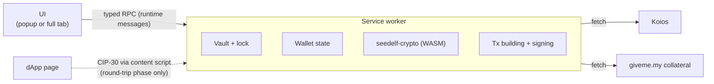

# Architecture

Keep it light: a small Manifest V3 extension, the Seedelf crypto and transaction building we already have in Rust (compiled to WebAssembly), and Koios for chain data. Nothing else unless it earns its place.

## Shape

- **Service worker:** owns everything that matters.
  - While unlocked, it holds the decrypted secret. It is the only place secrets ever exist.
  - It also holds wallet state, builds and signs transactions, and makes all network calls.
- **UI:** renders state and sends the user's actions to the service worker. It never holds keys. The only secret it ever sees is the recovery phrase, while the user writes it down or types it in during onboarding.
- **Content scripts:** v1 has none. They arrive with the contract round trip, to offer CIP-30 on one-time accounts.
  - This matters for security: v1 injects nothing into web pages.
  - v1 only needs host permissions for Koios and giveme.my, not `<all_urls>`.

## Service worker

- **The worker owns the state and the UI mirrors it.** The UI takes a snapshot on open (the `status` request), then refreshes whenever the worker broadcasts `state-changed`, for example on auto-lock. This is Lace's model, minus its framework.
  - The wallet states are `no-wallet`, `locked` and `unlocked` (`extension/src/background/wallet.ts`).
  - The worker runs state changes one at a time, so two pages can't race each other past the unlock back-off.
- **Chrome kills an idle worker after about 30 seconds.** State must reload from storage on every wake-up. The worker's timers don't survive either, so auto-lock uses `chrome.alarms`.
  - Register event listeners synchronously, before the first `await`, or the event that woke the worker is lost.
- **The worker is an ES module** (`"type": "module"` in the manifest).
  - Static imports of the extension's own files are fine. The build emits `sw.js` plus a shared chunk.
  - Dynamic `import()` and top-level `await` are not allowed in service workers, so WASM initializes lazily: `loadWasm()` in `extension/src/background/wasm.ts`.
  - Lace's classic-worker `importScripts` preloading isn't needed.
- **Staying unlocked across restarts (built in chunk 5).** A worker restart loses everything held in memory, including the unlocked keys. The popup can't hold the keys either, because it closes as soon as the user clicks away.
  - On unlock, the vault's entropy goes into `chrome.storage.session` (`seedelf.entropy`), along with the time of the last activity (`seedelf.lastActivity`). That storage is in memory only, never written to disk, cleared when the browser closes, and not readable by content scripts.
  - A restarted worker re-derives the keys from there, unless the auto-lock deadline has passed, in which case it locks.
  - **Lock** (manual or auto-lock) clears the key from session storage as well as from memory.
  - The result: the wallet stays unlocked until auto-lock or browser close, instead of asking for the password after every idle restart.

## Crypto

- **Seedelf cryptography comes from [seedelf-crypto](../../seedelf-crypto/), compiled to WebAssembly with `wasm-bindgen`.**
  - This is the same prover the CLI already runs against the on-chain verifier.
  - It covers register creation, re-randomization, the ownership check and Schnorr proofs.
  - One implementation, so there are no byte-for-byte parity problems.
- **One WebAssembly crate for the wallet:** [seedelf-web-wallet/wasm](../wasm/) (`seedelf-wasm`), a Cargo workspace member.
  - It exposes only what the extension needs, for both crypto and [transaction building](#transaction-building).
  - `build.sh` produces an ES module of about 590 KB, before `wasm-opt`.
  - Its tests check the output against native Rust byte for byte.
- **Build settings:**
  - `getrandom` 0.2 with the `js` feature, set in the wasm crate.
  - `CC_wasm32_unknown_unknown=clang`, because `blst` is C code.
  - `AR_wasm32_unknown_unknown=llvm-ar`, which is `llvm-ar-18` on Ubuntu.
  - `wasm-bindgen-cli` pinned to the crate's `wasm-bindgen` version.
- **The manifest CSP needs `script-src 'self' 'wasm-unsafe-eval'`** to load WebAssembly.
- **Recovery phrases (BIP39) are handled in Rust too:** generation, validation and the Seedelf key derivation. See [keys-and-accounts.md](keys-and-accounts.md#seedelf-key-derivation).
- **Everything else uses small, audited JS libraries:**
  - `@noble/hashes` (Argon2id, BLAKE2b)
  - `@noble/ciphers` (ChaCha20-Poly1305)

## Transaction building

**Decided: Rust (Pallas 0.33), compiled to WebAssembly.**

- **One implementation.** The CLI already builds every Seedelf transaction with Pallas: registers, reference-script spends, the fee and ex-unit loop, and the collateral-service witness. Offline integration tests cover it. Reusing it gives the same single implementation as the crypto.
- **The rejected option was a TypeScript library.** Lace's `TransactionBuilder` has no reference inputs, so we would have had to port the Seedelf logic by hand.

**Status (chunk 8):** move-in and creating a seedelf are built on it.

- **`seedelf-core` compiles to WebAssembly.** The one blocker was `seedelf-koios` setting `connect_timeout` (and `timeout`) on its HTTP client; `reqwest`'s browser build has neither, so both are gated with `#[cfg(not(target_arch = "wasm32"))]`.
- **The WebAssembly module is now about 2.2 MB** (545 KB gzipped), up from 1.6 MB before the script-spend code. It's loaded from the extension itself, so this only costs a moment on the worker's first start. `wasm-opt` is chunk 11.
- **Network-free builders** live in [`seedelf-core/src/build.rs`](../../seedelf-core/src/build.rs). A builder takes chain data the caller already has (protocol parameters, UTxOs as Koios returns them, deserialized into the same `seedelf-koios` types) and returns an unsigned transaction.
  - `external_sweep`: the CLI's `external sweep`, now a thin `run()` around it. Its offline tests pass unchanged.
  - `move_in`: the web wallet's move-in (see [flows.md](flows.md#move-in-cardano-account--seedelf)).
  - `mint`: the CLI's `util mint`, now a thin `run()` around it, and the web wallet's [Create a seedelf](flows.md#create-a-seedelf).
  - Shared pieces: `deposit_outputs` (contract outputs under fresh re-randomizations, tokens 20 to an output), and `settle_fee`, which signs each draft with one throwaway key per signer and reprices until the fee covers the signed size.
- **Script spends share one shape, `ScriptSpend`** (chunk 8). Transfer, sweep and remove (chunks 9 and 10) are the same shape with other outputs.
  - Owned contract inputs, each unlocked by a Schnorr proof bound to the one-time key's hash. The proofs come from a closure, so core never holds the Seedelf secret.
  - giveme.my's collateral UTxO, returned minus 3/2 of the fee. The scripts are read from reference inputs. The one-time key and giveme.my's key are the required signers.
  - **Two phases.** `draft()` gives every redeemer the transaction's maximum budget, for Ogmios to evaluate. `finalize(budgets)` puts in the measured budgets and settles an even fee. The fee covers the size with both signatures, the budgets at the protocol's prices, and 15 lovelace per reference-script byte.
  - **Budgets are matched to redeemers by purpose and index** (`Budgets::from_ogmios`), never by their order in the answer. Ogmios happens to list spends by index, then the mint, which is what the CLI's old `split_last` relied on.
  - Ogmios's errors become plain words: which script refused, or "these UTxOs aren't on chain anymore" (Ogmios reports inputs it can't find as extraneous redeemers, code 3110).
  - **Picking inputs** (`select_script_inputs`): pure-ADA UTxOs first, largest first, then token UTxOs, one at a time, until the fee and valid change fit. The fee is guessed from budgets Ogmios measured on preprod (a spend: 76,043 memory and 338M steps; the mint: 72,836 memory and 21M steps).
  - The shape matches a real CLI mint on preprod field for field, and a draft for the test phrase's UTxOs passes both real scripts under preprod Ogmios.
- **Ogmios through Koios:** `POST /ogmios` with `evaluateTransaction`. A failed evaluation comes back as HTTP 400 with a JSON-RPC `error`. The extension's client and `seedelf-koios`'s `evaluate_transaction` now pass that answer on instead of a bare status.
- **Protocol parameters** are parsed by `ProtocolParameters::from_koios`, so the extension passes Koios's `epoch_params` row through WebAssembly unchanged.
- **Signing stays in WebAssembly.**
  - Move-in: `buildMoveIn(account, key, requestJson)` checks that every UTxO sits at the address its `role/index` derives, builds with `move_in`, and signs once per distinct payment key.
  - Script spends: `draftMint`, then `finishMint`, then `signScriptSpend` at Send. `signScriptSpend` checks giveme.my's signature against its public key over the transaction id before adding it. giveme.my checks a transaction against the chain before it signs, and refuses one whose inputs it can't find ("Transaction Fails Validation").
  - Keys never reach JavaScript.
- **The one-time key is derived, not drawn** (web wallet only). It is HKDF-SHA-256 with the Seedelf scalar as the key material, the salt `seedelf-one-time-key-v1`, and a random 32-byte seed as the info.
  - **Why:** Chrome stops an idle worker after about 30 seconds, and reading a review can take longer. The unsigned transaction and the seed wait in `chrome.storage.session`, and Send re-derives the key inside WebAssembly, even in a restarted worker.
  - **Is it safe to store the seed?** The seed gives nothing without the Seedelf key, and session storage already holds the vault entropy while unlocked.
  - A new seed per spend means a new key per spend (privacy rule 1). The CLI still draws its one-time keys at random.

**What's left:** transfer (chunk 9), then sweep and remove (chunk 10), move onto `ScriptSpend`. The CLI's `create` and `fund` stay inside their `run()`s; the web wallet doesn't need them.

**Tests guard it.** The CLI's offline integration tests (`seedelf-cli/tests/cli/`) check value conservation, min-UTxO and valid change registers for each command, and `seedelf-core/tests/build_test.rs` checks the builders directly.

## Networks

**Preprod first. Mainnet is a build flag.**

**Default builds are preprod-only:**

- Only the preprod hosts are in the manifest's host permissions.
- There is no network switch.
- The UI shows a permanent **PREPROD** badge.

**Setting the flag** (for example `VITE_ENABLE_MAINNET=true`) makes three changes:

- It adds the mainnet hosts to the manifest.
- It makes mainnet the default.
- It adds a network switch in settings, so preprod stays available for testing.

**One network value drives everything network-specific.** The Rust side already takes a `network_flag` everywhere (`true` = preprod), and the WebAssembly API passes it through. This is how the CLI's `--preprod` works.

| | Preprod | Mainnet |
|---|---|---|
| Koios | `https://preprod.koios.rest/api/v1` | `https://api.koios.rest/api/v1` |
| Collateral service | `https://www.giveme.my/preprod/collateral/` | `https://www.giveme.my/mainnet/collateral/` |
| Contract config | `get_config(variant, true)` | `get_config(variant, false)` |
| Addresses | `addr_test…` | `addr…` |

- **The contract config** covers reference UTxOs, the collateral UTxO and the shared staking hash. These differ per network. The script hashes are the same on both.
- **Cached chain data is kept per network.** The vault is shared, because keys don't depend on the network. The CLI works the same way.
- **Addresses are checked against the active network** before anything is sent. This mirrors the CLI's `is_on_correct_network`.
- **Preprod status on 2026-09-23:**
  - The wallet and seedelf reference scripts are live and unspent.
  - The collateral UTxO is live, and the giveme.my preprod endpoint is up.
  - The wallet contract holds 25 UTxOs.

## Chain data

**Koios, same as the CLI.** Balances were built in chunk 6: `extension/src/background/koios.ts` (the client), `chain.ts` (pure helpers) and `balances.ts` (the service).

**What one balance reading asks Koios** (three requests, in parallel):

| Request | For |
|---|---|
| `credential_utxos` with the wallet contract's script hash | Every UTxO in the contract, to find the owned ones |
| `account_addresses` with the Cardano account's stake address (`_empty: true`) | Every address that has used the stake key, including empty ones, for discovery |
| `account_utxos` with the same stake address | The account's UTxOs |

- **Paging:** 1000 rows a page, in a fixed order (`order=tx_hash.asc,tx_index.asc`), until a short page.
- **Retries:** a rate limit (429), a server error (5xx) or a network failure is retried twice, after 1 s and 3 s. Anything else fails at once with Koios's status.
- **Finding owned UTxOs:** keep the contract UTxOs whose inline datum is a register (constructor 0, two 48-byte fields) with `generator^x == public_value`. This is `is_owned`, the same method the CLI's `balance` uses, run in WebAssembly. Points that don't decode or aren't torsion-free count as not owned.
  - As in the CLI, a UTxO holding a seedelf isn't counted in the balance. It's listed as a seedelf, with the ADA locked with it.
  - The query goes by payment credential, so it finds contract UTxOs with and without a staking part. Older outputs on preprod carry the shared Seedelf stake key; the current CLI writes none.
  - The cost grows with the size of the contract's UTxO set. That's fine today; revisit if it gets large.
- **Discovering the Cardano account:** walk the receive chain (`0/i`) and the change chain (`1/i`) from index 0 until 20 addresses in a row are unused. "Used" means Koios lists the address under the account's stake key.
  - The account's UTxOs count only when they sit at an address the wallet derived. Anyone can build an address from their own payment key or script plus someone else's stake key. The well-known `abandon … art` test phrase has exactly such a script UTxO on preprod.
  - Addresses from our payment keys with no staking part, or with someone else's, aren't found. Standard wallets don't make them.
- **Tokens** show the name as text when it decodes as UTF-8 (after dropping a CIP-68 label such as `0014df10`), otherwise as hex, with the decimals Koios reports. No token images are fetched: they would reveal holdings to more servers, and the page CSP allows only the extension's own images.
- **When it reads the chain:** when Home opens, if the last reading is over a minute old, and on **Refresh**. There's no background polling. The reading is cached per network in `chrome.storage.session` (it says which contract UTxOs are the user's, so it never goes to disk) and wiped on lock.
- **Transactions (chunks 7 and 8):** `epoch_params`, `ogmios` (`evaluateTransaction`; a 400 carries Ogmios's reason), `submittx` (never retried) and `tx_status`.
- **Still to come:** seedelf token lookups for recipients' registers (chunk 9).
- **Collateral for Seedelf spends comes from the giveme.my service**, exactly as in the CLI (`seedelf-koios`). See [privacy.md](privacy.md).
- **All requests come from the user's IP.** The IP-tracking caveats in the root [README](../../../README.md#de-anonymizing-via-ip-tracking) apply. The extension adds no analytics or telemetry.

## Storage

**Permissions:** `storage` and `alarms`, plus the host permissions for the enabled network's Koios and giveme.my.

| Where | Key | What |
|---|---|---|
| `chrome.storage.local` | `seedelf.vault` | The encrypted vault: a single SecretBox blob, see [keys-and-accounts.md](keys-and-accounts.md#password-and-vault) |
| `chrome.storage.local` | `seedelf.unlockFailures` | `{ count, lastFailureAt }` for the unlock back-off |
| `chrome.storage.session` | `seedelf.entropy` | The vault entropy, only while unlocked |
| `chrome.storage.session` | `seedelf.lastActivity` | When the user last did something, for auto-lock |
| `chrome.storage.session` | `seedelf.balances.<network>` | The last balance reading, only while unlocked |

Non-secret settings and cached chain data join `chrome.storage.local` in later chunks.

- **Decrypted secrets live only in service-worker memory and `chrome.storage.session`** (see above).
- **They are wiped on lock.** Lace keeps the last verified password in memory after use (`packages/contract/authentication-prompt/src/store/auth-secret-accessor.ts`), and we don't.
- **Auto-lock** after 15 minutes without activity.
  - While unlocked, the UI reports activity (a key press or a click) to the worker, at most every 30 seconds.
  - A `chrome.alarms` alarm checks once a minute, and every request checks too.
  - A settings screen for the delay can come later.
- **Failed unlocks** trigger an exponential back-off: 1 s, 2 s, 4 s and so on, capped at 60 s (Lace's values).
  - Unlike Lace, the worker enforces it: an attempt that comes too early is refused before the password is even tried.
  - The count is kept in `chrome.storage.local`, so restarting the worker or the browser doesn't reset it. The right password resets it.

## UI

- **React + TypeScript, bundled with Vite 8 (Rolldown) (decided).**
  - One build emits the popup/tab page, `sw.js`, the WASM asset, and `manifest.json` (generated by `extension/src/manifest.ts`).
  - The page CSP is `default-src 'self'; script-src 'self' 'wasm-unsafe-eval'; connect-src 'self'` plus the enabled network's Koios and giveme.my origins only.
  - No heavy component library.
  - Plain CSS with design tokens for light and dark themes. The colours come from the Seedelf logo (navy `#011833`, teal `#00c4bc`), and the dark theme follows Lace's structure.
  - Not Lace's React Native / Expo stack.
- **Lace's flows and visual language may inspire ours:** spacing, corner radius, light and dark themes, screen-to-screen flow.
- **We don't take Lace's name, logo or brand assets,** and we don't take its commercial fonts (Brandon Grotesque and Proxima Nova are in its repo but not licensed to us).
- **Our own brand:** the Seedelf logo set is in [brand/](../brand/). The extension ships resized copies (`extension/public/`).
- **Icons** only under a compatible license. The few UI icons so far are drawn inline for this project.
- **Popup plus full tab (decided), like Eternl:**
  - Clicking the toolbar icon opens a popup.
  - An "expand" button opens the same app in a full browser tab.
  - One responsive UI serves both.
  - Onboarding (create or restore) opens in a full tab, as in Lace and Eternl, because a popup closes as soon as the user clicks elsewhere.
  - No side panel. Lace opens in a side panel, which feels cramped.

## What we borrow from Lace

Paths are relative to a `lace-extension@2.4.0` checkout (see the [README](../README.md#reference-lace)).

| What | Lace path | How we use it |
|---|---|---|
| SecretBox (Argon2id + ChaCha20-Poly1305) | `packages/lib/core/src/secret-box/` | Adopted in `extension/src/background/secret-box/` (Apache-2.0, without the EMIP-003 path) |
| Typed RPC between extension contexts | `packages/lib/extension-messaging/src/` | Adapt; it's about 1.8k lines and needs RxJS |
| Service-worker boot order and install preloading | `apps/lace-extension/src/sw-script/` | Pattern |
| Worker-owned store mirrored in the UI | `apps/lace-extension/src/util/connect-store.ts`, `apps/lace-extension/src/sw-script/create-remote-store.ts` | Pattern |
| Lock state machine and inactivity timer | `packages/contract/app-lock/src/store/` | Pattern |
| Unlock back-off | `packages/contract/authentication-prompt/src/store/unlock-backoff.ts` | Pattern |
| MV3 manifest and CSP | `apps/lace-extension/assets/manifest.json` | Pattern |
| CIP-30 injection (round-trip phase) | `apps/lace-extension/src/content-scripts/`, `packages/lib/dapp-connector/`, `packages/module/dapp-connector-cardano/` | Pattern |
| Keeping existing vkey witnesses intact | `packages/module/blockchain-cardano/src/tx-executor-implementation/merge-pre-existing-vkeys.ts` | Reference |

We don't take Lace's contracts, modules or feature-flag framework, its host/guest shell, its analytics (PostHog, Sentry), or anything for Bitcoin or Midnight.

**Licensing:** Lace is Apache-2.0, and this repository is MIT. Files copied or adapted from Lace stay under Apache-2.0. For each one:

- keep its notices
- mark our changes
- ship a copy of the Apache-2.0 license alongside it
