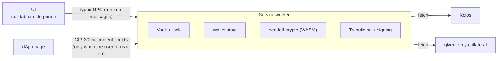
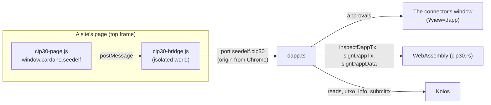
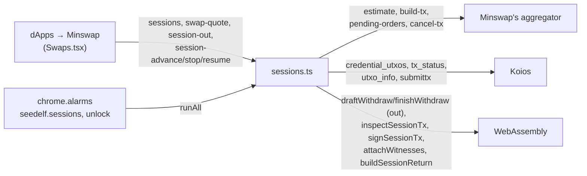
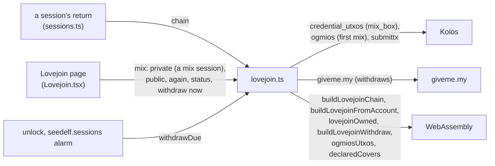

# Architecture

Keep it light: a small Manifest V3 extension, the Seedelf crypto and transaction building we already have in Rust (compiled to WebAssembly), and Koios for chain data. Nothing else unless it earns its place.

## Shape

- **Service worker:** owns everything that matters.
  - While unlocked, it holds the decrypted secret. It is the only place secrets ever exist.
  - It also holds wallet state, builds and signs transactions, and makes all network calls.
- **UI:** renders state and sends the user's actions to the service worker. It never holds keys. The only secret it ever sees is the recovery phrase, while the user writes it down or types it in during onboarding.
- **Content scripts (chunk 15):** none until the user turns on the [dApp connector](#dapp-connector).
  - This matters for security: until then, the wallet adds nothing to web pages.
  - Its install-time host permissions are only Koios and giveme.my. The sites are an optional permission, asked for when the connector is turned on, and kept when it's turned off (see [dApp connector](#dapp-connector)).

## Service worker

- **The worker owns the state and the UI mirrors it.** The UI takes a snapshot on open (the `status` request), then refreshes whenever the worker broadcasts `state-changed`, for example on auto-lock. This is Lace's model, minus its framework.
  - The wallet states are `no-wallet`, `locked` and `unlocked` (`extension/src/background/wallet.ts`).
  - The worker runs state changes one at a time, so two pages can't race each other past the unlock back-off.
- **Chrome kills an idle worker after about 30 seconds.** State must reload from storage on every wake-up. The worker's timers don't survive either, so auto-lock uses `chrome.alarms`.
  - Register event listeners synchronously, before the first `await`, or the event that woke the worker is lost.
- **The worker is an ES module** (`"type": "module"` in the manifest).
  - Static imports of the extension's own files are fine. The build emits `sw.js` plus a shared chunk.
  - Dynamic `import()` and top-level `await` are not allowed in service workers, so WASM initializes lazily: `loadWasm()` in `extension/src/background/wasm.ts`.
  - Lace's classic-worker `importScripts` preloading isn't needed.
- **The toolbar button (chunk 14).** There's no popup: the manifest's `action` has no `default_popup`. With the wallet set to open in a tab (the default), a click reaches the worker's `action.onClicked`, which brings back the wallet's open tab (`runtime.getContexts`) or opens one. Set to the side panel, Chrome opens the panel itself (`sidePanel.setPanelBehavior`), and the worker isn't asked. The choice is `seedelf.openIn` in `chrome.storage.local` (`shared/open-in.ts`), and it's applied again whenever the extension installs or starts.
- **Staying unlocked across restarts (built in chunk 5).** A worker restart loses everything held in memory, including the unlocked keys. No page can hold the keys either: there may be several, and each closes when the user closes it.
  - On unlock, the vault's entropy goes into `chrome.storage.session` (`seedelf.entropy`), along with the time of the last activity (`seedelf.lastActivity`). That storage is in memory only, never written to disk, cleared when the browser closes, and not readable by content scripts.
  - **It is readable by the extension's own pages**, as any extension storage is: there's no store only the worker can read. What keeps it from them is that they run only the extension's own code (the CSP allows no other script). Since the crypto review (2026-09-25), no page listens to `chrome.storage.onChanged`, whose events carry session storage's changes, the entropy among them at every unlock and lock: the UI follows `chrome.storage.local.onChanged` alone.
  - **Content scripts can't read local storage either** (the crypto review): the worker sets both areas to `TRUSTED_CONTEXTS` at every start (`chrome.storage.<area>.setAccessLevel`; Chrome's default leaves local storage open to content scripts). The connector's bridge runs in every site's renderer and never reads storage, so a renderer a site took over can't take the sealed vault through it to guess the password offline, or change the unsealed settings.
  - A restarted worker re-derives the keys from there, unless the auto-lock deadline has passed, in which case it locks.
  - **Lock** (manual or auto-lock) clears the key from session storage as well as from memory.
  - The result: the wallet stays unlocked until auto-lock or browser close, instead of asking for the password after every idle restart.

## Crypto

- **Seedelf cryptography comes from [seedelf-crypto](../../seedelf-crypto/), compiled to WebAssembly with `wasm-bindgen`.**
  - This is the same prover the CLI already runs against the on-chain verifier.
  - It covers register creation, re-randomization, the ownership check and Schnorr proofs.
  - One implementation, so there are no byte-for-byte parity problems.
  - **A proof's nonce is hedged** (the crypto review, 2026-09-25): HMAC-SHA-512 keyed by the Seedelf scalar, over the register, the one-time key's hash and 32 fresh random bytes, reduced mod the group order. It's as random as before, but a random source that failed or repeated could never give two different statements one nonce, which would reveal the key. The verifier is unchanged. Lovejoin's proofs already use deterministic RFC 6979 nonces (`seedelf-crypto/src/lovejoin.rs`).
  - **Randomness is drawn only where it protects something:** the recovery phrase, re-randomization scalars, proof nonces, one-time key seeds, and Lovejoin's mix scalars, orderings and delays. Sizing an output that doesn't exist yet uses a fixed register, and a Lovejoin withdraw's first, thrown-away build a fixed stand-in for its proof, never the key.
- **One WebAssembly crate for the wallet:** [seedelf-web-wallet/wasm](../wasm/) (`seedelf-wasm`), a Cargo workspace member.
  - It exposes only what the extension needs, for both crypto and [transaction building](#transaction-building).
  - `build.sh` produces an ES module with the `wasm-release` cargo profile: about 1.2 MB, 419 KB gzipped (see [Transaction building](#transaction-building)).
  - Its tests check the output against native Rust byte for byte.
- **Build settings:**
  - `getrandom` 0.2 with the `js` feature, set in the wasm crate: `crypto.getRandomValues`. If it ever fails, the draw panics and the call throws; nothing goes on with zeros.
  - Secrets in WebAssembly memory are wiped with `zeroize` (volatile writes the compiler can't drop): the Seedelf scalar on `free()`, the rebuilt phrase, the BIP39 seed and HKDF material, and the one-time key's. `bip39`'s `zeroize` feature wipes its mnemonics; the Cardano keys (`ed25519-bip32`'s `XPrv`) wipe themselves.
  - `CC_wasm32_unknown_unknown=clang`, because `blst` is C code.
  - `AR_wasm32_unknown_unknown=llvm-ar`, which is `llvm-ar-18` on Ubuntu.
  - `wasm-bindgen-cli` pinned to the crate's `wasm-bindgen` version.
- **The manifest CSP needs `script-src 'self' 'wasm-unsafe-eval'`** to load WebAssembly.
- **Recovery phrases (BIP39) are handled in Rust too:** generation, validation and the Seedelf key derivation. See [keys-and-accounts.md](keys-and-accounts.md#seedelf-key-derivation).
- **Everything else uses small, audited JS libraries:**
  - `@noble/hashes` (Argon2id, BLAKE2b)
  - `@noble/ciphers` (ChaCha20-Poly1305)

## Transaction building

**Decided: Rust (Pallas 0.35, 0.33 until chunk 16), compiled to WebAssembly.**

- **One implementation.** The CLI already builds every Seedelf transaction with Pallas: registers, reference-script spends, the fee and ex-unit loop, and the collateral-service witness. Offline integration tests cover it. Reusing it gives the same single implementation as the crypto.
- **The rejected option was a TypeScript library.** Lace's `TransactionBuilder` has no reference inputs, so we would have had to port the Seedelf logic by hand.

**Status (chunk 13):** every v1 transaction is built on it: move-in, creating a Seedelf, transfer, withdraw, removing a Seedelf, a send from the Cardano account, and staking (delegate, vote, withdraw rewards, stop).

- **`seedelf-core` compiles to WebAssembly.** The one blocker was `seedelf-koios` setting `connect_timeout` (and `timeout`) on its HTTP client; `reqwest`'s browser build has neither, so both are gated with `#[cfg(not(target_arch = "wasm32"))]`.
- **The WebAssembly module is about 1.3 MB** (439 KB gzipped since chunk 13's staking; it was 424 KB). It's loaded from the extension itself, so this only costs a moment on the worker's first start.
  - `build.sh` uses the workspace's `wasm-release` profile: `opt-level = "z"`, LTO, one codegen unit, stripped. It halved the module (it was 2.3 MB, 582 KB gzipped) at the same speed. The BLS arithmetic is blst's C, and a proof takes about 1.8 ms either way.
  - `wasm-opt` was measured on top and left out: it made the file 9 % smaller but its gzipped size 6 % larger, and the Web Store's download is a zip.
  - `wasm/bench.mjs` measures the size and the speed of a build.
- **Network-free builders** live in [`seedelf-core/src/build.rs`](../../seedelf-core/src/build.rs). A builder takes chain data the caller already has (protocol parameters, UTxOs as Koios returns them, deserialized into the same `seedelf-koios` types) and returns an unsigned transaction.
  - `external_sweep`: the CLI's `external sweep`, now a thin `run()` around it. Its offline tests pass unchanged.
  - `move_in` and `account_send`: the web wallet's move-in and a send from the Cardano account to one address (see [flows.md](flows.md#make-private-public-account--private-balance)). Each is one account payment to a `Payee`: into Seedelf (deposits, tokens 20 to an output, under your register or, chunk 14, someone else's, which must pass `is_payable`) or to a key address (one output). They share the UTxO choice and the change, and may spend any UTxO they're given: the web wallet leaves out its collateral and the UTxOs the user locked ([coin control](#chain-data), chunk 12). Until then they never spent a pure 5 ₳ UTxO, as the CLI's `collect_address_utxos` doesn't.
    - `account_send_many` (chunk 14) pays several recipients at once, each an `AccountPay`: a `Payee`, an amount and its tokens, in order before the change. Their tokens are checked together against what's held. Max pays a single recipient. The web wallet builds every send with it, to addresses and to Seedelfs; `account_send` is its one-address case.
  - `mint`: the CLI's `util mint`, now a thin `run()` around it, and the web wallet's stealth [Create a Seedelf](flows.md#create-a-seedelf).
  - `transfer` and `transfer_from`: the CLI's `transfer`, now a thin `run()` around them, and the web wallet's [Send to a Seedelf](flows.md#send-privately-private-balance--any-seedelf) (chunk 9).
    - Each payment goes under a fresh re-randomization of the recipient's register, as found on chain with their Seedelf.
    - `is_payable` refuses a register that a payment would be lost under: points that don't decode, torsion points, or the identity. `is_valid` alone lets the identity through, and anyone can prove the zero key behind it. Both mints use it too.
  - `sweep`, `sweep_from`, `sweep_many` and `sweep_all`: the CLI's `sweep`, now a thin `run()` around them, and the web wallet's [Withdraw](flows.md#send-to-an-address) (chunk 10). `sweep_many` (chunk 14) pays several addresses, each an `AddressPayment`, from one selection of inputs; `sweep` is its one-address case. `is_payable_address` accepts only a Shelley address on this network with no script in it, as the CLI always has.
  - `remove`: the CLI's `remove` and the web wallet's [Remove a Seedelf](flows.md#remove-a-seedelf). It spends the UTxO holding exactly one Seedelf and burns it (`ScriptSpend::mint` with −1).
  - `account_mint`: a Seedelf paid by the Cardano account (chunk 8b; the CLI's `create`, still inline in the CLI).
    - Key inputs pay: pure ADA first.
    - The collateral is the web wallet's set-aside one when it has one (never an input), otherwise one of the account's own UTxOs. If it holds tokens, the collateral return gives them back.
    - It's drafted and finalized like a script spend, but only the policy runs: no proofs, no one-time key, no giveme.my.
  - `account_staking` (chunk 13): a staking transaction from the Cardano account, an account payment to `Payee::Nobody`: its inputs pay the fee and any deposit, and everything else is change to `0/0`.
  - **Certificates and withdrawals are patched in** ([`seedelf-core/src/staking.rs`](../../seedelf-core/src/staking.rs), chunk 13). `pallas-txbuilder` can stage neither (0.33, 0.35 and 1.4 all write `None` for them), so the transaction is built as usual, then `Staking::patch` decodes the body, sets them, encodes it again, and puts the new body hash into the `BuiltTransaction`. Signing always comes after the patch, so `BuiltTransaction::sign` signs the right hash; a patch after signing is refused. Pricing patches each draft too, and counts the stake key's witness.
    - `Staking::of(key, action, state, key_deposit)` gives the certificates an action needs: `StakeRegDeleg` or `VoteRegDeleg` (register and delegate in one certificate) for an unregistered key, `StakeDelegation` or `VoteDeleg` for a registered one, `UnReg` with the deposit paid to stop. A withdrawal takes the whole reward balance; it's refused while the vote isn't delegated (Conway's rule since its second phase).
    - `Staking::withdraw` rides along with `move_in`, `account_send` and `account_mint`: the rewards count towards what the inputs pay, value being inputs + withdrawal + refund = outputs + fee + deposit.
    - Pool IDs (bech32 or hex) and DRep IDs (CIP-129 as Koios gives them, or CIP-105's `drep1…` and `drep_script1…`) are read there too, and written back the way Koios names them.
    - Checked on preprod without spending anything ([`tests/fixtures/probe-staking.mjs`](../extension/tests/fixtures/probe-staking.mjs)): every kind of staking transaction decodes on the node's Conway decoder, and an account-paid mint with a withdrawal passes the real Seedelf policy at the same budget as without (72,835 memory, 21.4M steps).
  - **A note is patched in the same way** ([`seedelf-core/src/note.rs`](../../seedelf-core/src/note.rs), chunk 14): Pallas can't stage metadata either. `Note::new` takes one line of at most 64 characters (Lace's limit), refusing control characters, and splits it into CIP-20 lines of at most 64 bytes, at a space when it can. `Note::patch` sets the auxiliary data (a plain metadata map, `{674: {"msg": [lines]}}`) and its hash in the body, after the staking patch and before signing; pricing patches each draft too, so the fee pays for its bytes. `account_send_many` takes an optional note; nothing else does. Checked on preprod without spending ([`tests/fixtures/probe-note.mjs`](../extension/tests/fixtures/probe-note.mjs)): a send with a note, with one of two lines, and with the rewards too, each decodes on the node.
  - Shared pieces: `deposit_outputs` (contract outputs under fresh re-randomizations, tokens 20 to an output), and `settle_fee`, which signs each draft with one throwaway key per signer and reprices until the fee covers the signed size.
  - **No transaction over 16 KiB** (chunk 14): `settle`, which prices every draft, refuses one whose signed size is over `MAX_TX_SIZE` (the ledger's `max_tx_size`, 16,384 bytes on mainnet and preprod), in words, rather than letting the node refuse it at submit. Many recipients or tokens are how a payment gets there.
  - **The least ADA a payment can carry** has a function per kind: `minimum_deposit` (a move-in), `minimum_address_payment` (a withdrawal or a send) and `minimum_seedelf_payment` (a transfer), each the same sum the builder checks. The builders still refuse less, as the CLI expects; the web wallet's WebAssembly raises a smaller amount to it (so "0" with tokens sends only that) and reports the least as `minimum` (chunk 12).
- **Script spends share one shape, `ScriptSpend`** (chunk 8). Mint, transfer, sweep and remove are all built on it.
  - The change goes back into the contract under fresh copies of the payer's register, or, with `change_to(addr)`, to a key address: that's how `sweep_all` sends everything, and how a removal pays an address.
  - Owned contract inputs, each unlocked by a Schnorr proof bound to the one-time key's hash. The proofs come from a closure, so core never holds the Seedelf secret.
  - giveme.my's collateral UTxO, returned minus 3/2 of the fee. The scripts are read from reference inputs. The one-time key and giveme.my's key are the required signers.
  - **Two phases.** `draft()` gives every redeemer the transaction's maximum budget, for Ogmios to evaluate. `finalize(budgets)` puts in the measured budgets and settles an even fee. The fee covers the size with both signatures, the budgets at the protocol's prices, and 15 lovelace per reference-script byte.
  - **Budgets are matched to redeemers by purpose and index** (`Budgets::from_ogmios`), never by their order in the answer. Ogmios happens to list spends by index, then the mint, which is what the CLI's old `split_last` relied on.
  - Ogmios's errors become plain words: which script refused, or "these UTxOs aren't on chain anymore" (Ogmios reports inputs it can't find as extraneous redeemers, code 3110).
  - **Picking inputs** (`select_script_inputs`): first the UTxOs holding the tokens being sent (the biggest holdings of each first, until there's enough), then pure-ADA UTxOs, largest first, then other token UTxOs, one at a time, until the fee and valid change fit. The fee is guessed from budgets Ogmios measured on preprod (a spend: 76,043 memory and 338M steps; the mint: 72,836 memory and 21M steps).
  - The shape matches a real CLI mint on preprod field for field, and a draft for the test phrase's UTxOs passes both real scripts under preprod Ogmios.
- **Ogmios through Koios:** `POST /ogmios` with `evaluateTransaction`. A failed evaluation comes back as HTTP 400 with a JSON-RPC `error`. The extension's client and `seedelf-koios`'s `evaluate_transaction` now pass that answer on instead of a bare status.
- **Protocol parameters** are parsed by `ProtocolParameters::from_koios`, so the extension passes Koios's `epoch_params` row through WebAssembly unchanged.
- **Signing stays in WebAssembly.**
  - Move-in and send: `buildMoveIn(account, key, requestJson)` and `buildAccountSend(account, requestJson)` check that every UTxO sits at the address its `role/index` derives, build with `move_in` or `account_send_many`, and sign once per distinct payment key. A send whose `to` is a Seedelf's name takes the contract UTxO holding it as `recipient`, checked as a transfer's is (`recipient_register`).
  - **Several recipients** (chunk 14): `buildAccountSend`, `draftTransfer`/`finishTransfer` and `draftWithdraw`/`finishWithdraw` take `payments`, a list of one to `MAX_RECIPIENTS` (20), and answer with what each received, in order.
  - Staking: `buildStaking(account, requestJson)` builds with `account_staking` from the action and the stake key's standing (`account_info`, fresh from the worker), and signs with the payment keys and the stake key (`2/0`). A move-in, a send or an account-paid mint given a `withdrawal` (the reward balance) signs with the stake key too. `poolId` and `drepId` read and normalize IDs for the worker.
  - Script spends: `draftMint`, `draftTransfer`, `draftWithdraw` or `draftRemove`, then the matching `finish…`, then `signScriptSpend` at Send. `signScriptSpend` checks giveme.my's signature against its public key over the transaction id before adding it. giveme.my checks a transaction against the chain before it signs, and refuses one whose inputs it can't find ("Transaction Fails Validation").
  - Keys never reach JavaScript.
- **The one-time key is derived, not drawn** (web wallet only). It is HKDF-SHA-256 with the Seedelf scalar as the key material, the salt `seedelf-one-time-key-v1`, and a random 32-byte seed as the info.
  - **Why:** Chrome stops an idle worker after about 30 seconds, and reading a review can take longer. The unsigned transaction and the seed wait in `chrome.storage.session`, and Send re-derives the key inside WebAssembly, even in a restarted worker.
  - **Is it safe to store the seed?** The seed gives nothing without the Seedelf key, and session storage already holds the vault entropy while unlocked.
  - A new seed per spend means a new key per spend (privacy rule 1). The CLI still draws its one-time keys at random.

- **In the worker, `script-spend.ts` holds the flow every Seedelf spend shares:** read the whole contract and the protocol parameters, build in WebAssembly, keep the unsigned transaction and its seed in session storage until Send, then giveme.my → `signScriptSpend` → submit → the pending watch. `mint.ts`, `transfer.ts` and `withdraw.ts` use it, and so does a session's funding.
  - **Measured in the wallet** (the crypto review, 2026-09-25): `buildMint`, `buildTransfer`, `buildWithdraw` and `buildRemove` prove the spend and measure its scripts with `ScriptSpend::measure_locally` (Aiken's `uplc`, as a Lovejoin chain is), in one call. A draft sent to Ogmios carried valid proofs, so Koios learned which contract UTxOs were the wallet's even for a review never sent; it cost a request too. The recorded preprod transfer's fee comes out the same to the lovelace, or 602 lovelace less. The scripts see a transaction's signers sorted by hash, and the wallet script looks for the one-time key's among them. A random one-time key hash that sorts before giveme.my's (`1108…`, about 7% of them) is found a step sooner. Each is exactly what that transaction uses.
  - The account-paid mint still drafts for Ogmios (`measure`): its draft holds only the public account's UTxOs, and one of those may carry a reference script, which the wallet's evaluator doesn't take yet. The CLI keeps Ogmios for everything.
  - A hard fork that changes script costs is what the local measure can't know; Lovejoin's check of each chain's first mix against Ogmios is the wallet's watch for it.
  - Transactions signed at review (an account-paid mint, a send, a staking transaction) are kept without a seed, and Send only submits them. `account.ts` reads the Cardano account for them and for a move-in: three requests (`account_addresses`, then `credential_utxos` for its payment keys, with `epoch_params` alongside), and `account_info` alongside too when the user spends rewards or it's a staking build. `destination.ts` reads a withdrawal's or a send's destination. `staking.ts` holds the staking reads and builds.

**In the CLI,** every script spend ends in `seedelf-cli/src/commands/spend.rs`: prove, evaluate, finish, giveme.my, sign, submit. Only `create` and `fund` still build inside their `run()`s; the web wallet doesn't need them.

**Tests guard it.** The CLI's offline integration tests (`seedelf-cli/tests/cli/`) check value conservation, min-UTxO and valid change registers for each command, and `seedelf-core/tests/build_test.rs` checks the builders directly.

## Networks

**Preprod first. Mainnet is a build flag.**

**Default builds are preprod-only:**

- Only the preprod hosts are in the manifest's host permissions.
- There is no network switch.
- The UI shows a permanent **PREPROD** badge.

**Setting the flag** (for example `VITE_ENABLE_MAINNET=true`) makes three changes:

- It adds the mainnet hosts to the manifest.
- It makes mainnet the default.
- It adds a network switch in settings, so preprod stays available for testing.

**One network value drives everything network-specific.** The Rust side already takes a `network_flag` everywhere (`true` = preprod), and the WebAssembly API passes it through. This is how the CLI's `--preprod` works.

| | Preprod | Mainnet |
|---|---|---|
| Koios | `https://preprod.koios.rest/api/v1` | `https://api.koios.rest/api/v1` |
| Collateral service | `https://www.giveme.my/preprod/collateral/` | `https://www.giveme.my/mainnet/collateral/` |
| Contract config | `get_config(variant, true)` | `get_config(variant, false)` |
| Addresses | `addr_test…` | `addr…` |

- **The contract config** covers reference UTxOs, the collateral UTxO and the shared staking hash. These differ per network. The script hashes are the same on both.
- **Cached chain data is kept per network.** The vault is shared, because keys don't depend on the network. The CLI works the same way.
- **Addresses are checked against the active network** before anything is sent. This mirrors the CLI's `is_on_correct_network`.
- **Preprod status on 2026-09-23:**
  - The wallet and Seedelf reference scripts are live and unspent.
  - The collateral UTxO is live, and the giveme.my preprod endpoint is up.
  - The wallet contract holds 25 UTxOs.

## Chain data

**Koios, same as the CLI.** Balances were built in chunk 6: `extension/src/background/koios.ts` (the client), `chain.ts` (pure helpers) and `balances.ts` (the service).

**What one balance reading asks Koios** (four requests: the contract's and the stake key's alongside the account's two, which run one after the other):

| Request | For |
|---|---|
| `credential_utxos` with the wallet contract's script hash | Every UTxO in the contract, or only those after the last block seen (below), to find the owned ones |
| `account_addresses` with the Cardano account's stake address (`_empty: true`) | Every address that has used the stake key, including empty ones, for discovery |
| `credential_utxos` with the account's payment key hashes in range (chunk 12) | Every UTxO under those keys, whatever the address's staking part. At most 75 keys a request (Koios's public tier refuses bodies over 5,120 bytes), so an account with more than about 35 used addresses takes more than one. |
| `account_info` with the stake address (chunk 13) | Whether it's registered, its pool, its vote delegation, its rewards and its deposit. No row means never registered. The pool's ticker comes from what the session has read, the pool list on the device, or one `pool_info` a session. |

- **Paging:** 1000 rows a page, in a fixed order (`order=tx_hash.asc,tx_index.asc`), until a short page.
- **Retries:** a rate limit (429), a server error (5xx) or a network failure is retried twice, after 1 s and 3 s. Anything else fails at once with Koios's status.
- **Bursts:** every request the worker makes, each retry included, waits its turn under one shared limit of 60 every 10 s (`KOIOS_LIMIT` in `koios.ts`), under the public tier's 100. A long Lovejoin chain, or several screens reading at once, can't reach it.
- **Submits:** a submit Koios doesn't answer (a timeout, a lost connection, 429, 5xx) throws `KoiosBusyError`, since the transaction may or may not have gone through. A Lovejoin chain sends it again later, which is safe: the ledger takes it once.
  - **A chain is sent a window at a time** (`pumpChain`): at most 4 of its transactions wait in the mempool. A block may use 20 billion CPU steps in scripts and a mix uses 5.73 billion, so a block takes only 3 mixes, and a node's mempool holds about two blocks' worth; a submit past that waits for a block, longer than Koios answers (20 s). So the wallet sends while there's room, looks for blocks every 5 s, and each call sends for at most about a block: a Send sends the first window, and the runner's steps, the alarm and the open Lovejoin page the rest. The chain waits in `chrome.storage.session` meanwhile (`seedelf.session.chain.<network>.<index>`, `seedelf.lovejoin.sending.<network>`), so no request runs near Chrome's five minutes. Locking wipes it: the rest then comes back directly, and the session says why.
  - **Sent again, it can be refused as spending what's spent,** because it's waiting in the mempool already. So a chain's transaction refused that way, after a try Koios didn't answer or anywhere past the first, is sent again and looked for on chain every 10 s for about three minutes (`chainRetryMs`) before the chain stops. When it does stop, the session records why, and the Lovejoin page shows it in full.
- **Koios's public tier, with no API key (decided 2026-09-25).** Its limits are per IP address (5,000 requests a day, 100 every 10 s), so each user has their own, and there's no key to ship, leak or share.
  - A key in the extension would be anyone's: the extension's files are public. Every user would also share its one daily allowance (50,000 on the free tier), and Koios would tie every request to the key's account.
  - **Since 2026-09-25 the public tier sends browsers no CORS headers** (Koios's [tiers](https://koios.rest/tiers.html): CORS "Restricted" without a key, "Open" with one). A web page can't read it. The extension can: its requests to a host in its host permissions skip CORS. So the wallet reads Koios only through Chrome's grant for `preprod.koios.rest` (and `api.koios.rest` on mainnet).
  - If the user limits the wallet's site access in Chrome, that grant goes with it. A failed request then says so (`KOIOS_NOT_ALLOWED` in `koios.ts`, not retried), and the wallet's page shows a notice with **Ask Chrome again** (`ServiceAccess` in `App.tsx`), which asks Chrome for the hosts from the click.
  - giveme.my still answers with `Access-Control-Allow-Origin: *`.
- **Finding owned UTxOs:** keep the contract UTxOs whose inline datum is a register (constructor 0, two 48-byte fields) with `generator^x == public_value`. This is `is_owned`, the same method the CLI's `balance` uses, run in WebAssembly. Points that don't decode or aren't torsion-free count as not owned.
  - As in the CLI, a UTxO holding a Seedelf isn't counted in the balance. It's listed as a Seedelf, with the ADA locked with it.
  - The query goes by payment credential, so it finds contract UTxOs with and without a staking part. Older outputs on preprod carry the shared Seedelf stake key; the current CLI writes none.
  - **The contract is read in full only when due (chunk 12, `contract-scan.ts`).** A full read costs a request per 1,000 contract UTxOs, and Koios's public tier allows 5,000 requests a day, so it happens after an unlock, every 30 minutes, and after the network refuses a spent input (`SpentInputError`).
    - In between, a read asks only for the UTxOs in blocks after the last one seen (`credential_utxos?block_height=gt.N`, re-reading 2 blocks), usually a single request.
    - What's kept, in `chrome.storage.session`, is this wallet's own UTxOs, each Seedelf's UTxO (for Send's lookup) and the height: never the whole contract.
    - The wallet's own spends drop out as it makes them (`spent.ts`). A spend made with the same phrase elsewhere, or a rollback, shows at the next full read.
    - The balance, Send's lookup and every Seedelf spend's build read through it, so opening Send after Home costs one small request, not another full read.
- **Discovering the Cardano account:** walk the receive chain (`0/i`) and the change chain (`1/i`) from index 0 until 20 addresses in a row are unused. "Used" means Koios lists the address under the account's stake key.
  - **The account's UTxOs are everything under its payment keys** in that range (`account.ts`), whatever the address's staking part: a base address, an enterprise address with none, or our key paired with someone else's stake key. It's the user's money either way, and the wallet spends it. (Until chunk 12 it asked by stake key and kept only its own base addresses, so it missed both.)
  - Asking by payment key also leaves out what anyone can pair with our stake key: their own payment key or a script. The well-known `abandon … art` test phrase has exactly such a script UTxO on preprod.
  - WebAssembly checks each UTxO before signing: its address must be a Shelley address on this network whose payment part is the key at the path given. A script, even one whose hash matched, is refused.
- **Tokens** show the name as text when it decodes as UTF-8 (after dropping a CIP-68 label such as `0014df10`), otherwise as hex, with the decimals Koios reports. No token images are fetched: they would reveal holdings to more servers, and the page CSP allows only the extension's own images.
- **When it reads the chain:** when Home opens, if the last reading is over a minute old, and on **Refresh**. There's no background polling. The reading is cached per network in `chrome.storage.session` (it says which contract UTxOs are the user's, so it never goes to disk) and wiped on lock.
- **Transactions (chunks 7 and 8):** `epoch_params`, `ogmios` (`evaluateTransaction`; a 400 carries Ogmios's reason), `submittx` and `tx_status`.
  - `submittx` is retried only when Koios answers that it couldn't reach its own node (`TxSubmitConnectionError`), which means nothing was sent. Any other failure isn't retried: a second submit of a transaction that did go through would fail and hide that it did.
  - "A UTxO it spends is already spent" (`BadInputsUTxO`) gets its own message: review it again after a refresh.
- **A Koios backend that's behind (chunk 11b):** Koios's gateway balances several backends, and one can lag. Found live on preprod: an answer with the account as it was two transactions and 20 minutes earlier, right after `tx_status` called the newest one confirmed.
  - The worker remembers the inputs of every transaction it submits (`spent.ts`, in `chrome.storage.session`, wiped on lock).
  - A balance reading or a build whose answer lists one of them is read again, up to three more times, 3 s apart.
  - What's spent is left out either way, so a stale answer can't be built on.
- **Activity (chunk 12, `activity.ts`):** the Seedelf history makes no requests (sends are written at submit, arrivals come from the contract scan), sealed in the private store. The Cardano account's comes from `account_txs` (newest first, 20 a page; after the newest block read, to catch up) and one `tx_info` a page, with inputs, outputs, assets, metadata, withdrawals and certificates turned on (about 2 KB a transaction): each entry names its staking (a registration's deposit, the pool, the vote, a withdrawal, stopping), from the certificates naming the account's stake address, and carries its note (CIP-20's label 674, at most 500 characters kept). A pool's ticker comes only from the device (the session's pool reads, then the kept pool list), never from a request. The pages stay in `chrome.storage.session`; the account's addresses come from the last balance reading.
- **Coin control (chunk 12, `coin-control.ts`):** the UTxOs the user locked, per side, and the Cardano account's collateral. None of it asks Koios anything: the UTxOs screen and the locked amounts read the last balance reading's UTxOs (`seedelf.accountUtxos.<network>`) and the contract scan's.
  - **Locked** UTxOs are left out before WebAssembly sees the UTxOs, in `readAccount` (a move-in, a send, an account-paid mint) and `readContract` (every Seedelf spend). The balance still counts them, and reports them apart (`locked` on each side), fresh on every request. A Seedelf's UTxO can't be locked, and the collateral is reclaimed, not unlocked.
  - **The collateral** is one pure-ADA 5 ₳ UTxO under the account: the one the user chose, or else the oldest the account holds, unless the user reclaimed it. It's always left out of payments, and passed to `draftAccountMint` as the mint's collateral. Setting one with none to take is a send of 5 ₳ to the account's own `0/0` (`SendService.buildCollateral`); its output 0 is the collateral from Send on, and it's "waiting" until a reading has it, for up to 10 minutes.
  - The choices are a private record (`coins.<network>`), sealed like Contacts: which Seedelf UTxOs are the user's is exactly what the contract hides.
- **Staking (chunk 13, `staking.ts`):** only the columns shown are asked for (PostgREST `select`).
  - The pool list: `pool_list?pool_status=eq.registered` (live pools only), 1,000 a request (559 on preprod, 2,891 on mainnet on 2026-09-24), with `totals` (the supply) and `epoch_params` (`optimal_pool_count`) for saturation: stake × k / supply. It's the same for everyone, so it's kept in `chrome.storage.local` for a day.
  - A pool's details: `pool_info`, fresh each time (live stake, saturation, pledge, delegators, blocks, retiring).
  - A DRep: `drep_info` and `drep_metadata` with `select=drep_id,meta_json->body->givenName`: the name only, never the image, which could be anywhere. Only for the DRep picked: searching uses the wallet's own list (below).
  - A build: the account (three requests) and `account_info`. Submit refusals in plain words: `WithdrawalsNotInRewards` (an epoch paid more between Review and Send), `NotDelegatedToDRep`, a pool or DRep that's gone, an account whose staking changed.
- **ADA's price (chunk 14, `prices.ts`):** on mainnet only, as in Lace (test ADA has no value). CoinGecko's public `simple/price` for `cardano` in every currency the wallet offers, in one request, kept in `chrome.storage.local` for five minutes, and read only when Home opens or is refreshed. With the currency set to "off", nothing is asked. A failed read keeps showing the last price for up to an hour. Only ADA is priced: asking about the wallet's tokens would say what it holds. `api.coingecko.com` is in the host permissions and the CSP only when the build enables mainnet.
- **ADA Handles (chunk 10):** `asset_nft_address` for the handle policy (`f0ff48bb…`, the same on preprod), the plain name and then the CIP-68 one. Only when the user types `$name` as a withdrawal's or a send's destination, and again at Review.
- **A send from the Cardano account (chunk 12):** Review reads the destination (a handle: one or two requests) and the account (four, with `account_info`); Send is one `submittx`. The pending watch then asks `tx_status`, as for every transaction.
  - To a Seedelf (chunk 14): the name is found as a transfer finds it, in the contract as the scan has it (usually one request for what's new, when the name is pasted and again at Review). Koios is never asked about its token.
- **Finding a recipient (chunk 9):** the contract as the scan has it; the UTxO holding the Seedelf is picked in the extension. Koios is never asked about the recipient's token. Since chunk 14 a lookup as the name is pasted first tries the view the last reading kept, with no request, and reads what's new only for a name it didn't see; a build always reads fresh, once for all its recipients.
- **Collateral for Seedelf spends comes from the giveme.my service**, exactly as in the CLI (`seedelf-koios`). See [privacy.md](privacy.md).
- **All requests come from the user's IP.** The IP-tracking caveats in the root [README](../../../README.md#de-anonymizing-via-ip-tracking) apply. The extension adds no analytics or telemetry.

## Storage

**Permissions:** `storage`, `alarms`, `sidePanel` and `scripting`, plus the host permissions for the enabled network's Koios and giveme.my. The sites (`https://*/*`, `http://localhost/*`, `http://127.0.0.1/*`) are optional host permissions, asked for when the dApp connector is first turned on and kept after (see [dApp connector](#dapp-connector)).

| Where | Key | What |
|---|---|---|
| `chrome.storage.local` | `seedelf.vault` | The encrypted vault: a single SecretBox blob, see [keys-and-accounts.md](keys-and-accounts.md#password-and-vault) |
| `chrome.storage.local` | `seedelf.unlockFailures` | `{ count, lastFailureAt }` for the unlock back-off |
| `chrome.storage.session` | `seedelf.entropy` | The vault entropy, only while unlocked |
| `chrome.storage.session` | `seedelf.lastActivity` | When the user last did something, for auto-lock |
| `chrome.storage.session` | `seedelf.balances.<network>` | The last balance reading, only while unlocked |
| `chrome.storage.session` | `seedelf.contract.<network>` | This wallet's contract UTxOs, each Seedelf's UTxO and the last block seen (`contract-scan.ts`), only while unlocked |
| `chrome.storage.session` | `seedelf.accountAddresses.<network>`, `seedelf.accountActivity.<network>` | The account's stake address and addresses (from the balance reading), and its Activity pages, only while unlocked |
| `chrome.storage.session` | `seedelf.accountUtxos.<network>` | The account's UTxOs with their key paths, from the balance reading, for the UTxOs screen and what's locked; only while unlocked |
| `chrome.storage.local` | `seedelf.preferences` | The user's settings: `spendRewards` (chunk 13); `hideBalances`, `lockAfterMinutes` and `currency` (chunk 14); `dappConnector` (chunk 15). Not sealed: nothing in it is about money. Deleted with the wallet. |
| `chrome.storage.local` | `seedelf.pools.<network>` | Every live pool, for a day (chunk 13). The same for everyone, so it says nothing about the user. |
| `chrome.storage.session` | `seedelf.poolRefs.<network>`, `seedelf.stake.built` | The tickers of pools read this session (the user's among them), and the staking transaction built last; only while unlocked |
| `chrome.storage.local` | `seedelf.private.<record>` | **Sealed** private records: `contacts`, `history.<network>` (the Seedelf history), `coins.<network>` (the locked UTxOs and the collateral), and `dapps` (the sites connected to the public account, per network, chunk 15). See below. |
| `chrome.storage.session` | `seedelf.dapp.view.<network>`, `seedelf.dapp.signed.<network>` | The account as the dApp connector last read it (kept 30 s), and the account's outputs of the last 32 transactions it signed for sites, for chaining; only while unlocked |

- **Private records** (`private-store.ts`, chunk 12) are what the wallet keeps on disk that says something about its user.
  - Each one is JSON sealed with XChaCha20-Poly1305 under a random 24-byte nonce, with the record's key as associated data.
  - The key is HKDF-SHA-256 of the vault's entropy (salt `seedelf-web-wallet-private-store-v1`, info `records`), derived only while unlocked and zeroed after use (`Wallet.withStoreKey`). So a record can't be read while locked, or by anyone without the phrase.
  - Removing the wallet deletes them all.

- **Decrypted secrets live only in service-worker memory and `chrome.storage.session`** (see above).
- **They are wiped on lock.** Lace keeps the last verified password in memory after use (`packages/contract/authentication-prompt/src/store/auth-secret-accessor.ts`), and we don't.
- **Auto-lock** after 15 minutes without activity, or the time chosen in Settings (chunk 14): 1, 5, 15, 30 or 60 minutes, Lace's choices less "never". The wallet reads the setting (`lockAfterMinutes`) on every check, so a change applies at once.
  - While unlocked, the UI reports activity (a key press or a click) to the worker, at most every 30 seconds.
  - A `chrome.alarms` alarm checks once a minute, and every request checks too.
  - **A countdown in its last 2 minutes** (chunk 16), or the last half of a 1-minute lock: a banner on every screen, "Locking in 1:30", with **Stay unlocked** (`LockCountdown.tsx`). The page asks the worker when it locks (`lock-deadline`, the last activity plus the lock time), which isn't activity: every 15 seconds, every 5 while the countdown shows, and when the page comes back into view. While it shows, any click or key puts the lock off at once, as Stay unlocked does; mouse movement doesn't count. At 0:00 the page asks again, and asking past the deadline locks.
- **Failed unlocks** trigger an exponential back-off: 1 s, 2 s, 4 s and so on, capped at 60 s (Lace's values).
  - Unlike Lace, the worker enforces it: an attempt that comes too early is refused before the password is even tried.
  - The count is kept in `chrome.storage.local`, so restarting the worker or the browser doesn't reset it. The right password resets it.

## UI

- **React + TypeScript, bundled with Vite 8 (Rolldown) (decided).**
  - One build emits the page (the tab and the side panel), `sw.js`, the WASM asset, and `manifest.json` (generated by `extension/src/manifest.ts`).
  - The page CSP is `default-src 'self'; script-src 'self' 'wasm-unsafe-eval'; connect-src 'self'` plus the enabled network's Koios and giveme.my origins only. Styles, images and fonts come only from the extension itself.
  - No component library, and nothing loaded from the web: the font and the icons ship inside the extension.
  - Not Lace's React Native / Expo stack.
- **The look: Lace's dark mode in Seedelf's colours, dark only (chunk 11a, decided).**
  - The design tokens are at the top of `extension/src/ui/styles.css`.
    - A near-black page with a hint of navy (`#0f141d`), surfaces of white at 5 % and 8 %, and faint white borders.
    - Lace's radii (8, 12, 16 and 24 px, and pills), its 4 px spacing grid and its faint card shadow.
  - Teal `#00c4bc` is the accent (primary buttons, links, focus, selection), with navy `#011833` text on it. Warnings are amber and errors a light rose.
  - Text contrast is checked (WCAG AA) against the most raised surface. The ratios are in the stylesheet's comment.
  - There's no light theme; the page sets `color-scheme: dark`.
- **Font: Inter** (OFL 1.1), the variable `woff2` from `@fontsource-variable/inter` 5.3.0.
  - Only the latin and latin-ext subsets ship, 133 KB together; latin-ext carries ₳.
  - They're in `extension/public/fonts/`, and the licence is `public/licenses/inter-OFL-1.1.txt`, both copied into the build.
- **Icons: Lucide** (ISC; the ones it took from Feather are MIT), from `lucide-static` 1.48.0.
  - Only the icons used are copied, as inline SVG, into `extension/src/ui/components/Icons.tsx`, each under its Lucide name.
  - The licence ships as `public/licenses/lucide-ISC.txt`.
- **Shared components** in `extension/src/ui/components/`:
  - `Screen` is every flow's layout: Back and the title, a line under it (the step, what's available, "Nothing is sent until you press Send"), the body, then the error and the primary action. That foot stays in view while the body scrolls.
  - `ReviewRows` and `Row` hold a review's details, like Lace's detail rows.
  - `Callout` is a privacy note (a shield), a warning or plain information. **The privacy notes carry [privacy.md](privacy.md)'s decisions:** a restyle can move or shorten one, but never drop it.
  - `ActionButton` is Home's round action. `Choice` is a segmented switch of pressed buttons, and `Tabs` a segmented switch of tabs (Home's two, the Tokens screen's two).
  - `RefreshRow` is Home's "Updated 2 min ago" and refresh button, on the UTxOs and Activity screens too.
  - `Recipients` (chunk 14) holds a form's recipients (`useRecipients`), a card for each once there are several (`RecipientCard`), **Add recipient**, the together-too-much note, and the review's sections (`ReviewRecipients`). `DestinationInput` is a To field that reads itself and reports what it read, with the text, so a field that comes back after Review doesn't ask again.
  - `TxBanner` is a sent transaction's banner, centred: its status, the Cardanoscan link, and Dismiss once there's nothing to wait for (Home's pending banner, the collateral's "waiting").
  - `Splash` covers Home while its first reading loads (`useSplash`: shown only after 150 ms without data, at least 600 ms once shown, a 320 ms fade out, and never more than 8 s).
  - `Modal` is a `<dialog>` centred over the page, capped at the window's height with its body scrolling, so nothing is cut off in the side panel. `TokenList` holds `TokenRow`, `TokenAvatar` and `TokenDetails` (a modal).
  - `TokenAmounts` is a token picker after Lace's "Add assets": **Add tokens** opens a searchable `Modal` (select, Select all, Add), and only the picked tokens get an amount box, with **Max** and **×**. Move in, Send and Withdraw use it, so a wallet with hundreds of tokens never lists them all in a form. `Modal` takes an optional `foot` that stays in view while its body scrolls. Forms and reviews name tokens by `tokenLabel`, the list's ticker when there is one.
  - The rest: `AdaInput` (with `RoundNote`), `TokenAmounts`, `CopyButton`, `CopyField`, `QrCode`, `PhraseInput`, `PhraseGrid` and `SetPassword`.
- **The wallet's token list** (chunk 12): tickers, names, decimals and logos for a hand-kept list of fungible tokens per network, bundled in the extension, so a balance never asks anyone about the tokens it holds.
  - `extension/src/tokens/list.json` pins each token's unit and the ticker the Cardano token registry must give it. `npm run tokens` (`scripts/tokens.mjs`) reads the registry through Koios `asset_info`, fails on a ticker that doesn't match, reports other registry entries claiming the same ticker, shrinks each logo to a 96 px WebP, and writes `src/tokens/registry.<network>.json`. It runs at each release.
  - `src/ui/tokens.ts` names, sorts and searches tokens. A token off the list never gets a listed token's ticker or logo, however it's named. Only a mainnet build carries the mainnet list.
- **The wallet's DRep list** (chunk 13): every registered DRep whose CIP-119 metadata gives a name, per network, bundled like the token list, so the vote page searches DReps without a request. `npm run dreps` (`scripts/dreps.mjs`) reads `drep_list` and then `drep_metadata`'s names, 75 IDs a request, and writes `src/dreps/<network>.json` (`[id, name]` pairs, by name). It runs at each release. `src/ui/dreps.ts` searches it; only a mainnet build carries the mainnet list.
  - Buttons are classes on a plain `<button>`: `primary`, `secondary`, `danger`, `link`, `icon-button` and `chip`.
- **Lace's flows and visual language inspire ours:** spacing, corner radius, the dark theme, screen-to-screen flow.
- **We don't take Lace's name, logo, brand colours or brand assets,** and we don't take its commercial fonts (Brandon Grotesque and Proxima Nova are in its repo but not licensed to us).
- **Our own brand:** the Seedelf logo set is in [brand/](../brand/). The extension ships resized copies (`extension/public/`).
- **Private and Public (chunk 14, decided):** the wallet is one wallet on Cardano with two sides, so Home's tabs are **Private** and **Public**, not Seedelf and Cardano (which read like two chains, as Lace's Cardano and Midnight do). The screens say *private balance* for the Seedelf balance and *public account* for the Cardano account, and name the flows to match: **Make private** (move in), **Make public** (withdraw), and **Send** on each side (announced as *Send privately* and *Send publicly*). The code keeps the older names (`move-in`, `withdraw`, `transfer`, `seedelf`/`cardano` sides), and so do the docs' internals ([flows.md](flows.md), *Names*).
- **How we write the name (chunk 14, decided):** always **Seedelf**, and **Seedelf Wallet** for the app. That covers a Seedelf (the named token), Seedelfs, the Seedelf balance, "Send to a Seedelf", and the top bar's wordmark. It holds for everything a person reads: screens, worker and WebAssembly messages, the store listing and these docs.
  - Lowercase stays only in code: identifiers, storage keys, test ids, file names, and the frozen derivation strings (`seedelf-wallet-v1`, `seedelf-key`, `seedelf-one-time-key-v1`), which can never change.
  - `extension/tests/words.test.ts` parses every source file and fails on a lowercase "seedelf" or a "Seedelf wallet" in any text a person could read.
- **A full tab, or the side panel (chunk 14, decided; it was a popup and a tab until then):**
  - The toolbar button opens the wallet in a full tab by default, or brings back the one already open.
  - Settings' **Open Seedelf Wallet in** switches it to Chrome's side panel, as Lace does (its view mode, `packages/module/views-extension/src/default-open-mode/`; Lace's default is the side panel). The panel stays open beside the page as the user browses. Switching opens the wallet the new way at once and closes the page it was chosen on, as Lace's does.
  - There's no popup. Lace 2.4 has none either (its manifest's `action` is empty).
  - One UI serves both: `?view=tab`, a centred column, and `?view=panel`, the narrow layout (the popup's, at the panel's width, up to 520 px). In the panel an "expand" button opens the same app in a tab.
  - Onboarding (create or restore) runs in a full tab: from the side panel, Create and Restore open one.
  - It needs the `sidePanel` permission, and Chrome 116 (`runtime.getContexts`).

## dApp connector

**Built in chunk 15 for the public account, and in chunk 15c for private sessions.** The plans are [plans/chunk-15-dapp-connector.md](plans/chunk-15-dapp-connector.md) and [plans/chunk-15c-private-cip30.md](plans/chunk-15c-private-cip30.md).

- **The switch** (`dappConnector` in the settings) is off by default.
  - Settings asks Chrome for the sites from the switch's click, because Chrome only asks then. The worker then registers the two content scripts (`connector.ts`).
  - Off, they're unregistered. **Chrome's access to sites is kept:** `chrome.permissions.remove` of `https://*/*` also takes every https host under it, Koios's and giveme.my's included (found on 2026-09-25), and the wallet can't read Koios without that grant (see *Koios's public tier* above). Chrome's own settings taking it away turns the connector off too.
  - The worker applies it again whenever the extension starts.
- **Content scripts** (`src/content/`): each is one file with nothing imported at run time, built as an IIFE by a plugin in `vite.config.ts`, because Chrome runs content scripts as classic scripts.
  - `cip30-page.js` defines only `window.cardano.seedelf`, and never replaces an existing entry.
  - `cip30-bridge.js` takes the page's calls (only from the same window and origin), sends them on a port, and pings every 20 s while one waits.
  - Both run on top frames only.
- **The worker** (`dapp.ts`) checks each port: this extension, a tab, the top frame, and an https origin or localhost's. The origin is `sender.origin`, never the page's word.
  - Connected sites are the sealed `dapps` record.
  - What sites wait for is kept in memory: a restarted worker has lost the ports too.
  - Locked: `isEnabled` answers false. Anything else waits for an unlock in the window.
- **Reads** come from `readAccountUtxos` (two requests), kept 30 s.
  - They leave out what's locked and the collateral, and add what sent transactions return that isn't on chain yet.
  - `getCollateral` is the set-aside 5 ₳ UTxO, or null.
- **Signing** is WebAssembly's: `inspectDappTx` for the prompt, `signDappTx` once approved. Both get the same request: the transaction, the account's key paths, and the UTxOs it spends as far as the worker could find them (the account, then its signed transactions' outputs, then Koios `utxo_info`).
  - The Rust side decides ownership by payment key hash, and which keys sign: inputs, collateral, required signers, stake certificates and withdrawals.
  - It refuses the other network, a collateral return to someone else, and a transaction marked to fail its scripts.
- **The window** (`dapp-window.ts`, `screens/DappApprovals.tsx`): a popup, one at a time. Closing it declines everything, and it closes itself once nothing's left.
- **Private CIP-30** (chunk 15c): a connected site's record may name a private session (`session: i`). Each call resolves whom the site talks to, the public account or session `i`, and every path branches on it:
  - **Reading:** the session's one address, its UTxOs from `SessionService.accountUtxos`, its reward address (`OneTimeAccounts.rewardAddress`, stake key `2/i`), and the funding's pure 5 ₳ UTxO as its collateral, kept out of `getUtxos`. The reading and the signed outputs kept for chaining are stored per account (`…:i`).
  - **Signing:** `inspectSessionTx`/`signSessionTx` and `sessionDataSigner`/`signSessionData`, with `stakeIndex: i` so the session's own stake key counts as its own. The prompt says "Your private session".
  - **Connecting:**
    - The connect window offers a private session. `dapp-private-build` builds its funding (`siteOutBuild`, Make public's builder). `dapp-answer` with `fund` sends it (`siteOutSubmit`, recorded first) and records the site with the session.
    - The request is then marked `funding`, and the worker reads the account every 10 s until the money is there. Only then does `enable()` answer.
    - A window closed meanwhile doesn't decline it: the payment is sent.
  - **Managing:** the dApps page's *Sites*: Top up (`topUpBuild`/`topUpSubmit`), Bring it back (the session return), and Disconnect (`disconnectSession`: the account must be empty, and the site's record goes). A site's session doesn't close at its return, only at its disconnect: something still open at the site may pay the account later.
- **Bring everything back** (`claimBuild`/`claimSubmit`, `screens/ClaimAll.tsx`): every session that holds something and isn't a swap that runs itself, with no order waiting, comes back in one go.
  - Each session's return is its own transaction, signed by its own key, never one spending several sessions' UTxOs: that would show on chain that they share an owner.
  - They're built up front, for a review where any can be left out, then sent one after another; one that fails doesn't stop the rest.
  - The dApps page reads the sessions' accounts when it opens (one Koios request for all of them), so it knows what they hold.
- **The password at Sign** (the `dappPassword` setting, on by default): a site's `signTx` or `signData` is signed only once the password typed in the window checks out (`Wallet.checkPassword`), even while unlocked and even right after an unlock. A wrong one leaves the request waiting, tells the site nothing, and counts towards the unlock back-off. Only the wallet's own pages can answer a request: the worker refuses messages from anywhere else.

## Private sessions

Chunk 15, step 2: a swap through Minswap's aggregator, run from a one-time account funded from the private balance and brought back into it. Since chunk 15b it runs itself after one approval. It's reached from the dApp browser (`screens/Dapps.tsx`: Home's **dApps** row, a grid of tiles, Minswap's opening `screens/Swaps.tsx`). The flow is in [flows.md](flows.md#contract-round-trip).

- **The accounts** (WebAssembly's `OneTimeAccounts`, a type of its own so nothing that pays the public account can be handed these keys): account `24301'` (`seedelf_crypto::cardano::ONE_TIME_ACCOUNT`), payment key `0/i` and stake key `2/i` for session `i`, both its own (`api::one_time_address`; never registered). Sessions recorded before chunk 15b have the shared Seedelf staking part instead (`sharedStakeAddress`, `address::dapp_address`), and keep it: the record's `ownStake` says which. Session 0's key hash and both its addresses, for the 12-word test phrase, are pinned in `wasm/tests/session_test.rs`, checked with `cardano-address`.
- **The record** is the sealed `sessions.<network>`: the next index, and each session's index, its transactions (funding, swap, cancels, return) with whether the chain has them, and its swap as quoted, with how its two tokens are shown.
  - A session is recorded before its funding is sent, and the index moves on then, so no account is used twice even when a send fails.
  - A session's stage is worked out when it's read: funding, open, returning, closed (brought back, confirmed, and the account empty), or failed (the funding never reached the chain).
- **Out** is Make public's builder (`draftWithdraw`/`finishWithdraw`): two payments to the account, the swap with its costs (Minswap's DEX fee and deposits, plus 2 ₳ of room, `SWAP_MARGIN`) and 5 ₳ of collateral (`SESSION_COLLATERAL`).
- **The swap** is Minswap's (`build-tx` takes only a sender): the worker checks that its inputs are all the session's, then WebAssembly reads it with the connector's code (`cip30::inspect_tx`) against the session's one key path. `refuseOddities` in `sessions.ts` refuses one that isn't complete with that key alone, spends what the wallet can't find, touches staking or governance, or mints.
  - `signSessionTx` gives the vkey witness; `attachWitnesses` (`cip30::attach_witnesses`) splices it into Minswap's witness set, copying the body and the other entries byte for byte, so the id is unchanged and the order's datum still hashes to what the order names. Checked on a real preprod swap Minswap built (`wasm/tests/fixtures/minswap-swap-preprod.json`).
  - A connector summary's `scripts` is now redeemers only: a script data hash alone covers witness-set datums, as an order's, and runs nothing.
- **The cancel** is the same with Minswap's `cancel-tx`: its inputs are the orders (read from Koios `utxo_info`) and the account's collateral.
- **Back** is `buildSessionReturn`: every UTxO at the account into the contract, signed by the session's key. The worker refuses it while Minswap lists an order of a session that placed one.
  - **Merged into the funding's change** (chunk 16) when that Seedelf UTxO is still in the private balance and not locked (`fundingChange`): one Seedelf spend (`ScriptSpend::with_account`) takes it and every UTxO at the account, under the session's own 5 ₳ collateral, which it also spends. What comes back joins a UTxO already tied to the session, so no new one is.
    - Its proof is bound to a new one-time key, never the session's: a site connected to the session can ask the session's key to sign.
    - It's measured in the wallet (`measure_locally`), not by Ogmios.
  - **Otherwise** it's the CLI's external sweep (`build::external_sweep`): new registers, no script, no collateral.
  - **On preprod, spare ADA goes through Lovejoin first** (below).
- **The runner** (chunk 15b). Sending the funding is the one approval: the record gains `auto` (the approved `minAmountOut` and `fund`). `SessionService.advance` takes whatever step is next from the record and the chain, so it's safe to call any number of times:
  - **Who calls it:** the session's page every 20 s (and its Refresh, which skips the wait), the `seedelf.sessions` alarm every minute while a swap runs and the wallet is unlocked (`runAll`, which stops the alarm once nothing runs), and unlocking (the wallet's `changed`). Locked, it does nothing and the alarm stops until unlock. One promise queue in the service takes every step, the runner's and the user's, one at a time.
  - **The steps:** wait for what was sent to confirm (`tx_status`); then place the order, wait for the fill, and bring it all back. A fill is something arriving from a transaction the session didn't make while Minswap lists no order; an empty list alone can be Minswap lagging behind.
  - **What it signs by itself:** the session's UTxOs only, its key alone (`refuseOddities`), no more paid out, fee included, than was funded for the swap (`withinFunding`), and an order for at least the approved minimum: the order's minimum is the higher of the fresh quote's and the approved one. A fresh quote expecting less than that pauses (`paused.why: "price"`), and a failed check pauses (`"refused"`). A failure (Koios, Minswap's 429) waits 30 s, doubling to five minutes, and tries again; the timeline says why, in plain words, with Try now.
  - **Every transaction is recorded before it's submitted** (`sending`, then `unsent` if Koios refused it). One Koios never took, and the chain hasn't got, is built again after 2 minutes; one the chain still hasn't seen, after 15. Its inputs are the session's, so the ledger lets only one land. A funding the chain never saw is marked failed after 20 minutes (2 when giveme.my or Koios refused it).
  - **Stop** (the user's, never the runner's): an order that waits is cancelled (Minswap's `cancel-tx`, refused if it pays anyone but the session), then everything comes back. Before any order, it just comes back.
  - **Home's banner** watches only the funding, a spend of the private balance. The swap, a cancel and the return are watched on the session's page; a confirmed return drops the kept balances so Home reads them fresh.
- **What each costs:** reading the sessions is one Koios `credential_utxos` for every open session's key hash, and one `tx_status` for the transactions waiting, only when Minswap's screen reads. A running swap reads its chain at most every 15 s unless the user refreshes: one `tx_status` while something waits to confirm, else one `credential_utxos`, plus Minswap's `pending-orders` once its order is on chain. About 10–20 requests a swap, and nothing while none runs. The form asks Minswap's `estimate` once typing pauses (0.6 s) after each change of the amount, the pair or the slippage, never on every key, and its token search asks `tokens` the same way (0.4 s); a quote over a minute old is asked for once more before the funding. Placing the order costs two Minswap requests (`estimate`, `build-tx`) and one Koios read of the account.
- **Routing is through DEXes that take orders only.** Some DEXes on Minswap's routes swap straight against their pools in the same transaction: it spends the pools' UTxOs, runs their scripts, and uses someone else's collateral. A session signs only what spends nothing but its own UTxOs, so every `estimate` and `build-tx` asks Minswap to leave them out (`exclude_protocols`, `DIRECT_PROTOCOLS` in `minswap.ts`: DanogoCLMMV1, ChakraBondingCurve, OpenDjedV1). The session's check stays as the backstop: any other DEX that does it pauses the swap. Allowing such swaps (checking the pools' script inputs, the other collateral and the session's net change) is a later step.
- **Minswap's aggregator** answers browsers with CORS headers, so the manifest only lists it in the pages' `connect-src` (`networks.ts` `corsOrigins`): no host permission, no new warning at install. If it ever stops, it'll need an optional host permission.

## Lovejoin

Chunk 16: [Lovejoin](https://github.com/logical-mechanism/Lovejoin), a mixer of fixed 10 ₳ boxes, deployed on preprod only. The plan has the protocol and the decisions: [plans/chunk-16-lovejoin.md](plans/chunk-16-lovejoin.md).

- **Boxes are owned by the Seedelf key.** A box's datum `{a, b}` has a Seedelf register's shape, so the key's ownership check finds its boxes anywhere in the pool, after other people's mixes and after a restore. Boxes aren't remembered; only their due times are, sealed as `lovejoin.<network>`.
- **A chain is built whole before any of it is sent,** in WebAssembly, each transaction measured against the deployed scripts (`seedelf_core::eval`, Aiken's `uplc`) on the outputs of the one before:
  - the deposit;
  - each box fanned out three wide, `depth` waves deep (a setting, 1 to 3, default 2), with fresh pool boxes drawn at random;
  - for a session, the return last (merged, as above).

  The session's one collateral backs every mix. The worker sends the chain in order, trying a child again a few times when Koios hasn't seen its parent yet.
- **The network's check:** before a chain is used, Koios's Ogmios measures its first mix, given the unsent deposit as `additionalUtxo`. If it measures more than the mix declares, or refuses a script, the chain doesn't start: a return comes back directly and says why. That's what a hard fork the evaluator doesn't know looks like.
- **Withdraws:** each box comes back on its own after a random wait (a setting, default 1 to 6 hours, from `crypto.getRandomValues`), at the first unlock after it or on the sessions alarm, which keeps running while boxes wait and the wallet is unlocked. It goes into a fresh register, paid from itself, with giveme.my's collateral: nothing ties it to where it came from.
  - **One box a run** (the crypto review): boxes due together, as after hours locked, would all go at the next unlock. So one goes, and each of the others waits a fresh delay of 5 to 60 minutes (`WITHDRAW_SPREAD_MS`), drawn on its own: they come back apart while the wallet stays unlocked, or one at the next unlock.
- **The tile mixes too:**
  - **From the private balance:** a mix session, a one-time account funded for the boxes that then runs itself with the swap runner's machinery.
  - **From the public account:** the deposit and every mix paid by the account and backed by its collateral; the change stays in it.
  - **Mix my boxes again:** every box of the wallet's in the pool fanned out once more (as many as the pool has other boxes for, and one chain of at most 130 mixes), for a chain cut short or boxes nobody has mixed since. It's a mix session with `again`: its one-time account is funded for the mixes alone (`again_funding`), and its chain has no deposit (`lovejoin::again`), the first mix paying from the funding. Its first mix is checked by the network with nothing extra, since all its inputs are on chain.
    - **While one runs, no box is withdrawn** (`SessionService.mixingAgain`, which Lovejoin asks before `withdrawDue` and Bring one back now): from its funding until its return is sent, since its chain spends the boxes. There's one at a time.
    - **Once its first mix is in, the boxes wait again:** the earliest due times go, and each gets a fresh delay, as a deposit's boxes do.
- **Progress:** a return's chain is recorded before it's sent (`chain: { total, last, at }` on the session), so its view counts the transactions sent and those on chain, and says if it stopped partway. The Lovejoin page, a swap's timeline, a site session's page and every return's Send button show it, reading the record every 2 s while a chain goes (no Koios); the on-chain count moves as the runner reads `tx_status`. A public mix's Send counts from the worker's memory (`lovejoin-mix-public-progress`). A chain that finished doesn't hold a later return of the same session back from Lovejoin; one that stopped partway sends the rest back directly.
- **Home's *In Lovejoin* row** is read from the schedule alone (`lovejoin-held`). The unlock scan reads the pool only on a wallet that has used Lovejoin on this device.
- **What each costs:** a chain is one pool read, one evaluate, and one submit per transaction (a session at depth 2 with k boxes: 4k + 2; mixing k boxes again, 4k + 1). A withdraw is giveme.my and one submit, and the unlock scan one pool read.

## What we borrow from Lace

Paths are relative to a `lace-extension@2.4.0` checkout (see the [README](../README.md#reference-lace)).

| What | Lace path | How we use it |
|---|---|---|
| SecretBox (Argon2id + ChaCha20-Poly1305) | `packages/lib/core/src/secret-box/` | Adopted in `extension/src/background/secret-box/` (Apache-2.0, without the EMIP-003 path) |
| Typed RPC between extension contexts | `packages/lib/extension-messaging/src/` | Adapt; it's about 1.8k lines and needs RxJS |
| Service-worker boot order and install preloading | `apps/lace-extension/src/sw-script/` | Pattern |
| Worker-owned store mirrored in the UI | `apps/lace-extension/src/util/connect-store.ts`, `apps/lace-extension/src/sw-script/create-remote-store.ts` | Pattern |
| Lock state machine and inactivity timer | `packages/contract/app-lock/src/store/` | Pattern |
| Unlock back-off | `packages/contract/authentication-prompt/src/store/unlock-backoff.ts` | Pattern |
| MV3 manifest and CSP | `apps/lace-extension/assets/manifest.json` | Pattern |
| CIP-30 connector (chunk 15) | `apps/lace-extension/src/content-scripts/`, `packages/lib/dapp-connector/`, `packages/module/dapp-connector-cardano/` | Pattern: a page script and a bridge, the origin from Chrome, pings while a prompt waits, a popup window, the collateral rules, chaining. Not its manifest content scripts on every page: ours are registered only while the user has the connector on. |
| Keeping existing vkey witnesses intact | `packages/module/blockchain-cardano/src/tx-executor-implementation/merge-pre-existing-vkeys.ts` | Reference |

We don't take Lace's contracts, modules or feature-flag framework, its host/guest shell, its analytics (PostHog, Sentry), or anything for Bitcoin or Midnight.

**Licensing:** Lace is Apache-2.0, and this repository is MIT. Files copied or adapted from Lace stay under Apache-2.0. For each one:

- keep its notices
- mark our changes
- ship a copy of the Apache-2.0 license alongside it

**The store package carries every third-party notice** in `licenses/THIRD-PARTY.txt`: SecretBox, the npm packages in the bundle, and the Rust crates in the WebAssembly. `extension/scripts/third-party.mjs` writes it when `npm run package` runs. Inter's and Lucide's licences sit next to it.
