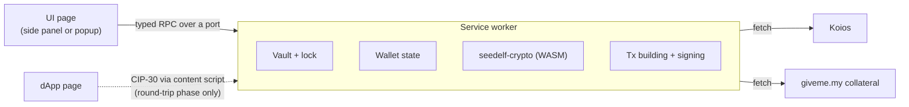

# Architecture

Keep it light: a small Manifest V3 extension, the Seedelf crypto we already have compiled to WebAssembly, and Koios for chain data. Nothing else unless it earns its place.

## Shape

- **Service worker:** owns everything that matters.
  - While unlocked, it holds the decrypted secret. It is the only place secrets ever exist.
  - It also holds wallet state, builds and signs transactions, and makes all network calls.
- **UI:** renders state and sends the user's actions to the service worker. It never holds keys.
- **Content scripts:** v1 has none. They arrive with the contract round trip, to offer CIP-30 on one-time accounts.
  - This matters for security: v1 injects nothing into web pages.
  - v1 only needs host permissions for Koios and giveme.my, not `<all_urls>`.

## Service worker

- **The worker owns the state and the UI mirrors it.** The UI takes a snapshot on open, then receives updates. This is Lace's model, minus its framework.
- **Chrome kills an idle worker after about 30 seconds.** State must reload from storage on every wake-up.
  - Register event listeners synchronously, before the first `await`, or the event that woke the worker is lost.
- **`importScripts` only works during `install`.** Don't code-split the worker, or preload every chunk at install the way Lace does.
- **Open decision:** what happens to an unlocked wallet when the worker restarts.
  - **Option 1:** keep the unlocked key in `chrome.storage.session`. That storage is in memory only, cleared when the browser restarts, and not readable by content scripts.
  - **Option 2:** ask for the password again after every restart.

## Crypto

- **Seedelf cryptography comes from [seedelf-crypto](../../seedelf-crypto/), compiled to WebAssembly with `wasm-bindgen`.**
  - This is the same prover the CLI already runs against the on-chain verifier.
  - It covers register creation, re-randomization, the ownership check and Schnorr proofs.
  - One implementation, so there are no byte-for-byte parity problems.
- **A thin wrapper crate exposes only what the wallet needs.** That way `seedelf-crypto` itself doesn't change.
- **Build notes from a first probe:** `seedelf-crypto` compiled to `wasm32-unknown-unknown` at about 670 KB before `wasm-opt`. It has not been run yet. It needed three settings:
  - `getrandom` 0.2 with the `js` feature, set in the wrapper crate.
  - `CC_wasm32_unknown_unknown=clang`, because `blst` is C code.
  - `AR_wasm32_unknown_unknown=llvm-ar`, which is `llvm-ar-18` on Ubuntu.
- **The manifest CSP needs `script-src 'self' 'wasm-unsafe-eval'`** to load WebAssembly.
- **Everything else uses small, audited JS libraries:**
  - `@noble/hashes` (Argon2id, BLAKE2b)
  - `@noble/ciphers` (ChaCha20-Poly1305)
  - `@scure/bip39` (recovery phrases)

## Transaction building

**Open decision.** The two options:

1. **Rust (Pallas) compiled to WebAssembly.**
   - The CLI already builds every Seedelf transaction with Pallas 0.33: registers, the reference-script spend, the fee and ex-unit loop, and the collateral-service witness. It is covered by offline integration tests.
   - To reuse that logic, the builders would move out of each command's `run` into shared functions. [seedelf-platform/CLAUDE.md](../../CLAUDE.md) currently forbids that on purpose, so it would be a deliberate change.
   - Networking stays in TypeScript.
2. **A TypeScript Cardano library.**
   - Lace's `TransactionBuilder` (`packages/contract/cardano-context/src/tx-builder/`) covers inline datums, redeemers, collateral and script evaluation.
   - But it has **no reference inputs**, and Seedelf spends go through reference scripts.
   - We would port the Seedelf-specific logic by hand.

**Leaning:** option 1, for the same reason as the crypto: one implementation that has already been tested against the chain.

## Chain data

- **Koios, same as the CLI.**
  - Wallet contract UTxOs via `credential_utxos`.
  - `address_utxos` for the deposit and one-time accounts.
  - Protocol parameters, tip, `evaluate_transaction`, `submit_tx`.
  - Seedelf token lookups for recipients' registers.
- **Collateral for Seedelf spends comes from the giveme.my service**, exactly as in the CLI (`seedelf-koios`). See [privacy.md](privacy.md).
- **Finding owned UTxOs:** fetch every UTxO at the wallet contract and keep the ones where the register satisfies `generator^x == public_value`. This is `is_owned`, the same method the CLI's `balance` uses.
  - The cost grows with the size of the contract's UTxO set. That's fine today; revisit if it gets large.
- **All requests come from the user's IP.** The IP-tracking caveats in the root [README](../../../README.md#de-anonymizing-via-ip-tracking) apply. The extension adds no analytics or telemetry.

## Storage

- **`chrome.storage.local` holds three things:**
  - the encrypted vault: a single SecretBox blob, see [keys-and-accounts.md](keys-and-accounts.md#password-and-vault)
  - non-secret settings
  - cached chain data
- **Decrypted secrets live only in service-worker memory**, or in session storage if we choose that (see above).
- **They are wiped on lock.** Lace keeps the last verified password in memory after use (`packages/contract/authentication-prompt/src/store/auth-secret-accessor.ts`), and we won't.
- **Auto-lock** after a period of inactivity.
- **Failed unlocks** trigger an exponential back-off.

## UI

- **A plain web UI** with a small framework or none. Not Lace's React Native / Expo stack.
- **Lace's flows and visual language may inspire ours:** spacing, corner radius, light and dark themes, screen-to-screen flow.
- **We don't take Lace's name, logo or brand assets,** and we don't take its commercial fonts (Brandon Grotesque and Proxima Nova are in its repo but not licensed to us).
- **Icons** only under a compatible license.
- **Side panel or popup:** open decision. Lace uses a side panel and has no popup.

## What we borrow from Lace

Paths are relative to a `lace-extension@2.4.0` checkout (see the [README](../README.md#reference-lace)).

| What | Lace path | How we use it |
|---|---|---|
| SecretBox (Argon2id + ChaCha20-Poly1305) | `packages/lib/core/src/secret-box/` | Adopt |
| Typed RPC between extension contexts | `packages/lib/extension-messaging/src/` | Adapt; it's about 1.8k lines and needs RxJS |
| Service-worker boot order and install preloading | `apps/lace-extension/src/sw-script/` | Pattern |
| Worker-owned store mirrored in the UI | `apps/lace-extension/src/util/connect-store.ts`, `apps/lace-extension/src/sw-script/create-remote-store.ts` | Pattern |
| Lock state machine and inactivity timer | `packages/contract/app-lock/src/store/` | Pattern |
| Unlock back-off | `packages/contract/authentication-prompt/src/store/unlock-backoff.ts` | Pattern |
| MV3 manifest and CSP | `apps/lace-extension/assets/manifest.json` | Pattern |
| CIP-30 injection (round-trip phase) | `apps/lace-extension/src/content-scripts/`, `packages/lib/dapp-connector/`, `packages/module/dapp-connector-cardano/` | Pattern |
| Keeping existing vkey witnesses intact | `packages/module/blockchain-cardano/src/tx-executor-implementation/merge-pre-existing-vkeys.ts` | Reference |

We don't take Lace's contracts, modules or feature-flag framework, its host/guest shell, its analytics (PostHog, Sentry), or anything for Bitcoin or Midnight.

**Licensing:** Lace is Apache-2.0, and this repository is MIT. Files copied or adapted from Lace stay under Apache-2.0. For each one:

- keep its notices
- mark our changes
- ship a copy of the Apache-2.0 license alongside it
