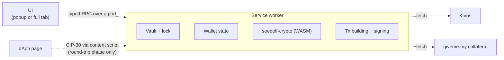

# Architecture

Keep it light: a small Manifest V3 extension, the Seedelf crypto and transaction building we already have in Rust (compiled to WebAssembly), and Koios for chain data. Nothing else unless it earns its place.

## Shape

- **Service worker:** owns everything that matters.
  - While unlocked, it holds the decrypted secret. It is the only place secrets ever exist.
  - It also holds wallet state, builds and signs transactions, and makes all network calls.
- **UI:** renders state and sends the user's actions to the service worker. It never holds keys.
- **Content scripts:** v1 has none. They arrive with the contract round trip, to offer CIP-30 on one-time accounts.
  - This matters for security: v1 injects nothing into web pages.
  - v1 only needs host permissions for Koios and giveme.my, not `<all_urls>`.

## Service worker

- **The worker owns the state and the UI mirrors it.** The UI takes a snapshot on open, then receives updates. This is Lace's model, minus its framework.
- **Chrome kills an idle worker after about 30 seconds.** State must reload from storage on every wake-up.
  - Register event listeners synchronously, before the first `await`, or the event that woke the worker is lost.
- **The worker is an ES module** (`"type": "module"` in the manifest).
  - Static imports of the extension's own files are fine. The build emits `sw.js` plus a shared chunk.
  - Dynamic `import()` and top-level `await` are not allowed in service workers, so WASM initializes lazily: `loadWasm()` in `extension/src/background/wasm.ts`.
  - Lace's classic-worker `importScripts` preloading isn't needed.
- **Staying unlocked across restarts (decided).** A worker restart loses everything held in memory, including the unlocked key. The popup can't hold the key either, because it closes as soon as the user clicks away.
  - On unlock, the key goes into `chrome.storage.session`. That storage is in memory only, never written to disk, cleared when the browser closes, and not readable by content scripts.
  - A restarted worker reads the key back from there.
  - **Lock** (manual or auto-lock) clears the key from session storage as well as from memory.
  - The result: the wallet stays unlocked until auto-lock or browser close, instead of asking for the password after every idle restart.

## Crypto

- **Seedelf cryptography comes from [seedelf-crypto](../../seedelf-crypto/), compiled to WebAssembly with `wasm-bindgen`.**
  - This is the same prover the CLI already runs against the on-chain verifier.
  - It covers register creation, re-randomization, the ownership check and Schnorr proofs.
  - One implementation, so there are no byte-for-byte parity problems.
- **One WebAssembly crate for the wallet:** [seedelf-web-wallet/wasm](../wasm/) (`seedelf-wasm`), a Cargo workspace member.
  - It exposes only what the extension needs, for both crypto and [transaction building](#transaction-building).
  - `build.sh` produces an ES module of about 590 KB, before `wasm-opt`.
  - Its tests check the output against native Rust byte for byte.
- **Build settings:**
  - `getrandom` 0.2 with the `js` feature, set in the wasm crate.
  - `CC_wasm32_unknown_unknown=clang`, because `blst` is C code.
  - `AR_wasm32_unknown_unknown=llvm-ar`, which is `llvm-ar-18` on Ubuntu.
  - `wasm-bindgen-cli` pinned to the crate's `wasm-bindgen` version.
- **The manifest CSP needs `script-src 'self' 'wasm-unsafe-eval'`** to load WebAssembly.
- **Recovery phrases (BIP39) are handled in Rust too:** generation, validation and the Seedelf key derivation. See [keys-and-accounts.md](keys-and-accounts.md#seedelf-key-derivation).
- **Everything else uses small, audited JS libraries:**
  - `@noble/hashes` (Argon2id, BLAKE2b)
  - `@noble/ciphers` (ChaCha20-Poly1305)

## Transaction building

**Decided: Rust (Pallas 0.33), compiled to WebAssembly.**

- **One implementation.** The CLI already builds every Seedelf transaction with Pallas: registers, reference-script spends, the fee and ex-unit loop, and the collateral-service witness. Offline integration tests cover it. Reusing it gives the same single implementation as the crypto.
- **The rejected option was a TypeScript library.** Lace's `TransactionBuilder` has no reference inputs, so we would have had to port the Seedelf logic by hand.

**What a probe found:**

- **It compiles.** `seedelf-core`, `pallas-txbuilder`, `seedelf-crypto` and `seedelf-koios` all compile to `wasm32-unknown-unknown`, at about 912 KB before `wasm-opt`.
- **One line blocked it.** `seedelf-koios` sets `connect_timeout` on its HTTP client, and `reqwest`'s browser build doesn't have that setting. Gate the line with `#[cfg(not(target_arch = "wasm32"))]`.

**Plan: separate building from network calls.** Each CLI command's `run` mixes pure building with a few network calls:

- **At the start:** protocol parameters, UTxOs, recipient registers.
- **In the middle:** `evaluate_transaction`, to get ex-units.
- **At the end:** the giveme.my collateral witness, then submit.

The building moves into network-free functions in `seedelf-core`: a draft step, plus a finalize step after evaluation for script spends. Both callers then use the same functions:

- **The CLI** calls them with Koios data, as it does today.
- **The extension** fetches the same Koios JSON in TypeScript and passes it through WebAssembly. It deserializes into the same `seedelf-koios` types.

**Notes on the refactor:**

- **Scope:** only the commands the web wallet needs, about 2.1k lines:
  - `external sweep` (move in)
  - `util mint` (create)
  - `transfer`
  - `sweep`
  - `remove`
- **Tests guard it.** The CLI's offline integration tests (`seedelf-cli/tests/cli/`) already check value conservation, min-UTxO and valid change registers for each of these commands.
- **CLAUDE.md rule:** this reverses the "don't reintroduce `build_*` functions" rule in [seedelf-platform/CLAUDE.md](../../CLAUDE.md). That rule existed because the removed GUI was the only other consumer. Update it when the refactor lands.

## Networks

**Preprod first. Mainnet is a build flag.**

**Default builds are preprod-only:**

- Only the preprod hosts are in the manifest's host permissions.
- There is no network switch.
- The UI shows a permanent **PREPROD** badge.

**Setting the flag** (for example `VITE_ENABLE_MAINNET=true`) makes three changes:

- It adds the mainnet hosts to the manifest.
- It makes mainnet the default.
- It adds a network switch in settings, so preprod stays available for testing.

**One network value drives everything network-specific.** The Rust side already takes a `network_flag` everywhere (`true` = preprod), and the WebAssembly API passes it through. This is how the CLI's `--preprod` works.

| | Preprod | Mainnet |
|---|---|---|
| Koios | `https://preprod.koios.rest/api/v1` | `https://api.koios.rest/api/v1` |
| Collateral service | `https://www.giveme.my/preprod/collateral/` | `https://www.giveme.my/mainnet/collateral/` |
| Contract config | `get_config(variant, true)` | `get_config(variant, false)` |
| Addresses | `addr_test…` | `addr…` |

- **The contract config** covers reference UTxOs, the collateral UTxO and the shared staking hash. These differ per network. The script hashes are the same on both.
- **Cached chain data is kept per network.** The vault is shared, because keys don't depend on the network. The CLI works the same way.
- **Addresses are checked against the active network** before anything is sent. This mirrors the CLI's `is_on_correct_network`.
- **Preprod status on 2026-09-23:**
  - The wallet and seedelf reference scripts are live and unspent.
  - The collateral UTxO is live, and the giveme.my preprod endpoint is up.
  - The wallet contract holds 25 UTxOs.

## Chain data

- **Koios, same as the CLI.**
  - Wallet contract UTxOs via `credential_utxos`.
  - `address_utxos` for the Cardano account (receive and change chains, gap limit 20) and one-time accounts.
  - Protocol parameters, tip, `evaluate_transaction`, `submit_tx`.
  - Seedelf token lookups for recipients' registers.
- **Collateral for Seedelf spends comes from the giveme.my service**, exactly as in the CLI (`seedelf-koios`). See [privacy.md](privacy.md).
- **Finding owned UTxOs:** fetch every UTxO at the wallet contract and keep the ones where the register satisfies `generator^x == public_value`. This is `is_owned`, the same method the CLI's `balance` uses.
  - The cost grows with the size of the contract's UTxO set. That's fine today; revisit if it gets large.
- **All requests come from the user's IP.** The IP-tracking caveats in the root [README](../../../README.md#de-anonymizing-via-ip-tracking) apply. The extension adds no analytics or telemetry.

## Storage

- **`chrome.storage.local` holds three things:**
  - the encrypted vault: a single SecretBox blob, see [keys-and-accounts.md](keys-and-accounts.md#password-and-vault)
  - non-secret settings
  - cached chain data
- **Decrypted secrets live only in service-worker memory and `chrome.storage.session`** (see above).
- **They are wiped on lock.** Lace keeps the last verified password in memory after use (`packages/contract/authentication-prompt/src/store/auth-secret-accessor.ts`), and we won't.
- **Auto-lock** after a period of inactivity.
- **Failed unlocks** trigger an exponential back-off.

## UI

- **React + TypeScript, bundled with Vite 8 (Rolldown) (decided).**
  - One build emits the popup/tab page, `sw.js`, the WASM asset, and `manifest.json` (generated by `extension/src/manifest.ts`).
  - The page CSP is `default-src 'self'; script-src 'self' 'wasm-unsafe-eval'; connect-src 'self'` plus the enabled network's Koios and giveme.my origins only.
  - No heavy component library.
  - Plain CSS with design tokens for light and dark themes.
  - Not Lace's React Native / Expo stack.
- **Lace's flows and visual language may inspire ours:** spacing, corner radius, light and dark themes, screen-to-screen flow.
- **We don't take Lace's name, logo or brand assets,** and we don't take its commercial fonts (Brandon Grotesque and Proxima Nova are in its repo but not licensed to us).
- **Icons** only under a compatible license.
- **Popup plus full tab (decided), like Eternl:**
  - Clicking the toolbar icon opens a popup.
  - An "expand" button opens the same app in a full browser tab.
  - One responsive UI serves both.
  - No side panel. Lace opens in a side panel, which feels cramped.

## What we borrow from Lace

Paths are relative to a `lace-extension@2.4.0` checkout (see the [README](../README.md#reference-lace)).

| What | Lace path | How we use it |
|---|---|---|
| SecretBox (Argon2id + ChaCha20-Poly1305) | `packages/lib/core/src/secret-box/` | Adopt |
| Typed RPC between extension contexts | `packages/lib/extension-messaging/src/` | Adapt; it's about 1.8k lines and needs RxJS |
| Service-worker boot order and install preloading | `apps/lace-extension/src/sw-script/` | Pattern |
| Worker-owned store mirrored in the UI | `apps/lace-extension/src/util/connect-store.ts`, `apps/lace-extension/src/sw-script/create-remote-store.ts` | Pattern |
| Lock state machine and inactivity timer | `packages/contract/app-lock/src/store/` | Pattern |
| Unlock back-off | `packages/contract/authentication-prompt/src/store/unlock-backoff.ts` | Pattern |
| MV3 manifest and CSP | `apps/lace-extension/assets/manifest.json` | Pattern |
| CIP-30 injection (round-trip phase) | `apps/lace-extension/src/content-scripts/`, `packages/lib/dapp-connector/`, `packages/module/dapp-connector-cardano/` | Pattern |
| Keeping existing vkey witnesses intact | `packages/module/blockchain-cardano/src/tx-executor-implementation/merge-pre-existing-vkeys.ts` | Reference |

We don't take Lace's contracts, modules or feature-flag framework, its host/guest shell, its analytics (PostHog, Sentry), or anything for Bitcoin or Midnight.

**Licensing:** Lace is Apache-2.0, and this repository is MIT. Files copied or adapted from Lace stay under Apache-2.0. For each one:

- keep its notices
- mark our changes
- ship a copy of the Apache-2.0 license alongside it
