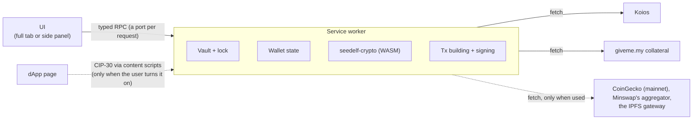
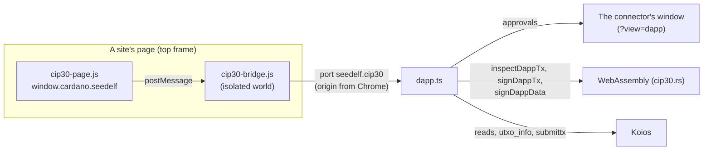
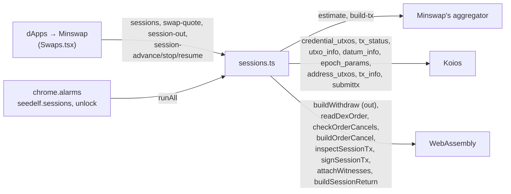
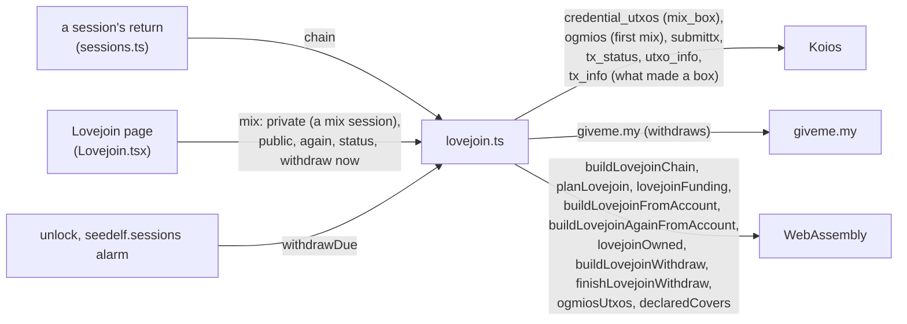

# Architecture

Keep it light: a small Manifest V3 extension, the Seedelf crypto and transaction building we already have in Rust (compiled to WebAssembly), and Koios for chain data. Nothing else unless it earns its place.

## Shape

```mermaid
flowchart LR
  UI["UI<br/>(full tab or side panel)"] -- "typed RPC (a port per request)" --> SW
  subgraph SW["Service worker"]
    Vault["Vault + lock"]
    Wallet["Wallet state"]
    Crypto["seedelf-crypto (WASM)"]
    Tx["Tx building + signing"]
  end
  SW -- "fetch" --> Koios["Koios"]
  SW -- "fetch" --> Collat["giveme.my collateral"]
  SW -. "fetch, only when used" .-> Others["CoinGecko (mainnet), Minswap's aggregator,<br/>the IPFS gateway"]
  Page["dApp page"] -. "CIP-30 via content scripts<br/>(only when the user turns it on)" .-> SW
```

- **Service worker:** owns everything that matters.
  - While unlocked, it holds the decrypted secret. It is the only place secrets ever exist.
  - It also holds wallet state, builds and signs transactions, and makes all network calls.
- **UI:** renders state and sends the user's actions to the service worker. It never holds keys. The only secrets it ever sees are the ones the user types or asks for: the password, and the recovery phrase while the user writes it down or types it in (onboarding, or Settings' reveal and check). Each goes only to the worker.
- **Content scripts (chunk 15):** none until the user turns on the [dApp connector](#dapp-connector).
  - This matters for security: until then, the wallet adds nothing to web pages.
  - Its install-time host permissions are only Koios and giveme.my (and CoinGecko, in a mainnet build). The sites are an optional permission, asked for when the connector is turned on, and kept when it's turned off (see [dApp connector](#dapp-connector)).

## Service worker

- **The worker owns the state and the UI mirrors it.** The UI takes a snapshot on open (the `status` request), then refreshes whenever the worker broadcasts `state-changed`, for example on auto-lock. This is Lace's model, minus its framework.
  - **Requests go to the worker alone** (the launch review, #33). Each travels on a port of its own (`UI_PORT`, `ui/background.ts`), which only the worker listens for (`ui-port.ts`: this extension's own pages only). `runtime.sendMessage` would also hand it, and a password or the phrase in it, to every other open wallet page. The broadcasts (`state-changed`, `dapp-changed`) carry nothing, so they stay messages.
  - The wallet states are `no-wallet`, `locked` and `unlocked` (`extension/src/background/wallet.ts`).
  - The worker runs state changes one at a time, so two pages can't race each other past the unlock back-off.
  - **That queue isn't re-entrant.** `withKeys`, `withAccount` and `withStoreKey` each run their task in the wallet's one queue (`serial` in `wallet.ts`), so calling any of them from inside such a task waits on itself, and every request behind it waits too. Pass the task what it needs from the enclosing call instead: `balances.ts`'s `held` takes `activeAccount` as an argument for exactly this (chunk 18).
- **Chrome kills an idle worker after about 30 seconds.** State must reload from storage on every wake-up. The worker's timers don't survive either, so auto-lock uses `chrome.alarms`.
  - Register event listeners synchronously, before the first `await`, or the event that woke the worker is lost.
- **The worker is an ES module** (`"type": "module"` in the manifest).
  - Static imports of the extension's own files are fine. The build emits `sw.js` plus a shared chunk.
  - Dynamic `import()` and top-level `await` are not allowed in service workers, so WASM initializes lazily: `loadWasm()` in `extension/src/background/wasm.ts`.
  - Lace's classic-worker `importScripts` preloading isn't needed.
- **The toolbar button (chunk 14).** There's no popup: the manifest's `action` has no `default_popup`. With the wallet set to open in a tab (the default), a click reaches the worker's `action.onClicked`, which brings back the wallet's open tab (`runtime.getContexts`) or opens one. Set to the side panel, Chrome opens the panel itself (`sidePanel.setPanelBehavior`), and the worker isn't asked. The choice is `seedelf.openIn` in `chrome.storage.local` (`shared/open-in.ts`), and it's applied again whenever the extension installs or starts.
- **Staying unlocked across restarts (built in chunk 5).** A worker restart loses everything held in memory, including the unlocked keys. No page can hold the keys either: there may be several, and each closes when the user closes it.
  - On unlock, the vault's entropy goes into `chrome.storage.session` (`seedelf.entropy`), along with the time of the last activity (`seedelf.lastActivity`) and of the unlock itself (`seedelf.unlockedAt`, also written at create and restore, for the unlock's fresh draws: see [Lovejoin](#lovejoin)). That storage is in memory only, never written to disk, cleared when the browser closes, and not readable by content scripts.
  - **It is readable by the extension's own pages**, as any extension storage is: there's no store only the worker can read. What keeps it from them is that they run only the extension's own code (the CSP allows no other script). The CSP doesn't stop a person at the browser, though: while the wallet is unlocked, DevTools opened on its tab can read session storage, the entropy included (crypto review, *Not fixed* #1; privacy review §5.10). Since the crypto review (2026-09-25), no page listens to `chrome.storage.onChanged`, whose events carry session storage's changes, the entropy among them at every unlock and lock: the UI follows `chrome.storage.local.onChanged` alone.
  - **Content scripts can't read local storage either** (the crypto review): the worker sets both areas to `TRUSTED_CONTEXTS` at every start (`chrome.storage.<area>.setAccessLevel`; Chrome's default leaves local storage open to content scripts). The connector's bridge runs in every site's renderer and never reads storage, so a renderer a site took over can't take the sealed vault through it to guess the password offline, or change the unsealed settings. A Chrome that won't set it on local storage keeps the connector off: its scripts are never registered, and the status says why (`connectorBlocked: "storage"`, `storage-access.ts`).
  - A restarted worker re-derives the keys from there, unless the auto-lock deadline has passed, in which case it locks.
  - **Lock** (manual or auto-lock) clears the entropy from session storage and frees the keys in memory. Wiping memory is best effort (see *Build settings* under [Crypto](#crypto)).
    - It clears all of session storage but `seedelf.sends` (and, on a lock, the declined sites: below): when the wallet last sent something (its own sends and sites' through the connector), and when session storage began. Two times, nothing of what was sent, kept so Lovejoin's quiet rule holds across a lock (independent review M10). A trap and Remove wallet keep it too; a closed browser or an update clears it. A lock and a trap keep `seedelf.dapp.refused` too, the sites the user declined and their waits (no title, nothing about money), so a lock doesn't let one ask at once, even a lock made by a worker that hasn't read them yet; Remove wallet doesn't (the blind test's cross-area review).
    - Storage goes first, and the keys are dropped whatever happens, each freed in its own `try`: a WebAssembly instance that trapped refuses `free()`, and nothing it does can keep the wallet unlocked (the launch review, #17).
    - A call that traps (`isTrap` in `wasm.ts`) locks the wallet and replaces the instance with a fresh one in place (`freshWasm`, wasm-bindgen's reset function, which `wasm/build.sh` asks for). The old instance's key objects stop working, so the user unlocks again.
    - So does a trap under a site's call (`answerSite`) or as the user approves a site's request (`DappService.answer`). The site hears only "Seedelf Wallet couldn't answer this request." (independent review M15). A trap inside the wallet's queue, while a site's transaction is read or signed, locks it there (`Wallet.serial`), as for any request.
    - Auto-lock counts an activity time more than 30 s in the future (a clock that moved back further than a time service's usual correction) as expired, and its alarm stops once there's no entropy, as after a browser restart, without loading WebAssembly.
  - The result: the wallet stays unlocked until auto-lock or browser close, instead of asking for the password after every idle restart.

## Crypto

- **Seedelf cryptography comes from [seedelf-crypto](../../seedelf-crypto/), compiled to WebAssembly with `wasm-bindgen`.**
  - This is the same prover the CLI already runs against the on-chain verifier.
  - It covers register creation, re-randomization, the ownership check and Schnorr proofs.
  - One implementation, so there are no byte-for-byte parity problems.
  - **A proof's nonce is hedged** (the crypto review, 2026-09-25): HMAC-SHA-512 keyed by the Seedelf scalar, over the register, the one-time key's hash and 32 fresh random bytes, reduced mod the group order. It's as random as before, but a random source that failed or repeated could never give two different statements one nonce, which would reveal the key. The verifier is unchanged. Lovejoin's proofs already use deterministic RFC 6979 nonces (`seedelf-crypto/src/lovejoin.rs`).
  - **Randomness is drawn only where it protects something:** the recovery phrase, re-randomization scalars, proof nonces, one-time key seeds, and Lovejoin's mix scalars, orderings and delays. Sizing an output that doesn't exist yet uses a fixed register, and a Lovejoin withdraw's first, thrown-away build a fixed stand-in for its proof, never the key.
- **One WebAssembly crate for the wallet:** [seedelf-web-wallet/wasm](../wasm/) (`seedelf-wasm`), a Cargo workspace member.
  - It exposes only what the extension needs, for both crypto and [transaction building](#transaction-building).
  - `build.sh` produces an ES module with the `wasm-release` cargo profile: about 2.6 MB, 797 KB gzipped (see [Transaction building](#transaction-building)).
  - Its tests check the output against native Rust byte for byte.
- **Build settings:**
  - `getrandom` 0.2 with the `js` feature, set in the wasm crate: `crypto.getRandomValues`. If it ever fails, the draw panics and the call throws; nothing goes on with zeros.
  - **Secrets in WebAssembly memory are wiped with `zeroize`** (volatile writes the compiler can't drop), as far as the wallet's own code reaches:
    - the Seedelf scalar on `free()`, and the one-time keys' material. The Cardano keys (`ed25519-bip32`'s `XPrv`) wipe themselves, and `bip39`'s `zeroize` feature wipes its mnemonics.
    - Unlock derives the keys from the entropy directly, so the phrase isn't written out at all (the launch review, #32).
    - Every copy of the phrase and the entropy that `seedelf-crypto` makes, the BIP39 seed, the HKDF key and output, and the Cardano master key. The HKDF expand has its own HMAC for this: cryptoxide's keeps its key in vectors it frees unwiped.
    - The phrase and entropy exports take what they're given by value, wipe it, and build what they return in JavaScript. wasm-bindgen would free its copies unwiped.
  - **Wiping is best effort.** Copies inside the libraries (cryptoxide's HMAC and PBKDF2, among them the proof nonce's HMAC keyed by the Seedelf scalar) and on the stack stay in freed memory until it's reused. JavaScript strings can't be wiped at all: the base64 entropy the worker reads from session storage, and a phrase typed or shown. So lock frees the keys and clears session storage, but it can't promise the worker's memory holds nothing until the worker is torn down.
  - `CC_wasm32_unknown_unknown=clang`, because `blst` is C code.
  - `AR_wasm32_unknown_unknown=llvm-ar`, which is `llvm-ar-18` on Ubuntu.
  - `wasm-bindgen-cli` pinned to the crate's `wasm-bindgen` version.
  - **The same commit and toolchain give the same module** (the launch review, #61). `seedelf-platform/Cargo.lock` is tracked, and `build.sh` and CI build and test with `--locked`, so the crates are the ones it records. `seedelf-platform/rust-toolchain.toml` pins Rust (1.98.1, with the wasm32 target), and CI installs the same. `build.sh` remaps the workspace, the target folder, Cargo's registry and Rust's sysroot (`--remap-path-prefix`), so no path on the builder's disk goes into the module, and it refuses a module that still carries one. **Nothing pins the C compiler:** blst's C goes through whatever `clang` is on `PATH`, and another major version gives other code, so `build.sh` ends by printing it (`C compiler: …`) for the release record ([development.md](development.md#releasing-to-the-web-store)).
- **The manifest CSP needs `script-src 'self' 'wasm-unsafe-eval'`** to load WebAssembly.
- **Recovery phrases (BIP39) are handled in Rust too:** generation, validation and the Seedelf key derivation. See [keys-and-accounts.md](keys-and-accounts.md#seedelf-key-derivation).
- **Everything else uses small, audited JS libraries:**
  - `@noble/hashes` (Argon2id, BLAKE2b, HKDF-SHA-256)
  - `@noble/ciphers` (ChaCha20-Poly1305, and XChaCha20-Poly1305 for the private records)

## Transaction building

**Decided: Rust (Pallas 0.35, 0.33 until chunk 16), compiled to WebAssembly.**

- **One implementation.** The CLI already builds every Seedelf transaction with Pallas: registers, reference-script spends, the fee and ex-unit loop, and the collateral-service witness. Offline integration tests cover it. Reusing it gives the same single implementation as the crypto.
- **The rejected option was a TypeScript library.** Lace's `TransactionBuilder` has no reference inputs, so we would have had to port the Seedelf logic by hand.

**Status (chunk 13):** every v1 transaction is built on it: move-in, creating a Seedelf, transfer, withdraw, removing a Seedelf, a send from the Cardano account, and staking (delegate, vote, withdraw rewards, stop). Built on it since: a private session's funding and return (chunk 15; Minswap builds the swap, and the wallet only signs it), Lovejoin's deposits, mixes and withdraws (chunk 16), the account's own DRep's registration, update, retirement and votes (chunk 21), and a session's cancel of its DEX orders (chunk 24, [`seedelf-core/src/orders.rs`](../../seedelf-core/src/orders.rs)).

- **`seedelf-core` compiles to WebAssembly.** The one blocker was `seedelf-koios` setting `connect_timeout` (and `timeout`) on its HTTP client; `reqwest`'s browser build has neither, so both are gated with `#[cfg(not(target_arch = "wasm32"))]`.
- **The WebAssembly module is 2.6 MB** (797 KB gzipped, measured on 2026-10-04). It was 1.3 MB (439 KB) at chunk 13; chunk 16's script evaluator (Aiken's `uplc`) is most of the growth, and chunk 17's transaction decoder is 15 KB of it. It's loaded from the extension itself, so this only costs a moment on the worker's first start.
  - `build.sh` uses the workspace's `wasm-release` profile: `opt-level = "z"`, LTO, one codegen unit, stripped. Against the plain `release` profile it cuts the module by almost two-thirds (7.1 MB to 2.6 MB, 1,474 KB to 797 KB gzipped, 2026-10-04) at the same speed. The BLS arithmetic is blst's C, and a proof takes about 1.8 ms either way.
  - `wasm-opt` was measured on top and left out: it made the file 9 % smaller but its gzipped size 6 % larger, and the Web Store's download is a zip.
  - `wasm/bench.mjs` measures the size and the speed of a build.
- **Network-free builders** live in [`seedelf-core/src/build.rs`](../../seedelf-core/src/build.rs). A builder takes chain data the caller already has (protocol parameters, UTxOs as Koios returns them, deserialized into the same `seedelf-koios` types) and returns an unsigned transaction.
  - `external_sweep`: the CLI's `external sweep`, now a thin `run()` around it. Its offline tests pass unchanged.
  - `move_in` and `account_send`: the web wallet's move-in and a send from the Cardano account to one address (see [flows.md](flows.md#make-private-public-account--private-balance)). Each is one account payment to a `Payee`: into Seedelf (deposits, tokens 20 to an output, under your register or, chunk 14, someone else's, which must pass `is_payable`) or to a key address (one output). They share the UTxO choice and the change, and may spend any UTxO they're given: the web wallet leaves out its collateral and the UTxOs the user locked ([coin control](#chain-data), chunk 12). Until then they never spent a pure 5 ₳ UTxO, as the CLI's `collect_address_utxos` doesn't.
    - `account_send_many` (chunk 14) pays several recipients at once, each an `AccountPay`: a `Payee`, an amount and its tokens, in order before the change. Their tokens are checked together against what's held. Max pays a single recipient. The web wallet builds every send with it, to addresses and to Seedelfs; `account_send` is its one-address case.
  - `mint`: the CLI's `util mint`, now a thin `run()` around it, and the web wallet's stealth [Create a Seedelf](flows.md#create-a-seedelf).
  - `transfer` and `transfer_from`: the CLI's `transfer`, now a thin `run()` around them, and the web wallet's [Send to a Seedelf](flows.md#send-privately-private-balance--any-seedelf) (chunk 9).
    - Each payment goes under a fresh re-randomization of the recipient's register, as found on chain with their Seedelf.
    - `is_payable` refuses a register that a payment would be lost under: points that don't decode, torsion points, or the identity. `is_valid` alone lets the identity through, and anyone can prove the zero key behind it. Both mints use it too.
    - `transfer_most` is private Send's Max (blind test §9.6): one Seedelf is paid everything the given inputs hold but the fee, with the tokens given, and the tokens it doesn't send stay as change with exactly their minimum (`ScriptSpend::pay_rest`). `max_inputs` picks those inputs, as Max does: the ones holding the tokens sent, then the largest, at most 20, never one whose tokens wouldn't fit or the evaluator can't take, and says how many it left.
  - `sweep`, `sweep_from`, `sweep_many`, `sweep_many_from`, `sweep_all` and `sweep_most`: the CLI's `sweep`, now a thin `run()` around them, and the web wallet's [Withdraw](flows.md#send-to-an-address) (chunk 10). `sweep_many` (chunk 14) pays several addresses, each an `AddressPayment`, from one selection of inputs; `sweep` is its one-address case, and `sweep_many_from` spends exactly the inputs given. `sweep_all` sends everything, every token too (Make public's Max); `sweep_most` the most a payment of some tokens can be, the others staying, which Make public's shortfall says (blind test §4.4). `is_payable_address` accepts only a Shelley address on this network with no script in it, as the CLI always has.
  - `remove`: the CLI's `remove` and the web wallet's [Remove a Seedelf](flows.md#remove-a-seedelf). It spends the UTxO holding exactly one Seedelf and burns it (`ScriptSpend::mint` with −1).
  - `account_mint`: a Seedelf paid by the Cardano account (chunk 8b; the CLI's `create`, still inline in the CLI).
    - Key inputs pay: pure ADA first.
    - The collateral is the web wallet's set-aside one when it has one (never an input), otherwise one of the account's own UTxOs. If it holds tokens, the collateral return gives them back.
    - It's drafted and finalized like a script spend, but only the policy runs: no proofs, no one-time key, no giveme.my.
  - `account_staking` (chunk 13): a staking transaction from the Cardano account, an account payment to `Payee::Nobody`: its inputs pay the fee and any deposit, and everything else is change to `0/0`.
  - **Certificates and withdrawals are patched in** ([`seedelf-core/src/staking.rs`](../../seedelf-core/src/staking.rs), chunk 13). `pallas-txbuilder` can stage neither (0.33, 0.35 and 1.4 all write `None` for them), so the transaction is built as usual, then `Staking::patch` decodes the body, sets them, encodes it again, and puts the new body hash into the `BuiltTransaction`. Signing always comes after the patch, so `BuiltTransaction::sign` signs the right hash; a patch after signing is refused. Pricing patches each draft too, and counts the stake key's witness.
    - `Staking::of(key, action, state, key_deposit)` gives the certificates an action needs: `StakeRegDeleg` or `VoteRegDeleg` (register and delegate in one certificate) for an unregistered key, `StakeDelegation` or `VoteDeleg` for a registered one, `UnReg` with the deposit paid to stop. A withdrawal takes the whole reward balance; it's refused while the vote isn't delegated (Conway's rule since its second phase).
    - `Staking::withdraw` rides along with `move_in`, `account_send` and `account_mint`: the rewards count towards what the inputs pay, value being inputs + withdrawal + refund = outputs + fee + deposit.
    - Pool IDs (bech32 or hex) and DRep IDs (CIP-129 as Koios gives them, or CIP-105's `drep1…` and `drep_script1…`) are read there too, and written back the way Koios names them.
    - Checked on preprod without spending anything ([`tests/fixtures/probe-staking.mjs`](../extension/tests/fixtures/probe-staking.mjs)): every kind of staking transaction decodes on the node's Conway decoder, and an account-paid mint with a withdrawal passes the real Seedelf policy at the same budget as without (72,835 memory, 21.4M steps).
    - **The account's own DRep, and its votes** (chunk 21): `Staking::drep(stake, stake_state, drep, drep_state, action, params)` gives `RegDRepCert` with `drep_deposit` (and the stake key's `VoteDeleg` or `VoteRegDeleg` to it after, when the account's own vote goes with it), `UpdateDRepCert`, `UnRegDRepCert` with the deposit paid (and `VoteDeleg` to always abstain after, when the account's vote was the DRep's), or votes. `Staking` carries votes beside its certificates, and `patch` sets the body's `voting_procedures` (`Voter::DRepKey` to each `GovActionId`'s `Yes`, `No` or `Abstain`, no anchor) too. `signers()` counts keys, not "any": the stake key for a stake certificate or a withdrawal (`stake_signs`), the DRep key for a DRep certificate or a vote (`drep_signs`), so a registration with the account's own vote is priced and signed with both. `ProtocolParameters::from_koios` reads `drep_deposit` as an `Option`, since only a registration needs it, and that refuses without it. Checked on preprod without spending anything ([`tests/fixtures/probe-governance.mjs`](../extension/tests/fixtures/probe-governance.mjs)): a registration with and without the account's own vote and with a profile, an update, a retirement and a vote on every live action each decode on the node's Conway decoder, at 0.17–0.18 ₳ of fee.
  - **A note is patched in the same way** ([`seedelf-core/src/note.rs`](../../seedelf-core/src/note.rs), chunk 14): Pallas can't stage metadata either. `Note::new` takes one line of at most 64 characters (Lace's limit), refusing control characters, and splits it into CIP-20 lines of at most 64 bytes, at a space when it can. `Note::patch` sets the auxiliary data (a plain metadata map, `{674: {"msg": [lines]}}`) and its hash in the body, after the staking patch and before signing; pricing patches each draft too, so the fee pays for its bytes. `account_send_many` takes an optional note; nothing else does. Checked on preprod without spending ([`tests/fixtures/probe-note.mjs`](../extension/tests/fixtures/probe-note.mjs)): a send with a note, with one of two lines, and with the rewards too, each decodes on the node.
  - Shared pieces: `deposit_outputs` (contract outputs under fresh re-randomizations, tokens 20 to an output), and `settle_fee`, which signs each draft with one throwaway key per signer and reprices until the fee covers the signed size.
  - **No transaction over 16 KiB** (chunk 14): `settle`, which prices every draft, refuses one whose signed size is over `MAX_TX_SIZE` (the ledger's `max_tx_size`, 16,384 bytes on mainnet and preprod), in words, rather than letting the node refuse it at submit. Many recipients or tokens are how a payment gets there.
  - **The least ADA a payment can carry** has a function per kind: `minimum_deposit` (a move-in), `minimum_address_payment` (a withdrawal or a send) and `minimum_seedelf_payment` (a transfer), each the same sum the builder checks. The builders still refuse less, as the CLI expects; the web wallet's WebAssembly raises a smaller amount to it (so "0" with tokens sends only that) and reports the least as `minimum` (chunk 12).
- **Script spends share one shape, `ScriptSpend`** (chunk 8). Mint, transfer, sweep and remove are all built on it.
  - The change goes back into the contract under fresh copies of the payer's register, or, with `change_to(addr)`, to a key address: that's how `sweep_all` sends everything, and how a removal pays an address.
  - **`pay_rest(to, tokens)`** pays what's left instead, to a Seedelf (under a fresh re-randomization of its register, `is_payable`) or a key address, with `tokens`: the tokens it doesn't send stay as change with exactly the least ADA they need, and no other ADA stays (`transfer_most`, `sweep_most`). `FinalSpend::rest_lovelace` is what it paid, worked out in `settle` with the measured fee, so a Max review is exact.
  - Owned contract inputs, each unlocked by a Schnorr proof bound to the one-time key's hash. The proofs come from a closure, so core never holds the Seedelf secret.
  - giveme.my's collateral UTxO, returned minus 3/2 of the fee. The scripts are read from reference inputs. The one-time key and giveme.my's key are the required signers.
  - **Two phases.** `draft()` gives every redeemer the transaction's maximum budget, for Ogmios to evaluate. `finalize(budgets)` puts in the measured budgets and settles an even fee. The fee covers the size with both signatures, the budgets at the protocol's prices, and the reference scripts' bytes at the protocol's price a byte (15 lovelace), in Conway's tiers (`reference_script_fee`).
  - **Budgets are matched to redeemers by purpose and index** (`Budgets::from_ogmios`), never by their order in the answer. Ogmios happens to list spends by index, then the mint, which is what the CLI's old `split_last` relied on.
  - Ogmios's errors become plain words: which script refused, or "these UTxOs aren't on chain anymore" (Ogmios reports inputs it can't find as extraneous redeemers, code 3110).
  - **Picking inputs** (`select_script_inputs`): first the UTxOs holding the tokens being sent (the biggest holdings of each first, until there's enough). Then, when the caller knows nothing of the UTxOs' histories (the CLI, `Histories::default`), pure-ADA UTxOs, largest first, then other token UTxOs, one at a time, until the fee and valid change fit. The web wallet passes each UTxO's history class and the spend's purpose (`build::Histories`, privacy review §2.3) through `mint_apart`, `transfer_apart` and `sweep_many_apart`, and selection keeps different classes apart where it can: one UTxO that pays alone, the smallest first (at most 12 token-bearing ones tried alone, `MAX_TOKEN_SINGLES`); then UTxOs of one class, largest first; only then merging, the purpose's last resorts after the rest, and boxes back from Lovejoin last of all, one at a time. It returns the classes it merged (`classesMixed`) for the review's note. `Purpose::Pay` (Send, Make public) takes money made private first; `Mint` received money; `Fund` (a session's funding or top-up) its own session's, then received money or a box, and another session's last. With every class Unknown, the inputs and the fee are as before.
    - **Merging** (independent review M6, L39): a token send first tries the UTxOs holding its tokens with one UTxO of another class, never a last resort or a box (by rank, the smallest first, under the same 12-try cap). Then whole orders, each grown one UTxO at a time and passed over at a failure more inputs can't fix (the computation `estimate` guesses, about 22 Seedelf inputs, or 16 KiB):
      1. by tier (last resorts, then boxes, after the rest), then whether it joins the base's class, then the purpose's rank, pure ADA before tokens, the largest first;
      2. the same without the rank, the order before these fixes, so what merging paid then it pays the same way;
      3. for j = 0, 1, 2 …, the j largest boxes, then every other UTxO, the rest of the boxes left out: first largest first, token-bearing ones included, then pure ADA before tokens. So it spends as few boxes as pay, and a token UTxO too large to merge can be left out for a box;
      4. the CLI's order.

      An order already tried, or the start of a whole order that failed, is skipped, and an order that takes every UTxO and still comes up short ends the search. So it never refuses what the CLI's order pays; when nothing pays, the refusal can be the computation or size limit, not only "not enough".
    - **The classes come from the extension** (`activity.ts` `classes`): every funding, top-up and return of one session is one class, all of their histories merged, and it ranks as that session's money (independent review L41). While none of the UTxOs being classed has a known history, the extension sends no classes, and selection is the CLI's; once one has, each Unknown UTxO is a class of its own, `unknown:<tx>` (independent review L40).
  - **A Seedelf spend's outputs are shuffled** (Lovejoin's Fisher–Yates over the OS's random source, privacy review §3.7), so a transfer's change isn't always last. Nothing reads them by position. The fee is guessed from budgets Ogmios measured on preprod (a spend: 76,043 memory and 338M steps; the mint: 72,836 memory and 21M steps).
  - The shape matches a real CLI mint on preprod field for field, and a draft for the test phrase's UTxOs passes both real scripts under preprod Ogmios.
- **Ogmios through Koios:** `POST /ogmios` with `evaluateTransaction`. A failed evaluation comes back as HTTP 400 with a JSON-RPC `error`. The extension's client and `seedelf-koios`'s `evaluate_transaction` now pass that answer on instead of a bare status.
- **Protocol parameters** are parsed by `ProtocolParameters::from_koios`, so the extension passes Koios's `epoch_params` row through WebAssembly unchanged.
- **Signing stays in WebAssembly.**
  - Move-in and send: `buildMoveIn(account, key, requestJson)` and `buildAccountSend(account, requestJson)` check that every UTxO sits at the address its `role/index` derives, build with `move_in` or `account_send_many`, and sign once per distinct payment key. A send whose `to` is a Seedelf's name takes the contract UTxO holding it as `recipient`, checked as a transfer's is (`recipient_register`).
  - **Several recipients** (chunk 14): `buildAccountSend`, `buildTransfer` and `buildWithdraw` take `payments`, a list of one to `MAX_RECIPIENTS` (20), and answer with what each received, in order.
  - Staking: `buildStaking(account, requestJson)` builds with `account_staking` from the action and the stake key's standing (`account_info`, fresh from the worker), and signs with the payment keys and the stake key (`2/0`). A move-in, a send or an account-paid mint given a `withdrawal` (the reward balance) signs with the stake key too. `poolId` and `drepId` read and normalize IDs for the worker. Since chunk 21 `buildStaking` also builds the account's own DRep's registration, update, retirement and votes, from its standing (`drep_info`, fresh from the worker), and signs those with the DRep key (`3/0`) too; `drepProfile` writes a DRep's CIP-119 profile and its hash, asking no one.
  - The account-paid mint: `draftAccountMint` for Ogmios, then `finishAccountMint` with its measure, which signs with the account's keys at review.
  - Script spends: `buildMint`, `buildTransfer`, `buildWithdraw` or `buildRemove`, which prove and measure in one call (below), then `signScriptSpend` at Send. `signScriptSpend` checks giveme.my's signature against its public key over the transaction id before adding it. giveme.my checks a transaction against the chain before it signs, and refuses one whose inputs it can't find ("Transaction Fails Validation").
  - Keys never reach JavaScript.
- **The one-time key is derived, not drawn** (web wallet only). It is HKDF-SHA-256 with the Seedelf scalar as the key material, the salt `seedelf-one-time-key-v1`, and a random 32-byte seed as the info.
  - **Why:** Chrome stops an idle worker after about 30 seconds, and reading a review can take longer. The unsigned transaction and the seed wait in `chrome.storage.session`, and Send re-derives the key inside WebAssembly, even in a restarted worker.
  - **Is it safe to store the seed?** The seed gives nothing without the Seedelf key, and session storage already holds the vault entropy while unlocked.
  - A new seed per spend means a new key per spend (privacy rule 1). The CLI still draws its one-time keys at random.

- **In the worker, `script-spend.ts` holds the flow every Seedelf spend shares:** read the whole contract and the protocol parameters, build in WebAssembly, keep the unsigned transaction and its seed in session storage until Send, then giveme.my → `signScriptSpend` → submit → the pending watch. `mint.ts`, `transfer.ts` and `withdraw.ts` use it, and so does a session's funding.
  - **Measured in the wallet** (the crypto review, 2026-09-25): `buildMint`, `buildTransfer`, `buildWithdraw` and `buildRemove` prove the spend and measure its scripts with `ScriptSpend::measure_locally` (Aiken's `uplc`, as a Lovejoin chain is), in one call.
    - **What's short is measured before it's refused** (blind test §4.4, T05). Picking checks each choice with guessed budgets (`SPEND_BUDGET_GUESS`, about 1.3× what the scripts use), so it refused amounts the review's own fee could pay. When nothing pays by the guess (`build::is_short`), `buildTransfer` and `buildWithdraw` measure the largest UTxOs together (`max_inputs`) before refusing, and `measure_locally` drafts a spend the guess calls short with the most fee it can pay, since the scripts read neither the fee nor the outputs. A session's funding keeps its picking. A refusal then says about how much can go: the worker builds the payment again as Max would, on the UTxOs already read (`transfer.ts`, `withdraw.ts`, `short.ts` `privateShortOf`; `buildWithdraw` takes `most` for the most a payment of some tokens can be), and what has to stay (`changeMinimum`).
    - **Max on private Send** (`buildTransfer` with one payment's `lovelace` null, blind test §9.6) builds `transfer_most` on `max_inputs`, and answers `max`, `left`, and the change it kept for the tokens that stay. A draft sent to Ogmios carried valid proofs, so Koios learned which contract UTxOs were the wallet's even for a review never sent; it cost a request too. The recorded preprod transfer's fee comes out the same to the lovelace, or 602 lovelace less. The scripts see a transaction's signers sorted by hash, and the wallet script looks for the one-time key's among them. A random one-time key hash that sorts before giveme.my's (`1108…`, about 7% of them) is found a step sooner. Each is exactly what that transaction uses.
  - The account-paid mint still drafts for Ogmios (`measure`): its draft holds only the public account's UTxOs, and one of those may carry a reference script, which the wallet's evaluator doesn't take yet. The CLI keeps Ogmios for everything.
  - A hard fork that changes script costs is what the local measure can't know; Lovejoin's check of each chain's first mix against Ogmios is the wallet's watch for it.
  - Transactions signed at review (an account-paid mint, a send, a staking transaction) are kept without a seed, and Send only submits them. `account.ts` reads the Cardano account for them and for a move-in: four requests (`account_addresses`, then `credential_utxos` for its payment keys, with `epoch_params` and `tip` alongside, the tip for its slot), and `account_info` alongside too when the user spends rewards or it's a staking build. `destination.ts` reads a withdrawal's or a send's destination. `staking.ts` holds the staking reads and builds.

**In the CLI,** every script spend ends in `seedelf-cli/src/commands/spend.rs`: prove, evaluate, finish, giveme.my, sign, submit. Only `create` and `fund` still build inside their `run()`s; the web wallet doesn't need them.

**Tests guard it.** The CLI's offline integration tests (`seedelf-cli/tests/cli/`) check value conservation, min-UTxO and valid change registers for each command, and `seedelf-core/tests/build_test.rs` checks the builders directly.

## Reading a transaction

**Decided: in WebAssembly, with Pallas, as a function of its bytes alone** ([`wasm/src/decode.rs`](../wasm/src/decode.rs), chunk 17). `decodeTx(network, txCbor)` answers a `TxDetail`: CBOR in, structure out. It takes no account, no keys and no UTxOs, so it makes no network call, a fixture file is a whole test of it, and it cannot be wrong about the account because it never sees one. The `network` only names Seedelf Wallet's own contract; every address is read from its own bytes.

**Three readers, three jobs. None of them is the others.**

- **`cip30::inspect_tx`** answers *what does this do to my account*, which is what the approval decision turns on, and it reduces most of the body to tallies (`reference_inputs: usize`, `votes: usize`, `metadata: bool`). It is load-bearing for a signature, and chunk 17 changed nothing in it.
- **`decode::decode_tx`** answers *what is in these bytes*. It emits structure where the summary emits counts, and nothing it says is load-bearing for anything: it is a view.
- **`background/cbor.ts`** is the hardened pre-check, not a decoder. Its own header sets the boundary: just enough CBOR to find an item's end, list the inputs and compute the id, with bounds and depth checks because a dApp hands the worker bytes of its choosing. Conway's types live in Pallas, and reimplementing them in TypeScript would be a second ledger model to keep right.

**Both Rust readers decode Conway's format alone** (`conway::MintedTx` in `decode.rs`, `conway::Tx` in `cip30.rs`). Chunk 8 chose that partly for size, when Pallas's all-era `MultiEraTx` cost about 540 KB of module. Since chunk 16, `seedelf-core`'s evaluator (`eval.rs`) and Lovejoin's withdraw context (`lovejoin.rs`) decode with `MultiEraTx`, so the module carries it anyway and that saving is no longer a reason.

**What the decoder does that matters:**

- **It reads the bytes as written.** Pallas's `MintedTx` keeps each item's original CBOR (`KeepRaw`), so a datum's hash is the hash of the bytes as written rather than of a re-encoding, an inline datum's hex is what is in the output, and a redeemer's argument is a verbatim slice of the transaction (the redeemers are walked raw for exactly that). The body's own bytes give the size and the id.
- **It reports what it has no name for.** The body's, the witness set's and the auxiliary data's map keys are scanned raw beside the typed read, and any key the module doesn't know is reported as a field number and raw hex. That also covers what Pallas itself drops: Conway's transactions carry *alonzo's* auxiliary data in Pallas, whose typed form knows only keys 0–2, so every script in the metadata is read from the raw bytes instead of the typed value.
- **It refuses before it reads.** The same guards as the connector's: `MAX_TX_BYTES` (64 KiB, four times the ledger's limit), the non-recursive nesting walk (`MAX_NESTING`, 128 levels — Pallas decodes plutus data recursively, and a few thousand levels kill the WebAssembly instance), and exactly one transaction with nothing after it, so the hex the view shows is the transaction.
- **Plutus data is read as the tree it is, whole** — a datum written into an output, a datum in the witness set, and a redeemer's argument, each for any contract: constructors by their number (the CBOR tag carries it: 121–127 are 0–6, 1280–1400 are 7–127, and tag 102 holds any number), lists, maps, byte strings, and integers however they were written, the big forms of tag 2 and tag 3 included (`-1 - n`, as CBOR has it). There is no schema to read a datum against — a contract's datum means whatever that contract says it means — so the shape is what can honestly be shown, and the shape is what it shows.
  - **Nothing is counted off.** A reader may need every node, so a datum of five thousand items comes through as five thousand items. What keeps a big one readable is the screen: [`PlutusTree.tsx`](../extension/src/ui/components/PlutusTree.tsx) collapses the tree and **draws only the branches that have been opened**, so the size of the data costs nothing until someone asks for that part of it. Expand all opens the lot; Copy JSON gives it in Plutus data's detailed schema (`{"constructor": n, "fields": […]}`), the form cardano-cli, Blockfrost and Koios all speak.
  - **How deep it can go** is decided by the CBOR guard, not by the view: `MAX_NESTING` (128 levels) refuses the whole transaction before anything decodes it, because Pallas reads plutus data by recursion and a few thousand levels end the WebAssembly instance for good. A constructor is two levels (a tag around an array), so a datum nests about sixty constructors deep. That guard is the connector's too, so a datum the view can't reach is one no part of the wallet can read.
  - The constructor's number is `constructorIndex`, not `constructor`: every object in JavaScript has one of those already (`Object.prototype.constructor`), so that field gone missing would read as a function rather than as nothing.
- **It reads a register only where the address says the contract is ours.** Anyone's datum can be constructor 0 with two 48-byte fields; what makes one a register is the contract that will read it, and an output's address is the only thing that says which contract that is. So `register_detail` runs for an output at Seedelf Wallet's own contract and nowhere else — and not at all for a datum in the witness set, which belongs to whichever output names its hash and could be any contract's. Where it does run, `build::is_payable` adds the one thing the shape can't say: whether a payment under it could be spent.

**Three rules came out of reading [Conway's CDDL](https://github.com/IntersectMBO/cardano-ledger/blob/master/eras/conway/impl/cddl/data/conway.cddl) against what JavaScript and a screen can hold.** Each is a way the bytes could have been shown wrongly:

1. **Every number the bytes decide is a decimal string**, not only the lovelace ones. `coin`, `slot`, `epoch` and `metadatum_label` are `uint` up to 2^64-1 there and `ex_units` is `0 .. 2^63-1`, while `JSON.parse` rounds anything past 2^53: a ttl of 2^60+1 showed as 1152921504606846800, off by 177. Only counts the decoder works out itself — the size, an output's position, how many witnesses — are numbers.
2. **Bytes that aren't the thing they should be are shown as themselves.** The CDDL types an output's `address` and a withdrawal's `reward_account` as plain `bytes`, so a transaction can carry bytes that are no address at all, and one of those used to hide the whole transaction behind "Output 0 has an unreadable address". They show as hex now, with the kind `unreadable`, and every other field still reads.
3. **Text from the chain is escaped where it would show as something else.** A metadatum, a token name, an anchor's URL and a relay's host are whatever was written — a right-to-left override turns "drowssap" into "password" on the screen, and a zero-width joiner hides a word break. Each such character is written out as `\u{...}` (`decode::shown`, the same set as `ui/tokens.ts`'s `HIDDEN`), and `unicode-bidi: isolate` in the stylesheet keeps a right-to-left *script*, which is nobody's trick, inside its own element.

**It also checks the metadata against the body's hash** (`metadataHashMatches`). Metadata whose hash the body doesn't carry is metadata the chain will never hold, and the view would otherwise show a note that could never reach it; a transaction whose two disagree gets a warning and is still shown in full.

**What it refuses, in words, rather than showing partly:** a certificate from before Conway (a genesis key delegation or a move of instantaneous rewards, variants 5 and 6, which Conway dropped and no node accepts today) — Pallas can't decode one, and showing a transaction with a certificate missing would be worse than saying so. A body field from an older era, such as Shelley's `update` (key 6), is only a field: it's reported with its hex and the rest reads.

**In the worker, [`tx-view.ts`](../extension/src/background/tx-view.ts) is the cheapest handler there is:** no Koios request, no storage write, nothing kept. Every flow parks its built transaction in session storage under its own key and `script-spend.ts` strips the CBOR out of the summary the screen gets, so the view is asked by transaction hash — which every review already has — and the worker looks the bytes up where they live, walking the kept record rather than knowing each key's shape (a session's return keeps its chain inside it; Bring everything back keeps a list). A chain through Lovejoin still being sent is looked for where it's sent from (`SESSION_LOVEJOIN_SENDING`, and each session's `SESSION_CHAIN_PREFIX` key, by the indices the device knows), since its transactions move there from the key they were kept for Send under; the Lovejoin page's row for the chain opens each (O3, chunk 25). It's looked for there first, before what's kept for Send (a session's return keeps the same bytes there until its first submit), and the answer says so (`TxView.chain`): Transaction details then says its signatures were made when the chain was prepared, never that they wait for a confirm (1.3.0's release review, C17). A hash it no longer holds that a recorded chain names (`inChain` in `lovejoin.ts`: the sealed schedule's deposit, mixes and last, no Koios) gets "The wallet no longer holds that transaction: its chain through Lovejoin was all sent, or stopped partway." rather than "Review it again" (C28). A site's are in the connector's own queue (`Waiting.txCbor`), held only while the request waits. It shows `sentCbor` where there is one, so a payment Koios didn't answer shows the bytes that will be sent again. It also marks each output that pays the user (`TxOutput.yours`, blind test §9.9): the public accounts' payment keys (the active one's from its keys and the last reading, others' derived on the device), the user's own register in the wallet contract, and the private sessions' one-time keys. Still no request; locked, nothing is marked.

**The bytes never reach the screen until it asks.** That is what makes opening or closing the view safe: Send reads the transaction back out of its session key, not out of a component, so the signed bytes were never in the view's hands. A test pins it, and so does an end-to-end one in the browser.

## Networks

**One build, both networks: mainnet by default, preprod for testing (the owner's call, 2026-09-26).** Every build has both (`enabledNetworks` in `networks.ts`), the dev build included:

- **Mainnet and preprod, in that order:** the hosts of both are in the manifest, mainnet is the default, the welcome screen asks which before a wallet exists, and Settings has a switch.
- **`VITE_ENABLE_MAINNET=false` makes a preprod-only build,** with no switch and only the preprod hosts, for tests: `npm run build:store:preprod` is a store package of one.
- **A wallet from before the switch stays on preprod.** Every build was preprod only until then, so a vault with no choice kept is a preprod wallet (`NetworkChoice`), and an update never moves a test wallet to mainnet. A new wallet keeps the network it's created or restored on before its vault is written. Removing a wallet (Remove wallet, or Forgot password) keeps the network in use first, so removing one from before the switch leaves preprod chosen for the restore, never mainnet (independent review L42).

**The switch (launch review M3):**

- **The choice is `seedelf.network` in `chrome.storage.local`** (`NetworkChoice` in `background/preferences.ts`): a network the build doesn't have, or nothing, is the build's first. It's kept on its own, not with the settings, so it's read locked or unlocked, and removing the wallet keeps it, as it keeps where the wallet opens.
- **The worker reads it for every request** (`answerUi` in `sw.ts` puts it on the request's context) **and every site's call** (`DappService`), so a switch needs no restart. Every service takes the network it's asked about; none holds one.
- **Before a wallet exists, the welcome screen asks** (`components/NetworkPicker.tsx`), above Create and Restore, and moves at once: nothing is on either network yet. Create and Restore say which network they're on, on their first step, with a way back to change it.
- **Moving asks first** (Settings, *Network*), and says plainly what the other network is: preprod's ADA is test ADA, with no value; mainnet's is real money. The worker then broadcasts `state-changed` (it listens for the key's changes in local storage), and every open page starts afresh on the new network (App keys its screen by network), so nothing read or reviewed on the other stays on screen.
- **A preprod strip on every screen.** Beside the top bar's badge, while preprod is on, a one-line strip under it says it's a test network and that ADA there has no value (`components/NetworkBadge.tsx`), in the connector's window too, where it's in the top bar itself, which has no buttons there (blind test T18: a row of its own pushed a signature's privacy note across the fold). Test ADA is never taken for real.
- **Nothing kept goes out on the other network.** Every transaction kept for Send records its network, and every submit refuses one built on another (`That payment isn't ready to send. Review it again.`).
- **The dApp connector follows it.** `getNetworkId` answers the network the wallet is on as each call comes in; a site connected on one network isn't connected on the other (the `dapps` record is per network). What sites were asking on the network the wallet left is declined when it moves (`networkChanged`), and an approval shown for it signs nothing. A private session's funding already sent still connects its site on the network it was sent on.
- **The worker's runs go through every network** (`runs.ts`, at unlock and on the sessions alarm): a swap that runs itself, a chain being sent, Lovejoin's boxes due back and a payment that may still go through carry on on their own network while the wallet shows the other. A network with nothing of the wallet's asks Koios nothing; one network's failure never stops the other's. A run is long, and the wallet can lock and unlock while it goes on: from the next network on, the rest of it is the unlock's run, which sends nothing by itself (independent review L11).

**What's kept per network**, checked for the switch:

| What | Where |
|---|---|
| Balances, the contract scan, the account's UTxOs, addresses and Activity pages | `seedelf.balances.<network>`, `seedelf.contract.<network>`, `seedelf.accountUtxos.<network>`, `seedelf.accountAddresses.<network>`, `seedelf.accountActivity.<network>` |
| The Seedelf history, coin control, private sessions, Lovejoin's schedule and chains, a payment that may still go through, a mix from the public account kept by Remove wallet, who paid for each Seedelf minted here | sealed `history.<network>`, `coins.<network>`, `sessions.<network>`, `lovejoin.<network>`, `maybeSent.<network>`, `lovejoinMaybe.<network>`, `mintedBy.<network>` |
| Contacts, connected sites | one sealed record each, every entry with its network |
| The payment the pending watch follows, maybe sent or not | `seedelf.pendingTx.<network>`, one per network: a Send on one never drops the other's watch |
| A chain being sent, and what chains reserve | `seedelf.session.chain.<network>.<index>`, `seedelf.lovejoin.sending.<network>`, `seedelf.reserved.<network>` |
| Transactions kept for Send | one slot each, recording its network; the submit checks it |
| The pool list, the live governance actions, the dApp connector's reading | `seedelf.pools.<network>`, `seedelf.govActions.<network>`, `seedelf.dapp.view.<network>`, `seedelf.dapp.signed.<network>` |
| ADA's price | mainnet only; nothing is asked on preprod |

What isn't per network: the vault (keys don't depend on the network), the settings, the active account (`seedelf.account`) and the language (`seedelf.language`), and the spent outpoints (`seedelf.spent`), which no two networks share. What sites' submits spent is kept apart from the wallet's own (`seedelf.spent.sites`, the newest 5,000, never in the list of sent transactions), so a site can't push out what the wallet spent; `spentSet` and `lastSpentAt` read both (independent review L7).

**One network value drives everything network-specific.** The Rust side already takes a `network_flag` everywhere (`true` = preprod), and the WebAssembly API passes it through. This is how the CLI's `--preprod` works.

| | Preprod | Mainnet |
|---|---|---|
| Koios | `https://preprod.koios.rest/api/v1` | `https://api.koios.rest/api/v1` |
| Collateral service | `https://www.giveme.my/preprod/collateral/` | `https://www.giveme.my/mainnet/collateral/` |
| Contract config | `get_config(variant, true)` | `get_config(variant, false)` |
| Addresses | `addr_test…` | `addr…` |
| Minswap's aggregator | `aggr.monorepo-testnet-preprod.minswap.org` | `agg-api.minswap.org` |
| Lovejoin's `mix_box` | `67ffe4ed…ecc5` | `c145c10f…1fad` |
| Lovejoin's pool floor | none | 30 others' boxes |
| ADA's price | none | CoinGecko |
| An NFT's image (chunk 20) | `ipfs.blockfrost.dev` | `ipfs.blockfrost.dev` |

- **The contract config** covers reference UTxOs, the collateral UTxO and the shared staking hash. These differ per network. The script hashes are the same on both.
- **Lovejoin's per-network facts come from one place** (`lovejoin` in `networks.ts`, launch review M1): its `mix_box`, the pool's floor and what a mix measured there. `lovejoinOn(network)` is the gate the worker (`LovejoinService.available`, `pool`) and the UI (the dApps tile, Settings) share. The core's `Protocol::of` holds each network's deployment.
- **The vault is shared,** because keys don't depend on the network. The CLI works the same way.
- **Addresses are checked against the active network** before anything is sent. This mirrors the CLI's `is_on_correct_network`.
- **Mainnet has a slot for Seedelf Wallet's own data layer** (`data` in `networks.ts`, chunk 26b), empty until the VPS chunk sets the API's `https://` origin. **The store build carries none, so it reads Koios alone, as before.** A dev or e2e build names one with `VITE_DATA_ORIGIN` (`dataOrigin`), which a store build refuses (`vite.config.ts`, `buildManifest`, `package.mjs`). Preprod never has one. See [Chain data](#chain-data).
- **Preprod status on 2026-09-23:**
  - The wallet and Seedelf reference scripts are live and unspent.
  - The collateral UTxO is live, and the giveme.my preprod endpoint is up.
  - The wallet contract holds 25 UTxOs. Anyone can add to it, and it was past 1,000, more than one page of a read, by 2026-10-01.

## Chain data

**Mainnet through the wallet's own data layer (chunk 26b), where the build has one.** The API is [seedelf-data/](../../../seedelf-data/README.md); the plan is [chunk 26b](plans/chunk-26b-data-layer-wallet.md). **The store build has no data layer until the VPS chunk gives it one,** so everything below this paragraph is what it does. With one:

- **Three parts, each falling back to Koios on its own** (`data-layer.ts`): the public routes (Koios's own paths and JSON, under `<origin>/api/v1`), the private index (`private-index.ts`), and submits with `ogmios`.
  - **The factory:** the worker's `koios(network)` is `chainClient`: plain Koios on preprod, and on mainnet a `DataLayerKoios`, whose every method runs on the data layer first and, on a failure, again **from its start** on Koios, so a paged read never mixes the two. The data client is the same `Koios` class with its own `Backend` (10 s reads, 35 s submits, no retries, `DATA_LIMIT` weighed per route as the edge charges), so the API sees exactly koios.ts's requests.
  - **What sends a part to Koios for 5 minutes** (or a 429's `Retry-After`, if longer), kept in session storage: no answer, a timeout, any 5xx, a 429, a 403, a 400 for a request the API doesn't take, an answer that isn't the data. "Too large for this server" (a 503 with no `Retry-After`) sends that call alone.
  - **Submits:** straight to Koios when the transaction can't have reached the node (no connection, a 429, a 503, a 403, a 413, a 415); maybe sent (pending.ts) on a 502, a 504 or a timeout. After a lost connection, Koios calling an input spent is read as maybe sent too: it may be this very transaction.
  - **The Koios-only switch** (Settings, *Network*, shown only where there's a data layer) is read at each request.
- **The private side** (`contract-scan.ts`): a restore takes the index's snapshot; every read after asks `since` the sealed cursor and checks only the new rows. The record `contract.mainnet` (private-store.ts) holds the cursor, the wallet's own rows as of it, and the newer rows already checked, tied to the Seedelf key, across a lock. Entries above an answer's cursor are never folded in; a `reset` starts again from a snapshot. Seedelf names come from the shared `names` route, so another device's spends and removed names show at once. Koios's scan below stays the fallback, and never moves the cursor. Rows become Koios's `UtxoResponse` in `utxoOf` (credential, epoch from the slot, `created.time`, CIP-14 fingerprints, the registry's decimals, height 0), so private coins sort by time and the UTxOs screen says when one was made.
- **Lovejoin** (`lovejoin.ts`): the pool is `lovejoin/pool` and what changed since its cursor (the pool at the tip, not ten blocks back), and what made each box comes with its row (`made_by`), so `tx_info` isn't asked about the wallet's boxes. A box Kupo answered for has no inputs, and is asked of again at the next look.
- **Private watches** (`feed.ts`): a transaction that spends or pays a Seedelf or a box is looked for in the contract's or the pool's feed since a cursor from before it went out, instead of `tx_status` naming it; Home asks every 5 s while one is. The cursors the index hands out are kept in session storage, one every 5 minutes for 6 hours. What touches only key addresses still asks `tx_status`, on the public side, and so does a private one while the feed can't say.
- **Home's reading never waits for a pool's ticker** (`readStake`): an unknown pool is its ID, and `pool_info` is asked behind it.

**Koios, same as the CLI.** Balances were built in chunk 6: `extension/src/background/koios.ts` (the client), `chain.ts` (pure helpers) and `balances.ts` (the service).

**What one balance reading asks Koios** (four requests: the contract's and the stake key's alongside the account's two, which run one after the other):

| Request | For |
|---|---|
| `credential_utxos` with the wallet contract's script hash | Every UTxO in the contract, or only those after the last block seen (below), to find the owned ones |
| `account_addresses` with the Cardano account's stake address (`_empty: true`) | Every address that has used the stake key, including empty ones, for discovery |
| `credential_utxos` with the account's payment key hashes in range (chunk 12) | Every UTxO under those keys, whatever the address's staking part. At most 75 keys a request (Koios's public tier refuses bodies over 5,120 bytes), so an account with more than about 35 used addresses takes more than one. |
| `account_info` with the stake address (chunk 13) | Whether it's registered, its pool, its vote delegation, its rewards and its deposit. No row means never registered. The pool's ticker comes from what the session has read, the pool list on the device, or one `pool_info` a session. |

- **Paging:** 1000 rows a page, in a fixed order (`order=tx_hash.asc,tx_index.asc`), until a short page. Each page starts after the last row of the one before (`or=(tx_hash.gt.…,and(tx_hash.eq.…,tx_index.gt.…))`), not at an offset: a UTxO spent between two requests would shift an offset's rows and skip one. Each UTxO is kept once, by outpoint.
- **Waiting:** a read waits 45 s for Koios, a submit 30 s. It was 20 s for both, tuned on preprod; mainnet's chain is far bigger, and a `credential_utxos` over an account with real history ran past it (found on mainnet, 2026-09-28).
- **Retries:** a server error (5xx) or a network failure is retried twice, after 1 s and 3 s. A read that ran out of time gets one retry, not two: it already waited 45 s, and three of those is over two minutes of a spinner. A timeout also says Koios was slow rather than blaming the connection, since an ad blocker isn't what makes a heavy mainnet read take too long. A rate limit (429) is retried too, but waits the cooldown below instead of the fixed delay. Anything else fails at once with Koios's status.
- **Bursts:** every request the worker makes, each retry included, waits its turn under one shared limit (`KOIOS_LIMIT` in `koios.ts`): 40 every 10 s, not half the tier's 100, because Chrome stops the worker after about 30 seconds idle and a fresh one starts with an empty window. Two workers either side of a stop can each spend theirs inside the same 10 seconds, so the pair has to fit as well.
- **A 429 slows everything down, not just the request that got it** (found on mainnet, 2026-09-28): `hold` stops every request until the cooldown is over, for as long as `Retry-After` asks (seconds or an HTTP date, capped at a minute) or 10 s when it names nothing. Retrying alone kept the limit tripped, since the other requests in flight went on at full rate. The cooldown is kept in `chrome.storage.session`, so a worker Chrome restarted mid-cooldown still honours it.
- **The public tier caps a day as well as a burst** (5,000 requests), and answers 429 for either, so the refusal names both.
- **Submits:** a submit Koios doesn't answer (a timeout, a lost connection, 429, 5xx, an answer cut off after its status, or a success that isn't a transaction id) throws `KoiosBusyError`, since the transaction may or may not have gone through (`maybeSent`; not for a 429, which Koios's gateway answers before passing anything on; independent review L2). A Lovejoin chain sends it again later, a few times, which is safe: the ledger takes it once. A mix from the public account whose transaction may have gone through stops there instead, and is settled before another is built (see [Lovejoin](#lovejoin), independent review L5).
  - **A user's Send Koios didn't answer comes back maybe sent** (`pending.ts`, launch review #10), not as an error: its inputs are remembered as spent, the signed transaction stays kept, and Home's pending entry is flagged `maybeSent`. Send again sends the very same bytes, however old, and asks giveme.my nothing; the watch sends them again every 2 minutes too. Until the chain shows it, or it can't land, every other build and Send on that network (Make private, Send, Make public, a mint, a removal, staking, the collateral, a session's funding or top-up) refuses ("Your last payment may still go through…"): otherwise another payment could go out beside it and pay twice. Lovejoin's Bring one back now and its mix from the public account refuse too (final review lovejoin-2). (A session's own steps and chains, and sites' submits, don't wait for it yet.) Nothing takes its place in the watch meanwhile: every write of `pendingTx` goes through one helper (`take`), which leaves a maybe-sent transaction there for another alone. Koios is asked outside the wallet's lock, so the watch can change while it answers: Home's pages and the worker's runs share one look at a transaction at a time, and what the look finds changes the watch only while it still holds that transaction (final review money-submit-3). It's sent again only while the watch still holds it as the look read it, so a look begun before a lock never sends it at the next unlock, whoever joins that look (final review F7). Its Seedelf history is written once it's seen.
    - **Every Send is watched as maybe sent before it goes** (`writeAhead`, independent review M1): put in the watch as maybe sent, sealed (below), its inputs held as spent, before Koios is asked. A record that can't be sealed isn't sent. A lock, a closed browser or a stopped worker mid-submit leaves it watched, and a second Send on that network is refused meanwhile, as for any maybe-sent one. Koios taking it makes it an ordinary sent one; an answer with another transaction id keeps it maybe sent.
    - **A definite refusal takes it back** (the network's, or a 429): the watch as it was, the spent times of its inputs as they were (one another of the wallet's transactions spent while Koios was asked stays held back), and Send's kept copy, unless a lock came between. While locked, or unlocked with nothing having put it back yet, the sealed copy goes by the nonce of that write (`PrivateStore.removeIf`); one sealed since stays. If the watch sent it again meanwhile, it stays maybe sent.
  - **Refused as spending what's spent,** a Send asks `tx_status` first: on chain, it counts as sent. After a try Koios didn't answer, one not on chain yet is still maybe sent (most likely in a mempool).
  - **One that never lands is let go, and its inputs freed.** The public account's transactions stop being valid at a slot, two hours after they're built by the chain's clock: its tip, read at the build, plus 7,200 one-second slots (`account.ts` `validUntil`, final review money-submit-5), so a device clock that's off can't keep one valid, and payments held back, for hours longer than the banner says. They're watched until the chain's tip passes it by 30 minutes (Koios's backends can lag): then nothing was sent, and the banner says so. A private one has no slot yet: after 20 minutes unseen it most likely never went out, and the banner says that, and to check Activity before sending again. Letting it go as unseen frees its inputs, but its last try (a resend, or Send again) stays the wallet's last send for Lovejoin's quiet rule (`noteSend`, `seedelf.sends`; final review F8).
    - **Unless it's waiting in a mempool** (independent review L1): a resend refused as spending what's spent looks up what it spends (`utxo_info`). While every UTxO it spends is on chain and unspent, it's held as waiting (`inMempool`, sealed with it) until two and a half hours after it was sent at most (`HELD_IN_MEMPOOL_MS`: a public payment's slot plus the half hour). The banner says it may still land, and until when; let go then, it says the network said it had it. A UTxO it spends shown spent, or not on chain at all, lets the 20 minutes apply again. A Koios error keeps what the last look found, and holds it when there was no look yet.
    - **A lock, a closed browser or an update** clears session storage, but not a maybe-sent one: it's sealed on the device too, from before its submit (`maybeSent.<network>`, final review money-submit-4), and put back into the watch, its inputs remembered as spent again, before the watch is next read (Home, the worker's run at unlock, any build). Put back, it counts as sent again at that moment (for Lovejoin's quiet rule too), so its first resend is 2 minutes later: the unlock's run only looks (`tx_status`), never resends (independent review L9, final review F7).
    - **Only its settling** (seen, taken on a resend, expired or unseen), a definite refusal of its own submit, or another phrase's wallet after Remove wallet (below) removes it, and the record is deleted, not emptied. One put back past its slot, or past its 20 minutes and not waiting in a mempool, is let go at the first look, and nothing is sent; one put back within its 20 minutes goes again once before it can be let go (independent review L9).
    - **Remove wallet and Forgot password keep an unsettled one** (`KEPT_ON_RESET`, independent review M2). It's sealed under the phrase's key, so restoring the same phrase here watches it again. Making or restoring a wallet from another phrase here deletes it (`adoptKept`), as it does a settled one. Nothing watches it in between.
    - An ordinary sent one is still forgotten by a lock, as its spent inputs are.
  - **A chain is sent a window at a time** (`pumpChain`): at most 4 of its transactions wait in the mempool. A block may use 20 billion CPU steps in scripts and a mix uses 5.73 billion, so a block takes only 3 mixes, and a node's mempool holds about two blocks' worth; a submit past that waits for a block, longer than Koios answers (30 s). So the wallet sends while there's room, looks for blocks every 5 s, and each call sends for at most about a block: a Send sends the first window, and the runner's steps, the alarm and the open Lovejoin page the rest. One chain of a session at a time: another return of it kept for Send (its page's, Bring everything back's) is refused while one is on its way, rather than take its place (final review lovejoin-4). The chain waits in `chrome.storage.session` meanwhile (`seedelf.session.chain.<network>.<index>`, `seedelf.lovejoin.sending.<network>`), so no request runs near Chrome's five minutes. Locking wipes it, and the session says why: a swap or a mix then brings the rest back directly; a site's session, or an older swap brought back by hand, keeps it at its account until Bring it back or Bring everything back sends it, directly (independent review L23).
    - **One sender of a public mix at a time** (independent review L26): the Send, the Lovejoin page and the alarm never send a network's mix from the public account twice at once. The first claims the network before awaiting anything, and the others return at once, so a Send may leave the first window to the one already sending.
    - **A lock stops a chain before its next try** (independent review L14): a send waiting between tries checks that the wallet is still unlocked, and the chain still its own, before it tries again. A lock and an unlock meanwhile end it (`ChainGone`): nothing more is sent or written back, and the record says the chain was cut.
    - **The record comes first** (independent review L28): a chain is recorded (sealed), then its inputs reserved, then its progress written where it can be sent from. A chain whose record can't be written never starts, a failure after that takes the record and the reservation back, and `cuts()` leaves alone a chain whose progress is still being written.
    - **A chain kept for Send is refused at Send, before any of it goes,** when something it spends went out in another of the wallet's transactions since its review (a Make public sent first, say, that took the funding's change its return merges into), and it asks for a new review (independent review L18).
  - **Sent again, it can be refused as spending what's spent,** because it's waiting in the mempool already. So a chain's transaction refused that way, after a try Koios didn't answer or anywhere past the first, is sent again and looked for on chain every 10 s for about three minutes (`chainRetryMs`), then as below. When the chain does stop, the session records why, and the Lovejoin page shows it in full. Only `tx_status` saying it isn't on chain counts: one sent before and refused while `tx_status` doesn't answer may have landed, so it's looked for again and goes again with the window 3 minutes on (`CHAIN_RESEND_MS`), however long that lasts, and the session doesn't mark it unsent (`mayBeIn`, final review lovejoin-6). Once a try went unanswered, no later failure marks it unsent in the session's record, even when the chain stops there (final review F11).
    - **A dropped window goes again whole** (independent review L25): a node that drops a transaction drops the ones built on it too. So while the window is full and its oldest has waited 3 minutes, or once a transaction refused as spent after those tries shows the ones before it still flying, every one of the chain's transactions still waiting goes again, in order. The refused one goes once more at the next call (`resentFor`), and a second refusal stops the chain; `pump` then writes the session's stop reason. Under heavy congestion that can outlast one call: the saved progress lets the next call go on.
- **Koios's public tier, with no API key (decided 2026-09-25).** Its limits are per IP address (5,000 requests a day, 100 every 10 s), so each user has their own, and there's no key to ship, leak or share.
  - A key in the extension would be anyone's: the extension's files are public. Every user would also share its one daily allowance (50,000 on the free tier), and Koios would tie every request to the key's account.
  - **Since 2026-09-25 the public tier sends browsers no CORS headers** (Koios's [tiers](https://koios.rest/tiers.html): CORS "Restricted" without a key, "Open" with one). A web page can't read it. The extension can: its requests to a host in its host permissions skip CORS. So the wallet reads Koios only through Chrome's grant for `preprod.koios.rest` (and `api.koios.rest` on mainnet).
  - If the user limits the wallet's site access in Chrome, that grant goes with it. A failed request then says so (`KOIOS_NOT_ALLOWED` in `koios.ts`, not retried), and the wallet's page shows a notice with **Ask Chrome again** (`ServiceAccess` in `App.tsx`), which asks Chrome for the hosts from the click.
  - giveme.my still answers with `Access-Control-Allow-Origin: *`.
- **Rows are trimmed as they're read** (`trimmed` in `koios.ts`, launch review H4): each UTxO's datum loses its JSON (`inline_datum.value` becomes null) and its reference script is cut to `{hash, size, type, bytes}`, never to null. Anyone can pay an address an output whose datum or native script nests thousands of levels deep. V8 parses that, but `JSON.stringify`, `structuredClone` and `chrome.storage` overflow on it, so an untrimmed row would stop every read of that address.
- **Finding owned UTxOs:** keep the contract UTxOs whose inline datum is a register (constructor 0, two 48-byte fields) with `generator^x == public_value`. The register is read from the datum's CBOR bytes (`registerOf` in `chain.ts`), as strictly as seedelf-koios's `register_of_datum`, never from its JSON. This is `is_owned`, the same method the CLI's `balance` uses, run in WebAssembly. Points that don't decode or aren't torsion-free count as not owned.
  - As in the CLI, a UTxO holding a Seedelf isn't counted in the balance. It's listed as a Seedelf, with the ADA locked with it.
  - The query goes by payment credential, so it finds contract UTxOs with and without a staking part. Older outputs on preprod carry the shared Seedelf stake key; the current CLI writes none.
  - **The contract is read in full only when due (chunk 12, `contract-scan.ts`).** A full read costs a request per 1,000 contract UTxOs, and Koios's public tier allows 5,000 requests a day, so it happens after an unlock, every 30 minutes, and after the network refuses a spent input (`SpentInputError`).
    - In between, a read asks only for the UTxOs in blocks after the last one seen (`credential_utxos?block_height=gt.N`, re-reading 2 blocks), usually a single request.
    - What's kept, in `chrome.storage.session`, is this wallet's own UTxOs, where each Seedelf is (for Send's lookup) and the height: never the whole contract.
    - Another wallet's Seedelf is kept as its outpoint, address and register, a few hundred bytes, and given back as the minimal row paying it reads (the launch review, H5). Session storage has 10 MB for the whole extension, and anyone can add Seedelfs, each with as many tokens as a UTxO holds. A view that still can't be kept is used anyway, and the next read is full.
    - Which rows are ours is checked 200 to a turn of the wallet's queue, so a lock or a page's request never waits for the whole contract, and a lock partway ends the read with nothing kept (#52).
    - The wallet's own spends drop out as it makes them (`spent.ts`). A spend made with the same phrase elsewhere, or a rollback, shows at the next full read.
    - The balance, Send's lookup and every Seedelf spend's build read through it, so opening Send after Home costs one small request, not another full read.
- **Discovering the Cardano account:** walk the receive chain (`0/i`) and the change chain (`1/i`) from index 0 until 20 addresses in a row are unused. "Used" means Koios lists the address under the account's stake key.
  - **The account's UTxOs are everything under its payment keys** in that range (`account.ts`), whatever the address's staking part: a base address, an enterprise address with none, or our key paired with someone else's stake key. It's the user's money either way, and the wallet spends it. (Until chunk 12 it asked by stake key and kept only its own base addresses, so it missed both.)
  - Asking by payment key also leaves out what anyone can pair with our stake key: their own payment key or a script. The well-known `abandon … art` test phrase has exactly such a script UTxO on preprod.
  - WebAssembly checks each UTxO before signing: its address must be a Shelley address on this network whose payment part is the key at the path given. A script, even one whose hash matched, is refused.
- **Tokens** show the name as text when it decodes as UTF-8 (after dropping a CIP-68 label such as `0014df10`), otherwise as hex, with the decimals Koios reports. No token images are fetched unasked (an NFT's image only when the user asks to see it, below): they would reveal holdings to more servers, and the page CSP allows only the extension's own images and data URIs.
- **When it reads the chain:** the balance when Home opens, if the last reading is over a minute old, and on **Refresh**. Nothing else reads the balance in the background. While unlocked, the one-minute `seedelf.sessions` alarm reads only what's running (a swap's account and its orders, from Koios and never Minswap, a Lovejoin chain being sent, a box that's due, a payment that may still go through, looked for each run and sent again every 2 minutes, a Lovejoin withdraw that may have gone through, looked for each run and sent again at most every 3 minutes, for up to 2 hours, and a mix from the public account stopped at a transaction that may have gone through, looked for at most every 2 minutes until it's settled); at unlock, Lovejoin's pool is read once on each network with something open there (a withdraw that may have gone through is looked for instead); and while a payment is on its way, Home asks `tx_status` every 15 s. Locking stops all of it.
  - Every Send starts the alarm as it goes, and so does a maybe-sent payment put back after a lock, so one is sent again on a network no page shows (independent review L4). A Koios error while a run looks for it keeps the alarm going (independent review L3).
  - A mix from the public account stopped at a transaction that may have gone through is looked for (`tx_status`, then `utxo_info` when that doesn't show it) at most every 2 minutes on each network (`PUBLIC_LOOK_MS`), whichever asks first: the worker's runs, on every network and at the unlock too, with no page open, keeping the alarm on until it's settled (final review F2), or, on the network shown, Home (every 20 s while it's open), the UTxOs page's public side, or the Lovejoin page. Its Review and Send look each time (independent review L5). After the same phrase is restored, the runs, Review and Send look for one Remove wallet kept (final review F1).
  - A private spend that lands marks only the private side behind (privacy review §2.9): the next reading reads the contract from the last block seen and keeps the account's side, so Koios doesn't see the public account read in the second the private transaction lands. So do a box brought back from Lovejoin, a session's return and a private session's site sending a transaction; a swap, a cancel or a chain's mix marks neither (independent review M8). A mix from the public account and a public site's submit still read both.
  - The reading is cached per network in `chrome.storage.session` (it says which contract UTxOs are the user's, so it never goes to disk) and wiped on lock.
  - A reading too large to keep (anyone can pay either side UTxOs holding a thousand tokens each) is used anyway, with what's locked summed from its own UTxOs. Nothing older is kept in its place: the next request reads again, and the UTxOs and Collateral screens say why they can't list it.
- **Transactions (chunks 7 and 8):** `epoch_params`, `tip` (a public-account build's slot), `ogmios` (`evaluateTransaction`; a 400 carries Ogmios's reason), `submittx` and `tx_status`.
  - `submittx` is retried only when Koios answers that it couldn't reach its own node (`TxSubmitConnectionError`), which means nothing was sent. Any other failure isn't retried: a second submit of a transaction that did go through would fail and hide that it did.
  - "A UTxO it spends is already spent" (`BadInputsUTxO`) gets its own message: review it again after a refresh.
- **A Koios backend that's behind (chunk 11b):** Koios's gateway balances several backends, and one can lag. Found live on preprod: an answer with the account as it was two transactions and 20 minutes earlier, right after `tx_status` called the newest one confirmed.
  - The worker remembers the inputs of every transaction it submits (`spent.ts`, in `chrome.storage.session`, wiped on lock; only the time of the last send outlasts a lock, in `seedelf.sends`, independent review M10).
  - A balance reading or a build whose answer lists one of them is read again, up to three more times, 3 s apart.
  - What's spent is left out either way, so a stale answer can't be built on.
  - So a payment's change would be missing from the balance until the chain shows it: what the wallet's own transactions pay back to the account's keys, or to the contract under the user's register, is counted as on its way (`incoming.ts`, `Balances.*.incoming`, chunk 23's second review, HM-1), from the device alone. Not when it never went out (its inputs were freed), when another transaction or a Lovejoin chain spends it, or when a reading lists it. Every answer is the kept reading less what the wallet has spent since (the private side from the kept view of the contract), as a reading made then would be, so a transaction counts whole whenever the reading was made, and Home reads it right after a send with no request (`balances` with `kept`, blind test §9.3). The forms never spend it.
  - The rewards those transactions withdraw come out of `staking.rewards` (`Balances.cardano.withdrawing` says how much), while the reading counts at least that and lists none of their outputs to the account: Koios reports them until the block, and the change holds them (blind test §9.1). A withdrawal takes the whole of the rewards, so a reading that lists the change and shows less has seen it land; when that can't be told (an `account_info` behind the UTxOs, a reading from before an epoch's rewards) they come out all the same, at most what the reading counts, so the figure errs low. `readAccount` doesn't withdraw them again meanwhile, and Withdraw and Stop staking are refused until it lands (`rewardsOnTheWay`, `worker.staking.warn.rewardsOnTheWay`), two that spend the same coin counted too.
  - The transactions are kept (`sent-txs.ts`) for as long as what they spend is held back, two hours, though a site is answered from them for 20 minutes only; the wallet's own Sends, each with the public account it was sent from, under a cap of 16 apart from a chain's steps, which never push them out. A private spend's watch that ends unseen after 10 minutes marks the private side behind, as a landing does, so the next reading reads the contract again.
- **Activity (chunk 12, `activity.ts`):** the Seedelf history makes no requests (sends are written at submit, arrivals come from the contract scan), sealed in the private store. The Cardano account's comes from `account_txs` (newest first, 20 a page; after the newest block read, to catch up) and one `tx_info` a page, with inputs, outputs, assets, metadata, withdrawals, certificates and votes turned on (about 2 KB a transaction): each entry names its staking (a registration's deposit, the pool, the vote, a withdrawal, stopping), from the certificates naming the account's stake address, and, since chunk 21, what the account's own DRep did (registered, updated, retired, how many actions it voted on), and carries its note (CIP-20's label 674, at most 500 characters kept). A pool's ticker comes only from the device (the session's pool reads, then the kept pool list), never from a request. The pages stay in `chrome.storage.session`; the account's payment keys come from the last balance reading. Ahead of them, worked out on every read and never kept, are the wallet's own transactions Koios doesn't list yet, marked pending, from the transactions the device keeps (`incoming.ts` `pendingEntries`, blind test §9.3). An entry's ADA is what the balance as Home counts it did but for the fee, so a withdrawal of the rewards it counted is no money in (blind test §9.1). An input or output is the account's by its payment key, as the balance counts it, and a transaction with nothing of the account's (someone paying their own key under our stake key, which `account_txs` lists) is left out (the launch review, #30).
- **Coin control (chunk 12, `coin-control.ts`):** the UTxOs the user locked, per side, and the Cardano account's collateral. None of it asks Koios anything: the UTxOs screen and the locked amounts read the last balance reading's UTxOs (`seedelf.accountUtxos.<network>`) and the contract scan's. Toggling a lock changes only that UTxO's: a reading that leaves a locked UTxO out (a backend behind, say) never drops its lock (#51).
  - **Locked** UTxOs are left out before WebAssembly sees the UTxOs, in `readAccount` (a move-in, a send, an account-paid mint) and `readContract` (every Seedelf spend). The balance still counts them, and reports them apart (`locked` on each side), fresh on every request. A Seedelf's UTxO can't be locked, and the collateral is reclaimed, not unlocked.
  - **The collateral** is one pure-ADA 5 ₳ UTxO under the account: the one the user chose, or else the oldest the account holds, unless the user reclaimed it. It's always left out of payments, and passed to `draftAccountMint` as the mint's collateral. Setting one with none to take is a send of 5 ₳ to the account's own `0/0` (`SendService.buildCollateral`); its output 0 is the collateral from Send on, and it's "waiting" until a reading has it, for up to 10 minutes.
  - The choices are a private record (`coins.<network>`), sealed like Contacts: which Seedelf UTxOs are the user's is exactly what the contract hides.
- **Staking (chunk 13, `staking.ts`):** only the columns shown are asked for (PostgREST `select`).
  - The pool list: `pool_list?pool_status=eq.registered` (live pools only), 1,000 a request (559 on preprod, 2,891 on mainnet on 2026-09-24), with `totals` (the supply) and `epoch_params` (`optimal_pool_count`) for saturation: stake × k / supply. It's the same for everyone, so it's kept in `chrome.storage.local` for a day.
  - A pool's details: `pool_info`, fresh each time (live stake, saturation, pledge, delegators, blocks, retiring).
  - A DRep: `drep_info` and `drep_metadata` with `select=drep_id,meta_json->body->givenName`: the name only, never the image, which could be anywhere. Only for the DRep picked: searching uses the wallet's own list (below).
  - A build: the account (four requests, with `tip`) and `account_info`, and `drep_info` too for an action of the account's own DRep (chunk 21). Submit refusals in plain words: `WithdrawalsNotInRewards` (an epoch paid more between Review and Send), `NotDelegatedToDRep`, a pool or DRep that's gone, an account whose staking changed.
- **Governance (chunk 21, `governance.ts`):** the account as its own DRep, its ID from the key `3/0` inside WebAssembly.
  - Its standing: one `drep_info` (status, deposit, voting power, delegators, the profile's anchor), with `epoch_params` for what registering locks up when it isn't registered, or `drep_metadata` for whether Koios found its profile and it matched its hash. The wallet never fetches the profile itself.
  - The live actions: `proposal_list`, only those not yet ratified, enacted, dropped or expired (each `*_epoch` column `is.null`), with each one's title and abstract taken from its metadata by JSON path rather than the whole text (5.7 KB for mainnet's three on 2026-10-04, against 70 KB), and its `block_time` and `withdrawal` (a treasury withdrawal's payments), which date each row and say what it pays to whom (chunk 23's second review: the same request, a few bytes more). The order (`proposed_epoch.desc`, then `proposal_id`) names only columns the `select` keeps: Koios refuses to order by one it leaves out, which only chunk 21's fixture recorder caught. Koios hasn't read preprod's actions' metadata, so there they're shown by their type. They're the same for everyone, so they're kept in `chrome.storage.local` for an hour (`seedelf.govActions.<network>`). The DRep's votes on them, once it's registered: `vote_list`, 40 actions a request.
- **ADA's price (chunk 14, `prices.ts`):** on mainnet only, as in Lace (test ADA has no value). CoinGecko's public `simple/price` for `cardano` in every currency the wallet offers, in one request, kept in `chrome.storage.session` for five minutes (in `chrome.storage.local` until the privacy review, §3.13, which dated the last visit on disk), and read only when Home or the swap form opens, or Home is refreshed. The currency is US dollars by default (the owner kept it so, §3.8). With the currency set to "off", nothing is asked. A failed read keeps showing the last price for up to an hour. Only ADA is priced: asking about the wallet's tokens would say what it holds. `api.coingecko.com` is in the host permissions and the CSP only when the build enables mainnet.
- **An NFT's image (chunk 20, `nft-image.ts`):** only when the user presses **Show image** in an NFT's details, one NFT at a time; nothing is read for holding NFTs or opening Tokens.
  - **One Koios request:** `asset_info` for that token, `select=minting_tx_metadata,cip68_metadata`. A CIP-68 NFT (label 222) reads its reference datum first, which Koios gives in detailed-schema JSON under `"222"`, then CIP-25's label 721 (the name as text, or hex for v2; an image split into 64-byte pieces is joined). Anything else reads CIP-25's alone.
  - **Then one fetch from the IPFS gateway** (`IPFS_GATEWAY` in `networks.ts`, Blockfrost's, the same on both networks), for an image on IPFS: `ipfs://<cid>`, its variants (`ipfs://ipfs/…`, `ipfs:…`, a bare CID), and another gateway's address (`https://<host>/ipfs/<cid>`, `https://<cid>.ipfs.<host>`), which is the same file. The CID is checked, and each part of the path decoded and encoded again, with no `.` or `..`. An image written on chain (`data:image/…`) is used as it is, with no fetch; any other address is handed back unfetched.
  - **The fetch:** `credentials: "omit"`, `referrerPolicy: "no-referrer"`, `cache: "no-store"`, 30 s, at most 10 MB (a `content-length` over it stops it before a byte is read; otherwise it's counted as it comes). Its type is the gateway's when it says image, else its first bytes', else the metadata's `mediaType` if the gateway didn't know. It comes to the page as a data URI.
  - **Chrome's grant first:** the gateway sends no CORS headers, so the worker reads it through Chrome's access to `https://ipfs.blockfrost.dev/*`, which the page asks for (`chrome.permissions.request`) as the first thing the click does, before anything is awaited. It's a part of the optional `https://*/*` the dApp connector declares, so the manifest's permissions don't change; only the CSP's `connect-src` names the gateway. The worker checks the grant before asking Koios, so a user who turned Chrome down has asked no one.
  - **Kept in the page's memory only** (`ui/nft-images.ts`), keyed by network and token, until the wallet locks (App.tsx forgets it), and shown as the NFT's avatar in the lists meanwhile. A Seedelf's token is never asked about.
  - **SVG is shown**, where Lace refuses it (its audit finding M-301: a way in should the browser's sandbox for an SVG in an `` ever fail). Every image is drawn in an ``, which runs no script and loads nothing, so an SVG there is as static as a PNG, and a type that's wrong only fails to draw.
  - **If Blockfrost's gateway stops serving**, every image on IPFS fails in words and nothing else breaks; one written on chain still shows. The fix is one constant, `IPFS_GATEWAY`, which the CSP and the grant the page asks Chrome for both read. A verified fetch from trustless gateways (Helia's `verified-fetch`) would take the trust out of any one gateway, at the cost of a large dependency.
- **ADA Handles (chunk 10):** `asset_nft_address` for the handle policy (`f0ff48bb…`, the same on preprod), the plain name and then the CIP-68 one. Only when the user types `$name` as a withdrawal's or a send's destination, and again at Review.
- **A send from the Cardano account (chunk 12):** Review reads the destination (a handle: one or two requests) and the account (four, with `tip`, and `account_info` too when it spends the rewards, as it does by default); Send is one `submittx`. The pending watch then asks `tx_status`, as for every transaction.
  - To a Seedelf (chunk 14): the name is found as a transfer finds it, in the contract as the scan has it (usually one request for what's new, when the name is pasted and again at Review). Koios is never asked about its token.
- **Finding a recipient (chunk 9):** the contract as the scan has it; the UTxO holding the Seedelf is picked in the extension. Koios is never asked about the recipient's token. Since chunk 14 a lookup as the name is pasted first tries the view the last reading kept, with no request, and reads what's new only for a name it didn't see; a build always reads fresh, once for all its recipients.
- **Collateral for Seedelf spends comes from the giveme.my service**, exactly as in the CLI (`seedelf-koios`). See [privacy.md](privacy.md).
- **All requests come from the user's IP.** The IP-tracking caveats in the root [README](../../../README.md#de-anonymizing-via-ip-tracking) apply. The extension adds no analytics or telemetry. Every service request (Koios, giveme.my, CoinGecko, Minswap, the IPFS gateway) is made with `credentials: "omit"` and `referrerPolicy: "no-referrer"` (privacy review §2.14): with a host permission, the worker's fetch would otherwise carry any cookie the browser holds for that host. And with `cache: "no-store"` (`SERVICE_FETCH`), so Chrome's cache on the disk keeps none of them: some addresses name an ADA Handle or the DRep ID, and CoinGecko's would date the wallet's use. Koios sends no caching headers, so nothing was being reused.
- **Every transaction goes through Koios, and every Seedelf spend through giveme.my, from that one IP** (privacy review §5.1, §5.2), the same IP that reads the public account. So both can tie private spends, sessions and both ends of a Lovejoin trip to the account, whatever the chain hides. giveme.my is Logical Mechanism's. Only a user-set Koios (§4.7, not built) or an own backend would change that.

## Storage

**Permissions:** `storage`, `alarms`, `sidePanel` and `scripting`, plus the host permissions for the build's networks' Koios and giveme.my (and CoinGecko, in a mainnet build). The sites (`https://*/*`, `http://localhost/*`, `http://127.0.0.1/*`) are optional host permissions, asked for when the dApp connector is first turned on and kept after (see [dApp connector](#dapp-connector)). One host under them, `https://ipfs.blockfrost.dev/*`, is asked for on its own the first time the user shows an NFT's image (chunk 20).

| Where | Key | What |
|---|---|---|
| `chrome.storage.local` | `seedelf.vault` | The encrypted vault: a single SecretBox blob, see [keys-and-accounts.md](keys-and-accounts.md#password-and-vault) |
| `chrome.storage.local` | `seedelf.unlockFailures` | `{ count, lastFailureAt }` for the unlock back-off |
| `chrome.storage.session` | `seedelf.entropy` | The vault entropy, only while unlocked |
| `chrome.storage.session` | `seedelf.lastActivity` | When the user last did something, for auto-lock |
| `chrome.storage.session` | `seedelf.unlockedAt` | When the wallet last unlocked (or was created or restored), for the unlock's fresh draws; only while unlocked (independent review M10, L10) |
| `chrome.storage.session` | `seedelf.restored` | `true` from a restore until a Home has said so with a reading, or the note was dismissed (`restored`, blind test T20a, T20b): the fact alone, so the note shows in whichever page opens Home next. Wiped by a lock and Remove wallet, so a later unlock is never called a restore; a create never sets it |
| `chrome.storage.session` | `seedelf.sends` | When the wallet last sent something before a lock (or, while unlocked, the last try of a payment let go as unseen: final review F8), and when session storage began (noted at each worker start if missing), for Lovejoin's quiet rule. Kept across a lock and Remove wallet, cleared when the browser closes or the extension updates: two times, nothing of what was sent (independent review M10) |
| `chrome.storage.session` | `seedelf.dapp.refused` | The sites the user declined, turned away unasked for a while: by origin, `until`, how many in a row, the network and whether one asked again, never a page's title (`dapp.ts` `keepRefusals`; blind test §9.2 and its cross-area review). Kept across a lock and a trap, not Remove wallet |
| `chrome.storage.session` | `seedelf.balances.<network>` | The last balance reading, only while unlocked |
| `chrome.storage.session` | `seedelf.contract.<network>` | This wallet's contract UTxOs, where each Seedelf is (outpoint, address, register) and the last block seen (`contract-scan.ts`), only while unlocked |
| `chrome.storage.session` | `seedelf.accountAddresses.<network>`, `seedelf.accountActivity.<network>` | The account's stake address, addresses and payment keys (from the balance reading), and its Activity pages, only while unlocked |
| `chrome.storage.session` | `seedelf.accountUtxos.<network>` | The account's UTxOs with their key paths, from the balance reading, for the UTxOs screen and what's locked; only while unlocked |
| `chrome.storage.local` | `seedelf.preferences` | The user's settings: `spendRewards` (chunk 13); `hideBalances`, `lockAfterMinutes` and `currency` (chunk 14); `dappConnector` and `dappPassword` (chunk 15); `lovejoinReturns`, `lovejoinDepth` and `lovejoinDelay` (chunk 16, privacy review §4.1); `dappAccount`, the public account connected sites use (chunk 18). Not sealed: nothing in it is about money, though it shows which settings were changed. Deleted with the wallet. |
| `chrome.storage.local` | `seedelf.network` | The network the wallet is on, in a build with both (see [Networks](#networks)). Kept when the wallet is removed. |
| `chrome.storage.local` | `seedelf.account` | Which public account the wallet works on, as an index from 0 (chunk 18). Unsealed, beside the network and for the same reason: `Wallet` reads it while deriving the keys, before anything is unlocked. One integer for the wallet, not one per network — the account's keys are the same on both. *Which* accounts the phrase has used, and what they are called, are sealed (`accounts`). A create or restore puts it back to 0. |
| `chrome.storage.local` | `seedelf.language` | The language the wallet is in, `en`, `es` or `ja` (chunk 19). Unsealed, beside the network and the account and for the same reason: the screens before the unlock are shown in it. Kept when the wallet is removed. |
| `chrome.storage.local` | `seedelf.openIn` | Where the toolbar button opens the wallet: a tab or the side panel (chunk 14). The browser's, so kept when the wallet is removed. |
| `chrome.storage.local` | `seedelf.pools.<network>` | Every live pool, for a day (chunk 13). The same for everyone, but its time shows when staking was last browsed. Deleted with the wallet. |
| `chrome.storage.local` | `seedelf.govActions.<network>` | The live governance actions, for an hour (chunk 21). The same for everyone, but its time shows when they were last read. Deleted with the wallet. |
| `chrome.storage.session` | `seedelf.prices` | ADA's price in every currency, for five minutes (mainnet only), so when it was read stays off the disk (privacy review §3.13); a copy an older version kept on disk is removed at the next read, and with the wallet. |
| `chrome.storage.session` | `seedelf.poolRefs.<network>`, `seedelf.stake.built` | The tickers of pools read this session (the user's among them), and the staking transaction built last; only while unlocked |
| `chrome.storage.local` | `seedelf.private.<record>` | **Sealed** private records: `accounts` (which public accounts the phrase has used and what the user called them, chunk 18), `contacts`, `history.<network>` (the Seedelf history, which each UTxO's history class is read from), `coins.<network>` (the locked private UTxOs, shared, and **each public account's own** locked UTxOs and collateral, by index; the pre-chunk-18 shape reads as account 0's and is folded in on the first write), `dapps` (the sites connected, per network, chunk 15; no account is recorded per site, since every public-account connection is to the one dApp account, `Preferences.dappAccount`), `maybeSent.<network>` (the payment being sent, from just before its submit, and one that may still go through, until it's settled; kept by Remove wallet), `sessions.<network>` (private sessions: indexes, stages, transactions, with what each funding and top-up paid the session's account and what a site's signed transactions pay it, the newest 40 outputs, and, where a swap's Splash order was filled in part, which transactions at its address were fills of it and which a stranger's (`remnants`); a site's session's record goes when it's disconnected, unless something left behind is still at its account), `lovejoin.<network>` (boxes' due times and their unlock marks, each chain the wallet sends with its leaves, a withdraw being sent, signed, with its box's due time, from just before its submit until it's seen, refused or 2 hours old, and what Koios said made each box no record accounts for, with the transactions it hasn't answered for yet, kept until 3 hours after a pool read last listed a box of them), and `mintedBy.<network>` (who paid for each Seedelf minted here), and `lovejoinMaybe.<network>` (a mix from the public account stopped at a transaction that may have gone through, written only by Remove wallet while unlocked; final review F1). See below. |
| `chrome.storage.session` | `seedelf.dapp.view.<network>`, `seedelf.dapp.signed.<network>` | The account as the dApp connector last read it (kept 30 s), and the account's outputs of the last 32 transactions it signed or sent for sites, for chaining and for answering a site's resubmit with its id (independent review M3, final review F12), per account (`…:i` for a session); only while unlocked |
| `chrome.storage.session` | `seedelf.moveIn.built`, `seedelf.mint.built`, `seedelf.transfer.built`, `seedelf.withdraw.built`, `seedelf.remove.built`, `seedelf.send.built`, `seedelf.collateral.built`, `seedelf.session.out`, `seedelf.session.site-out`, `seedelf.session.top-up`, `seedelf.session.mix-out`, `seedelf.session.tx`, `seedelf.session.back`, `seedelf.session.claim`, `seedelf.lovejoin.public` | Each flow's transaction as its review built it, kept for Send and recording its network (a Seedelf spend's with its one-time key's seed); only while unlocked |
| `chrome.storage.session` | `seedelf.pendingTx.<network>` | The payment the pending watch follows, one per network (see *Submits*); only while unlocked, with a maybe-sent one sealed too (`maybeSent.<network>`) |
| `chrome.storage.session` | `seedelf.spent`, `seedelf.spent.sites`, `seedelf.sent.<network>`, `seedelf.reserved.<network>` | What the wallet's own submits spent and when (for 2 hours, the newest 10,000), what sites' submits spent (the newest 5,000), the transactions it sent there whole, for 2 hours, the newest 16 of its own Sends (each with the public account its review was built on) and, apart, the newest 16 a chain sent (sites are answered from those of the last 20 minutes), and what each chain being sent reserves; only while unlocked |
| `chrome.storage.session` | `seedelf.session.chain.<network>.<index>`, `seedelf.lovejoin.sending.<network>` | A Lovejoin chain being sent, a window at a time: a session's return, or a mix from the public account; only while unlocked |
| `chrome.storage.session` | `seedelf.koios.until` | When Koios's limit lets the wallet ask again, after a 429, so a restarted worker honours it |
| `chrome.storage.session` | `seedelf.readFailed.<network>` | When the last balance reading on a network failed (`balances.ts`), so Home's alert follows the worker's last reading, across a trip to Settings or a reload, until one succeeds (blind test E05); its words stay in the worker's memory alone. Only while unlocked |
| `chrome.storage.session` | `seedelf.balancesPrivateStale.<network>`, `seedelf.readingTooLarge.<network>` | That only the kept reading's private side is behind (privacy review §2.9), and when a reading too large to keep was made; only while unlocked |

- **Private records** (`private-store.ts`, chunk 12) are what the wallet keeps on disk that says something about its user.
  - Each one is JSON sealed with XChaCha20-Poly1305 under a random 24-byte nonce, with the record's key as associated data.
  - The key is HKDF-SHA-256 of the vault's entropy (salt `seedelf-web-wallet-private-store-v1`, info `records`), derived only while unlocked and zeroed after use (`Wallet.withStoreKey`). So a record can't be read while locked, or by anyone without the phrase.
  - Each is padded with spaces to 1 KiB, or the next power of two, before sealing (privacy review §3.13), so its size no longer counts boxes or entries. Readers don't change. Sealing hides what a record says, not that it exists: the names are readable, and are created on first use.
  - Removing the wallet deletes them all but a payment that may still go through (`maybeSent.<network>`, see *Submits*; independent review M2) and a mix from the public account stopped at a transaction that may have gone through (`lovejoinMaybe.<network>`, see [Lovejoin](#lovejoin); final review F1), and the pool list, the governance actions and any price kept on disk. It isn't a secure erase: the browser's storage may keep old copies on the disk.
  - **Remove wallet first lists what's still open** (independent review M2, M5), on each network, from the sealed records, asking Koios nothing: a payment that may still go through, private sessions still open and what's left behind at a closed one's account (a restore doesn't find what one-time accounts hold yet), a Lovejoin chain being sent, and a mix from the public account stopped at a transaction that may have gone through (final review F1). With any listed, or the check failed, it needs *Remove it anyway, leaving that behind* as well as the typed confirmation, and the worker refuses the reset without it (`force`). Forgot password, while locked, lists nothing.
  - The vault keeps no creation time (an older vault's goes at the next password change).

- **Switching public accounts drops what the account it left read** (chunk 18, `accounts.ts` `WIPED_ON_SWITCH`): `seedelf.balances.<network>`, `seedelf.balancesPrivateStale.<network>`, `seedelf.accountUtxos.<network>`, `seedelf.accountAddresses.<network>`, `seedelf.accountActivity.<network>` and `seedelf.readingTooLarge.<network>`. The contract scan (`seedelf.contract.<network>`) is **kept**, because the private balance is one for the whole phrase — which is what makes a switch cost one account read rather than a full scan. So are what the wallet spent (`seedelf.reserved.*`, `seedelf.sent.*`), which protect every account from a double spend, and a payment in flight (`seedelf.pendingTx.*`), whose watch needs no account keys and follows it to the end. A switch is refused outright while something of the account's may still go out.
- **Decrypted secrets live only in service-worker memory and `chrome.storage.session`** (see above).
- **They are wiped on lock.** Lace keeps the last verified password in memory after use (`packages/contract/authentication-prompt/src/store/auth-secret-accessor.ts`), and we don't.
- **Auto-lock** after 15 minutes without activity, or the time chosen in Settings (chunk 14): 1, 5, 15, 30 or 60 minutes, Lace's choices less "never". The wallet reads the setting (`lockAfterMinutes`) on every check, so a change applies at once.
  - While unlocked, the UI reports activity (a key press or a click) to the worker, at most every 30 seconds.
  - A `chrome.alarms` alarm checks once a minute, and every request checks too.
  - **A countdown in its last 2 minutes** (chunk 16), or the last half of a 1-minute lock: a banner on every screen, "Locking in 1:30", with **Stay unlocked** (`LockCountdown.tsx`). The page asks the worker when it locks (`lock-deadline`, the last activity plus the lock time), which isn't activity: every 15 seconds, every 5 while the countdown shows, and when the page comes back into view. While it shows, any click or key puts the lock off at once, as Stay unlocked does; mouse movement doesn't count. At 0:00 the page asks again, and asking past the deadline locks. While it shows, the page also asks whether a chain through Lovejoin is being sent, on any network (`chains-sending`, from the device's record, not activity), and if one is, says "A Lovejoin chain is being sent: locking now stops it partway." (privacy review §6, chunk 25): a chain is sent only while the wallet is unlocked.
- **Failed unlocks** trigger an exponential back-off: 1 s, 2 s, 4 s and so on, capped at 60 s (Lace's values).
  - Unlike Lace, the worker enforces it: an attempt that comes too early is refused before the password is even tried.
  - The count is kept in `chrome.storage.local`, so restarting the worker or the browser doesn't reset it. The right password resets it.

## UI

- **React + TypeScript, bundled with Vite 8 (Rolldown) (decided).**
  - One build emits the page (the tab and the side panel), `sw.js`, the dApp connector's two content scripts, the WASM asset, and `manifest.json` (generated by `extension/src/manifest.ts`).
  - The page CSP is `default-src 'self'; script-src 'self' 'wasm-unsafe-eval'; object-src 'none'; connect-src 'self'` plus the build's networks' Koios and giveme.my origins (CoinGecko's in a mainnet build), Minswap's aggregators, the data layer where the build has one (chunk 26b: a dev or e2e build's `VITE_DATA_ORIGIN`; the store build has none yet), and the IPFS gateway (chunk 20) only. Styles, images and fonts come only from the extension itself; an NFT's image the user asks to see comes from the worker as data (`img-src 'self' data:`).
  - No component library, and nothing loaded from the web: the font and the icons ship inside the extension.
  - Not Lace's React Native / Expo stack.
- **The look: Lace's dark mode in Seedelf's colours, dark only (chunk 11a, decided).**
  - The design tokens are at the top of `extension/src/ui/styles.css`.
    - A near-black page with a hint of navy (`#0f141d`), surfaces of white at 5 % and 8 %, and faint white borders.
    - Lace's radii (8, 12, 16 and 24 px, and pills), its 4 px spacing grid and its faint card shadow.
  - Teal `#00c4bc` is the accent (primary buttons, links, focus, selection), with navy `#011833` text on it. Warnings are amber and errors a light rose.
  - Text contrast is checked (WCAG AA) against the most raised surface. The ratios are in the stylesheet's comment.
  - There's no light theme; the page sets `color-scheme: dark`.
- **Font: Inter** (OFL 1.1), the variable `woff2` from `@fontsource-variable/inter` 5.3.0.
  - Only the latin and latin-ext subsets ship, 133 KB together; latin-ext carries ₳.
  - They're in `extension/public/fonts/`, and the licence is `public/licenses/inter-OFL-1.1.txt`, both copied into the build.
- **Icons: Lucide** (ISC; the ones it took from Feather are MIT), from `lucide-static` 1.48.0.
  - Only the icons used are copied, as inline SVG, into `extension/src/ui/components/Icons.tsx`, each under its Lucide name.
  - The licence ships as `public/licenses/lucide-ISC.txt`.
- **Shared components** in `extension/src/ui/components/`:
  - `Screen` is every flow's layout: Back and the title, a line under it (the step, what's available, "Nothing is sent until you press Send"), the body, then the error and the primary action. That foot stays in view while the body scrolls, except on a screen whose body must be read to its end first (`footSticky={false}`: a new phrase, a restore; chunk 23), and on a review in a window 600 px tall or less, whose foot follows its rows (`review`, which every screen whose button sends what it shows sets: `screen--review` in `styles.css`), so its totals come before its button (blind test T04). Its Back is the browser's Back too (`ui/history.ts`, chunk 23). `headSticky` keeps the header, Back and the title, in view as the page scrolls: Settings' own page, about 2,000 px long, whose way out had scrolled away (blind test E05); it keeps under the lock countdown, which keeps to the top too and sets `--lock-countdown-h` while it shows, and the page's `scroll-padding-top` keeps a focused field clear of it.
  - **Every screen opens at its top** (blind test §9.10). The document is what scrolls, and screens swap inside it with no router, so each kept the last one's offset. `useOpensAtTop(page)` in `Screen.tsx` sets it to 0 before the paint whenever `page` is new (`arrived`): `Screen` keys it by its title's id and title, so a form turning into its review counts, and a language switch doesn't; Home uses it (`OpensAtTop`) for its own view, keyed by the tab and the top bar's mark, and `App` for the views that aren't a `Screen` (Unlock, the welcome). `history.ts` sets `history.scrollRestoration` to `manual`, or the browser's Back would put back the offset its entry was left at. **A screen Back leads to opens where it was left** (pass two of the blind test's fix round: Back to a long list landed at its top). `Screen`'s call passes `remember`: each page's offset is kept by its key as the document scrolls, and at a click (read in the capture phase, before the press is handled, since the last move's scroll event comes a frame later); a Back, the screen's button or the browser's popstate, calls `pressedBack()` in `history.ts`, and the page drawn in that same task opens at its kept offset (`openAt`). A page still drawing what it reads is followed with a `ResizeObserver` for up to a second, until the reader scrolls, presses or types. Home and the app's views pass no `remember` and always open at their top, so a sent transaction's banner is seen, and forget what was kept (`Offsets.view`): a page Back leads to that wasn't shown since Home (Voting opened from Home's "Delegate your vote", with Staking behind it) opens at its top, not at an offset Home's own scrolling left under its key. The app's view drawn round a `Screen` in the same draw (Settings, the sign windows) doesn't. A new screen therefore gets this for free; one that needs to bring something into view (the connect window's amount, CW-2) does it after.
  - `ReviewRows` and `Row` hold a review's details, like Lace's detail rows; `Row`'s `whole` shows an address or a Seedelf's name entire, under its label, and `stack` a sentence under its label (Lovejoin's "Back later"). A value keeps its words whole and takes up to 65% of the row, the label wrapping in the rest, and a shortened ID (`isShortenedId`, "drep1y2e…2egjc8") stays on one line (the visual review of the blind test's fix round). `ReviewTotals` (chunk 23) adds what leaves a balance, fee included, what it holds after, and staking rewards collected; a review shows those rather than its change. `StaleFoot` is a review's foot once the worker says it's stale (`code: "stale"`): **Refresh and review again**.
  - `Callout` is a privacy note (a shield), a warning or plain information. **The privacy notes carry [privacy.md](privacy.md)'s decisions:** a restyle can move or shorten one, but never drop it.
  - `ActionButton` is Home's round action, its name under it on up to two lines ("Send privately": the side is on the page, not in the accessible name alone, since the blind test); a disabled one loses its fill. `Choice` is a segmented switch of pressed buttons, for plain settings, and `Tabs` a segmented switch of tabs (Home's two, the Tokens screen's two). `RadioCards` (chunk 23) is a choice with consequences, each option a card saying what it means: the connect window's, who pays for a Seedelf, where a removed one's ADA goes.
  - `RefreshRow` is Home's "Updated 2 min ago" and refresh button, on the UTxOs and Activity screens too.
  - `Recipients` (chunk 14) holds a form's recipients (`useRecipients`), a card for each once there are several (`RecipientCard`), **Add recipient**, the together-too-much note, and the review's sections (`ReviewRecipients`: with several, the totals first, then a box for each, so the total isn't under the Send kept in view; blind test §9.10). `DestinationInput` is a To field that reads itself and reports what it read, with the text, so a field that comes back after Review doesn't ask again.
  - `TxBanner` is a sent transaction's banner, centred: its status, the Cardanoscan link, and Dismiss once there's nothing to wait for (Home's pending banner, the collateral's "waiting").
  - `Splash` covers Home while its first reading loads (`useSplash`: shown only after 150 ms without data, at least 600 ms once shown, a 320 ms fade out, and never more than 8 s).
  - `Modal` is a `<dialog>` centred over the page, capped at the window's height with its body scrolling, so nothing is cut off in the side panel. `TokenList` holds `TokenRow`, `TokenAvatar` and `TokenDetails` (a modal).
  - `TokenAmounts` is a token picker after Lace's "Add assets": **Add tokens** opens a searchable `Modal` (select, Select all, Add), and only the picked tokens get an amount box, with **Max** and **×**. Move in, Send and Withdraw use it, so a wallet with hundreds of tokens never lists them all in a form. `Modal` takes an optional `foot` that stays in view while its body scrolls. Forms and reviews name tokens by `tokenLabel`, the list's ticker when there is one.
  - The rest: `AdaInput` (with `MinimumHint` and `MinimumNote`), `TokenAmounts`, `CopyButton`, `CopyField`, `QrCode`, `PhraseInput`, `PhraseGrid` and `SetPassword`.
  - Added since: `AmountField` (an amount's box, its commas regrouped as it's typed), `PasswordField`, `Destination` and `Contacts` (a To field and its contact picker), `Clearable` (a × that empties a field), `Hint` (an explanation behind an icon; with `Hinted` beside a heading or a label, and `Screen`'s `hint` beside a title, since chunk 23), `MiddleEllipsis`, `BuildStage` (what a build is doing, as the worker reports it), `PendingBanner`, `PaidRows`, `LeftOut`, `HistoriesNote`, `HandleWarning`, `ExplorerLink`, `SessionLeft`, `LovejoinReturn`, `LockCountdown`, `NetworkBadge`, `NetworkPicker`, `AccountPicker` and `AccountRecipients` (chunk 18), `TxDetail` and `PlutusTree` (chunk 17), and `NftImage` (chunk 20).
- **The wallet's token list** (chunk 12): tickers, names, decimals and logos for a hand-kept list of fungible tokens per network, bundled in the extension, so a balance never asks anyone about the tokens it holds.
  - `extension/src/tokens/list.json` pins each token's unit and the ticker the Cardano token registry must give it. `npm run tokens` (`scripts/tokens.mjs`) reads the registry through Koios `asset_info`, fails on a ticker that doesn't match, reports other registry entries claiming the same ticker, shrinks each logo to a 96 px WebP, and writes `src/tokens/registry.<network>.json`. It runs at each release.
  - `src/ui/tokens.ts` names, sorts and searches tokens. A token off the list never gets a listed token's ticker or logo, however it's named. Only a mainnet build carries the mainnet list.
- **The wallet's DRep list** (chunk 13): every registered DRep whose CIP-119 metadata gives a name, per network, bundled like the token list, so the vote page searches DReps without a request. `npm run dreps` (`scripts/dreps.mjs`) reads `drep_list` and then `drep_metadata`'s names, 75 IDs a request, and writes `src/dreps/<network>.json` (`[id, name]` pairs, by name). It runs at each release. **Koios's servers can disagree about DRep metadata**, and the script asks once and writes what the one it reached holds: 1.3.0's release prep had two refreshes name 371 and 407 mainnet DReps against the committed 449, each missing a different set, so it kept the committed lists ([development.md](development.md#releasing-to-the-web-store), step 3). `src/ui/dreps.ts` searches it; only a mainnet build carries the mainnet list.
  - Buttons are classes on a plain `<button>`: `primary`, `secondary`, `danger`, `link`, `icon-button` and `chip`.
- **Lace's flows and visual language inspire ours:** spacing, corner radius, the dark theme, screen-to-screen flow.
- **We don't take Lace's name, logo, brand colours or brand assets,** and we don't take its commercial fonts (Brandon Grotesque and Proxima Nova are in its repo but not licensed to us).
- **Our own brand:** the Seedelf logo set is in [brand/](../brand/). The extension ships resized copies (`extension/public/`).
- **Private and Public (chunk 14, decided):** the wallet is one wallet on Cardano with two sides, so Home's tabs are **Private** and **Public**, not Seedelf and Cardano (which read like two chains, as Lace's Cardano and Midnight do). The screens say *private balance* for the Seedelf balance and *public account* for the Cardano account, and name the flows to match: **Make private** (move in), **Make public** (withdraw), and **Send** on each side (announced as *Send privately* and *Send publicly*). The code keeps the older names (`move-in`, `withdraw`, `transfer`, `seedelf`/`cardano` sides), and so do the docs' internals ([flows.md](flows.md), *Names*).
- **How we write the name (chunk 14, decided):** always **Seedelf**, and **Seedelf Wallet** for the app. That covers a Seedelf (the named token), Seedelfs, the Seedelf balance, "Send to a Seedelf", and the top bar's wordmark. It holds for everything a person reads: screens, worker and WebAssembly messages, the store listing and these docs.
  - Lowercase stays only in code: identifiers, storage keys, test ids, file names, and the frozen derivation strings (`seedelf-wallet-v1`, `seedelf-key`, `seedelf-one-time-key-v1`), which can never change.
  - `extension/tests/words.test.ts` parses every source file and fails on a lowercase "seedelf" or a "Seedelf wallet" in any text a person could read. Since chunk 19 most of that text is in the translations, and `extension/tests/i18n.test.ts` checks the same in every language.
- **Three languages, bundled (chunk 19, decided):** English, Spanish and Japanese, every string in `extension/src/i18n/translations/<code>.json`, and nothing fetched. It's i18next alone, initialised synchronously in English when `src/i18n/core.ts` is imported, so a component rendered bare in a test already has its words. `startI18n()` then switches the page (`ui/main.tsx`, before the first paint) and the worker (`sw.ts`) to the stored choice, or else Chrome's language when it's one of the three. Screens use `useT`, and `<Rich>` for markup inside a sentence, by named `{{placeholder}}`; plain functions and the worker use `t()`. The reasoning is in [archive/plans/chunk-19-language.md](archive/plans/chunk-19-language.md).
  - **The choice is `seedelf.language`**, unsealed in local storage, because onboarding, Unlock and Reset are shown before anything is unlocked. Remove wallet keeps it (see [Storage](#storage)).
  - **One sentence, one key.** A sentence is never put together from translated pieces, since word order is the language's. Plurals are `_one` and `_other`, Spanish adds `_many` and Japanese has `_other` alone, so the files are held to the same keys by base key (`tests/i18n.test.ts`). Sentences and lists are joined with `joinSentences` and `joinList` (`src/i18n`), and a reason's full stop set with `withStop` (`ui/sentence.ts`), never with a space or ", ": Japanese sets nothing between sentences, and lists with 、.
  - **Never call `t()` at module level.** Imports run before the stored language is read, so a `const` holding a sentence would stay English for the page's life: every such text is a function.
  - **Never compare, parse or persist translated text.** The worker speaks the user's language too, and chunk 19's review found code matching its English (`/locked/i` on the lock error, a stored "Private session N" read back by pattern) that would have broken in Spanish and Japanese. Typed errors (`WalletLocked`), stored numbers and reason codes do that job.
  - **The content scripts, and what `vite.config.ts` imports, never reach i18n.** `content/page.ts` runs in the page's own world, where `chrome` is undefined, so a module touching it at load kills `window.cardano.seedelf`; and Vite loads `src/manifest.ts`'s graph with Node. `tests/import-boundaries.test.ts` walks both import graphs.
  - **The accuracy-critical set is derived, not listed** (`scripts/i18n-critical.mjs`): the keys inside `<Callout tone="privacy">`, `<Callout tone="warn">` or anything with `role="alert"`, plus any key named `.warn.` or `.privacy.`. A warning whose words come from a helper, a const, a prop or the worker has to carry that name, and `tests/i18n-critical-helpers.test.ts` and `tests/i18n-worker-reasons.test.ts` fail on one that doesn't.
  - **What stays English:** the Rust core's messages, the recovery phrase's words (BIP39's English list, frozen), `content/bridge.ts`'s two messages to sites, and numbers: their `toLocale*` and `Intl` calls keep `en-US`'s grouping, so an amount reads as its field writes it ("1,234.5"), which a Spanish "1.234,5" would contradict ([O8](post-release-roadmap.md#owed)). **Dates and times follow the language** (chunk 25): `dateLocale()` in `i18n/core.ts` maps en → en-GB, es → es-ES, ja → ja-JP, read at each use.
- **A full tab, or the side panel (chunk 14, decided; it was a popup and a tab until then):**
  - The toolbar button opens the wallet in a full tab by default, or brings back the one already open.
  - Settings' **Open Seedelf Wallet in** switches it to Chrome's side panel, as Lace does (its view mode, `packages/module/views-extension/src/default-open-mode/`; Lace's default is the side panel). The panel stays open beside the page as the user browses. Switching opens the wallet the new way at once and closes the page it was chosen on, as Lace's does.
  - There's no popup. Lace 2.4 has none either (its manifest's `action` is empty).
  - One UI serves both: `?view=tab`, a centred column, and `?view=panel`, the narrow layout (the popup's, at the panel's width, up to 520 px). In the panel an "expand" button opens the same app in a tab.
  - Onboarding (create or restore) runs in a full tab: from the side panel, Create and Restore open one.
  - It needs the `sidePanel` permission, and Chrome 116 (`runtime.getContexts`).

## dApp connector

**Built in chunk 15 for the public account, and in chunk 15c for private sessions.** The plans are [archive/plans/chunk-15-dapp-connector.md](archive/plans/chunk-15-dapp-connector.md) and [archive/plans/chunk-15c-private-cip30.md](archive/plans/chunk-15c-private-cip30.md).

```mermaid
flowchart LR
  subgraph Tab["A site's page (top frame)"]
    P["cip30-page.js<br/>window.cardano.seedelf"] -- "postMessage" --> B["cip30-bridge.js<br/>(isolated world)"]
  end
  B -- "port seedelf.cip30<br/>(origin from Chrome)" --> D["dapp.ts"]
  D -- "approvals" --> W["The connector's window<br/>(?view=dapp)"]
  D -- "inspectDappTx, signDappTx,<br/>signDappData" --> X["WebAssembly (cip30.rs)"]
  D -- "reads, utxo_info, submittx" --> K["Koios"]
```

- **Governance, CIP-95** (chunk 21b): `cip30-page.js` lists `{ cip: 95 }` in `supportedExtensions`, passes `enable()` an extensions request only when the site made one, and gives the API a `cip95` namespace only once `getExtensions()` says it was granted. The grant is `cip95: true` on the site's sealed record (`DappSite`), for the public account only, and a refusal `cip95Declined: true`, so it isn't asked again until the site connects anew; the connect question carries `governance` (and `connected`, asking for it alone), and `dapp-answer` the window's switch (`governance`, off by default). A declined or closed question for a connected site resolves its `enable()` with `true`: it keeps its connection. `getPubDRepKey` is `drepOf()`'s public key; the stake key lists are `stakePublicKey()` with one `account_info`. For `signTx` and `signData` the worker passes `governance`, and only then does `cip30.rs`'s `Keys` hold the DRep key's hash: the account's own `RegDRepCert`, `UnRegDRepCert` (its refund counted as the account's) and `UpdateDRepCert`, and votes by `Voter::DRepKey` of it, become `Signer::Drep` (`drepAction` on the certificate, `ownVotes` on the summary); `signData` takes the DRep's ID (hex, CIP-129 or CIP-105) or its key's enterprise address, with the key hash in the COSE `address` header, as Lace writes it. A session's WebAssembly entry points force `governance` off whatever they're sent. The DRep key's signature is refused over an input the wallet can't find, as a payment key's is, since it spends whatever sits at its key's enterprise address.
- **The switch** (`dappConnector` in the settings) is off by default.
  - Settings asks Chrome for the sites from the switch's click, because Chrome only asks then (the dApps page's **Let sites connect** is the same switch, `ui/sites.ts`). The worker then registers the two content scripts (`connector.ts`).
  - **Registered scripts reach only pages loaded after**, so a site already open still found no wallet until it was reloaded (blind test §9.2, T15). Turned on, the worker also puts both scripts in the pages open then (`reachOpenPages`, from `preferences-set`, not waited for): `tabs.query` for the connector's origins, then `scripting.executeScript` of each file into each tab's top frame, in its world, with the access the switch was just given and no permission more. A tab Chrome discarded loads the registered ones as it wakes, and one it keeps scripts out of (the Web Store) refuses: both are left. **A page whose own world has `window.cardano.seedelf` already is left alone too**, found by a probe run there first (`executeScript` with `world: "MAIN"`): it holds this wallet's scripts, maybe an earlier version's cut off from the worker by an update or a reload, whose bridge answers "Reload this page" at once. A second bridge there would still send each call on, so a site that gave up could have a window open, or a transaction sent while it heard it failed (the blind test's cross-area review; independent review M3). The bridge's own mark can't see an earlier version's, which runs in another isolated world. Never at a start or an update either. Each script keeps one copy a page (below). A site that looked for wallets only as it loaded still needs a reload, and the switch says so.
  - Off, they're unregistered. **Chrome's access to sites is kept:** `chrome.permissions.remove` of `https://*/*` also takes every https host under it, Koios's and giveme.my's included (found on 2026-09-25), and the wallet can't read Koios without that grant (see *Koios's public tier* above). Chrome's own settings taking it away turns the connector off too.
  - The worker applies it again whenever the extension starts.
- **The public side is one account, the dApp account** (`dappAccount` in the settings, chunk 18; Eternl's model): every site connected to the public account reads with it (`withDappKeys` in `dapp.ts`), whichever account the wallet is on, so switching shows a site nothing new; a signature is read, shown and signed with the keys of the account its reading was for (`withViewKeys`, `View.account`), never the setting read again (1.3.0's release review, C26). Settings → *Sites* → **The account sites use** changes it, and says every connected site then sees the new one. **A signature already waiting when it changes is declined** (chunk 25): it records the account it was read and checked for (`Waiting.account`, from `View.account`), and Settings' change declines it with CIP-30's AccountChange (`dappAccountChanged`), which asks the site to `enable()` again. **One still being read is refused the same way, before it's shown** (C27): its last look at the account (`sameAccount`) is the last await before `ask`, which puts it in `waiting` at once, and Settings writes the account before `dappAccountChanged` runs, so a change is seen at the look or finds it waiting; a fresh read for an input the kept reading lacks reads that same account (`view`'s `pinned`). `answer`, `stillConnected` and a last look before signing (`sameAccount`) refuse one approved after a change, and the keys that sign are the reading's account's whatever lands meanwhile, so the new account's keys never sign what was inspected for the old one. A connect waits on: no account is read for it. **Lace pins an account to each site** at connect instead (`sessionAccountByOrigin`, checked 2026-10-07 at `e431933`), so its own setting can't change under a waiting request, and it refuses a signData whose site was bound anew meanwhile with AccountChange too; a signTx it doesn't, signing with the account bound at approval. **One dApp account stays the model** (the owner, 2026-10-07, having seen Lace's): a site wanting to be kept apart from the others connects through a private session.
- **Content scripts** (`src/content/`): each is one file with nothing imported at run time, built as an IIFE by a plugin in `vite.config.ts`, because Chrome runs content scripts as classic scripts.
  - `cip30-page.js` defines only `window.cardano.seedelf`, and never replaces an existing entry.
  - `cip30-bridge.js` takes the page's calls (only from the same window and origin), sends them on a port, and pings every 20 s while one waits. It listens once a page: a mark on its isolated world's `window`, which the page can't see, keeps a second copy (put in by `reachOpenPages` where one ran before the switch was last turned off) from sending every call twice.
  - Both run on top frames only.
- **The worker** (`dapp.ts`) checks each port: this extension, a tab, the top frame, and an https origin or localhost's. The origin is `sender.origin`, never the page's word.
  - Connected sites are the sealed `dapps` record, each with the page's title as it asked (`DappSite.title`, from Chrome's tab, one line of 80 characters at most): the site's own words, so the lists show it after the address (blind test E03). A change to it broadcasts `DAPP_CHANGED`, so Home's dApps row and the dApps page read the list again.
  - What sites wait for is kept in memory: a restarted worker has lost the ports too.
  - Locked: `isEnabled` answers from the connected sites the worker last read, so a connected site still reads as connected (privacy review §2.11; a worker restarted since, which hasn't read the record, answers false). Reads are refused at once, in the words a stranger hears. `enable()`, signatures and sends wait for an unlock in the window, unless the page went away, the site already has 5 requests waiting or the window 20 (`MAX_SITE_WAITING`, `MAX_WAITING`), or the site is in its refuse window (below).
  - **Closing the unlock window** (or its Decline, which closes it) declines what waited with "The user declined.", and for a while (`REFUSE_MS`), while the wallet stays locked, that site's signatures and sends are refused unasked, in the not-connected words, never "Seedelf Wallet is locked." (independent review L36). Its `enable()` is declined too, unless the worker knows it as connected. A connect question declined or closed on refuses that site's `enable()` for the same while, locked or not. The while is 10 s, then 60 s, then 5 minutes for each refusal in a row (`refuseFor`; back to 10 s after `REFUSE_RESET_MS`, ten quiet minutes, or once the site connects), counted once per site for each close, and a refused `enable()` hears how many seconds are left (`declinedWait`, the same words locked or not): a flat minute of "The user declined." left a user who cancelled by mistake stonewalled (chunk 23's second review, CW-3).
  - **The wallet's pages say it too** (blind test §9.2, T17r: only a site that printed CIP-30's info said anything). A connect question carries `declineWaitMs`, the wait a decline now would start (`nextRefusal`), which the window states over **Decline**; `dapp-answer` returns `waitMs` for a declined connect, which the window states before it closes. `dapp-declined` lists the sites refused now (`declined`: origin, title, `until`, and `retried` once one asked again, which `askedAgain` broadcasts once a refusal, so a page asking in a loop can't make the wallet's pages read in one), only those declined on the network the wallet is on, never a connected site (one whose signature waited behind a closed unlock window is turned away the same way, but wasn't declined), and none while the connector is off; and `dapp-let-ask` ends one (`letAsk`: the user's pages only, so the anti-spam holds; a decline after it still counts as one in a row). Both are refused while locked. The lists read again every 5 s while one shows, rather than count down a reading.
  - **The refusals outlast the worker** (the cross-area review): Chrome stops an idle worker after about 30 s, and a minute's wait kept in its memory lasted until then, with the next decline back at 10 s. They're kept in session storage (`SESSION_DAPP_REFUSED`: origin, `until`, the count, the network, `retried`; never a title, which stays in the worker's memory), read back once (`readRefusals`) before a site's call or a list, written after each change in turn (`keepRefusals`), and dropped, counting for nothing, at the first write ten minutes or more after their wait ended. Nothing drops one sooner, so it can stay until the browser closes. A lock keeps them: `Wallet.wipe` reads them before it clears session storage and writes them back after, as it does `seedelf.sends`, so locking doesn't let a declined site ask at once, even in a worker that hasn't read them yet (written back from the worker's memory instead, a fresh worker's lock lost them). Remove wallet drops them, and the worker's copy with them.
  - **One connect question per site and network** (independent review L35): another page's `enable()` waits for it, and asks its own only if that page went away. While locked, a site's `enable()` calls from several tabs take one place together.
  - **A page that goes away** (`gone`) has its waiting requests and unlock waiters declined, and a sent funding's wait ended (the site stays recorded to its session). Its calls still running then put nothing in the window afterwards (`pageCalls`, `gonePages`; independent review L31, L35).
  - **Disconnect declines what that site was waiting for;** turning the connector off (the switch, or Chrome taking the sites' access away) and removing the wallet decline every site's (independent review L33). Its next call is refused (CIP-30's Refused); **CIP-30 has no event**, and the bridge has no channel the worker could push on, so an open page that reads nothing more keeps showing what it read. The lists say so as the site is disconnected (blind test E03).
- **Reads** come from `readAccountUtxos` (two requests), kept 30 s.
  - **A site that polls spends the user's Koios allowance:** two requests every 30 s is 5,760 a day, over the public tier's 5,000 for the IP. Reads are refused while locked, and a site's calls never count as activity, so auto-lock ends it; if it shows up anyway, the keep (`VIEW_MS` in `dapp.ts`) is the lever.
  - What a site's submits spent is left out of every reading of the account, the wallet's own included, for up to 2 hours (`seedelf.spent.sites`, `SPENT_KEEP_MS`), so a site's transaction that never lands hides its inputs that long. A lock clears it (independent review L6, not fixed).
  - They leave out what's locked and the collateral, and add what sent transactions return that isn't on chain yet.
  - `getCollateral` is the set-aside 5 ₳ UTxO, or null. It's null too while the account's own Lovejoin chain being sent needs that UTxO, and a site's transaction can't spend it or put it up as collateral then (`heldForLovejoin`, independent review L32). A mix from the public account stopped at a transaction that may have gone through holds only that transaction's inputs, never the collateral, and the refusal says so: "… or that one which stopped at a transaction that may have gone through still holds …" (final review F2).
  - A site's `amount` over 8 KiB, a `signData` address over 512 characters, and a value naming more than 1,000 policies and tokens together are refused before WebAssembly reads them (independent review M15).
- **Signing** is WebAssembly's: `inspectDappTx` for the prompt, `signDappTx` once approved. Both get the same request: the transaction, the account's key paths, and the UTxOs it spends as far as the worker could find them (the account, then its signed transactions' outputs, then Koios `utxo_info`).
  - The Rust side decides ownership, and which keys sign: inputs, collateral, required signers, stake certificates and withdrawals. An input is the account's by its payment key hash. An output is the account's only when its stake part is the account's stake key too; the account's payment key under any other stake part is listed as paid (`ownPaymentKey`).
  - Its net counts what the account puts in from staking (`stakingLovelace`: its rewards withdrawn and its deposit refunded) as it counts its UTxOs, wherever they go.
  - Before decoding anything, it refuses a transaction over 64 KiB or nested more than 128 levels deep, counting the CBOR in a datum's bytes.
  - It refuses the other network, a collateral return to someone else, and a transaction marked to fail its scripts.
  - Whatever `partialSign` says, it also refuses a payment key's signature while any input or collateral is one it can't find (it may be the account's own, not on chain yet), an old-style deregistration of the account's stake key (its refund isn't in it), and a pool registration naming the account's stake key an owner.
  - **For the prompt only, the worker matches what the transaction pays, and the inputs it found, against the wallet's other accounts** (`ties`, independent review M12), asking Koios nothing: for a site on a private session, the public account's payment keys (both chains, 0 to 19, and any past that the last reading found) and its stake key, and the other sessions; for a site on the public account, the sessions (by payment key or their own stake key). A match is named in the prompt ("Your public account", "Your private session N") with a warning that signing ties the two on chain, and the prompt says the other side isn't in it only when it checked and found nothing. It never refuses, so the site learns nothing. Keys outside that range, and sessions this device doesn't have in its record, aren't matched.
  - Approving a signature checks again that the connector is on and the site still connected to the same private session, or to the public side, and, for a transaction, `heldForLovejoin` and `keptApart` (independent review L33).
- **The window** (`dapp-window.ts`, `screens/DappApprovals.tsx`): a popup, one at a time. Closing it declines everything but a funding already sent, and it closes itself once nothing's left: 0.8 s on, or 4 s after the user declined a site, or everything with **Decline all**, which it says meanwhile (blind test T17). A request's title is capped as the lists keep it (one line, 80 characters). It holds 20 requests at most, 5 of them a site's.
- **Private CIP-30** (chunk 15c): a connected site's record may name a private session (`session: i`). Each call resolves whom the site talks to, the public account or session `i`, and every path branches on it:
  - **Reading:** the session's one address, its UTxOs from `SessionService.accountUtxos`, its reward address (`OneTimeAccounts.rewardAddress`, stake key `2/i`), and a pure 5 ₳ UTxO at its account (the funding's, or a top-up's) as its collateral, kept out of `getUtxos`. The reading and the signed outputs kept for chaining are stored per account (`…:i`).
  - **Signing:** `inspectSessionTx`/`signSessionTx` and `sessionDataSigner`/`signSessionData`, with `stakeIndex: i` so the session's own stake key counts as its own. The prompt says "Your private session". A signature isn't given if the session ended while the user was asked: it first records what the transaction pays the session's account (`siteSigned`, below).
  - **Connecting:**
    - The connect window offers a private session. `dapp-private-build` builds its funding (`siteOutBuild`, Make public's builder). `dapp-answer` with `fund` sends it (`siteOutSubmit`, recorded first) and records the site with the session.
    - The request is then marked `funding`, and the worker reads the account every 10 s until the money is there. Only then does `enable()` answer.
    - A window closed meanwhile doesn't decline it: the payment is sent. The page going away, or the connector turned off, ends the wait; the site stays connected to the session.
  - **Managing:** the dApps page's *Sites*: Top up (`topUpBuild`/`topUpSubmit`; it adds a new 5 ₳ collateral when the account holds none it could put up, since a return takes the session's, independent review M9), Bring it back (the session return), and Disconnect (`disconnectSession`: the account must be empty, and the site's record goes, unless something left behind is still at its account). A site's session doesn't close at its return, only at its disconnect: something still open at the site may pay the account later.
    - **Disconnect waits for what's on its way** (`SessionService.disconnect`; the launch review, H7), since nothing reads a closed session again: a return's chain still being sent, or any of the session's transactions not on chain yet (a funding, a top-up, a return; `tx_status`), unless the chain hasn't shown it in 20 minutes (a funding or a top-up may still hold it up to 2 hours: below). A funding or a top-up the wallet's watch still sends (`pending.ts`, maybe sent, in `chrome.storage.session` or its sealed copy) counts as on its way whatever its age, and one the watch sent again and Koios took counts its 20 minutes from then (final review sessions-6). Forget waits for the same. It reads the account as Koios lists it, with what the wallet spent: a return that never lands leaves its inputs there. What no return takes doesn't count. Settings' Disconnect has no check of its own, so this is the one.
      - **Anyone who knows the session's address can keep Disconnect waiting**, by paying it something a return takes. That's by design: each such payment is money the user gets back with Bring it back (independent review L34, not fixed).
      - **An empty read isn't enough** (independent review M4): a Koios backend behind the funding reads the account empty. So each funding and top-up records what it pays the account (`outs`) before it's sent, and each transaction a site signs for the session what it pays it (`siteOuts`, the newest 40 outputs), before the site gets the signature (`siteSigned`). Disconnect asks `utxo_info` about them (`ownGone`): each one Koios knows must be spent, or still at the account as left behind. One of the site's own it doesn't know passes (a site may never send its own). One of a funding or top-up it doesn't know refuses once that was seen confirmed: "Koios hasn't caught up with this session yet, so the wallet can't be sure its account is empty. Try again in a minute." It refuses too while that funding or top-up hasn't been seen and may still land, for 2 hours after it was sent: "The chain hasn't shown this session's funding, or its top-up, and it may still land: … Try again then." (final review F13). The runner's close and the list's close check the same, and wait for the next read. Sessions recorded before this have no `outs`, and end on the read as before.
      - **A funding or top-up any read saw land is recorded as confirmed** (final review F13): the connect window's read of the account while it waits (`fundingSeen`), the worker's runs by `tx_status` (below), a refresh of the list, or Disconnect's own read. From then on, only Koios showing its outputs spent, or still listed as left behind, ends the session.
      - **Forget** asks the same of a failed session: if Koios knows one of its outputs unspent, its funding landed after all, so it isn't forgotten, and it goes on (a swap or a mix runs again). If every one Koios knows is spent, or it knows none, it's forgotten.
      - **What's left behind** (independent review L19): Disconnect keeps the record, closed, only while something left behind is still at the account as its read lists it, and cuts the list to that. The whole record stays then, the site's origin included.
      - **A return's history** (independent review M7): before the record goes, Disconnect writes the history of a return it sees landed, and of one seen earlier whose history write failed.
- **Bring everything back** (`claimBuild`/`claimSubmit`, `screens/ClaimAll.tsx`): every session that holds something and isn't a swap that runs itself, with no order waiting, comes back in one go.
  - Each session's return is its own transaction, signed by its own key, never one spending several sessions' UTxOs: that would show on chain that they share an owner.
  - They're built up front, for a review where any can be left out, then sent one after another; one that fails doesn't stop the rest.
  - The dApps page reads the sessions' accounts when it opens (one Koios request for all of them), so it knows what they hold.
- **The password at Sign** (the `dappPassword` setting, on by default): a site's `signTx` or `signData` is signed only once the password typed in the window checks out (`Wallet.checkPassword`), even while unlocked and even right after an unlock. A wrong one leaves the request waiting, tells the site nothing, and counts towards the unlock back-off. Only the wallet's own pages can answer a request: the worker refuses requests from anywhere else.

## Private sessions

Chunk 15, step 2: a swap through Minswap's aggregator, run from a one-time account funded from the private balance and brought back into it. Since chunk 15b it runs itself after one approval. It's reached from the dApp browser (`screens/Dapps.tsx`: Home's **dApps** row, a grid of tiles, Minswap's opening `screens/Swaps.tsx`). The flow is in [flows.md](flows.md#contract-round-trip).

```mermaid
flowchart LR
  UI["dApps → Minswap<br/>(Swaps.tsx)"] -- "sessions, swap-quote, session-out,<br/>session-advance/stop/resume" --> S["sessions.ts"]
  A["chrome.alarms<br/>seedelf.sessions, unlock"] -- "runAll" --> S
  S -- "estimate, build-tx" --> M["Minswap's aggregator"]
  S -- "credential_utxos, tx_status,<br/>utxo_info, datum_info, epoch_params,<br/>address_utxos, tx_info, submittx" --> K["Koios"]
  S -- "buildWithdraw (out),<br/>readDexOrder, checkOrderCancels,<br/>buildOrderCancel,<br/>inspectSessionTx, signSessionTx,<br/>attachWitnesses, buildSessionReturn" --> X["WebAssembly"]
```

- **The accounts** (WebAssembly's `OneTimeAccounts`, a type of its own so nothing that pays the public account can be handed these keys): account `24301'` (`seedelf_crypto::cardano::ONE_TIME_ACCOUNT`), payment key `0/i` and stake key `2/i` for session `i`, both its own (`api::one_time_address`; never registered). Sessions recorded before chunk 15b have the shared Seedelf staking part instead (`sharedStakeAddress`, `address::dapp_address`), and keep it: the record's `ownStake` says which. Session 0's key hash and both its addresses, for the 12-word test phrase, are pinned in `wasm/tests/session_test.rs`, checked with `cardano-address`.
- **The record** is the sealed `sessions.<network>`: the next index, and each session's index, its transactions (funding, swap, cancels, return) with whether the chain has them, and its swap as quoted, with how its two tokens are shown.
  - A session is recorded before its funding is sent, and the index moves on then, so this browser never uses an account twice, even when a send fails. Send asks the chain once more that the account is unused (`stillUnused`, independent review M13), though two browsers funding sessions at about the same time can still share one (see [keys-and-accounts.md](keys-and-accounts.md#accounts)).
  - A session's stage is worked out when it's read: funding, open, returning, closed (brought back, confirmed, the account empty, and Koios showing what its own transactions paid the account spent), or failed (the chain hasn't shown the funding in 20 minutes: for a site's session it may still land, and Disconnect waits up to 2 hours for it, final review F13).
- **Out** is Make public's builder (`buildWithdraw`): two payments to the account, the swap with its costs (Minswap's DEX fee and deposits, plus 2 ₳ of room, `SWAP_MARGIN`) and 5 ₳ of collateral (`SESSION_COLLATERAL`).
- **The swap** is Minswap's (`build-tx` takes only a sender): the worker checks that its inputs are all the session's (or, for a direct swap, below, that the rest are a pool's and a collateral signed already), then WebAssembly reads it with the connector's code (`cip30::inspect_tx`) against the session's one key path. `refuseOddities` in `sessions.ts` refuses one that isn't complete with that key alone (a direct swap's, with that key and the collateral owner's signature already in it), spends what the wallet can't find, touches staking or governance, or mints.
  - `signSessionTx` gives the vkey witness; `attachWitnesses` (`cip30::attach_witnesses`) splices it into Minswap's witness set, copying the body and the other entries byte for byte, so the id is unchanged and the order's datum still hashes to what the order names. Checked on a real preprod swap Minswap built (`wasm/tests/fixtures/minswap-swap-preprod.json`).
  - A connector summary's `scripts` is now redeemers only: a script data hash alone covers witness-set datums, as an order's, and runs nothing.
- **The cancel is the wallet's own** (chunk 24, Step 3; [archive/plans/chunk-24-dapp-additions.md](archive/plans/chunk-24-dapp-additions.md)). Minswap's `cancel-tx` answered 404 on both networks when probed, and cancels some orders and not others in 1.2.0 (the owner, 2026-10-07), and its `pending-orders` doesn't list every order, so Minswap is asked for neither. `buildOrderCancel` in WebAssembly (`seedelf_core::orders::cancel_orders`) builds it from the session's own UTxOs:
  - **The orders:** the swap's own, still open on chain (`liveOrders`, below), from Koios `utxo_info`, a datum kept by hash from `datum_info`. Each is read again against `orders.json` (`read_order`): the session's own, in a form its script can spend (no script on it, and a Plutus V1 order's datum by hash, never inline: `unspendable`), or it isn't built.
  - **Each DEX's cancel**, as `orders.json` pins it by network: its order script, its Plutus version, and its script, read from a reference UTxO (each checked on chain on 2026-10-07) or, for a Plutus V1 one, bundled and carried in the transaction with the order's own datum bytes. A reference spent since still gives its script through Koios: checked against the pinned hash, the cancel carries it in its witnesses instead, under the group's Plutus version (1.3.0's release review, C20). Its cancel redeemer and which key cancels are set by DEX in `orders.rs` (`cancel_redeemer`, `signs_with_stake`). Every canceller is a required signer: the session's payment key, or its stake key for SundaeSwap V3 and Stableswaps.
  - **One group a transaction:** one Plutus version (Pallas stages one language view); a Splash order alone, its exact value back as output 0, as its script holds it. The next step cancels the rest.
  - **The fee comes from the orders' ADA** (bar a Splash order's, refunded whole) **and the session's other UTxOs of ADA alone.** Its collateral (its 5 ₳, or its largest UTxO of ADA alone) is spent too only when those can't pay the fee and a change output, and then leaves an output of exactly 5 ₳ of ADA alone behind where what's left allows, which only a collateral over 5 ₳ can (1.3.0's release review, C01). The collateral covers 1.5 times the fee and comes back as an output of at least the least one holds, or the cancel is refused in words. Everything comes back to the session's address. Measured in the wallet (`eval::evaluate_with`, all three cost models), and its script data hash is recomputed from its own witness bytes (`integrity_hash`): Pallas's would be wrong for a witness datum. An order script that refuses the cancel is named, with its order, never as Seedelf's contract (`order_refusal`, C19).
  - Every DEX the wallet routes cancels this way, each tested against its real script and a real order from chain (`seedelf-core/tests/orders_test.rs`), and three live (2026-10-07): SundaeSwap V3 on preprod, Minswap V2 and Minswap V1, a Plutus V1 cancel, on mainnet; the cancel Minswap's own app sends refunds its aggregator fee too, and this one can't.
- **Back** is `buildSessionReturn`: what's at the account into the contract, as much as one return takes (below), signed by the session's key. The worker refuses it while an order of a session that placed one is open on chain.
  - **Merged into the funding's change** (chunk 16) when that Seedelf UTxO is still in the private balance and not locked (`fundingChange`): one Seedelf spend (`ScriptSpend::with_account`) takes it and what's at the account, under the session's own 5 ₳ collateral, which it also spends. What comes back joins a UTxO already tied to the session, so no new one is. While its chain through Lovejoin is being sent, no other spend of the private balance takes that UTxO: `readContract` leaves out what a chain being sent reserves, a Max says why, and one with nothing else to pay with says what it waits for (final review lovejoin-3). A private spend reviewed before the chain started, kept for Send, is refused at Send when it spends what a chain through Lovejoin being sent spends (a return's, or a public mix's), and asks for a new review (`script-spend` `send()`, independent review L18).
    - Its proof is bound to a new one-time key, never the session's: a site connected to the session can ask the session's key to sign.
    - It's measured in the wallet (`measure_locally`), not by Ogmios.
  - **Otherwise** it's the CLI's external sweep (`build::external_sweep`): new registers, no script, no collateral.
  - **What one return takes is planned by cost** (`plan_return`, WebAssembly's; independent review H1, H2). The session's own UTxOs (the outputs of its own transactions, and of a site's transactions the session's key signed, `siteOuts`, final review F4) and ADA-only ones go first, the largest first; the session's ADA pays their tokens' deposit. A token UTxO none of those made (a stranger's, a DEX's fill, or a site's transaction the key didn't sign) goes in only when its own ADA pays what its tokens add: the deposit outputs (20 tokens each, each with a register) and their bytes, with 0.05 ₳ to spare. The return stays under 16 KiB. The Lovejoin chain's return shares the plan. What's left out says why (`leftOut`):
    - `tokens` (its tokens would total past what an output holds) and `size` (it doesn't fit this time) wait for the next return, which the runner builds once this one lands, and Bring it back takes;
    - `cost` (its ADA doesn't pay its way) stays at the account.
    - A return that won't build drops strangers' UTxOs: all at once when the session's own are in it, else one at a time, the smallest first.
  - **What no return takes** stays at the account, recorded as `leftBehind` on the session: a UTxO with a reference script the wallet can't measure (`script`), a stranger's left out for `cost`, and, when nothing there pays for its own way back, all of it, the session's own included (`fee`). It doesn't hold the session open, `holding` leaves it out, and the session's view lists it (the launch review, H6). A `fee` row isn't left for good: once more arrives, or at Bring it back, the next return built takes it if it can, and a row taken, or left out only to wait, holds the session open again.
  - **Spare ADA goes through Lovejoin first** (below), on both networks, unless Settings' `lovejoinReturns` is off or the swap's approval turned it off (`auto.direct`), and on mainnet only once the pool floor is met.
- **The runner** (chunk 15b). Sending the funding is the one approval: the record gains `auto` (the approved `minAmountOut`, `fund` and Minswap's quoted fee, and, for a swap that comes back through Lovejoin, the depth and wait its approval showed, `auto.lovejoin`). Its return's chain, Stop's price and its boxes' due times use those, so Settings changes only swaps started after it (independent review L21). `SessionService.advance` takes whatever step is next from the record and the chain, so it's safe to call any number of times:
  - **Who calls it:** the session's page every 20 s (and its Refresh, which skips the wait), the `seedelf.sessions` alarm every minute while a swap runs (or a chain, or a look below) and the wallet is unlocked (`runAll`, on every network; the worker's run, runs.ts, then stops the alarm once nothing runs on any, unless something started it meanwhile), and unlocking (the wallet's `changed`), whose run sends nothing: a step found then waits a fresh draw, 2 to at most 20 minutes (`UNLOCK_WAIT_MS`), as a box due does, while what the user asks for goes at once (privacy review §3.1). Locked, it does nothing and the alarm stops until unlock. One promise queue in the service takes every step, the runner's and the user's, one at a time.
    - **Whichever gets there first draws** (independent review L10, L12): a run or a page that reaches a step of a session started before the unlock, within 20 minutes of it, with no draw for this unlock yet (`unlockDrawn`), draws one then and waits it, so a failed read at the unlock, a page opened first or a run crossing a lock can't send it early. What the user asks for (Refresh, Stop, Try now, Try again) goes at once and takes that unlock's draw with it, so the session's next step isn't held back again. A wait drawn at an unlock that locked before it was over isn't drawn again: it goes at the next check.
    - **The worker's runs also look for a return's history** (independent review M7): for a session nothing steps (a site's, one brought back by hand, a paused or failed one), `runAll` looks for a return whose history isn't written yet (`settleReturns`), and keeps the alarm going while one may land. For a session with no `auto` (a site's, or an older swap brought back by hand), it also looks for a funding or top-up not yet seen, by `tx_status` only, never reading the account, for up to 2 hours after it was sent, and records it confirmed once seen (final review F13).
  - **The steps:** wait for what was sent to confirm (`tx_status`); then place the order, wait for the fill, and bring it all back. A fill is something arriving from a transaction the session didn't make, once the order itself is spent: each copy of the swap records its outputs to the DEXes' contracts before it's sent (`orders`), those of the copy that landed are the ones looked at (final review sessions-3), and Koios `utxo_info` says whether they're spent. Anyone can pay the account (the launch review, #25). Once the outcome is recorded and a return is in, what's left of the session's own (the swap's change, which a cancel given up had counted spent) comes back too, with nothing arriving (1.3.0's release review, C03). **An order still open is read from chain, never from Minswap's list** (`liveOrders`, chunk 24 Step 3): the recorded orders `utxo_info` shows unspent, and, where a spent one was Splash's, what a fill in parts left at the same address under the session's stake key (`address_utxos`). Anyone can pay that address an output whose datum names the session, so only one that reads as the session's order, holds no reference script, and was put there by a fill of the session's own order counts: the transaction that made it spent one of the swap's orders, or what such a fill left, followed back through Koios `tx_info`'s inputs for up to 8 fills (`remnantsFrom`, `REMNANT_HOPS`). Each transaction is decided once and kept with the session (`remnants`); one Koios doesn't know yet fails the read, and the next asks again (C02).
    - **Filled, partly filled or refunded** (independent review M18) is decided once, from what arrived in that listing and in one more read of the account, so a split route's leg paid in between counts. Swapping for a token: none of it arrived is refunded; some, but less than the landed copy's minimum, or any of the token given back, is partly filled; otherwise filled. Swapping a token for ADA: none of the token back is filled; all of it back is refunded; anything between is partly filled. A refund is recorded as `auto.refunded` and shown as Refunded, never Done; partly filled is `auto.filled` with `auto.partly`.
    - **After a cancel** the return also waits until every recorded order of the landed copy is spent (independent review L16), and until Koios lists what the cancel paid the account, for up to 15 minutes after the cancel's send (`unlisted`, 1.3.0's release review, C12): a return before then would take the 5 ₳ collateral alone, and the rest would come back later without it, never through Lovejoin. Nothing is decided about a fill then. While a stopped swap waits on an unspent order Koios can't find yet, so the wallet can't cancel it yet, the record holds when the runner first found it so (`auto.orderOpen`), from the reads it already makes, written only when that changes. It's cleared once that order is spent, or found and cancelled. Before Step 3 it marked an order Minswap didn't list, which Stop couldn't cancel; a record from then is cleared at its next run, and the order cancelled. Only the page reads it: an "Order open" tag, and a line saying what's left waits at the swap's account (the owner's call on independent review L16).
  - **What it signs by itself:** the session's UTxOs only, its key alone, nothing for the treasury (`refuseOddities`), and no more paid out, fee included, than was funded for the swap (`withinFunding`); and a swap that places orders only once the wallet has built each order's own cancel and run it through the order's script, at a fee within 3 ₳ (`cancelsChecked` → `checkOrderCancels`, 1.3.0's release review, C05). A swap against Danogo's pools (below) is the exception: it also spends the pools' UTxOs and a collateral whose owner signed it already, as Minswap's comes, never the session's own (`directSpends`, `partialSign`), and it's held to what the session nets instead: its net spend within the funding and its fees within the funded costs (`withinNet`), and at least the approved minimum of what it buys (`checkProceeds`; chunk 24). The one other key it signs with is the session's own stake key `2/i`, beside `0/i`, for Stop's cancel of a SundaeSwap V3 or Stableswaps order, whose owner it is, as the spent order itself says (`readDexOrder`), and only when the session has its own (`ownStake`); a V3 cancel without that signature is refused, as it couldn't work (chunk 24).
    - **Where it pays** (`checkOrder`; a swap against the pools' is `checkDirect`, below; the launch review, #21), read from the transaction's bytes: back to the session's address; an order, one at least: an output at a DEX order script `orders.json` pins, read by WebAssembly (`readDexOrder`) in the form the output is in, its datum inline or carried in the witness set for its hash, as Minswap's V1 orders are (`builtOutputs` tells it an inline datum and a script: a Plutus V1 order's datum held inline, or any script on it, is no order the wallet can cancel): cancelled by the session's own key, paying the session's address alone, under the session's staking part or none (a V3 order Minswap builds, under Minswap's there); and at most one more output, Minswap's fee, wherever it goes: ADA alone, and no more than was quoted with the funding. Anything else is refused, any other contract above all (chunk 24, Step 3). The reader vouches for who cancels an order and whom it pays. **Each order's cancel is then built and run through its own script before the swap is signed** (`checkOrderCancels`, 1.3.0's release review, C05): each alone, with stand-in funds and collateral of ADA alone at the session's address, its script from its reference UTxO, read once a worker's life and kept by network (`referenceRows`), or, a Plutus V1 one's, bundled. An order the reader can't read, whose form no script spends, whose cancel the dry run can't build or its script refuses, or whose cancel's fee is over 3 ₳, is refused as one the wallet couldn't cancel (`notCancellable`), not as someone else's. So **every order the session places is one the wallet can cancel itself**, shown before it's signed. A real preprod order Minswap built passes it (`wasm/tests/fixtures/minswap-swap-preprod.json`), and so does each real order `seedelf-core`'s tests cancel, made out to a session (`extension/tests/order-cancel-check.test.ts`).
    - **The order's minimum is Minswap's own**: `build-tx` quotes again and puts amount_out / (1 + slippage%) in the order, whatever it's asked for. The `min_amount_out` the wallet gives is only the least it may be: Minswap refuses a build under it, in a 400 that words the comparison backwards. The runner gives the fresh quote's minimum when that's at least the approved one, and the approved one otherwise, asked with the slippage that keeps Minswap's own at it (`slippageKeeping`): after a dip within the slippage, the approved slippage alone left Minswap's under the approved minimum and every build refused until the price came back (mainnet, 1.1.0). Review it myself gives the fresh quote's. Each swap copy records what it asked for (`minAmountOut`), and the timeline shows the placed copy's once one is (`placedMinOut`), the approved one before (independent review L24). Minswap builds the order, and the wallet doesn't read its minimum back. Since Step 3 it does check which script the order goes to, and reads its owner and receivers, so the check stops an order made out to someone else, a receiver set apart from the owner's, and a script that isn't a DEX's, and the cancel's dry run through the order's own script holds the rest of the datum to what that script can spend (1.3.0's release review, C05); not a wrong minimum. That trust in Minswap stays: an aggregator acting in bad faith could take up to the funded swap amount either way (final review sessions-5).
    - A cancel pays no one else and its fee is at most 3 ₳ (`cancel`). A cancel's review (**Cancel the order**, which only a swap from before swaps ran themselves offers: `cancelBuild`) runs `inspect`'s, not those two, and shows where it pays; WebAssembly builds it to pay everything back to the session's address. The user's own review of a swap (**Review it myself**, `swapBuild`) runs the route's checks and `inspect`'s against its own fresh quote, whose minimum and Minswap fee it shows. It isn't held to `withinFunding` or to the approved route (C09), though a swap against the pools is still held to the approved funding (`withinNet`; 1.3.0's release review, X06). Once a swap copy has gone out, it says the swap was sent already, unless that copy was given up with what it spends freed (`inputs`, `held`) and nothing says it landed (`tx_status` shows it, Koios knows an order of it, spent or not, or lists its own output at the account): then it builds the swap again from the same funding, as the runner does (cross-area review X04).
    - On mainnet, a fresh quote routed through a DEX the wallet doesn't check pauses first (`paused.why: "refused"`, independent review M17). On either network so does one Minswap still routes as a path of more than one leg, or with Danogo beside another DEX, in words of its own (`sess.refuse.warn.nowOutOfPlace`, 1.3.0's release review, C34), and a swap approved against the pools that Minswap now routes, or `build-tx` builds, as an order (`approved.againstPools`, `sess.refuse.warn.nowOrder`, C09); Review it myself, the user's own review, may still send that order. A fresh quote expecting less than the approved minimum pauses (`paused.why: "price"`), and a failed check pauses (`"refused"`), an order whose cancel the dry run can't build or whose script refuses it among them ("it places an order the wallet couldn't cancel", C05). The review's alert words a refusal by what was refused (`Refused.of`): the wallet's own cancel says "The wallet couldn't cancel the order: …" (`sess.refuse.warn.cancelRefused`), and one it can't read "The wallet can't read the cancel it built." (`sess.cannotReadCancel`). The swap's page tells a refusal after Stop, of the wallet's own cancel, from a swap's, and says **Try again** builds the cancel afresh (`pauseText`'s `cancelling`, C15). A failure (Koios, Minswap's 429) waits 30 s, doubling to five minutes, and tries again; the timeline says why, in plain words, with Try now. A Koios that can't give an order script's reference UTxO is such a failure, never a refusal.
  - **Every transaction is recorded before it's submitted** (`sending`, then `unsent` if it never went: giveme.my or Koios refused it, or Koios's gateway turned it away with a 429). One Koios didn't answer (a timeout, a 5xx) may have gone, so it isn't `unsent`: what it spends counts as spent, and it's looked for like one Koios took (the launch review, #11). Sent again after that, it stays maybe sent whatever the second try meets (a refusal as spent, a 429, anything): its inputs stay held, the runner looks for a swap's orders before placing another, and a return's history is written once it lands. The runner builds a copy again only once it goes unseen, 15 minutes after its first send; for a session nothing steps, nothing is built again (final review F11). Its inputs are recorded with it, and freed once its step is built again or it's dropped, so the next copy, or a return, can take them; the ledger lets only one of the two land (final review sessions-1). A cancel's, or a swap against the pools', that Koios took are recorded too (`held`), and freed the same way when it's given up (1.3.0's release review, C03); an order swap's and a return's that Koios took stay counted spent, for up to 2 hours (`SPENT_KEEP_MS`).
    - **A return's reviewed summary is recorded with it** (independent review M7), on a chain's last transaction too (final review F3), and goes once its history is written. A chain's is written when the whole chain is sent. One Koios didn't answer, that a lock, a closed browser, a restart or retries that ran out cut off, or whose history write failed, gets its history written once the chain shows it, or a copy of it built again: by the runner's step, the list, Disconnect, or the worker's runs, which keep the alarm going for up to 2 hours while it may land.
    - One Koios never took, and the chain hasn't got, is built again after 2 minutes; one the chain still hasn't seen, after 15. Its inputs are the session's, so the ledger lets only one land.
    - A swap, cancel or return built again keeps its unseen copy in the record (`replaced`), looked for with the rest for 2 hours: if that copy lands, it's the step, and the copy built after it goes, if one was built (final review sessions-2). A copy built again byte for byte (the wallet's own cancel, which has no validity interval) is that copy sent again: it's no longer `replaced`, and it's looked for from the resend (1.3.0's release review, C32). A resend refused as spending what's spent may have met that first copy still waiting in a mempool, so it stays maybe sent: still the step, shown, its inputs held, looked for 15 minutes from the resend, and freed if it's given up again (1.3.0's release review, X01). So does a resend of a copy Koios took or one given up that meets any other failure, a 429 included, as a try Koios didn't answer does: Stop's cancel resent that way is tried again 15 minutes on, not 2. Only a cancel's or a pool swap's inputs are held this way (`held`); an order swap's or a return's stay counted spent, as C03 leaves them. Before placing an order again, or bringing the session back, the runner looks on chain for one of its orders (`liveOrders`).
    - **A swap copy `tx_status` doesn't show** (replaced, or unseen for 2 minutes after its send or 15 in all) has its recorded orders looked up (`utxo_info`) before it's taken as never placed. If one exists, spent or not, that copy landed: it's the step, and its order is waited on, never placed a second time. So does one whose own change the account's listing holds (independent review L15).
    - It's over once the last step is a return that landed, the account as Koios lists it (what the wallet spent included: a step that never lands leaves its inputs there) holds nothing a return takes, and no unseen copy may still land (final review sessions-1). A swap also waits until every order of the landed copy is spent and none is open on chain (`liveOrders`; independent review L15, D2). The list of sessions closes one that isn't a site's the same way, swaps brought back by hand included, and leaves it open when a lookup fails.
    - A funding the chain never saw is marked failed after 20 minutes (2 when it never went), unless the account holds what it paid, whatever `tx_status` says. One found failed goes on once it shows up: a refresh of the list sees it, Try again looks again, and Forget, finding one of its outputs unspent, refuses and lets it go on (independent review M4). A site's session, which nothing steps, is looked for by the worker's runs, and the connect window's read or a list refresh that lists a top-up's output also records it as landed (final review F13).
  - **Stop** (the user's, never the runner's): an order that waits is cancelled (the wallet's own cancel, above, refused if it pays anyone but the session), then everything comes back. So is one found on chain for a swap that went unseen. Before any order, it just comes back. Stop's dialog reads the record as it opens (no Koios read), and closes when that reading leaves nothing to stop (`stopReading`: a swap against the pools gone out, the order filled or refunded, or one stopping already). `stop()` says whether a swap copy had gone out, or may have, before Stop took effect (`ordered`): the page then says the order is cancelled unless a batcher fills it first (independent review L22), or, when the latest swap copy sent went against a DEX's pools, shown or given up (`orderedPools`), that it can't be cancelled, is swapped if it lands, and comes back either way (`lateStopOf`, `StoppedLate`; 1.3.0's release review, C24, X04).
  - **Home's banner** watches only the funding, a spend of the private balance. The swap, a cancel and the return are watched on the session's page; a confirmed return marks only the private side of the kept reading behind, so Home reads that side fresh and not the public account (independent review M8).
- **What each costs:** reading the sessions is one Koios `credential_utxos` for every open session's key hash, and one `tx_status` for the transactions waiting, only when Minswap's screen reads. A running swap reads its chain at most every 15 s unless the user refreshes: one `tx_status` while something waits to confirm, else one `credential_utxos`, plus one `utxo_info` for its orders once one is on chain. About 10–20 requests a swap, and nothing while none runs. The form asks Minswap's `estimate` once typing pauses (0.6 s) after each change of the amount, the pair or the slippage, never on every key, and a second `estimate` when its route is asked for again (`routeOf`, below), and its token search asks `tokens` the same way (0.4 s); a quote over a minute old is asked for once more before the funding. Placing the order costs two Minswap requests (`estimate`, `build-tx`), three when Minswap's first route is asked for again without a DEX (`routeOf`: one in a path of more than one leg, or Danogo beside another DEX), and one Koios read of the account; and, for its cancels' dry run, one `epoch_params`, and one `utxo_info` of its orders' scripts' reference UTxOs the first time a worker places through that DEX (kept per network; none for a Plutus V1 order; 1.3.0's release review, C05). A swap against Danogo's pools asks `utxo_info` of the pools' UTxOs and Minswap's collateral instead (`inspect`). Review it myself's build costs the same, and, after a swap copy was given up, one `tx_status` of the copies sent and a `utxo_info` of their orders (`placed`; cross-area review X04). A new session's Send asks Koios about its account once more (`account_addresses`, and `credential_utxos` when that shows nothing). While a swap copy `tx_status` doesn't show is looked for, each pass adds one `utxo_info` for its orders; so does each pass waiting for a fill, or for the orders to be spent after a cancel. Deciding filled or refunded reads the account once more and its orders a second time (`liveOrders`, then `ordersSpent`), and closing a swap reads its orders twice (`ordersOpen`: `ordersSpent`, then `liveOrders`), besides the `utxo_info` for what its own transactions paid the account (independent review M4, M13, M18, L15, L16). Once a Splash order is spent, each `liveOrders` adds an `address_utxos` of its address, and a `tx_info` (inputs alone) about each new transaction that put something there reading as the session's order, followed back up to 8 fills, each asked once and kept (1.3.0's release review, C02). Stop's cancel reads Koios's `epoch_params`, a `utxo_info` for its orders' reference scripts, and a `datum_info` for an order that keeps its datum by hash, and its check a `utxo_info` of the orders it spends.
- **Routing is through DEXes that take orders, and Danogo's pools.** Some DEXes on Minswap's routes swap straight against their pools in the same transaction: it spends the pools' UTxOs, runs their scripts, and uses someone else's collateral. Every `estimate` and `build-tx` asks Minswap to leave out the ones the session doesn't read (`exclude_protocols`, `DIRECT_PROTOCOLS` in `minswap.ts`: ChakraBondingCurve, OpenDjedV1).
  - **Direct routes only** (chunk 24): every `estimate` and `build-tx` asks with `allow_multi_hops: false`. That's what Minswap does when it isn't asked (seen on both networks, 2026-10-06), but its documentation gives no default. In a path of more than one leg, the later legs' orders are placed by the leg before's batcher, which the session's check never sees, and the first leg pays the next leg's order or Minswap's adapter, not the session. So a route with one is asked for again without its DEXes (`routeOf`, `outOfPlace`), and refused if Minswap still routes so, on either network, in words of its own, which name the route's way rather than its DEXes, since the wallet checks those (1.3.0's release review, C34). `uncheckedProtocols` is mainnet's DEXes off `MAINNET_PROTOCOLS` alone, and is checked first, in its own words.
  - **Danogo's swaps against its pools are routed** (chunk 24; [archive/plans/chunk-24-dapp-additions.md](archive/plans/chunk-24-dapp-additions.md)), on both networks. A swap that spends anything not the session's is read as one (`inspect`), and signed (`partialSign`) only when: its other inputs are at Danogo's pool script (`DANOGO_POOL`, by network); its collateral is a key's UTxO whose owner signed the transaction already, as Minswap's comes, never the session's own; its withdrawals are zero, from that script or a spent pool's staking script (`directSpends`); it pays only the session, each pool it spends recreated at that pool's own address, once, and at most Minswap's quoted fee (`checkDirect`); what it gives the session is at least the approved minimum, ADA bought counting Minswap's fee back, and the network fee only up to 3 ₳ (`MAX_DIRECT_FEE`) (`checkProceeds`); and its net spend is within the approved funding, its network fee and Minswap's within the funded costs, never the proceeds (`withinNet`, in `inspect`: the runner and Review it myself alike; 1.3.0's release review, C08, C10, C21, C22). Its proceeds are in itself, so once it lands, and Koios lists them at the account (for up to 15 minutes after its send, C12), it's the fill (`act`, `againstPools` on the recorded swap). A swap approved against the pools is placed against them or pauses (C09); one approved as an order may be built against them. A route that puts Danogo beside anything else is asked for again without it (`outOfPlace`). The quote and the session's view say so, from its approval on: `approvedPools` before the swap is sent (words alone), `againstPools` once it is, which is what Stop reads (C13). The swap's page reads *Swapped against the DEX's pools* and *In the swap itself*, and offers no Stop once it has gone out, as there's nothing to cancel. Any other DEX that swaps against its pools still pauses the swap.
- **On mainnet, only through DEXes whose orders the check reads** (final review sessions-4). `MAINNET_PROTOCOLS` in `minswap.ts` lists those whose published order details name the owner's key as a 28-byte field of its own, at a script with no staking part or the sender's: Minswap, MinswapV2, MinswapStable, SundaeSwap, WingRiders, WingRidersV2, WingRidersStableV2, Splash and Spectrum; SundaeSwapV3, its owner and destination read and its cancel run through V3's own script before the swap is signed (below); and DanogoCLMMV1, read by what it spends, pays and gives back (above). Each but Splash and Spectrum ran live on mainnet (the owner, 2026-10-07; the pairs are in [chunk 24's plan](archive/plans/chunk-24-dapp-additions.md#mainnet-runs-the-pairs-2026-10-07)): quoted, ordered, filled and paid out, Danogo's in the swap itself, and a Stop that cancelled a Minswap V2 and a Minswap V1 order. No pair routed through Splash or Spectrum at a sane price, so theirs are still open ([O2](post-release-roadmap.md#owed)).
  - **Routing leaves out every other DEX Minswap offers** (independent review M17): on mainnet, every `estimate` and `build-tx` excludes, besides `DIRECT_PROTOCOLS`' two, VyFinance (its owner is one 56-byte field, key and staking part together), MuesliSwap (its orders are staked to its own key), SplashStable (its only stable-pool validator was drained on 2026-09-13), SundaeSwapStable, CswapV1 and WingRidersStableV1: eight names in all. `MINSWAP_PROTOCOLS` holds the 19 names Minswap's API took on 2026-09-27 (it refuses a request naming one it doesn't know), and `include_protocols` isn't kept to, so the list is what excludes.
  - **SundaeSwapV3 is in, as a path of its own** (independent review M16, chunk 24). Minswap builds its orders under a fixed staking part that isn't the sender's, owned by the sender's stake key, and V3's orders never expire. So `checkOrder` pins V3's order script and Minswap's staking part there, by network (`SUNDAE_V3`), and `readDexOrder` reads its owner and destination (`seedelf-core`'s `orders::read`): owned by `Signature` of the session's own stake key, paying `Fixed` to the session's address with no datum. `checkOrderCancels` runs V3's own script on the order's cancel before the swap is signed (1.3.0's release review, C05). Stop's cancel of one is signed by `0/i` and `2/i`. In a longer path, a V3 order would be Minswap's adapter's (owned by Minswap's key, so the session could never cancel it) or placed by the first leg's batcher: one reason routes are direct (above).
  - **The route is checked again at the order:** a quote through a DEX off `MAINNET_PROTOCOLS` is refused before anything is funded, the runner's fresh estimate pauses as refused, and Review it myself refuses. What stays trusted: `build-tx` routes again on Minswap's side, so a DEX Minswap adds later isn't on the exclude list, and could be routed by `build-tx` alone. Its order would sit at a script `orders.json` doesn't hold, though, and `checkOrder` refuses that before anything is signed (chunk 24, Step 3).
- **Minswap's aggregator** answers browsers with CORS headers, so the manifest only lists it in the pages' `connect-src` (`networks.ts` `corsOrigins`): no host permission, no new warning at install. If it ever stops, it'll need an optional host permission.

## Lovejoin

Chunk 16: [Lovejoin](https://github.com/logical-mechanism/Lovejoin), a mixer of fixed 10 ₳ boxes, on preprod and, since 2026-09-26, on mainnet, where a return goes through it too once its pool holds 30 boxes that aren't the wallet's (the pool floor; below it a return comes back directly and says why). It has had no third-party audit, only its makers' own review, and the wallet says so where Lovejoin is chosen. The plan has the protocol and the decisions: [archive/plans/chunk-16-lovejoin.md](archive/plans/chunk-16-lovejoin.md).

**Seeding the pool.** A mix takes two other people's boxes for each of its own, and the wallet's own boxes never count towards the floor, so an empty pool can't be mixed into and no wallet could ever start one: the mainnet pool was empty at launch. So the public account can *seed*, a chain of depth 0: the deposit alone, no mixes (`publicBuild`'s `seed`, `check_deposit` in the WebAssembly, `fresh_for` in `seedelf-core`). It needs no other boxes, and the floor doesn't apply to it, because it draws nothing from the pool. It buys the seeder nothing — the box comes back to the same owner and the chain shows it — so the review says that plainly, in a warning. The page offers it as soon as it opens on a pool under the floor, without waiting for a mix to be refused: `lovejoin-status` carries `others` and `floor` for that, both from the pool read the page already makes (`ownership` works out the other boxes anyway). It also says there that the wallet's own boxes don't count, so seeding and mixing in one wallet never unblocks it. A seed's count is typed, not stepped, and defaults to what the pool still needs: it makes no mixes, so it isn't held to a mix chain's MAX_MIX_BOXES but to MAX_DEPOSIT_BOXES, the transaction's own size — the whole floor goes in one deposit. **It seeds from whichever side is chosen, as a mix does.** From the public account it's that one deposit, which spends no script and so puts up no collateral at all (`Funding.collateral` is `None`; only `mix` reads it, and a seed makes none). From the private balance it's a one-time account funded by a Seedelf spend, which puts up giveme.my's collateral as every Seedelf spend does, and deposits from there — the session records `mix.seed` so the chain it runs later is depth 0 too. The private side spends private UTxOs for a seed that hides nothing, so the page says the public account is the cheaper side. A seed's boxes get a due time like a mix's: at depth 0 its leaves are the deposit's own boxes, which `unmixedOf` counts as mixed, so the first pool read schedules each one back after the delay, unmixed. The owner kept that (2026-10-06); the reviews say it.

```mermaid
flowchart LR
  R["a session's return<br/>(sessions.ts)"] -- "chain" --> L["lovejoin.ts"]
  T["Lovejoin page<br/>(Lovejoin.tsx)"] -- "mix: private (a mix session),<br/>public, again, status, withdraw now" --> L
  A["unlock, seedelf.sessions alarm"] -- "withdrawDue" --> L
  L -- "credential_utxos (mix_box),<br/>ogmios (first mix), submittx,<br/>tx_status, utxo_info,<br/>tx_info (what made a box)" --> K["Koios"]
  L -- "giveme.my (withdraws)" --> G["giveme.my"]
  L -- "buildLovejoinChain, planLovejoin, lovejoinFunding,<br/>buildLovejoinFromAccount, buildLovejoinAgainFromAccount,<br/>lovejoinOwned, buildLovejoinWithdraw, finishLovejoinWithdraw,<br/>ogmiosUtxos, declaredCovers" --> X["WebAssembly"]
```

- **Boxes are owned by the Seedelf key.** A box's datum `{a, b}` has a Seedelf register's shape, so the key's ownership check finds its boxes anywhere in the pool, after other people's mixes and after a restore. Boxes aren't remembered; only their due times are, sealed as `lovejoin.<network>`, with the chains the wallet sends.
  - **The same key proves both, so the proofs are kept apart** (`seedelf-crypto/src/lovejoin.rs`): Lovejoin's transcripts start with its own domain tag (`lovejoin/sigmajoin/v1/`) and Seedelf's don't, so neither proof passes for the other. A withdraw's proof binds `blake2b_256(outputs ‖ input refs ‖ mix_box's hash)`, read as the ledger hands them to `mix_logic` (`owner_context` in `seedelf-core/src/lovejoin.rs`), so it can't be lifted into another transaction.
  - **What made a box no record accounts for** (the owner's call on independent review M14): a restored wallet has no chain records, so it can't tell a box a cut chain's deposit left, never mixed, from a mixed one. So the wallet asks Koios for the inputs of the transaction that made such a box (`tx_info`, inputs only, 20 transactions a request, each asked once, keeping what came back before a request that failed):
    - an input at Lovejoin's `mix_box`: a mix made it, and it comes back by itself as any box does;
    - none: a deposit made it, and it's held as not mixed yet, as a recorded chain's unmixed box is: never scheduled, offered to Mix my boxes again, and brought back only anyway, behind its warning;
    - an input under one of the public account's payment keys (never its stake key alone, which anyone can pair with their own payment key): the box is the account's (`fromPublic`, below). An input carrying the account's stake key under a payment key the wallet hasn't seen has the account's keys looked for up to index 500 on each chain, once;
    - Koios not answering, or not knowing the transaction: the box is held (`unsure`), and the transaction asked about again at every pool read until Koios answers (`asking`).

    The answers are sealed (`origins`, `asking`) and go 3 hours after a pool read last listed a box of them.
  - **When it asks:** a pool read (the Lovejoin page, Bring one back now, a due box's run, the unlock scan) asks only when more boxes could come back than the schedule has due times for (after a restore, a box from another device, or once after Mix my boxes again took boxes not mixed yet; a deposit chain being sent counts its own due times apart), and always asks again about `asking`. Wherever a box is taken, a box of unknown origin is also asked about first, in any wallet, since a box someone else's mix moved, which a withdraw prefers, is one no record accounts for, and a last mix a node dropped can leave a due time to one: Mix my boxes again from the private balance asks about all of them and refuses while Koios can't say; its chain's build leaves out a box Koios can't say of, or skips Lovejoin if none is left; Bring one back now asks about the boxes ahead of the first known one and refuses while Koios can't say; and a box coming back by itself is asked about alone, just before its withdraw, and waits a fresh 5 to 60 minutes when Koios can't say. A failed lookup there isn't kept. A wallet whose boxes all have records asks nothing of the kind.
- **A chain is built whole before any of it is sent,** in WebAssembly, each transaction measured against the deployed scripts (`seedelf_core::eval`, Aiken's `uplc`) on the outputs of the one before:
  - the deposit;
  - each box fanned out three wide, `depth` waves deep (a setting, 1 to 3, default 2), with fresh pool boxes drawn at random;
  - for a session, the return last (merged, and planned by cost, as above).

  The session's one collateral backs every mix. The worker sends the chain in order, trying a child again a few times when Koios hasn't seen its parent yet, and a window a node dropped again whole (see *Submits*). What it spends, pool boxes included, is reserved as soon as WebAssembly builds it, before the network's check, and taken back if the check fails. A reservation that overlaps another chain's is refused, and the chain is built again without those boxes, so two chains built at once never draw the same pool box (independent review L27). One chain makes at most 130 mixes (`MAX_CHAIN_MIXES`), and one deposit at most 96 boxes (`MAX_DEPOSIT_BOXES`), which a transaction's 16 KiB holds with room to spare: a return's spare ADA past that comes back with its change (final review lovejoin-5).
- **Each network's deployment is bundled** (`Protocol::of` in `seedelf-core/src/lovejoin.rs`, with the reference outputs in `references.rs`).
  - Mainnet's scripts are preprod's logic recompiled, so their hashes and sizes differ: mainnet's `mix_logic` is 3,161 bytes to preprod's 3,156. The reference scripts' size, which prices every mix and withdraw, is read from the bundled outputs, never typed in: preprod's would have priced every mainnet mix 75 lovelace under the ledger's minimum.
  - **Never copy Seedelf's values from Lovejoin's repo.** At `cb5a5a3`, its `config/network.{mainnet,preprod}.json` and `offchain/src/seedelf/addresses.ts` have Seedelf's preprod and mainnet reference UTxOs swapped, and its mainnet config has `mix_script_hash: null`. Ours are `seedelf-core/src/constants.rs`'s, and mainnet's `mix_box`, `c145c10f…1fad`, is Lovejoin's `artifacts/mainnet/addresses.json`: `seedelf-core/tests/lovejoin_mainnet_test.rs` checks it against the protocol's reference datum, and it was confirmed against real mainnet transactions on 2026-09-28. Telling Lovejoin is [post-release-roadmap.md](post-release-roadmap.md#owed)'s O9.
- **The network's check:** before a chain is used, Koios's Ogmios measures its first mix, given the unsent deposit as `additionalUtxo`. If it measures more than the mix declares, or refuses a script, the chain doesn't start: a return comes back directly and says why. That's what a hard fork the evaluator doesn't know looks like.
- **Withdraws:** each box comes back on its own after a random wait (a setting, default 1 to 6 hours, from `crypto.getRandomValues`; the owner kept the shortest as the default, privacy review §3.5), on the sessions alarm while the wallet is unlocked. It goes into a fresh register, paid from itself, with giveme.my's collateral: nothing on its way back names a session or an account, though Koios and giveme.my see the device send both ends, and a box hides only among the leaves whose owners also bring them back into a Seedelf (privacy review §5.3).
  - **Never at the moment of unlock** (privacy review §3.1): the unlock's run sends nothing. A box that came due while locked, or comes due in the first 2 minutes after the unlock, waits a fresh secure draw inside the stretch the unlock keeps the wallet open (`UNLOCK_WAIT_MS`: from 2 minutes in, at most 2 before the auto-lock, never past 20), once. Whichever run gets there first after the unlock makes the draws (`unlockDraws`), from the sealed schedule before any Koios read, so a failed read at the unlock, or a run already under way, can't skip them. The schedule records which unlock drew them (`unlock`, from `seedelf.unlockedAt`; independent review L10, L13). A time drawn at an unlock that locked before it came isn't drawn again: it goes about a minute into the next unlock (the "once" rule).
  - **Quiet after a send:** none goes in a run that sent anything else, or within 5 minutes of the wallet's own send (`QUIET_AFTER_SEND_MS`; pushed 3 to 10 minutes, three times at most, then it may go, never in that run). Every try of a payment that may still go through counts, the watch's resends and Send again, and so does the last one of a payment later let go as unseen (independent review L8, final review F8). The last send, a site's through the connector included, is known across a lock (`seedelf.sends`, `Wallet.sends`). After a closed browser or an update earlier sends are forgotten, so a send is counted as late as the worker's first start then, and that push leaves the next unlock its fresh draw (independent review M10). An unlock alone isn't a send.
  - **A session's return chain keeps the wait its return showed** (`ChainRecord.delay`: a swap's as approved, else Settings' as the return was built), and its boxes' due times are drawn from it once its first transaction is sent (independent review L21). A mix from the public account uses Settings' then.
  - **The box that goes** has also waited its own chain's wait (the least of the delay its record keeps: a swap's as approved, a return's or a mix session's as reviewed) since that chain was recorded. A box someone else's mix moved can't be tied to a chain, so it waits the longest such wait among the chains recorded before that move (10 minutes allowed for clocks apart). A due time with no such box moves to when the first will be, plus 5 to 60 minutes. A chain's record is kept at least until its own wait is over, so a stopped 6 to 24 hour chain stays listed up to about 3 hours longer (final review F9). Only the least is kept: the pooled due times can still bring an approved swap's box back near it, and a public mix records no wait of its own. Bring one back now and a restored wallet, which has no chain records, skip it.
  - **Among those, the box that goes** has waited the delay's least (Settings' delay, as it is now) since a mix last moved it, and is one someone else's mix has moved since the wallet's chain left it, when there is one, then the oldest (privacy review §3.6). A chain's leaves are kept, sealed, while their boxes sit unmoved.
  - **One box a run** (the crypto review): boxes due together, as after hours locked, would all go at the next unlock. So one goes, and each of the others waits a fresh delay of 5 to 60 minutes (`WITHDRAW_SPREAD_MS`), drawn on its own: they come back apart while the wallet stays unlocked, or one at the next unlock. The due times are trimmed to the boxes the pool read found inside the schedule's update, never while a chain is being sent or one was scheduled during the read (independent review L29).
  - **A withdraw is written ahead** (independent review M1, M11): the signed withdraw is sealed (`withdrawing`, in `lovejoin.<network>`) and its box held as spent before it's submitted; one whose record can't be written isn't sent. One built while the wallet locked and unlocked again isn't sent, and waits the new unlock's draw (independent review L11). The record holds its box's due time (`due`), which goes with the box once it may have gone, and comes back if it never did. Koios refusing it, a 429 included, drops the record, frees the box and gives its due time back. A refusal while a lock kept the record from being dropped is remembered in memory, and dropped the same way at the next look, before the unlock's draws, never sent again; after a worker restart that memory is gone, and the record is handled as one that may have gone through (final review F5). Anything else (a timeout, a 5xx, an answer cut off or unreadable, another id) may have gone through: the record stays, and the box stays held.
  - **One that may have gone through** is looked for (`tx_status`) each run, and only looked for in the unlock's run. It's sent again, the same bytes with no new giveme.my, at most every 3 minutes, under a new withdraw's rules: it waits the unlock's draw, never goes in a run that sent anything else, and is pushed within 5 minutes of another send. Each resend counts as the wallet's send (independent review L8). A resend isn't sent when the wallet locked and unlocked since the run's unlock draws, as while Koios answered `tx_status`: it waits the new unlock's draw, if it hasn't had one (final review F6). It's dropped once it's seen, or 2 hours after it was first sent (its box then waits for a pool read to be given a due time again), and no other box goes on that network meanwhile. Bring one back now sends it again at once only once 3 minutes and any drawn wait are over, and until the chain shows it, says the last box may still be on its way.
- **The tile mixes too:**
  - **From the private balance:** a mix session, a one-time account funded for the boxes that then runs itself with the swap runner's machinery.
  - **From the public account:** the deposit and every mix paid by the account and backed by its collateral; the change stays in it.
    - **One at a time** (independent review L30): a Send starts in the network's turn, and is refused while the last mix from the account is still being sent ("Your last mix from the public account is still being sent. Wait for it to finish."). It goes only while its review's own reservation is in place, so a later Review on another page means "Review it again". A Review never takes the reservation of a mix being sent, and drops one left over when nothing is.
    - **A transaction that may have gone through** (independent review L5): before the chain's first transaction (the deposit, or an again chain's first mix) is first submitted, its sealed record marks it as maybe gone; the mark clears once Koios takes it, or nothing went. Once a try may have reached a node (no answer, a 5xx, an answer it can't read, another id), a later failure of that send keeps it maybe sent, whatever it says. It's let go only when every try was answered that nothing went (a 429, or a refusal); while only 429s come back, the first transaction's mark is taken back during the wait and written again before the next try, so a lock then doesn't block mixes for two hours. That a try of the next transaction may have reached a node is kept with the progress (`reached`, in session storage, so a lock ends it with the chain), so a later call whose tries are all refused, after a dropped window was sent again, still stops as may have gone through (final review F10).
    - **Stopped that way,** the mix says it may have gone through, and holds only that transaction's inputs, never the account's collateral, so a site on the account is offered it again: the later mixes' pool boxes are free too (final review F2). That hold is in session storage, so a lock ends it; the sealed mark stays, as it does for a first transaction a lock or a closed browser cut before it was known. No other mix from the account is built (Review and Send refuse) until `tx_status` shows it, `utxo_info` shows something it spends spent, or about two hours after its last try (`SPENT_KEEP_MS`). The refusal says how long is left, or, past that with Koios not answering, that it couldn't reach Koios to check. The wallet only looks for it, and never sends it again. The worker's runs look for it too, with no page open (above).
    - **Remove wallet lists it and keeps it** (final review F1): while unlocked, it seals what it spends and its id as `lovejoinMaybe.<network>`, kept through the reset. Restoring the same phrase here looks for it before another mix from the account is built, and deletes it once it's settled; any other phrase's wallet deletes it when it's made. It holds nothing back but new mixes from the account. Forgot password can't read the Lovejoin record, so it adds none, though it leaves one an earlier Remove wallet kept.
  - **A public mix's boxes are the account's** (privacy review §2.10): each box's origin comes from the recorded chains and their leaves, or, for a box no record accounts for, from Koios: the account's when its making transaction spent one of the account's payment keys (independent review M14). **Mix again from my public account** fans those out once more, paid by the account with no deposit (`buildLovejoinAgainFromAccount`, the change left in the account), which ties nothing new. Mix my boxes again leaves them out; **Pay from my private balance anyway** takes them all, after a warning its review repeats.
  - **Mix my boxes again:** every other box of the wallet's in the pool fanned out once more (as many as the pool has other boxes for, and one chain of at most 130 mixes), for a chain cut short or boxes nobody has mixed since. It's a mix session with `again`: its one-time account is funded for the mixes alone (`again_funding`), and its chain has no deposit (`lovejoin::again`), the first mix paying from the funding. Its first mix is checked by the network with nothing extra, since all its inputs are on chain. It asks Koios first what made any box no record accounts for, so it never pays from the private balance to mix the public account's box, and refuses while Koios can't say (independent review M14).
    - **While one runs, no box is withdrawn** (`SessionService.mixingAgain`, which Lovejoin asks before `withdrawDue` and Bring one back now): from its funding until its return is sent, since its chain spends the boxes. There's one at a time. A mix session with nothing at its account that pays its own way back (`nothingBack`) no longer holds them; one whose listing shows only a stranger's UTxO, its funding not listed yet, still does (independent review H1).
    - **Once its first mix is in, the boxes wait again:** the earliest due times go, and each gets a fresh delay, as a deposit's boxes do.
- **Progress:** a return's chain is recorded before it's sent (`chain: { total, last, at }` on the session), so its view counts the transactions sent and those on chain, and says if it stopped partway. The Lovejoin page, a swap's timeline, a site session's page and every return's Send button show it, reading the record every 2 s while a chain goes (no Koios); the on-chain count moves as the runner reads `tx_status`. A public mix's progress (`lovejoin-mix-public-progress`) comes from session storage, then from its sealed record once that's gone, and may look on chain (above). Stopped at a transaction that may have gone through, it says "stopped after N of M transactions, and the next may have gone through", in the Chains list too, after a lock as well (independent review L5). The Lovejoin page's chain rows, each listing its transactions while it's sent (on chain, sent and not on chain yet, being sent, or not sent yet; one whose send began, or whose try may have reached a node, is being sent, never not sent yet: 1.3.0's release review, C29), are read again from the device every 5 s while one isn't stopped (`lovejoin-chains`, `LovejoinService.chains`: `cuts` and the sealed schedule, no Koios), and at once when the public mix's progress poll finds it all sent or stopped, so a chain all sent or stopped since leaves its row or says so (C28). The page holds Transaction details opened from a chain's list, so it stays open when the list goes.
  - **Only a session's latest chain counts** (independent review L17). One that finished, or whose rest came back directly and is on chain, doesn't hold a later return of the same session back from Lovejoin; one that stopped partway sends the rest back directly (a site's session when it's brought back: independent review L23). While that rest isn't on chain yet, a return built meanwhile comes back directly and says why. A mix whose chain stopped brings what reaches its account afterwards back directly, never in a second chain.
- **Home's *In Lovejoin* row** is read from the schedule alone (`lovejoin-held`), and hidden with the balances, count included. The unlock scan reads the pool only on a network where something is open: boxes on their way back, a chain recorded, or boxes not mixed yet, those Koios hasn't said the making of included (privacy review §2.18).
  - **It counts only boxes that can come back by themselves.** A box a chain left not mixed yet has no due time: a chain that stops drops the times of the boxes its record says it hadn't mixed all the way, and a pool read those of any other it finds (a last mix a node dropped), once each (`unschedule`). A box that goes through Mix my boxes again gets a time afresh. After a restore, a box a deposit made has no due time either, and counts as not mixed yet; boxes Koios hasn't said the making of are counted apart, as "not known to be mixed yet" (`unsure`), on Home and on the Lovejoin page, and Bring one back anyway takes one of those first (independent review M14).
- **What each costs:** a chain is one pool read, one evaluate, and one submit per transaction (a session at depth 2 with k boxes: 4k + 2; mixing k boxes again, 4k + 1). A withdraw is giveme.my and one submit, and the unlock scan one pool read. A withdraw that may have gone through adds a `tx_status` each run and a submit at most every 3 minutes, with no new giveme.my. A dropped window sent again adds submits; a chain built again after drawing a box another chain holds, a pool read and an evaluate; and a public mix stopped at a transaction that may have gone through, a `tx_status` (and a `utxo_info`) each time it's looked for, at most every 2 minutes, by the runs as well as the pages. A box no record accounts for costs a `tx_info` per 20 transactions that made them: with a pool read once each (again at each read while Koios hasn't answered), and at Mix my boxes again, its chain's build, Bring one back now and a withdraw of such a box. A stake key input under an unknown payment key costs at most 960 key derivations, once (independent review M14).

## What we borrow from Lace

Paths are relative to a `lace-extension@2.4.0` checkout (see the [README](../README.md#reference-lace)).

| What | Lace path | How we use it |
|---|---|---|
| SecretBox (Argon2id + ChaCha20-Poly1305) | `packages/lib/core/src/secret-box/` | Adopted in `extension/src/background/secret-box/` (Apache-2.0, without the EMIP-003 path) |
| Typed RPC between extension contexts | `packages/lib/extension-messaging/src/` | Adapt; it's about 1.8k lines and needs RxJS |
| Service-worker boot order and install preloading | `apps/lace-extension/src/sw-script/` | Pattern |
| Worker-owned store mirrored in the UI | `apps/lace-extension/src/util/connect-store.ts`, `apps/lace-extension/src/sw-script/create-remote-store.ts` | Pattern |
| Lock state machine and inactivity timer | `packages/contract/app-lock/src/store/` | Pattern |
| Unlock back-off | `packages/contract/authentication-prompt/src/store/unlock-backoff.ts` | Pattern |
| MV3 manifest and CSP | `apps/lace-extension/assets/manifest.json` | Pattern |
| CIP-30 connector (chunk 15) | `apps/lace-extension/src/content-scripts/`, `packages/lib/dapp-connector/`, `packages/module/dapp-connector-cardano/` | Pattern: a page script and a bridge, the origin from Chrome, pings while a prompt waits, a popup window, the collateral rules, chaining. Not its manifest content scripts on every page: ours are registered only while the user has the connector on. |
| Keeping existing vkey witnesses intact | `packages/module/blockchain-cardano/src/tx-executor-implementation/merge-pre-existing-vkeys.ts` | Reference |

We don't take Lace's contracts, modules or feature-flag framework, its host/guest shell, its analytics (PostHog, Sentry), or anything for Bitcoin or Midnight.

**Licensing:** Lace is Apache-2.0, and this repository is MIT. Files copied or adapted from Lace stay under Apache-2.0. For each one:

- keep its notices
- mark our changes
- ship a copy of the Apache-2.0 license alongside it

**The store package carries every third-party notice** in `licenses/THIRD-PARTY.txt`: SecretBox, the npm packages in the bundle, and the Rust crates in the WebAssembly. `extension/scripts/third-party.mjs` writes it when `npm run package` runs. Inter's and Lucide's licences sit next to it.
