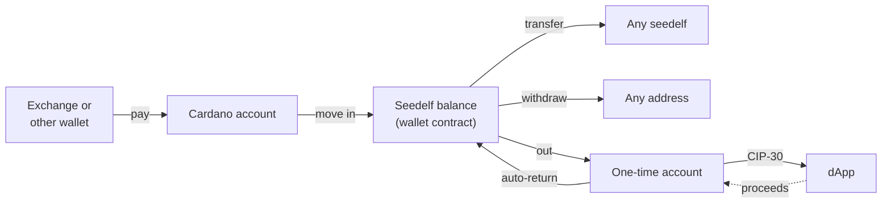

# Flows

## How money moves

**Seedelf balance** means every UTxO at the wallet contract whose register this wallet owns. A **seedelf** is a named token (`5eed0e1f…`) sitting in one of those UTxOs. Its register is what other people use to pay you.

## Onboarding

Onboarding runs in a full tab. From the popup, **Create** and **Restore** open one, because a popup closes as soon as the user clicks elsewhere.

- **Create:**
  1. The worker generates a 24-word phrase.
  2. The UI shows it once, blurred until the user presses **Reveal**, with the warnings below. There's no copy button.
  3. The user types 3 randomly chosen words to confirm them.
  4. The user sets a password, typed twice. Only now does the worker write the vault, so abandoning the flow leaves nothing behind.
- **Restore:**
  1. Choose 12, 15 or 24 words (24 by default), then enter the phrase: one box per word, with BIP39 autocomplete.
     - Typing a prefix suggests matching words: arrow keys, Enter, Tab or a click take one, and focus moves to the next box. Space accepts a complete or unique word.
     - A word that isn't on the list is flagged when its box loses focus.
     - Pasting a whole phrase into any box fills all of them (and switches the word count if needed), then clears the clipboard.
     - **Continue** asks the worker to validate the phrase, and shows the Rust core's reason if it's wrong, for example a bad checksum.
  2. Set a password.
  3. *(Chunk 6)* Scan the wallet contract for owned registers.
  4. *(Chunk 6)* Scan the Cardano account (account `0'`, receive and change addresses, gap limit 20).
  5. *(Later)* Scan one-time accounts up to a gap limit.
- **Password:** at least 12 characters, no composition rules, with a strength hint.
- **Phrase warnings, shown during create:**
  - "Don't copy the phrase into a screenshot, a chat, an email or a cloud note, and never type it into a website."
  - "This phrase restores your seedelfs only in a Seedelf wallet. Other Cardano wallets will show your Cardano account and nothing else."
- **Home** shows:
  - the **Seedelf balance**: ADA and tokens in the contract UTxOs this wallet owns, and **your seedelfs** with their tags and the ADA locked with each;
  - the **Cardano account**: its ADA and tokens, how many addresses it has used, the receive address (copy, QR) and the stake address;
  - the **Seedelf identity**: the base register's public value, shortened;
  - when the chain was last read, and **Refresh**.

## Lock and unlock

- **Unlock:** opening the vault with the password derives every key.
- **Lock:** the lock button in the top bar, or automatically after 15 minutes without activity (key presses and clicks in the wallet). Locking wipes all secrets from memory and session storage, and every open wallet page switches to the unlock screen.
- **Closing the browser locks the wallet;** closing the popup doesn't.
- **Failed unlocks:** exponential back-off (1 s, 2 s, 4 s … capped at 60 s), enforced by the worker. The unlock screen shows the countdown.
- **Forgot password:** "Restore from your phrase" deletes the wallet from this browser after a typed confirmation (`delete wallet`), then goes straight to restore.

See [keys-and-accounts.md](keys-and-accounts.md#password-and-vault) for details.

## Receive (Cardano account)

Show the receive address `0/0`, with a copy button and a QR code, so someone paying from a phone wallet can scan it. The QR is shown on request, drawn dark on white with the standard quiet zone. Anything that can pay a Cardano address can fund the wallet. For a restored wallet, the funds already in the account show up here too.

## Move in (Cardano account → Seedelf)

This is the equivalent of the CLI's `external sweep`, built by the same core code (`seedelf-core::build`). Built in chunk 7.

- **What it does:** the Cardano account pays into the wallet contract. Each contract output gets a freshly re-randomized copy of the user's own base register.
- **What the user chooses:**
  - An **ADA amount, or Max**.
  - **Tokens to bring along**, from a checklist. A picked token moves in full.
  - The form nudges towards round amounts, which are harder to match to a later withdrawal.
- **Which UTxOs are spent:**
  - Every UTxO holding a picked token.
  - Then pure-ADA UTxOs, largest first.
  - Then other token UTxOs, until the amount, the fee and valid change are covered.
  - **Never** a pure-ADA UTxO of exactly 5 ADA: it's probably another wallet's collateral. Those have to be moved with that wallet.
  - **Max** spends every other UTxO and keeps only the minimum ADA that the unpicked tokens need.
- **Outputs:**
  - The contract deposits, tokens 20 to an output.
  - Change (leftover ADA and unpicked tokens) back to the receive address `0/0`, as in Lace's single-address mode.
- **Review, then send:**
  - The worker builds and signs the transaction, and the user reviews what moves, the fee and the change.
  - Nothing is sent until **Send**, and then exactly the reviewed transaction is submitted. A built move-in expires after 10 minutes.
- **Watching:**
  - Home shows the sent transaction with a Cardanoscan link.
  - It asks Koios for its status every 15 s for up to 10 minutes, and reopening the wallet resumes the watch.
  - Once it's confirmed, the balances are read again.
- **Signing:** only the Cardano account's payment keys sign, one signature per key, inside WebAssembly.
- **No seedelf needed.** No script runs and no collateral is needed.
- **Privacy:** it links the Cardano account to *some* register UTxOs, but not to any seedelf name. The form says so.

## Create a seedelf

This is the equivalent of the CLI's `util mint`: a stealth mint paid from the Seedelf balance. Built in chunk 8.

1. **Create a seedelf** on the Seedelf card. It's disabled while the Seedelf balance is empty or a transaction is still confirming.
2. **An optional personal tag:** at most 15 characters of printable ASCII.
   - It's previewed as the wallet will list it, along with how the token name starts.
   - Anyone can read it on chain.
3. **Review.** Nothing leaves the wallet but chain reads and one Ogmios evaluation.
   - The worker reads the contract and the protocol parameters.
   - WebAssembly picks the UTxOs that pay (pure ADA first, as few as it can), proves them under a new one-time key, and drafts the transaction.
   - Ogmios, through Koios, measures its scripts, and WebAssembly finishes it.
   - The review shows the tag, the token name, the ADA locked with the seedelf (about 1.75 ₳, the minimum for its UTxO), the fee (about 0.26 ₳), and the change back to Seedelf.
4. **Send.** Only now does giveme.my see the transaction.
   - WebAssembly checks giveme.my's signature, adds it and the one-time key's, and exactly the reviewed transaction is submitted.
   - A banner follows it to "Seedelf created", and it's listed under **Your seedelfs**.

Details:

- The seedelf sits under a fresh re-randomization of the user's own register. Minting to someone else's register (the CLI's `--generator` and `--public-value`) isn't offered.
- The token is named after the smallest input spent (`5eed0e1f` ‖ tag ‖ its output index ‖ its tx id, cut to 32 bytes), because that's what the policy checks. So the name is only known once the UTxOs are picked.
- Only removing the seedelf (chunk 10) gives back the ADA locked with it.

The new seedelf is never linked to the Cardano account.

The CLI's `create` is different: an outside wallet pays for the mint, which links that wallet to the seedelf. See the root [README](../../../README.md#implicit-tracking-methods) (first implicit tracking method). The web wallet doesn't need that path.

## Transfer (Seedelf → any seedelf)

This is the equivalent of the CLI's `transfer`:

1. Look up the recipient seedelf's register.
2. Re-randomize it for the payment output.
3. Re-randomize our own base register for change.
4. Spend the chosen owned UTxOs. Each gets its own proof, bound to a new one-time key, as in [Create a seedelf](#create-a-seedelf).

Collateral comes from giveme.my, and the fee is paid from the inputs.

## Withdraw (Seedelf → any address)

- **Send:** the equivalent of the CLI's `sweep`. Send an amount, or everything, to any address, or to an ADA Handle.
- **Remove a seedelf:** the equivalent of the CLI's `remove`.
  - It burns the token.
  - The burn policy only checks the policy ID and the `5eed0e1f` prefix, so the leftover ADA can go to an address or straight back into the Seedelf balance.

## Contract round trip

This comes in the phase after v1. The idea: take money out of Seedelf to use a contract, then have what comes back returned automatically.

1. **Out:**
   - Make a Seedelf spend to a fresh one-time account.
   - Wait about one block before connecting. Many dApps look up inputs and run script checks against their own backend, which can't see unconfirmed outputs.
2. **Use:**
   - The dApp connects over CIP-30 and sees an ordinary wallet: that one account and nothing else.
   - The wallet shows its own signing prompt for each transaction.
3. **Back (auto-return):**
   - The wallet watches the one-time account.
   - Anything that lands there is paid into the contract under a freshly re-randomized own register, the same as move-in: no script, no collateral.
   - This covers both kinds of dApp:
     - **One-shot dApps:** the wallet signed the dApp transaction, so it already knows the change output. It can submit the return right behind it.
     - **Async dApps** (for example DEX orders filled later by batchers): proceeds arrive blocks later, and the watcher catches them.
4. **Retire:** once the account is empty and the session ends, it is never used again.
