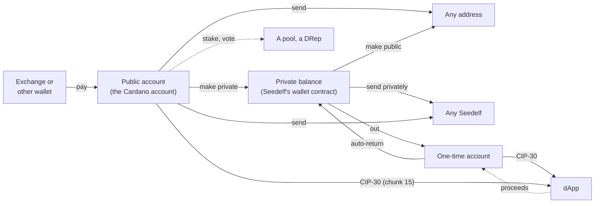

# Flows

## How money moves

**Names:** the wallet is one wallet on Cardano with two sides, and the screens say so (chunk 14): the **private balance** is the Seedelf balance, and the **public account** is the Cardano account. The flows are named to match: **Make private** is a move-in, **Make public** a withdrawal, and **Send** on each side a transfer (privately, to Seedelfs) or a send (publicly). The code and these docs' internals keep the older names (`move-in`, `withdraw`, `transfer`).

The **private balance** (the Seedelf balance) means every UTxO at the wallet contract whose register this wallet owns. A **Seedelf** is a named token (`5eed0e1f…`) sitting in one of those UTxOs. Its register is what other people use to pay you.

## Opening the wallet

The toolbar button opens the wallet in a **full tab**, or brings back the one already open (chunk 14). Settings' **Open Seedelf Wallet in** switches it to **the side panel**, as Lace does: Chrome's panel beside the page, which stays open as the user browses. Switching opens the wallet the new way at once and closes the page it was chosen on. The choice is the browser's, not the wallet's: removing the wallet keeps it. There's no popup.

## Onboarding

Onboarding runs in a full tab. From the side panel, **Create** and **Restore** open one.

- **Create:**
  1. The worker generates a 24-word phrase.
  2. The UI shows it once, blurred until the user presses **Reveal**, with the warnings below. There's no copy button.
  3. The user types 3 randomly chosen words to confirm them.
  4. The user sets a password, typed twice. Only now does the worker write the vault, so abandoning the flow leaves nothing behind.
- **Restore:**
  1. Choose 12, 15 or 24 words (24 by default), then enter the phrase: one box per word, with BIP39 autocomplete.
     - Typing a prefix suggests matching words: arrow keys, Enter, Tab or a click take one, and focus moves to the next box. Space accepts a complete or unique word.
     - A word that isn't on the list is flagged when its box loses focus.
     - Pasting a whole phrase into any box fills all of them (and switches the word count if needed), then clears the clipboard.
     - **Continue** asks the worker to validate the phrase, and shows the Rust core's reason if it's wrong, for example a bad checksum.
  2. Set a password.
  3. *(Chunk 6)* Scan the wallet contract for owned registers.
  4. *(Chunk 6)* Scan the Cardano account (account `0'`, receive and change addresses, gap limit 20).
  5. *(Later)* Scan one-time accounts up to a gap limit.
- **Password:** at least 12 characters, no composition rules, with a strength hint.
- **Phrase warnings, shown during create:**
  - "Don't copy the phrase into a screenshot, a chat, an email or a cloud note, and never type it into a website."
  - "This phrase restores your Seedelfs only in Seedelf Wallet. Other Cardano wallets will show your public account and nothing else."
- **Home** has two tabs, and under them when the chain was last read, and **Refresh**.
  - **The eye** beside each balance's label hides the amounts (chunk 14, after Eternl's), and shows them again. It's a setting, so the wallet opens hidden until it's pressed again. Hidden, the balances, the tokens' amounts, the staking rewards and what's locked show as "••••" on Home, Tokens, UTxOs, Activity, Receive and Staking. The forms and reviews still show their amounts: what's being sent is always shown. It asks no one anything.
  - **ADA's value** in the chosen currency, "≈ $1,234.56", sits under each balance on mainnet (chunk 14, as in Lace; test ADA has no value, so preprod shows none). It's read from CoinGecko when Home opens or is refreshed, at most every five minutes, and not at all with the currency set to "off" in Settings.
  - **Private:**
    - the **private balance**: ADA in the contract UTxOs this wallet owns, with round **Receive** (your Seedelfs), **Send** (to Seedelfs), **Make public** and **Create** (a Seedelf) actions;
    - its tokens: the first five (fungible first, by name, then NFTs) and **View all**. Tapping a token opens its details.

    The base register's public value isn't shown: a Seedelf's name is what people pay, and nothing else takes the public value.
  - **Public:** the public account's ADA, how many addresses it has used, **Receive**, **Send** and **Make private**, and its tokens (as on the Private tab). Until a Seedelf exists, a note says to create one before making money private.
  - **An ADA Handle in the private balance** gets a warning on the Private tab (chunk 14): a wallet paying `$name` pays the address holding it, which is then the Seedelf contract, with no register to say whose the payment is. The contract lets a UTxO without a register go to anyone, so anyone can take it. It says to make the handle public. Make private and both Sends warn before a handle goes into a Seedelf.
  - **While the first reading loads** (after an unlock, a restore or a create), a splash covers Home instead of empty balances: the emblem on navy with a teal arc circling it. It fades out into the wallet when the balances arrive. A cached reading shows Home at once, and the splash gives up after about 8 s, so a slow Koios can't hide Refresh or an error.
  - **Tokens** (from **View all**): one balance's tokens in two tabs, **Tokens** and **NFTs**, with a search (name, ticker, policy ID, fingerprint) and a sort (name or amount), 50 rows at a time.
    - **A token's details** open in a modal, centred and never taller than the window: the amount, the policy ID, the asset name and the fingerprint, each with Copy.
    - A token on the wallet's list shows its ticker and logo, and says it's on the list. Any other token goes by its own name, with its fingerprint under it and two letters for a logo, and the modal says its name is only what it calls itself.
    - NFTs are told apart without asking anyone: CIP-68 label 222 is an NFT, 333 and 444 are fungible, and otherwise a single unit with no decimals is an NFT.
  - **Get started:** until the wallet has both a Seedelf and a private balance, the Private tab lists three steps, in the order that keeps them apart (see [Create a Seedelf](#create-a-seedelf)):
    1. fund the public account;
    2. create the Seedelf, paid by the account;
    3. make ADA private.

    A step is ticked when it's done, and the next step has its button.

## Lock and unlock

- **Unlock:** opening the vault with the password derives every key.
- **Lock:** the lock button in the top bar, or automatically after 15 minutes without activity (key presses and clicks in the wallet), or the time chosen in Settings: 1, 5, 15, 30 or 60 minutes (chunk 14, Lace's choices less "never"). Locking wipes all secrets from memory and session storage, and every open wallet page switches to the unlock screen.
- **Closing the browser locks the wallet;** closing its tab or the side panel doesn't.
- **Failed unlocks:** exponential back-off (1 s, 2 s, 4 s … capped at 60 s), enforced by the worker. The unlock screen shows the countdown.
- **Forgot password:** "Restore from your phrase" deletes the wallet from this browser after a typed confirmation (`delete wallet`), then goes straight to restore.

**Settings** (the gear in the top bar, while unlocked): **Contacts**, **Collateral**; *Preferences*: **Open Seedelf Wallet in** (a full tab or the side panel; see [Opening the wallet](#opening-the-wallet)) and **Show ADA's value in** (eight currencies, or nothing, which asks for no prices; mainnet only); *Staking*: whether payments spend the rewards; *Security*: **Lock after**, **Show recovery phrase** (the password again first), **Check recovery phrase**, **Change password**, **Remove wallet** (typed confirmation); and About (the version, the network, the source code, the privacy policy, and whom the wallet talks to). Settings asks Koios nothing, except to set a collateral by payment.

**Check recovery phrase** (chunk 14, after Lace's recovery phrase verification) is for a written copy: type it (12, 15 or 24 boxes with autocomplete, or paste it), and the wallet says only whether it's this wallet's phrase, never which words differ, so it tells someone at an unlocked browser nothing a whole phrase they already have wouldn't. No password is needed, and nothing is kept: a match empties the boxes. A phrase that isn't one (a word off the list, a bad checksum) gets the Rust core's reason, as restore does.

**Activity** (the row at the bottom of each Home tab), newest first and grouped by day, after Lace's Activity tab. Each entry opens its details, with the transaction on Cardanoscan.

- **Seedelf:** what this wallet sent, written down at Send from the summary the user reviewed, and what arrived, noted from the balance reading (one entry per transaction; the wallet's own change and a UTxO holding a Seedelf don't count). It asks Koios nothing, and never about one transaction. It's encrypted on the device, and starts from when this wallet first saw each payment.
- **Cardano account:** from Koios, which knows the account already: 20 transactions a page (`account_txs` and one `tx_info`), only while Activity is open, and **Load more** for the next 20. Opening it again, or **Refresh**, asks only for what's newer.
  - **Staking** is in it since chunk 14, from the same `tx_info`: **Staked** (with the pool, by its ticker when the device has it, and the deposit the first time), **Delegated voting power** (with the vote, a DRep by its name from the wallet's list), **Withdrew rewards**, and **Stopped staking** (with the deposit back). A payment that spent the rewards stays **Sent**, and its details say how much of the rewards it spent.
  - **A note** on a transaction (CIP-20's message, anyone's) shows in its details, with a line saying anyone can read one, and write one.
  - An entry's details list each token that moved, with its sign.
- **Refresh** on the Seedelf side reads the balances again, as Home's does, since that's how arrivals are noted. Each entry is what the transaction did to the account's own addresses; a move-in or a mint this wallet made is named as such.
- **Save as CSV** (chunk 14, after Eternl's export) saves what's listed to a file on the device, asking no one: the date (UTC), the kind, the direction, the ADA (signed), the fee, each token with its sign, who or where, the note, the pool, the vote, a deposit or its return, the rewards withdrawn, and the transaction. On the public side it has the transactions read so far, and says to **Load more** first for older ones. The file isn't encrypted, and the private side says so: anyone who has it can read those payments. Someone else's words (a note, a tag, a token's name) never run as a spreadsheet formula: a cell starting `=`, `+`, `-` or `@` gets a leading `'`.

**Contacts** name the Seedelfs and addresses (or `$handles`) the user pays, after Lace's address book. They're managed in Settings, picked with **Contacts** above Send's Seedelf name or Withdraw's destination, and saved from either form with **Save to contacts** once it's found. They're encrypted on the device (see [privacy.md](privacy.md#known-links)).

**UTxOs** (the row under Activity on each Home tab, chunk 12) lists that balance's UTxOs from the last reading, asking Koios nothing (**Refresh** there is Home's, a new balance reading): the kept ones first (locked, the collateral, a Seedelf's), then the largest. Each shows its ADA, how many tokens, and its outpoint, and opens its details: the tokens, the transaction (with Copy), the output and block, and on the Cardano side the address.

- **The lock at the end of a row** locks or unlocks it at once; **Lock** in its details does the same. A locked UTxO is kept out of every payment from that balance, Max included. The list keeps its order while you toggle; locked ones come first the next time it's read. Home still counts it, and says so under the balance ("2 UTxOs · 25 ₳ locked"). The forms offer only what's unlocked, their line under the title says what's locked, and with everything locked they say why they're disabled.
- A Seedelf's UTxO has no Lock: only removing the Seedelf spends it. Its details name the Seedelf by its tag, and show its token name cut to fit, with Copy. The collateral has no Lock either: it's reclaimed in Settings.
- A UTxO's details list its first five tokens, then **Show all**, a box of its own that scrolls (with a search from 10 tokens), so a UTxO holding hundreds doesn't stretch them.
- The Seedelf side's privacy note: only this wallet can tell these are yours, and looking one up on an explorer tells that site. The choices are encrypted on the device, like Contacts.

**Collateral** (Settings, chunk 12, after Lace's) is 5 ₳ of the Cardano account set aside for transactions that run a script: today, creating a Seedelf from the account. It's only taken if the script fails, which the wallet checks before sending (Ogmios), and it's kept out of every payment.

- **Set by the wallet:** with none chosen, the wallet takes the oldest UTxO of exactly 5 ₳ and nothing else that the account holds, with no transaction. The page says so.
- **Set collateral:** from such a UTxO, nothing is sent. With none, it pays 5 ₳ from the account to its own `0/0` (a review, then Send; only the fee leaves the account). A banner follows it to "Collateral set", and the page says it's waiting until then.
- **Reclaim collateral** returns it to the balance at once, with no transaction. The wallet then takes none by itself until one is set again.
- Its privacy note: Seedelf spends never put it up; giveme.my lends theirs.

See [keys-and-accounts.md](keys-and-accounts.md#password-and-vault) for details.

## Receive publicly (the public account)

**Receive**, on the Public tab or the first *Get started* step, shows:

- a QR code of the receive address `0/0`, so someone paying from a phone wallet can scan it. It's drawn dark on white with the standard quiet zone;
- the address, with a copy button;
- **your ADA Handles** (chunk 14): each handle the account holds, from its tokens (asking no one), with Copy. A wallet paying one pays the address holding it: this account. The screen says a handle is as public as the address;
- the stake address.

Anything that can pay a Cardano address can fund the wallet. The screen also says that this is an ordinary address, which anyone can watch: to be paid privately, give out a Seedelf's name instead. For a restored wallet, the funds already in the account show up here too.

## Receive privately (the private balance)

**Receive** on the Private tab (chunk 12) is where your Seedelfs live: each by its tag, with the ADA locked with it, **Copy** for its whole name (to give to anyone who wants to pay you, or to paste into Send) and **Remove**. It asks Koios nothing: the list comes from the last balance reading.

- The whole name sits on one line under the tag. When it doesn't fit, as in the side panel, it's cut in the middle (`5eed0e1f7765…ababab`), keeping the last six characters; the cut moves with the width (`MiddleEllipsis`, CSS only). Copy and the tooltip always give all of it.

- It says to give out the whole name, since tags aren't unique, and that nobody can tell a payment to it is yours.
- Its privacy note: the name is public, and linked to whatever paid to create it; what's paid to it isn't.
- With no Seedelf yet, it says to create one first, with **Create a Seedelf** (disabled, with the reason, while the account can't pay for it).
- Home no longer lists them (it did until chunk 12). Back from a removal returns here.

## Make private (public account → private balance)

This is the equivalent of the CLI's `external sweep`, built by the same core code (`seedelf-core::build`). Built in chunk 7.

- **What it does:** the Cardano account pays into the wallet contract. Each contract output gets a freshly re-randomized copy of the user's own base register.
- **What the user chooses:**
  - An **ADA amount, or Max**.
  - **Tokens to bring along:** **Add tokens** opens a searchable picker; each picked token gets an amount box, with Max for all of it. The rest of a token stays in the account. Send and Withdraw pick tokens the same way. An ADA Handle among them gets a warning (chunk 14): in the private balance, a payment to it from another wallet is anyone's to take (see *Home*).
  - **The amount boxes** (ADA's and each token's) group the thousands with commas as you type, and regroup them as digits come and go; Backspace or Delete on a comma takes the digit beside it, and the caret stays among the same digits. Extra decimal places are dropped. A token's box refuses more than the wallet holds, keeping what was there with a note, as ADA's refuses more than the 45 billion there is (`sanitizeAmount`).
  - **The minimum ADA is worked out.** With tokens, the amount can stay empty (the box says "Minimum"): only the least ADA the deposit needs moves. An amount below that least, with or without tokens, is raised to it. The review says so ("1.17 ₳ is the least ADA the network accepts with these tokens", or "Raised from 0.5 ₳: …"). Send and Withdraw work the same way. Lace instead shows the minimum as an error and waits for the user to type it.
  - The form nudges towards round amounts, which are harder to match to a later withdrawal.
- **Which UTxOs are spent:**
  - Every UTxO holding a token being brought along.
  - Then pure-ADA UTxOs, largest first.
  - Then other token UTxOs, until the amount, the fee and valid change are covered.
  - **Never** the account's collateral, or a UTxO the user locked (see *UTxOs* and *Collateral* above). Until chunk 12 no pure-ADA UTxO of exactly 5 ADA was ever spent, in case it was another wallet's collateral; now only the collateral stays put.
  - **Max** spends every other UTxO and keeps only the minimum ADA that the tokens staying behind need.
- **Outputs:**
  - The contract deposits, tokens 20 to an output.
  - Change (leftover ADA, and every token or part of one that stays) back to the receive address `0/0`, as in Lace's single-address mode.
- **Review, then send:**
  - The worker builds and signs the transaction, and the user reviews what moves, the fee and the change.
  - Nothing is sent until **Send**, and then exactly the reviewed transaction is submitted. A built move-in expires after 10 minutes.
- **Watching:**
  - Home shows the sent transaction with a Cardanoscan link.
  - It asks Koios for its status every 15 s for up to 10 minutes, and reopening the wallet resumes the watch.
  - Once it's confirmed, the balances are read again.
- **Signing:** only the Cardano account's payment keys sign, one signature per key, inside WebAssembly.
- **No Seedelf needed.** No script runs and no collateral is needed.
- **Privacy:** it links the Cardano account to *some* register UTxOs, but not to any Seedelf name. The form says so.

## Send publicly (public account → any addresses or Seedelfs)

An ordinary Cardano payment from the account, so a user needn't open another wallet to pay from it. Built by `seedelf-core::build::account_send_many`, which shares the move-in's UTxO choice, change and signing. Added in chunk 12; paying a Seedelf (the CLI's `fund`, from the account) and several recipients at once came in chunk 14.

1. **Send** on the Public tab, between Receive and Make private. It's disabled while the account is empty or a transaction is still confirming.
2. **To:** an address or an ADA Handle, read and checked exactly as for a withdrawal, with Contacts. Your own account's address gets a note: the payment comes back, less the fee.
   - **Or someone's Seedelf, by its whole name**, found as [Transfer](#send-privately-private-balance--any-seedelf) finds it: "Found: *tag* · 5eed0e1f…". Koios is never asked about its token. Contacts offers Seedelfs and addresses both.
   - It's paid like a move-in, but under a fresh re-randomization of the Seedelf's register instead of your own: WebAssembly checks the UTxO holding it and refuses an unsafe register, as for a transfer. Only its owner can spend the payment.
   - **Your own Seedelf is refused**, pointing to Move in, which does the same thing.
3. **What's sent:** an ADA amount or Max, and tokens from the picker. The minimum ADA is worked out as for a move-in. **Max** is the move-in's: everything but the fee and what the tokens you keep need, and the collateral and locked UTxOs stay put. Each address gets one output (a Seedelf, one per 20 tokens), in order; the change goes back to `0/0`.
   - **Several recipients** (see [below](#several-recipients)): up to 20, each an address, a handle or a Seedelf, with its own amount and tokens.
   - **A note** (optional, chunk 14, as Lace's "Add a note"): one line of at most 64 characters, written on the transaction as CIP-20's message (label 674), which wallets and explorers show with it. The box counts the characters, and says anyone can read it, for good; paying a Seedelf, that it could say whose Seedelf this pays. Core refuses tabs and line breaks, and splits a note over 64 bytes into CIP-20's lines. The fee pays for its bytes and the hash of them the body carries: 0.00242 ₳ more for "Invoice 42", 0.00484 ₳ for all 64 characters. Make private, the private side's flows and staking offer none.
   - **An ADA Handle going to a Seedelf** is warned about, as on Make private: in a private balance, anyone paying the handle from another wallet pays the contract with nothing to say whose it is.
4. **Review:** where it goes (for a Seedelf, its tag and short name), the amount and tokens, the note, the fee, the change and how many UTxOs pay; with several recipients, each under "Recipient N", then the total. The account's keys sign here, inside WebAssembly.
5. **Send** submits exactly the reviewed transaction. No script runs, so no collateral and no giveme.my. A banner follows it to "Payment confirmed". It's listed in the Cardano account's Activity from Koios, not in the Seedelf history.

**Privacy:** it's paid in the open, from the account. The form says so, and that paying from Seedelf instead avoids the link. For a Seedelf, it adds that anyone can see the money went into Seedelf, though not whose Seedelf it is; for several recipients, that they can be seen to be paid together. A note is as public as the payment.

## Several recipients

Send on either side and Make public each pay up to 20 recipients in one transaction, as Eternl's multi-send does (chunk 14). Make private, Create and Remove pay one.

- **One recipient looks as it always did.** **Add recipient** puts each in a card, "Recipient N", with its own To, amount and tokens; × takes one off.
- **Max pays a single recipient.** Adding a second turns it off and hides it; each then needs an amount.
- **Tokens:** a recipient's token boxes offer only what the others haven't taken. The builders refuse more of a token, all recipients together, than is held.
- **"Together that's X ₳, more than the Y ₳ available"** stops Review early; the builder decides exactly.
- **The review** shows each recipient's rows under its number, then the total, the fee and the change. The minimum ADA note names the recipient it was raised for.
- **Limits:** 20 recipients (WebAssembly's `MAX_RECIPIENTS`), and core refuses a transaction over the network's 16 KiB (`build::MAX_TX_SIZE`) in words, whatever the count.
- **Koios:** several recipients cost what one does, plus each `$handle`'s lookup. The account and the contract are read once for everyone. A Seedelf's lookup as it's pasted costs nothing when Home's last reading saw it (the kept contract view), and one request for what's new when it didn't.
- **The Seedelf history** notes a transfer or withdrawal to several as its total, naming the first recipient "and N more".

## Staking and voting (public account)

Stake the Cardano account with a pool, spend or withdraw its rewards, and delegate its vote, as in Lace, so a user needs no second wallet. Built in chunk 13 by `seedelf-core::build::account_staking` and the `staking` module, which patch certificates and a withdrawal into an account transaction (see [architecture.md](architecture.md#transaction-building)). Only the Cardano account stakes: Seedelf money has no staking part.

- **Home:** the Public tab's balance counts the rewards, as other wallets do. Under it, a staking row ("Staking with LOGIC · 57.47 ₳ rewards", or "Not staking") opens Staking. While there are rewards and the vote isn't delegated, a warning says the rewards are locked and offers **Delegate your vote**: Conway pays nothing out otherwise.
- **Staking page:** read fresh on opening (the pool's `pool_info`: one request).
  - **Your pool:** ticker and name, saturation, margin, cost, pledge, delegators and blocks, and Lace's warnings: retiring or retired, oversaturated, pledge not met (the pool then earns nothing). **Change pool** opens the browser.
  - **Not staking:** why to stake, the 2 ₳ deposit the first time, and **Choose a pool**.
  - **Rewards:** the amount and **Withdraw rewards** (the whole balance: the ledger takes nothing less). It's disabled with nothing to withdraw, or while the rewards are locked.
  - **Voting power:** where it goes now, and **Change** (or **Delegate**).
  - **Stop staking:** withdraws the rewards, unregisters the stake key and returns its deposit, in one transaction. Disabled while rewards are locked, since it must withdraw them.
- **Pool browser:** every live pool, kept on the device for a day (one `pool_list` page on preprod, three on mainnet, with `totals` and `epoch_params` for saturation). Search by ticker or pool ID; sort by ticker, least saturated, lowest margin, lowest cost or highest pledge; 50 rows at a time. A pool opens its details (one `pool_info`) and **Stake with …**. Your pool is marked, and can't be chosen again. Names come with the details only: `pool_list` has tickers, and every pool's name would cost several requests a day.
- **Vote:** Always abstain, Always no confidence, or **A DRep**:
  - **Search** by name or ID in the wallet's own list of named DReps (`src/dreps/`, made by `npm run dreps` at each release: 61 on preprod, 452 on mainnet on 2026-09-24), 20 at a time. Searching asks no one anything.
  - **Or paste** a whole ID (CIP-129 or CIP-105) the list doesn't have, such as a DRep registered since the release, and **Look up this ID**.
  - The DRep picked is read live (`drep_info` and `drep_metadata`: its name, status, voting power and delegators). An inactive DRep gets a warning (its votes don't count until it votes again; the rewards unlock either way); a retired one can't be chosen. **Choose another DRep** goes back to the search.
- **Review, then Send:** each change is built and signed at review, like a send: the payment keys that pay the fee, and the stake key (`2/0`), inside WebAssembly. The review shows the pool or the vote, any deposit, refund or rewards withdrawn, the fee and the change. Send only submits. A banner follows it ("Delegation sent" … "Now staking").
- **What each costs Koios:** a balance reading is 4 requests (was 3), plus the pool's `pool_info` once a session for its ticker. A build is 4: `account_addresses`, `credential_utxos`, `account_info`, `epoch_params`.
- **Spending rewards** (Settings: *Use staking rewards when spending*, on by default): a send, a move-in or an account-paid mint reads `account_info` fresh and withdraws the whole reward balance along with it, if the vote is delegated. The forms count the rewards in what's available ("…, with 57.47 ₳ of rewards"), Max takes them too, and the review says what was spent. Off, the rewards wait for **Withdraw rewards**, and the stake key isn't read at all.
- **Refusals, in plain words:** an epoch paying more rewards between Review and Send ("review it again"), a pool or DRep that's gone, rewards withdrawn without a vote delegation, or an account whose staking changed underneath.

**Privacy:** staking and voting are public and name the account. Every screen says so, and the Staking page says Seedelf money can't be staked.

## Create a Seedelf

**A mint links the Seedelf to whatever pays for it** (see [privacy.md](privacy.md#known-links)), so the order matters: **mint first, then move in.**

- **Paid by the Cardano account (the default, chunk 8b).** The Seedelf is linked to the account openly, and to nothing else. Money moved in afterwards looks exactly like paying someone else's Seedelf, so the Seedelf balance isn't tied to the name. This is the CLI's `create`, with the account's own keys.
- **Paid by the Seedelf balance (a stealth mint, chunk 8).** The CLI's `util mint`. It only hides the payer when that balance came from other people's Seedelf payments: hidden money paying for a hidden Seedelf.
  - With money you moved in yourself, the mint spends that deposit, and its change sits in the same transaction. That ties the account, the name and the change together.
  - The first live preprod mint did exactly that.

The steps:

1. **Create a Seedelf** on the Private tab. It's disabled while a transaction is still confirming, or when there's nothing to pay with. Until the wallet has a Seedelf, the Public tab says to create one before moving in.
2. **An optional personal tag:** at most 15 characters of printable ASCII.
   - It's previewed as the wallet will list it, along with how the token name starts.
   - Anyone can read it on chain.
   - Without one, the wallet shows the Seedelf by its token name alone, never a stand-in such as "Unnamed", which could be someone's tag.
3. **Pay with:** Cardano account (the default) or Seedelf balance, each with a note on what it links.
4. **Review.** Nothing leaves the wallet but chain reads and one Ogmios evaluation.
   - WebAssembly picks the UTxOs that pay (pure ADA first, as few as it can) and drafts the transaction. Ogmios, through Koios, measures the policy (and the spends, for a stealth mint), and WebAssembly finishes it.
   - **Account:** the account's collateral is put up (see *Collateral* above). Without one, one of its UTxOs is, as in the CLI: ADA-only if there is one, a 5 ₳ one first. A token UTxO also works, since the collateral return gives its tokens back. The account's keys sign here, as for a move-in. The fee is about 0.21 ₳, because only the policy runs.
   - **Stealth:** the inputs are proven under a new one-time key, and giveme.my will lend the collateral. The fee is about 0.26 ₳.
   - The review shows the tag, the token name, what pays, the ADA locked with the Seedelf (about 1.75 ₳, the minimum for its UTxO), the fee, and the change.
5. **Send.**
   - Account: submits the transaction signed at review.
   - Stealth: only now does giveme.my see it. WebAssembly checks giveme.my's signature and adds it with the one-time key's.
   - Either way, exactly the reviewed transaction is submitted. A banner follows it to "Seedelf created", and it's listed in the Private tab's **Receive**.

Details:

- The Seedelf sits under a fresh re-randomization of the user's own register. Minting to someone else's register (the CLI's `--generator` and `--public-value`) isn't offered.
- The token is named after the smallest input spent (`5eed0e1f` ‖ tag ‖ its output index ‖ its tx id, cut to 32 bytes), because that's what the policy checks. So the name is only known once the UTxOs are picked.
- Only removing the Seedelf (chunk 10) gives back the ADA locked with it.
- The wallet doesn't yet tell received Seedelf money from moved-in money. The choice and its note are the user's. The wallet could tell them apart by the transaction that created each UTxO (a spend of contract inputs, versus key inputs), but asking Koios about specific transactions would show it which UTxOs are ours.

## Send privately (private balance → any Seedelf)

This is the equivalent of the CLI's `transfer`, built by the same core code (`seedelf-core::build::transfer`). Built in chunk 9.

1. **Send** on the Private tab. It's disabled while the private balance is empty or a transaction is still confirming.
2. **The recipient: paste the Seedelf's full name**, 64 hex characters starting `5eed0e1f`. Tags aren't unique (anyone can mint "alice"), so the name is what counts. Spaces and capitals are tidied away.
   - The wallet looks the name up in the whole wallet contract, the query a balance reading already makes, and shows "Found: *tag* · 5eed0e1f…", or "No Seedelf with that name on preprod."
   - Koios is never asked about the recipient's token (see [privacy.md](privacy.md#known-links)).
   - **Your own Seedelf** is allowed, with a warning: the payment comes back to your Seedelf balance, less the fee.
3. **What's sent:** an ADA amount (the move-in rules: 6 decimals, the supply cap, "more than you have", and the minimum worked out), and optionally part of any token in the Seedelf balance, each with its own amount.
   - No Max: withdraw (chunk 10) is for sending everything. Up to 20 recipients at once (see [Several recipients](#several-recipients)): `build::transfer` pays them all.
   - The form nudges towards round amounts, and says that sending right after moving in is easy to match by timing.
4. **Review.** Nothing leaves the wallet but chain reads and one Ogmios evaluation.
   - WebAssembly checks the recipient's UTxO: it's in the wallet contract, holds that Seedelf, and has a register as its datum. It refuses a register that a payment would be lost under: points that don't decode, points outside the prime-order subgroup, or the identity (anyone could spend a payment to that).
   - The payment goes under a fresh re-randomization of the recipient's register, never the register as found. The change goes under fresh copies of your own.
   - It picks the Seedelf UTxOs that pay: first the ones holding the tokens being sent (the biggest holdings first), then pure ADA, largest first, as few as it can.
   - The inputs are proven under a new one-time key, and Ogmios, through Koios, measures the spends. Only the wallet script runs. The fee is about 0.23 ₳ for one input, and 0.27 ₳ for two.
   - The review shows the recipient (tag and short name, full name on hover), the amount and tokens, the fee, the change back to the Seedelf balance, and how many UTxOs pay.
5. **Send.** As for a stealth mint: only now does giveme.my see the transaction. WebAssembly checks its signature and adds it with the one-time key's, and exactly the reviewed transaction is submitted. A banner follows it to "Private payment confirmed".

Details:

- If the recipient removes their Seedelf between review and Send, the payment still reaches their register, so it's still theirs to spend; only the name is gone. The wallet doesn't look again at Send.
- `build::transfer` pays several Seedelfs at once (the CLI's repeated `--seedelfs`); the UI offers it since chunk 14.

## Make public (private balance → any address)

Built in chunk 10, by the same core code as the CLI's `sweep` and `remove` (`seedelf-core::build`). Both are Seedelf script spends: proofs under a new one-time key, giveme.my's collateral at Send, and Ogmios measuring the scripts at review.

### Send to an address

1. **Make public** on the Private tab. It's disabled while the private balance is empty or a transaction is still confirming.
2. **To:** a Cardano address, or an ADA Handle like `$name`; or several, up to 20 (see [Several recipients](#several-recipients), `build::sweep_many`). What's typed is read after a short pause, and shown: "Sends to addr_test1…", or "$name is addr_test1…".
   - A handle is looked up through Koios (`asset_nft_address`), the plain name first, then the CIP-68 one. Koios sees which handle is asked about.
   - Only a normal address on this network is accepted: not a script (its output would carry no datum), not a stake address, not the other network. The same goes for the address a handle resolves to.
   - **Your own Cardano account gets a warning:** withdrawing there links the money back to it, and to whoever paid it into Seedelf. The wallet recognizes any address carrying the account's staking key, as every address a normal wallet shows for the account does.
3. **What's sent:**
   - An **amount** (the move-in rules: 6 decimals, the supply cap, "more than you have", and the minimum worked out), plus optional token amounts, as for a transfer. The change goes back into the Seedelf balance under fresh copies of your register.
   - Or **Max:** everything, up to 20 UTxOs at once (a transaction fits about that many script spends), with every token, less the fee. The largest go first, and the review says how many are left for another withdrawal. The form notes that spending them together ties them to each other.
   - The form nudges towards round amounts, and says that withdrawing to where the money came from links it back.
4. **Review:** where it goes (the handle and its address, full on hover), the amount or "Everything", the tokens, the fee, the change, and how many UTxOs pay. The fee is about 0.27 ₳ for two inputs.
5. **Send**, as for a transfer. A banner follows it to "Made public".

### Remove a Seedelf

1. **Remove** on a Seedelf's row in the Private tab's **Receive**.
2. **Send what's freed to:**
   - **Cardano account** (the default), its receive address `0/0`. A Seedelf the account paid for (the default since chunk 8b) is linked to it anyway, so this links nothing new.
   - **Seedelf balance**, under a fresh copy of your register. This is for a Seedelf you minted from the Seedelf balance. For one the account paid for, it ties the Seedelf's name to that new UTxO, and to whatever it's later spent with.
3. **Review:** the Seedelf, what comes back (the ADA locked with it, about 1.75 ₳, less a fee of about 0.24 ₳), and the fee. Both scripts run: the wallet's spend and the policy's burn.
4. **Send.** The token is burned, and the banner follows it to "Seedelf removed".

Details:

- Payments already sent to a removed Seedelf stay yours: they sit under copies of your register, not with the name. After the removal, nobody can pay the name.
- The burn policy only checks the policy ID and the `5eed0e1f` prefix. The CLI's `remove` still pays any address (`--address`); the web wallet offers the account or the Seedelf balance.
- The CLI's `sweep --all` takes the first 20 owned UTxOs, and the web wallet's Max takes the 20 largest.

## Connect a site (public account)

CIP-30 for the public account, as Lace offers it (chunk 15). The design is in [architecture.md](architecture.md#dapp-connector); the plan, with the private steps after it, in [plans/chunk-15-dapp-connector.md](plans/chunk-15-dapp-connector.md).

1. **Turn it on:** Settings → *Sites* → **Let sites connect to Seedelf Wallet**. Each site then gets the public account or a private session, chosen in the connect window (see *Any site* below). Chrome asks to let the wallet onto https sites; only then are its two scripts added to pages. Off (the default), sites can't see the wallet.
2. **Connect:** a site's **Connect wallet** lists Seedelf Wallet (when the site lists every CIP-30 wallet). Its `enable()` opens the connector's window: the site's address as Chrome reports it, what it will see (the public account's addresses, balance and UTxOs), and that it never sees the private balance. **Connect** or **Cancel**.
3. **Use it:** reads need no window. A transaction or a message to sign opens the window:
   - **A transaction:** what it does to the public account (it sends or it gets, each token that moves), the fee, who it pays (a contract, Seedelf Wallet's contract with or without a register, an address), the collateral at risk, any staking change, minting, a note, whether it runs contracts, and which keys sign. **Sign** or **Decline**.
   - **A message** (CIP-8): the address, which key signs, and the message as text, or hex when it isn't text. Signing moves no money.
   - A transaction that needs someone else's signature, when the site didn't ask for a partial one, or one that would hand the collateral to someone else, is refused before the window opens.
4. **Locked:** the window asks for the password first. Closing it refuses the site, which then can't reopen it for a minute.
5. **Disconnect:** Settings → *Connected sites* lists them, each with **Disconnect**. The list is sealed on the device.

The account's own outputs of a transaction it signed are kept, so a site can build its next transaction on them before they're on chain. A site's `submitTx` goes through Koios, as the wallet's own sends do.

## Contract round trip

Money leaves Seedelf to use a contract, then comes back: a **private session** on a one-time account (account `24301'`, payment key `0/i` and its own stake key `2/i`). The plan is [plans/chunk-15-dapp-connector.md](plans/chunk-15-dapp-connector.md), with the user's two designs (a round trip through a new account, or straight from Seedelf with giveme.my's collateral) and when each fits. The first built use is a swap through Minswap's aggregator (route A1).

### A private swap (built in chunk 15, runs itself since 15b)

Home's Private tab → **dApps**, a grid of the dApps the wallet uses privately → **Minswap**: its swaps, newest first, each with where it's at, and **New swap**. While a swap runs, Home's Private tab shows a **Swap in progress** row that opens it, and Minswap's tile says how many run.

1. **New swap**, in Minswap's shape: a **You pay** card over a **You receive** card, each a big amount beside its token, with a round **Switch** between them that swaps the two sides.
   - **You pay:** ADA or a token in the private balance, with what's held under it, and **Half** and **Max**. ADA's Max leaves the swap's costs, the collateral and 1 ₳ for the fee.
   - **You receive:** any token Minswap lists, picked from what's held or searched on Minswap's list (which then knows what was searched for).
   - **The quote:** it comes in as you type, asked once typing pauses for 0.6 s, since Minswap limits how often it's asked. What you receive fills in, with the rate under the cards; tap the rate to turn it round. Its details show the minimum received, the price impact (amber from 3%, red from 5%, with a warning), the slippage, the route (through DEXes that take orders only: one that swaps against its pools would spend UTxOs that aren't the session's), the DEX's fee, and the order's deposit (back with the proceeds). The refresh button asks again.
   - **Slippage:** the sliders button at the top. It offers 0.5, 1 or 3%, or your own from 0.1% to 20%, with a warning from 5%.
   - **The button** says what's missing (Select a token, Enter an amount, Not enough ADA), then **Review swap**. A quote over a minute old is asked for again before the funding is built on it.
2. **Review the swap:** what you pay and receive about, at least, the price impact and the route. Then the funding, the three transactions, each with its fee, and Send.
3. **The funding** (Send, the one approval): a Seedelf spend with giveme.my's collateral, paying the session's account twice: the swap with its costs and 2 ₳ of room, and 5 ₳ as the account's own collateral. The change goes back into the private balance. The session is recorded before it's sent, so its account is never used twice, even if the send fails. Home's banner watches this payment; the user lands on the swap's own page.
4. **From here it runs itself,** on a timeline of four steps: **Funded**, **Order placed**, **Filled**, **Back in your private balance**. Each shows waiting, done (with its transaction on Cardanoscan) or paused, and a line under them says what's happening in plain words. The page checks every 20 s (Refresh checks now); with the page closed, the worker checks once a minute while the wallet is unlocked.
   - **The order**, once the funding is on chain: a fresh quote and Minswap's swap for the account (Minswap picks the account's UTxOs itself, so it waits for the funding). WebAssembly reads it against the session's key alone; the key signs it, the signature goes in without changing a byte of Minswap's transaction, and Koios submits it. It's placed only within what was approved: the session's UTxOs, its key alone, no more paid out than was funded, and at least the approved minimum. Anything else **pauses** and says why, with **Try again** and **Review it myself** (the order's review, as a button used to give).
   - **Filled:** a DEX's batchers pay the proceeds to the account, usually within a few blocks. It waits as long as it takes: the wallet never cancels an order by itself.
   - **Back:** everything at the account into the private balance, under fresh registers, signed by the session's key, with no script and no collateral. Once it's on chain and the account is empty, the swap is done, and **the whole card turns the success colour**. The account is never used again.
5. **Stop**, there the whole time a swap runs, is always the user's: one confirmation, then an order that waits is cancelled (built by Minswap, read and signed the same way; the refund comes back to the account) and everything comes back. Before any order, everything just comes back.

**Pause and resume at any point:** locked, the swap waits, and unlocking carries on. A closed browser, a restarted worker, or a wallet opened hours later all carry on from what's stored and on chain. A failure (Koios down, Minswap's rate limit) turns the step amber and says what's wrong and when it tries again (30 s, doubling to five minutes), with **Try now**. The auto-lock setting doesn't change for a swap.

**If a session stalls,** everything is recoverable from the phrase: money left in the account comes back; an order that never fills is stopped, then brought back. A session whose funding never reached the chain shows so, and can be forgotten (its index isn't reused). Sessions from before swaps ran themselves keep their buttons (Place the order, Cancel the order, Bring it back). After a restore on another device, a scan of the one-time accounts (not built yet) finds what's left: see the plan's *Recovery*.

### Any site (private CIP-30, chunk 15c)

The same session, offered to a site over CIP-30 instead of the public account. The plan is [plans/chunk-15c-private-cip30.md](plans/chunk-15c-private-cip30.md).

1. **Connect:** the site's `enable()` opens the connector's window. **A private session** asks what to put in it (ADA, and tokens), and the funding's review shows it with 5 ₳ of collateral. **Send** needs the password when *Ask for your password to sign for a site* is on.
2. **Out:** a Seedelf spend to a fresh one-time account, with giveme.my's collateral. The window waits until Koios sees the money (about a minute), then `enable()` answers, so the site's first reading already shows it. Closing the window doesn't undo the payment.
3. **Use:** the site sees an ordinary wallet: that account, its reward address and its 5 ₳ collateral, and nothing else. Each transaction and message gets the window's prompt, signed with the session's keys.
4. **Top up and Bring it back** from the dApps page's *Sites*. Bringing it back leaves the site connected, to an empty account, because something still open at the site (a listing, an order) may pay it later.
5. **Disconnect** ends the session, once the account is empty. It is never used again, and the site's next connect asks again.

**Bring everything back** (the dApps page, when sessions hold money): every site's session, and every older swap brought back by hand, with nothing on its way, back into the private balance in one go. Each comes back in its own transaction, sent one after another. The review lists them, with the total and the fees, and a tap leaves one out: a site still in use, say.
