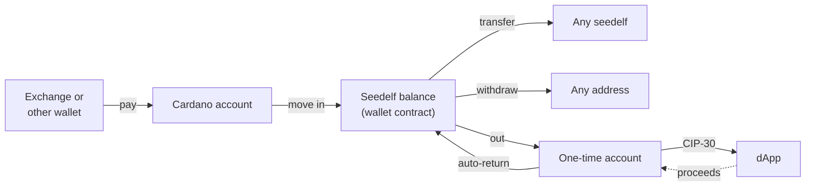

# Flows

## How money moves

**Seedelf balance** means every UTxO at the wallet contract whose register this wallet owns. A **seedelf** is a named token (`5eed0e1f…`) sitting in one of those UTxOs. Its register is what other people use to pay you.

## Onboarding

Onboarding runs in a full tab. From the popup, **Create** and **Restore** open one, because a popup closes as soon as the user clicks elsewhere.

- **Create:**
  1. The worker generates a 24-word phrase.
  2. The UI shows it once, blurred until the user presses **Reveal**, with the warnings below. There's no copy button.
  3. The user types 3 randomly chosen words to confirm them.
  4. The user sets a password, typed twice. Only now does the worker write the vault, so abandoning the flow leaves nothing behind.
- **Restore:**
  1. Choose 12, 15 or 24 words (24 by default), then enter the phrase: one box per word, with BIP39 autocomplete.
     - Typing a prefix suggests matching words: arrow keys, Enter, Tab or a click take one, and focus moves to the next box. Space accepts a complete or unique word.
     - A word that isn't on the list is flagged when its box loses focus.
     - Pasting a whole phrase into any box fills all of them (and switches the word count if needed), then clears the clipboard.
     - **Continue** asks the worker to validate the phrase, and shows the Rust core's reason if it's wrong, for example a bad checksum.
  2. Set a password.
  3. *(Chunk 6)* Scan the wallet contract for owned registers.
  4. *(Chunk 6)* Scan the Cardano account (account `0'`, receive and change addresses, gap limit 20).
  5. *(Later)* Scan one-time accounts up to a gap limit.
- **Password:** at least 12 characters, no composition rules, with a strength hint.
- **Phrase warnings, shown during create:**
  - "Don't copy the phrase into a screenshot, a chat, an email or a cloud note, and never type it into a website."
  - "This phrase restores your seedelfs only in a Seedelf wallet. Other Cardano wallets will show your Cardano account and nothing else."
- **Home** has two tabs, and under them when the chain was last read, and **Refresh**.
  - **Seedelf:**
    - the **Seedelf balance**: ADA in the contract UTxOs this wallet owns, with round **Send** (to a seedelf), **Withdraw** and **Create** (a seedelf) actions;
    - its tokens;
    - **your seedelfs**, with their tags, the ADA locked with each, a **Copy** button for each full name (to give to anyone who wants to pay you, or to paste into Send to a seedelf) and **Remove**;
    - the **Seedelf identity**: the base register's public value, shortened.
  - **Cardano account:** its ADA, how many addresses it has used, **Receive** and **Move in**, and its tokens. Until a seedelf exists, a note says to create one before moving money in.
  - **Get started:** until the wallet has both a seedelf and a Seedelf balance, the Seedelf tab lists three steps, in the order that keeps them apart (see [Create a seedelf](#create-a-seedelf)):
    1. fund the Cardano account;
    2. create the seedelf, paid by the account;
    3. move ADA in.

    A step is ticked when it's done, and the next step has its button.

## Lock and unlock

- **Unlock:** opening the vault with the password derives every key.
- **Lock:** the lock button in the top bar, or automatically after 15 minutes without activity (key presses and clicks in the wallet). Locking wipes all secrets from memory and session storage, and every open wallet page switches to the unlock screen.
- **Closing the browser locks the wallet;** closing the popup doesn't.
- **Failed unlocks:** exponential back-off (1 s, 2 s, 4 s … capped at 60 s), enforced by the worker. The unlock screen shows the countdown.
- **Forgot password:** "Restore from your phrase" deletes the wallet from this browser after a typed confirmation (`delete wallet`), then goes straight to restore.

See [keys-and-accounts.md](keys-and-accounts.md#password-and-vault) for details.

## Receive (Cardano account)

**Receive**, on the Cardano account tab or the first *Get started* step, shows:

- a QR code of the receive address `0/0`, so someone paying from a phone wallet can scan it. It's drawn dark on white with the standard quiet zone;
- the address, with a copy button;
- the stake address.

Anything that can pay a Cardano address can fund the wallet. The screen also says that this is an ordinary address, which anyone can watch: to be paid privately, give out a seedelf's name instead. For a restored wallet, the funds already in the account show up here too.

## Move in (Cardano account → Seedelf)

This is the equivalent of the CLI's `external sweep`, built by the same core code (`seedelf-core::build`). Built in chunk 7.

- **What it does:** the Cardano account pays into the wallet contract. Each contract output gets a freshly re-randomized copy of the user's own base register.
- **What the user chooses:**
  - An **ADA amount, or Max**.
  - **Tokens to bring along**, from a checklist. A picked token moves in full.
  - The form nudges towards round amounts, which are harder to match to a later withdrawal.
- **Which UTxOs are spent:**
  - Every UTxO holding a picked token.
  - Then pure-ADA UTxOs, largest first.
  - Then other token UTxOs, until the amount, the fee and valid change are covered.
  - **Never** a pure-ADA UTxO of exactly 5 ADA: it's probably another wallet's collateral. Those have to be moved with that wallet.
  - **Max** spends every other UTxO and keeps only the minimum ADA that the unpicked tokens need.
- **Outputs:**
  - The contract deposits, tokens 20 to an output.
  - Change (leftover ADA and unpicked tokens) back to the receive address `0/0`, as in Lace's single-address mode.
- **Review, then send:**
  - The worker builds and signs the transaction, and the user reviews what moves, the fee and the change.
  - Nothing is sent until **Send**, and then exactly the reviewed transaction is submitted. A built move-in expires after 10 minutes.
- **Watching:**
  - Home shows the sent transaction with a Cardanoscan link.
  - It asks Koios for its status every 15 s for up to 10 minutes, and reopening the wallet resumes the watch.
  - Once it's confirmed, the balances are read again.
- **Signing:** only the Cardano account's payment keys sign, one signature per key, inside WebAssembly.
- **No seedelf needed.** No script runs and no collateral is needed.
- **Privacy:** it links the Cardano account to *some* register UTxOs, but not to any seedelf name. The form says so.

## Create a seedelf

**A mint links the seedelf to whatever pays for it** (see [privacy.md](privacy.md#known-links)), so the order matters: **mint first, then move in.**

- **Paid by the Cardano account (the default, chunk 8b).** The seedelf is linked to the account openly, and to nothing else. Money moved in afterwards looks exactly like paying someone else's seedelf, so the Seedelf balance isn't tied to the name. This is the CLI's `create`, with the account's own keys.
- **Paid by the Seedelf balance (a stealth mint, chunk 8).** The CLI's `util mint`. It only hides the payer when that balance came from other people's Seedelf payments: hidden money paying for a hidden seedelf.
  - With money you moved in yourself, the mint spends that deposit, and its change sits in the same transaction. That ties the account, the name and the change together.
  - The first live preprod mint did exactly that.

The steps:

1. **Create a seedelf** on the Seedelf card. It's disabled while a transaction is still confirming, or when there's nothing to pay with. Until the wallet has a seedelf, the Cardano card says to create one before moving in.
2. **An optional personal tag:** at most 15 characters of printable ASCII.
   - It's previewed as the wallet will list it, along with how the token name starts.
   - Anyone can read it on chain.
3. **Pay with:** Cardano account (the default) or Seedelf balance, each with a note on what it links.
4. **Review.** Nothing leaves the wallet but chain reads and one Ogmios evaluation.
   - WebAssembly picks the UTxOs that pay (pure ADA first, as few as it can) and drafts the transaction. Ogmios, through Koios, measures the policy (and the spends, for a stealth mint), and WebAssembly finishes it.
   - **Account:** one of the account's own UTxOs is the collateral, as in the CLI: ADA-only if there is one, a 5 ₳ one first. A token UTxO also works, since the collateral return gives its tokens back. The account's keys sign here, as for a move-in. The fee is about 0.21 ₳, because only the policy runs.
   - **Stealth:** the inputs are proven under a new one-time key, and giveme.my will lend the collateral. The fee is about 0.26 ₳.
   - The review shows the tag, the token name, what pays, the ADA locked with the seedelf (about 1.75 ₳, the minimum for its UTxO), the fee, and the change.
5. **Send.**
   - Account: submits the transaction signed at review.
   - Stealth: only now does giveme.my see it. WebAssembly checks giveme.my's signature and adds it with the one-time key's.
   - Either way, exactly the reviewed transaction is submitted. A banner follows it to "Seedelf created", and it's listed under **Your seedelfs**.

Details:

- The seedelf sits under a fresh re-randomization of the user's own register. Minting to someone else's register (the CLI's `--generator` and `--public-value`) isn't offered.
- The token is named after the smallest input spent (`5eed0e1f` ‖ tag ‖ its output index ‖ its tx id, cut to 32 bytes), because that's what the policy checks. So the name is only known once the UTxOs are picked.
- Only removing the seedelf (chunk 10) gives back the ADA locked with it.
- The wallet doesn't yet tell received Seedelf money from moved-in money. The choice and its note are the user's. The wallet could tell them apart by the transaction that created each UTxO (a spend of contract inputs, versus key inputs), but asking Koios about specific transactions would show it which UTxOs are ours.

## Transfer (Seedelf → any seedelf)

This is the equivalent of the CLI's `transfer`, built by the same core code (`seedelf-core::build::transfer`). Built in chunk 9.

1. **Send to a seedelf** on the Seedelf card. It's disabled while the Seedelf balance is empty or a transaction is still confirming.
2. **The recipient: paste the seedelf's full name**, 64 hex characters starting `5eed0e1f`. Tags aren't unique (anyone can mint "alice"), so the name is what counts. Spaces and capitals are tidied away.
   - The wallet looks the name up in the whole wallet contract, the query a balance reading already makes, and shows "Found: *tag* · 5eed0e1f…", or "No seedelf with that name on preprod."
   - Koios is never asked about the recipient's token (see [privacy.md](privacy.md#known-links)).
   - **Your own seedelf** is allowed, with a warning: the payment comes back to your Seedelf balance, less the fee.
3. **What's sent:** an ADA amount (the move-in rules: 6 decimals, the supply cap, "more than you have"), and optionally part of any token in the Seedelf balance, each with its own amount.
   - One recipient per transfer, and no Max: withdraw (chunk 10) is for sending everything.
   - The form nudges towards round amounts, and says that sending right after moving in is easy to match by timing.
4. **Review.** Nothing leaves the wallet but chain reads and one Ogmios evaluation.
   - WebAssembly checks the recipient's UTxO: it's in the wallet contract, holds that seedelf, and has a register as its datum. It refuses a register that a payment would be lost under: points that don't decode, points outside the prime-order subgroup, or the identity (anyone could spend a payment to that).
   - The payment goes under a fresh re-randomization of the recipient's register, never the register as found. The change goes under fresh copies of your own.
   - It picks the Seedelf UTxOs that pay: first the ones holding the tokens being sent (the biggest holdings first), then pure ADA, largest first, as few as it can.
   - The inputs are proven under a new one-time key, and Ogmios, through Koios, measures the spends. Only the wallet script runs. The fee is about 0.23 ₳ for one input, and 0.27 ₳ for two.
   - The review shows the recipient (tag and short name, full name on hover), the amount and tokens, the fee, the change back to the Seedelf balance, and how many UTxOs pay.
5. **Send.** As for a stealth mint: only now does giveme.my see the transaction. WebAssembly checks its signature and adds it with the one-time key's, and exactly the reviewed transaction is submitted. A banner follows it to "Transfer confirmed".

Details:

- If the recipient removes their seedelf between review and Send, the payment still reaches their register, so it's still theirs to spend; only the name is gone. The wallet doesn't look again at Send.
- `build::transfer` pays several seedelfs at once (the CLI's repeated `--seedelfs`); the UI offers one.

## Withdraw (Seedelf → any address)

Built in chunk 10, by the same core code as the CLI's `sweep` and `remove` (`seedelf-core::build`). Both are Seedelf script spends: proofs under a new one-time key, giveme.my's collateral at Send, and Ogmios measuring the scripts at review.

### Send to an address

1. **Withdraw** on the Seedelf card. It's disabled while the Seedelf balance is empty or a transaction is still confirming.
2. **To:** a Cardano address, or an ADA Handle like `$name`. What's typed is read after a short pause, and shown: "Sends to addr_test1…", or "$name is addr_test1…".
   - A handle is looked up through Koios (`asset_nft_address`), the plain name first, then the CIP-68 one. Koios sees which handle is asked about.
   - Only a normal address on this network is accepted: not a script (its output would carry no datum), not a stake address, not the other network. The same goes for the address a handle resolves to.
   - **Your own Cardano account gets a warning:** withdrawing there links the money back to it, and to whoever paid it into Seedelf. The wallet recognizes any address carrying the account's staking key, as every address a normal wallet shows for the account does.
3. **What's sent:**
   - An **amount** (the move-in rules: 6 decimals, the supply cap, "more than you have"), plus optional token amounts, as for a transfer. The change goes back into the Seedelf balance under fresh copies of your register.
   - Or **Max:** everything, up to 20 UTxOs at once (a transaction fits about that many script spends), with every token, less the fee. The largest go first, and the review says how many are left for another withdrawal. The form notes that spending them together ties them to each other.
   - The form nudges towards round amounts, and says that withdrawing to where the money came from links it back.
4. **Review:** where it goes (the handle and its address, full on hover), the amount or "Everything", the tokens, the fee, the change, and how many UTxOs pay. The fee is about 0.27 ₳ for two inputs.
5. **Send**, as for a transfer. A banner follows it to "Withdrawal confirmed".

### Remove a seedelf

1. **Remove** on a row of *Your seedelfs*.
2. **Send what's freed to:**
   - **Cardano account** (the default), its receive address `0/0`. A seedelf the account paid for (the default since chunk 8b) is linked to it anyway, so this links nothing new.
   - **Seedelf balance**, under a fresh copy of your register. This is for a seedelf you minted from the Seedelf balance. For one the account paid for, it ties the seedelf's name to that new UTxO, and to whatever it's later spent with.
3. **Review:** the seedelf, what comes back (the ADA locked with it, about 1.75 ₳, less a fee of about 0.24 ₳), and the fee. Both scripts run: the wallet's spend and the policy's burn.
4. **Send.** The token is burned, and the banner follows it to "Seedelf removed".

Details:

- Payments already sent to a removed seedelf stay yours: they sit under copies of your register, not with the name. After the removal, nobody can pay the name.
- The burn policy only checks the policy ID and the `5eed0e1f` prefix. The CLI's `remove` still pays any address (`--address`); the web wallet offers the account or the Seedelf balance.
- The CLI's `sweep --all` takes the first 20 owned UTxOs, and the web wallet's Max takes the 20 largest.

## Contract round trip

This comes in the phase after v1. The idea: take money out of Seedelf to use a contract, then have what comes back returned automatically.

1. **Out:**
   - Make a Seedelf spend to a fresh one-time account.
   - Wait about one block before connecting. Many dApps look up inputs and run script checks against their own backend, which can't see unconfirmed outputs.
2. **Use:**
   - The dApp connects over CIP-30 and sees an ordinary wallet: that one account and nothing else.
   - The wallet shows its own signing prompt for each transaction.
3. **Back (auto-return):**
   - The wallet watches the one-time account.
   - Anything that lands there is paid into the contract under a freshly re-randomized own register, the same as move-in: no script, no collateral.
   - This covers both kinds of dApp:
     - **One-shot dApps:** the wallet signed the dApp transaction, so it already knows the change output. It can submit the return right behind it.
     - **Async dApps** (for example DEX orders filled later by batchers): proceeds arrive blocks later, and the watcher catches them.
4. **Retire:** once the account is empty and the session ends, it is never used again.
