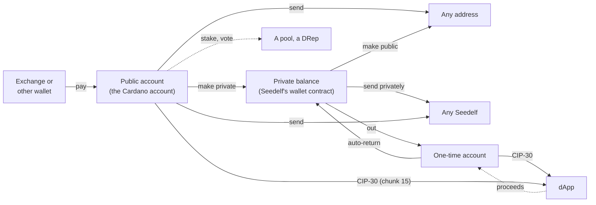

# Flows

## How money moves

```mermaid
flowchart LR
  Ext["Exchange or<br/>other wallet"] -- "pay" --> Dep["Public account<br/>(the Cardano account)"]
  Dep -- "make private" --> S["Private balance<br/>(Seedelf's wallet contract)"]
  Dep -- "send" --> Addr
  Dep -. "stake, vote" .-> Pool["A pool, a DRep"]
  S -- "send privately" --> Other["Any Seedelf"]
  Dep -- "send" --> Other
  S -- "make public" --> Addr["Any address"]
  S -- "out" --> OT["One-time account"]
  OT -- "CIP-30" --> D["dApp"]
  Dep -- "CIP-30 (chunk 15)" --> D
  D -. "proceeds" .-> OT
  OT -- "auto-return" --> S
```

**Names:** the wallet is one wallet on Cardano with two sides, and the screens say so (chunk 14): the **private balance** is the Seedelf balance, and the **public account** is the Cardano account. The flows are named to match: **Make private** is a move-in, **Make public** a withdrawal, and **Send** on each side a transfer (privately, to Seedelfs) or a send (publicly). The code and these docs' internals keep the older names (`move-in`, `withdraw`, `transfer`).

The **private balance** (the Seedelf balance) means every UTxO at the wallet contract whose register this wallet owns. A **Seedelf** is a named token (`5eed0e1f…`) sitting in one of those UTxOs. Its register is what other people use to pay you.

## Opening the wallet

The toolbar button opens the wallet in a **full tab**, or brings back the one already open (chunk 14). Settings' **Open Seedelf Wallet in** switches it to **the side panel**, as Lace does: Chrome's panel beside the page, which stays open as the user browses. Switching opens the wallet the new way at once and closes the page it was chosen on. The choice is the browser's, not the wallet's: removing the wallet keeps it. There's no popup.

**Back:** each screen's Back button, and since chunk 23 the browser's too (Alt+←, a mouse's back button): while a screen with a Back of its own shows, the page keeps one history entry of its own, at the same URL, and the browser's Back presses the screen's. Nothing goes in the URL, so a reload still starts at Home (`ui/history.ts`).

**Every screen opens at its top** (blind test §9.10): its title, its "Nothing is sent until …" and a banner are what's seen first. The page is what scrolls and screens swap inside it, so each one used to keep the last one's offset: "Review: stop staking" opened at its red button, and Home came back from Create Seedelf with its "sent" banner out of view. A `Screen` goes to the top when it opens and when its title changes (a form into its review, a list into an item, one step into the next), but not when the language does; Home does on coming back, on a change of tab and on the top bar's mark; and the browser's Back no longer restores an offset of its own. **Back opens a screen where it was left**, the app's Back and the browser's alike (pass two of the blind test's fix round): Back to a long list (Settings, the governance actions, the pools) landed at its top, and the reader looked for their place again. `Screen` keeps each page's offset as it scrolls and puts it back when Back leads to that page, following it for a moment while a list draws; going forward, and Home whichever way, still start at the top. **Settings' header stays in view** as it scrolls, with Back and the title (blind test E05: on its 2,000 px page the way out had scrolled away). On a window 600 px tall or less, a review's foot follows its rows instead of staying in view, so "Total leaving …" and "… after" come before its button (T04 at 360×480); the sign windows' feet always do, and so does a site's connect window's, and every other screen's stays in view.

## Onboarding

Onboarding runs in a full tab. From the side panel, **Create** and **Restore** open one, and a line under them says so before the panel closes (chunk 23). A tab opened that way (`#create`, `#restore`) drops the hash once the wallet exists, so a later Remove wallet lands on the welcome screen, not on Create's first step with a new phrase (chunk 23's second review).

- **The network comes first,** in a build with both (every build, the dev build included; `VITE_ENABLE_MAINNET=false` makes a preprod-only one for tests, with no choice): a small **Network** dropdown under **Create** and **Restore** says **Mainnet** or **Preprod** (mainnet on a new install; after Remove wallet or Forgot password, the network it was on, preprod for a wallet from before the switch; independent review L42), and moves at once, since no wallet exists yet to confirm for. Create and Restore then say which network they're on, on their first step only (the badge in the top bar says it throughout; chunk 23), with **Change network** back to the choice ("Forgot password" opens Restore without the welcome). So a preprod phrase is restored on preprod, never on mainnet first. Preprod's note in Settings says to test with a phrase you don't use on mainnet: the keys are the same on both.

- **Create:**
  1. The worker generates a 24-word phrase.
  2. The UI shows it once, blurred until the user presses **Reveal phrase**, with the warnings above it. There's no copy button. **I've written it down** follows the words rather than staying in view over them: a foot kept in view covered the last row at a laptop's height (chunk 23). Once revealed, **Hide phrase** beside it covers them again, and having seen them still counts (chunk 23's second review). The grid has as many columns as keep an eight-letter word whole: four in a tab, so all 24 fit, two in a 360 px panel (chunk 23's second review; four fixed in any tab cut "together" to "toge" in a narrow one).
  3. The user types 3 randomly chosen words to confirm them, each box labelled with its number ("Word 7") rather than the number inside it. A word that isn't on the list is said under its box ("Not on the list of recovery phrase words."), at once when no list word starts with it (chunk 23's second review). Every word that doesn't match is outlined and named, and while a box is empty a line under **Confirm** says why it waits.
  4. The user sets a password, typed twice. Only now does the worker write the vault, so abandoning the flow leaves nothing behind. While it does, a line under the form says "Setting up your wallet…" ("Restoring your wallet…" on restore; chunk 23's second review).
- **Restore:**
  1. Choose 12, 15 or 24 words (24 by default), then enter the phrase: one box per word, with BIP39 autocomplete.
     - Typing a prefix suggests matching words: arrow keys, Enter, Tab or a click take one, and focus moves to the next box. Space accepts a complete or unique word.
     - A word that isn't on the list is flagged when its box loses focus, or at once when no list word starts with it.
     - Pasting a whole phrase into any box fills all of them (and switches the word count if needed), then clears the clipboard.
     - The paste tip is above the boxes, and **Continue** follows them (chunk 23).
     - **Continue** names a word off the list in the user's language ("Word 12 isn't on the list of recovery phrase words. Check its spelling."), and otherwise asks the worker to validate the phrase: a bad checksum reads "These words don't make a valid phrase. Check the spelling and the order.", never the core's "checksum", even before the word list has loaded (chunk 23's second review). Editing a box takes the message away.
  2. Set a password.
  3. *(Chunk 6)* Scan the wallet contract for owned registers.
  4. *(Chunk 6)* Scan the Cardano account (the account the wallet is on, `0'` on a fresh restore; receive and change addresses, gap limit 20). *(Chunk 18)* Then look for accounts past it, in the background: one `account_addresses` request each, stopping at the first never used. A restored phrase may hold funds past account 0.
  5. *(Later)* Scan one-time accounts up to a gap limit.
  6. Home says **Wallet restored** at its top, once (blind test T20a, T20b: restore and create led to the same Home, so an empty restored wallet looked new): that it's reading what the phrase holds, then what it holds in the public account and the private balance, or that it holds nothing yet on this network, as expected for a new phrase. Once the look for more accounts finds some, it says instead what the account shown holds, by its name, and the private balance, and how many more public accounts the phrase has used, which the Public tab's heading switches to: account 0 empty never reads as a phrase never used when the money is in another (the pass-two review). Only accounts the look found used count. The page reads the list again whenever the look writes it, so the picker appears, and the note changes in place, as soon as it finds them (release review C12); a first reading that ends before the look can say "nothing yet" for a moment first. **Dismiss** takes it away, and it doesn't come back once it has said what was read. The worker keeps a mark that says to show it (`restored`, in session storage, the fact alone, which a lock or Remove wallet wipes), so it's whichever page opens Home next, the restore's tab or a side panel, and a Home that has shown it with a reading, or was dismissed, takes the mark away. A new wallet gets no such note: *Get started* is its welcome.
- **Password:** at least 12 characters, no composition rules, with a strength hint.
- **Phrase warnings, shown during create:**
  - "Anyone with these words can take your funds. Never put them in a screenshot, message, cloud note or website."
  - "Other Cardano wallets restore only your public account from this phrase."
- **Home** has two tabs, and under them when the chain was last read, and **Refresh** ("Updating…" while it reads), a small pill that says "Refresh": it was an unlabelled icon, and testers waiting on a deposit didn't find it (blind test §4.12; the wallet still doesn't read by itself, the owner's call). Each list screen that reads the chain has the same row. After a transaction is sent, Home opens on the tab of the side it spent from (a Seedelf by the side that paid for it, staking and votes on Public, Make public on Private), and a reload of the page, or a trip to Settings, keeps the tab last chosen, in the page's own session storage; a lock starts Home over on Private (chunk 23's second review, HM-6).
  - **The eye** beside each balance's label hides the amounts (chunk 14, after Eternl's), and shows them again. It's a setting, so the wallet opens hidden until it's pressed again. Hidden, the balances, the tokens' amounts, the staking rewards and what's locked show as "••••" on Home, Tokens, UTxOs, Activity, Receive and Staking. It hides how many Lovejoin boxes the wallet holds too, since every box is 10 ₳ (privacy review §2.16). A form's lines about the balance hide too: what's available, Max's "up to", a token's "of 1,234" and a too-much line's figure, Create a Seedelf's line about the balance that pays, Remove's "locked with it", what the swap form's sides and its token picker hold, and the connect window's private-session amount note and too-much error (chunk 23's second review, HM-9; the release review). What's typed, and a review's amounts, still show: what's being sent is read before it's sent. It asks no one anything. It's off by default (the owner kept it so, 2026-09-27).
  - **ADA's value** in the chosen currency, "≈ $1,234.56", sits under each balance on mainnet (chunk 14, as in Lace; test ADA has no value, so preprod shows none). It's read from CoinGecko when Home opens or is refreshed, at most every five minutes, and not at all with the currency set to "off" in Settings.
  - **An action that can't be pressed** loses its fill, and why it can't is said under the actions, not only in a tooltip (chunk 23): "Make some ADA private to Send privately or Make public", "Wait for the last transaction to confirm", "Fund your public account first". Each line names what it holds back, since a reason a press can't be tied to is no help, and touch and keyboard users get no tooltip (blind test T03). The line under each balance says only what's locked, if anything: the UTxO and address counts it carried are the UTxOs page's. On the Private tab the reasons follow *Get started*'s order (chunk 23's second review, GS-1): with nothing anywhere and no Seedelf, the one reason is "Fund your public account first: your Seedelf, Send privately and Make public need it", with **Show my public address** under it, filled, the way to do it above the fold (Get started's own button sat below it at 360×640: the pass-two visual check); with no Seedelf yet, Send's is to create it first, then make ADA private ("Create your Seedelf, then make ADA private to Send privately or Make public"); with one, "Make some ADA private to Send privately or Make public"; and Create says its own reason when it differs from Send's. The reasons name the actions as their labels read ("Receive publicly shows its address" on the Public tab).
  - **What's on its way** (chunk 23's second review, HM-1, HM-2): the wallet's own transaction spends whole UTxOs at once, and Koios lists the change only once it's in a block, so a payment of 1 ₳ from 10,408 ₳ read as 69 ₳, and its tokens vanished. The worker knows the outputs of what it sent (`sent-txs.ts`, kept as long as what each spends is held back, two hours), so each balance counts what they pay back to it that no reading lists yet: a payment's change, a Make private's deposit on the private side, a Make public to the account. It's said under the balance, with which way it goes ("Includes 1.2 ₳ on its way to this balance, not confirmed yet": T08 couldn't tell whether it was leaving or coming back), and a token coming back stays listed, marked "On its way". Read from the device (`incoming.ts`), no request. It's never counted twice: each side is the last reading less what the wallet has spent since, as a reading made now would leave it out, so a transaction counts whole whenever the reading was made. Nor are the staking rewards it withdraws: Koios reports them until the block, and the change holds them, so they come out of the rewards Home counts, and the line saying the balance includes them goes at once; the line on its way says it carries them (blind test §9.1: T08's pending 25 ₳ read 10,440.31465 ₳, against the review's 10,382.839339 ₳). A payment built meanwhile doesn't withdraw them again, and **Withdraw rewards** and **Stop staking** wait, saying the rewards can be withdrawn only once (the ledger would refuse one of the two). Where a reading can't tell whether it has seen the withdrawal land, the rewards shown err low, never high. A transaction counts this way as long as what it spends is held back, two hours, not the 20 minutes a site is answered from it (the fix round's review: at minute 21 T08's change was gone and its rewards counted again). The forms spend only what the chain shows.
  - **Right after a send** (any of them: Send, Make private, Make public, Create a Seedelf, staking…), Home reads again from the worker's kept reading alone, with no request (`balances` with `kept`), so both balances read the review's "after" at once (blind test §9.3). It asks Koios nothing, so the public account is never read in the second a private spend goes (privacy review §2.9); with no reading kept, Home keeps what it shows until the watch reads again.
  - **Private:**
    - the **private balance**: ADA in the contract UTxOs this wallet owns, with round **Receive privately** (your Seedelfs), **Send privately** (to Seedelfs), **Make public** and **Create a Seedelf** actions;
    - under it, after *Get started* and the handle warning when they show (a new wallet's next step stays first), the **public account**'s row, named as the Public tab's heading names it (the account's name once there are several): its balance under the name, as the Public tab shows it (hidden with the eye), "Pay any address, get paid by any wallet, stake and vote", and a press opens the Public tab at its top, its tab focused (blind test §9.4: Home opens here, and 11 of 29 runs looked here first for something on the public side, with nothing to say it existed once *Get started* was gone). The actions name their side on the page, "Receive privately", "Send publicly" (the owner's call on the blind test, 2026-10-05: chunk 14 put the side in their accessible names alone, and a sighted user couldn't tell the two Receives or the two Sends apart, T03, T20b). Each name takes two short lines under its round button, verb over side in English and Spanish ("Make" over "public" too, so the row reads evenly), in four equal columns as wide as the side panel allows; Japanese breaks only after プライベート, at 12 px so two side by side don't run together;
    - its tokens: the first five (fungible first, by name, then NFTs) and **View all**. Tapping a token opens its details;
    - **Swaps in progress** (chunk 15b), while a swap runs: a row for each, which opens its page (see [A private swap](#a-private-swap-built-in-chunk-15-runs-itself-since-15b));
    - **In Lovejoin** (chunk 16), while the wallet has boxes on their way back, boxes not mixed yet, or a mix stopped partway: how many boxes of 10 ₳ and when the next is back ("Next back …"), and a line such as "2 not mixed yet: open Lovejoin to see what to do." when something needs looking at. It opens Lovejoin's page (see [Mix through Lovejoin](#mix-through-lovejoin-the-dapps-page)). The boxes aren't counted in the balance until they're back;
    - **dApps**, above Activity and UTxOs, on both tabs (blind test §9.2: T15 looked for sites on the Public tab): the dApp browser, a grid of the dApps the wallet uses privately (Minswap, and Lovejoin where it's deployed), **Bring everything back** when sessions hold money, and *Sites* (below). Its row says under "dApps" what sites can do: "Sites can't see Seedelf Wallet", "Sites can ask to connect", or "2 sites connected", read from the device (the row's name stays "dApps"; that line is its description).
    - **The dApps page's *Sites*** is where users look for sites, not Settings (blind test §9.2: T15, T17, T17r and E03 each opened dApps first): whether sites can see the wallet; the sites declined just now; and every connected site. Off (the default, a privacy decision), it says so with the switch's own note and **Let sites connect**, which asks Chrome as Settings → *Sites* does (chunk 23: it said to connect on a site that couldn't see the wallet); on, "On: sites can ask to connect", and that pages already open see the wallet too (below). A site on the public account is listed by its address, then its page's title as it asked (the site's own words, so second; E03), "Your public account" (or which, with several: "Your public account, Account 2"), since when, and **Disconnect**, which asks first, as Settings' *Connected sites* does; a site on a private session by its session, which opens its page. With none, a line says to connect on the site itself and choose a private session.

    The base register's public value isn't shown: a Seedelf's name is what people pay, and nothing else takes the public value.
  - **Public:** the public account's ADA, **Receive publicly**, **Send publicly** and **Make private**, and its tokens (as on the Private tab). The filled action is the next step (chunk 23): **Receive publicly** while the account is empty, then, until a Seedelf exists, the note saying to create one before making money private, whose **Create a Seedelf** is then the filled button; **Make private** after. Under the staking row, and under the note whose **Create a Seedelf** is a new wallet's next step, the **private balance**'s row, the Private tab's for the public account turned round: its balance, "Pay and get paid privately, swap and mix", and the Private tab (blind test §9.4, T10 looked here for a swap). It sits below staking, which keeps the place this tab's users found it in.
  - **An ADA Handle in the private balance** gets a warning on the Private tab (chunk 14): a wallet paying `$name` pays the address holding it, which is then the Seedelf contract, with no register to say whose the payment is. The contract lets a UTxO without a register go to anyone, so anyone can take it. It says to make the handle public. Make private and both Sends warn before a handle goes into a Seedelf.
  - **While the first reading loads** (after an unlock, a restore or a create), a splash covers Home instead of empty balances: the emblem on navy with a teal arc circling it, and under it "Reading your balances…" (chunk 23's second review: without words, the frame after a create or a restore read as a crash). It fades out into the wallet when the balances arrive. A cached reading shows Home at once, and the splash gives up after about 8 s, so a slow Koios can't hide Refresh or an error.
  - **When a reading fails,** the balances last read stay, and a warning says so in the screen's terms ("Couldn't refresh: these are your balances as last read"), with **Try again**; the service's own words, its name and status code, are under **Details**, inside the warning (chunk 23). How old they are is the "Updated" line's alone, and a reading made since, whatever asked for it, clears the warning (chunk 23's second review, HM-5). It also says what's true when it keeps failing: the money is safe on chain, only reading it failed, nothing needs doing, and to try again later (blind test §4 entry 25). Koios's errors say what Koios is, "the service the wallet reads Cardano from", an outage's and a refusal's as the timeout's and the unreachable one's did (blind test §9.5). The warning follows the worker's last failed reading (`balances.ts`, kept in session storage until a newer reading, its words in memory only), not Home's own state: a trip to Settings replaced Home and dropped it, though nothing was fixed (blind test E05).
  - **Tokens** (from **View all**): one balance's tokens in two tabs, **Tokens** and **NFTs**, with a search (name, ticker, policy ID, fingerprint) and a sort (name or amount), 50 rows at a time.
    - **A token's details** open in a modal, centred and never taller than the window: the amount, the policy ID, the asset name and the fingerprint, each with Copy.
    - A token on the wallet's list shows its ticker and logo, and says it's on the list. Any other token goes by its own name, with its fingerprint under it and two letters for a logo, and the modal says that, off the list, its name proves nothing: its policy ID identifies it.
    - NFTs are told apart without asking anyone: CIP-68 label 222 is an NFT, 333 and 444 are fungible, and otherwise a single unit with no decimals is an NFT.
    - **An NFT's image** (chunk 20) is off until the user asks: an NFT's details say what **Show image** reveals and to whom, more strongly for one in the private balance, and the button is there. The first time, Chrome asks to let the wallet reach `ipfs.blockfrost.dev`, unless the access given for connecting sites already covers it: then no dialog comes, and the details don't say one will. Turned down, nothing is asked. Then the wallet asks Koios for the NFT's metadata and fetches the image from IPFS through that gateway, and the details show it, with where it came from. From then until the wallet locks it's shown again with nothing asked, in the details and as the NFT's avatar in the lists. An answer that comes after the wallet locked is dropped. What came, or why nothing did, is read out to a screen reader as it comes. An image written on chain needs no fetch. One on any other server isn't fetched: its address is shown to copy, with why. No metadata, no image in it, a file over 10 MB or one that isn't an image each get a line saying so. A Seedelf's token offers no image.
  - **Get started:** until the wallet has both a Seedelf and a private balance, the Private tab lists three steps, in the order that keeps them apart (see [Create a Seedelf](#create-a-seedelf)), under a line saying to do them in order, to keep the public account and the private balance apart:
    1. fund the public account (its button is **Show my public address** under the reason above the steps, so it's above the fold and the step has one button, not two; while something is on its way it's the step's own **Show my address**: never Receive, which the action row uses for the private side. Back comes back to the Private tab, where it used to leave Home on Public unsaid: blind test T03);
    2. create the Seedelf, paid by the account, said in two short ones: a name people can pay you by privately, paid for by the public account (chunk 23's second review, GS-4; who can pay one is Receive's to say);
    3. make ADA private.

    A step is ticked when it's done, and the next step has its button.

## Lock and unlock

- **Unlock:** opening the vault with the password derives every key.
- **Lock:** the lock button in the top bar, or automatically after 15 minutes without activity (key presses and clicks in the wallet), or the time chosen in Settings: 1, 5, 15, 30 or 60 minutes (chunk 14, Lace's choices less "never"). Locking clears the entropy from session storage and frees the keys in memory (wiping memory is best effort: see [keys-and-accounts.md](keys-and-accounts.md)), and every open wallet page switches to the unlock screen.
- **Closing the browser locks the wallet;** closing its tab or the side panel doesn't.
- **Failed unlocks:** exponential back-off (1 s, 2 s, 4 s … capped at 60 s), enforced by the worker. The unlock screen shows the countdown.
- **Forgot password:** "Restore from your phrase" deletes the wallet from this browser after a typed confirmation (`delete wallet`), then goes straight to restore. Its note says what the phrase brings back (the private balance, the Lovejoin boxes and the public accounts up to the first unused one), that what's still in a private session (a swap's, a mix's or a site's) doesn't show after a restore yet, and that a payment that may still go through leaves an encrypted record in this browser: restoring the same phrase here watches it again, and making or restoring another wallet deletes it (independent review M2, M5).

**Settings** (the gear in the top bar, while unlocked): in a build with both networks (every build but a preprod-only one for tests), *Network* (**Mainnet** or **Preprod**, which asks first and says what the other network is, the network it's on staying pressed until the move is confirmed, chunk 23's second review; while preprod is on, a strip under the top bar of every screen says its ADA has no value); *Wallet*: **Public accounts** (chunk 18: the accounts the phrase has used, to name, find and switch to, **Look for the next account**, and an account number to **Check it** or **Add it**; see [keys-and-accounts.md](keys-and-accounts.md#the-cardano-account)), **Contacts**, **Collateral**; *Preferences*: **Language** (English, Spanish or Japanese, chunk 19, with a link to report a translation error), **Open Seedelf Wallet in** (a full tab or the side panel; see [Opening the wallet](#opening-the-wallet)) and **Show ADA's value in** (eight currencies, or nothing, which asks for no prices; mainnet only); *Sites and mixing* (chunk 23: each a page of its own, since inline they made Settings one 3,400 px page; its row says what it does now, "On: sites can ask to connect" or "On: money from swaps and sites returns mixed, 2 waves deep", where a bare "On" read as the feature itself, chunk 23's second review): **Sites**, the dApp connector (off, and disabled with the reason, on a Chrome that can't keep sites out of the wallet's storage), **The account sites use** (with several accounts, chunk 18), **Ask for your password to sign for a site** (on by default) and **Connected sites**; **Lovejoin**: whether private sessions come back through it (on by default; off, they come back directly, and it says what that ties and saves), how deep each box mixes and how long it waits, what a mix costs on this network, that it hides boxes from people reading the chain, not from Koios or giveme.my, and that it has had no third-party audit; *Staking*: whether payments spend the rewards, and that turning it off keeps them apart until you withdraw them (chunk 23's second review); *Security*: **Lock after**, **Show recovery phrase** (the password again first), **Check recovery phrase**, **Change password**, **Remove wallet** (typed confirmation; it first lists what's still open on each network, and with anything listed needs *Remove it anyway, leaving that behind* too: see below); and About (the version, the network, the source code and the privacy policy, which says whom the wallet talks to and what each sees; a paragraph repeating it here went, at the owner's call, 2026-10-06, as giveme.my's owner is still said where it's used, Collateral and the reviews, and each private review's giveme.my note now says Koios sees the transaction from the IP address that reads the public account, which the paragraph alone had said). Settings asks Koios nothing, except to set a collateral by payment, to look for or check a public account (one `account_addresses` request each), and to disconnect a site on a private session, which reads the session's account first.

**Remove wallet** deletes the wallet from this browser, and the welcome screen after it says "Wallet removed from this browser." (chunk 23). Its note says the phrase brings back the private balance, the Lovejoin boxes and the public accounts up to the first unused one (a restore looks only in order, so an account added by number past an unused one doesn't come back by itself; release review C09), and that what's still in a private session (a swap's, a mix's or a site's) doesn't show after a restore yet: bring it back first (chunk 23's second review: it said "private sessions' one-time accounts"). Its warning to have the phrase first links **Show recovery phrase**, whose Back comes back to Remove wallet. Before anything is typed it lists what's still open, per network (independent review M2, M5): a payment Koios didn't answer, which may still go through (an encrypted record of it stays in this browser: restoring this same phrase here watches it again, but making or restoring another wallet here first deletes it, and while nothing watches it a payment could pay twice); private sessions still open, pointing to Bring everything back or a running swap's Stop; something left behind at a session's account; a Lovejoin chain still being sent, which removing the wallet stops partway; and a mix from the public account stopped at a transaction that may have gone through (an encrypted record of it stays too: the same phrase restored here looks for it again before another mix from the account is built, and another wallet made or restored here first deletes it; final review F1). With anything listed, or when it couldn't check, **Remove wallet** waits for *Remove it anyway, leaving that behind* as well as the typed confirmation. After a restore, the wallet asks Koios how each Lovejoin box it has no record of went into the pool: a box a mix made comes back by itself as before; a box a deposit made waits, not mixed yet, for Mix again or Bring one back anyway; a box Koios hasn't said the making of waits until it has, and Mix my boxes again can't be used meanwhile (the owner's call on independent review M14).

**Check recovery phrase** (chunk 14, after Lace's recovery phrase verification) is for a written copy: type it (12, 15 or 24 boxes with autocomplete, or paste it), and the wallet says only whether it's this wallet's phrase, never which words differ, so it tells someone at an unlocked browser nothing a whole phrase they already have wouldn't. No password is needed, and nothing is kept: a match empties the boxes. It opens on as many boxes as this wallet's phrase has words, which the worker reads off the unlocked wallet, asking nobody (`phrase-words`, chunk 23's second review): the length is no secret, every length being at least 128 bits. A phrase that isn't one is said as restore says it: the first word off the list, by its number, or "These words don't make a valid phrase", never the core's "checksum" (chunk 23's second review).

**Activity** (the row at the bottom of each Home tab), newest first and grouped by day, after Lace's Activity tab. Each side has its own list, and each list starts with a row for the other's ("Public activity: Payments to and from your public account", and the other way round): asked when ADA last came in, E01's tester answered from Private activity alone (blind test §4 entry 8; the owner's call). The other list is read only when that row is pressed, as from its own tab, and Back comes back to the list it was opened from, then to Home. Each entry opens its details, with the transaction on Cardanoscan. The link opens in the browser's own profile, only when clicked; on a private entry it says that opening it tells Cardanoscan, and the browser's history, that the transaction is yours (privacy review §3.4).

- **Seedelf:** what this wallet sent, written down at Send from the summary the user reviewed, and what arrived, noted from the balance reading (one entry per transaction; the wallet's own change and a UTxO holding a Seedelf don't count). It asks Koios nothing, and never about one transaction. It's encrypted on the device, and starts from when this wallet first saw each payment: what the first reading of a history this device starts finds already there (after a restore, say) is listed as *Already in your private balance*, not as received (independent review L38). A session's return that Koios didn't answer, or that a lock or anything else cut off, through Lovejoin or not, is written once it lands, from the summary kept with the session (independent review M7, final review F3).
- **Cardano account:** from Koios, which knows the account already: 20 transactions a page (`account_txs` and one `tx_info`), only while Activity is open, and **Load more** for the next 20. Opening it again, or **Refresh**, asks only for what's newer.
  - **What it says moved** is what the balance, as Home counts it, did but for the fee, which the details say apart: a payment is what it paid ("Sent −25 ₳"), a deposit what it locked, a stop the deposit back, and a transaction that moved nothing but its fee (a vote, rewards withdrawn into the balance that counted them) is listed at its fee. The rewards are in that balance, so collecting them is no money in: a 25 ₳ payment that withdrew 57.475311 ₳ of rewards was listed "Sent +32.300614 ₳" (blind test §9.1). **Sent** never carries a plus: one that left the account better off is **Received**.
  - **Pending:** what the wallet sent that Koios doesn't list yet is at the top, marked **Pending**, from the transaction the device keeps (`incoming.ts` `pendingEntries`), asking no one, as Private activity lists its own at once (blind test §9.3). It gives way to the entry Koios lists once it's in a block, and goes if it never went out. Only the active account's own: whose a Send is comes from Send's own record of the account it was sent from, never from the watch (the network's) or the private history (every account's), which listed account 0's payment in account 1's activity; a Lovejoin chain's transactions are listed by Koios alone. Its details, and a private entry's, say it's pending. While a transaction is watched, Activity shows Home's banner too.
  - **Staking** is in it since chunk 14, from the same `tx_info`: **Staked** (with the pool, by its ticker when the device has it, and the deposit the first time), **Delegated voting power** (with the vote, a DRep by its name from the wallet's list), **Withdrew rewards**, and **Stopped staking** (with the deposit back). A payment that spent the rewards stays **Sent**, and its details say how much of the rewards it collected.
  - **Who:** a payment this device made says who it paid, as it was reviewed. One read from the chain (made in another browser, or before a restore) names the addresses it paid, or that paid it, from the transaction already read, so it costs no request (chunk 23: "where did my 100 ₳ go?" had no answer); its details label them **To** or **From**. In the list an address is cut in the middle, keeping the tail people compare, as everywhere else (chunk 23's second review, AC-1: cut at its end it read "08:35 · a…").
- **A read that fails** says "Couldn't read your activity", with **Try again** and the service's own words under **Details** (chunk 23's second review, AC-2).
- An entry *Already in your private balance* is titled whole, and its details say why: it was there when this device first read it, so who paid isn't known (AC-3).
  - **A note** on a transaction (CIP-20's message, anyone's) shows in its details, with a line saying anyone can read one, and write one.
  - An entry's details list each token that moved, with its sign, in its units: a token off the wallet's list takes the decimals Koios gave the last balance reading, as Home shows it (blind test E01: "1,234.56" on Home read "+1,234,560,000" in Activity). One no longer held keeps its whole units.
- **Refresh** on the Seedelf side reads the balances again, as Home's does, since that's how arrivals are noted. Each entry is what the transaction did to the account's own addresses; a move-in or a mint this wallet made is named as such.
- **Save as CSV** (chunk 14, after Eternl's export) saves what's listed to a file on the device, asking no one: the date (UTC), the kind, the direction, the ADA (signed, the fee apart: ADA less the fee is what the balance did), the fee, each token with its sign, who or where, the note, the pool, the vote, a deposit or its return, the rewards withdrawn, and the transaction. On the public side it has the transactions read so far, and says to **Load more** first for older ones; one still pending isn't in it. Once saved, it says how many rows the file holds, and that they're the ones read so far (chunk 23's second review, AC-3). The file isn't encrypted, and the private side says what it gives away (privacy review §2.21): whoever has it can tie the private payments, sessions and Lovejoin boxes to each other, to the public account and to the Seedelf each payment went to (each row has its transaction's ID, which finds it on the chain). There's no export without IDs. Someone else's words (a note, a tag, a token's name) never run as a spreadsheet formula: a cell starting `=`, `+`, `-` or `@` gets a leading `'`.

**Contacts** name the Seedelfs and addresses (or `$handles`) the user pays, after Lace's address book. They're managed in Settings, picked with **Contacts** above Send's Seedelf name or Withdraw's destination, and saved from either form with **Save to contacts** once it's found. They're encrypted on the device (see [privacy.md](privacy.md#known-links)).

**UTxOs** (the row under Activity on each Home tab, chunk 12) lists that balance's UTxOs from the last reading, asking Koios nothing (**Refresh** there is Home's, a new balance reading; the public side's only exception looks, at most every two minutes, for a mix from the public account stopped at a transaction that may have gone through: `tx_status`, `utxo_info`; independent review L5): the kept ones first (locked, the collateral, a Seedelf's), then the largest. Each shows its ADA, how many tokens, and its outpoint, and opens its details: the tokens, the transaction (with Copy), the output and block, and on the Cardano side the address.

- **While the wallet's own transactions are on their way,** a line above the list says what they pay back to this side, from Home's own figure with nothing asked: "35.300614 ₳ on its way here, in 1 UTxO, listed once it's in a block. What was spent from here is already off the list." Several transactions on their way are counted together. (blind test T08: the spent UTxO had gone and the change wasn't there, with nothing to say why.) The list leaves out what the wallet has spent since the reading, on both sides, as the balances do (the private side kept a spent input until its kept contract view was read again: the pass-two cross-area review). It's a line, not rows: none of it can be locked or spent until it's on chain.
- **The pin at the end of a row** locks or unlocks it at once; **Lock** in its details does the same. It's a pin, not the top bar's padlock, which locks the wallet, and a line says what was done ("Locked: payments won't spend it until you unlock it.") (chunk 23's second review, AC-4). A public UTxO's details say whose its address is: the receive address, one of the account's change addresses (which other wallets with the phrase use), or another receive address. A locked UTxO is kept out of every payment from that balance, Max included. The list keeps its order while you toggle; locked ones come first the next time it's read. Home still counts it, and says so under the balance ("25 ₳ locked"). The forms offer only what's unlocked, their line under the title says what's locked, and with everything locked they say why they're disabled.
- A Seedelf's UTxO has no Lock: only removing the Seedelf spends it. Its details name the Seedelf by its tag, and show its token name cut to fit, with Copy. The collateral has no Lock either: it's reclaimed in Settings.
- A UTxO's details list its first five tokens, then **Show all**, a box of its own that scrolls (with a search from 10 tokens), so a UTxO holding hundreds doesn't stretch them.
- **On the Seedelf side each UTxO says where its money came from** (privacy review §2.3): Back from Lovejoin, Received, Made private ("Made private (account 2)" once the wallet knows of more than one account, chunk 18), Private session N, or Unknown, from the sealed Seedelf history, asking no one. Spending different ones together ties them, so a lock is an informed choice.
- The Seedelf side's privacy note: only this wallet can tell these are yours, and looking one up on an explorer tells that site. The choices are encrypted on the device, like Contacts.

**Collateral** (Settings, chunk 12, after Lace's) is 5 ₳ of the Cardano account set aside for transactions that run a script: creating a Seedelf from the account, a Lovejoin mix from the public account (chunk 16), and a connected site's transaction (`getCollateral`, chunk 15). **Each public account has its own** (chunk 18): the one shown is the account the wallet is on. It's only taken if the script fails, which the wallet checks before sending what it builds itself (Ogmios), and it's kept out of every payment.

- **The page leads with its status and what it's for** (chunk 23's second review): "Not set. Some sites need it to run their contracts.", or "Set: 5 ₳ kept aside for running contracts.", then what setting it costs; the rest of what collateral is sits behind the ⓘ.
- **Set by the wallet:** with none chosen, the wallet takes the oldest UTxO of exactly 5 ₳ and nothing else that the account holds, with no transaction. The page says so.
- **Set collateral:** from such a UTxO, nothing is sent. With none, it pays 5 ₳ from the account to its own `0/0` (a review, then Send; only the fee leaves the account). With the account empty, it's disabled, and says to fund the account first (chunk 23). A banner follows it to "Collateral set", and the page says it's waiting until then.
- **Reclaim collateral** returns it to the balance at once, with no transaction. The wallet then takes none by itself until one is set again.
- Its privacy note: Seedelf spends never put it up; giveme.my lends its own, so nothing on chain ties them to the account. giveme.my is run by Logical Mechanism, and sees each of them with the IP address.

See [keys-and-accounts.md](keys-and-accounts.md#password-and-vault) for details.

## Several public accounts

**One phrase holds many Cardano accounts, and the wallet works on one at a time** (chunk 18). Each is a separate public account, with its own addresses, staking, collateral and locked UTxOs; the private balance is one for the whole phrase. The keys and the reasons are in [keys-and-accounts.md](keys-and-accounts.md#the-cardano-account).

- **The picker:** with more than one account, Home's Public tab is titled with a dropdown, "Public account 2 ▾", which switches between them; Settings → Public accounts switches too. It began in the top bar, where a 360 px side panel had room for "Account" alone and pushed Lock off the edge (chunk 23), then had a row of its own under the top bar on every screen, a lot of room for something rarely used (the owner, 2026-10-06). With one, there's none, and the wallet looks as it always did. Accounts are counted from 1 ("Account 1" is CIP-1852 account `0'`), or go by the name the user gave them; Home names the active one "Public account 2" or "Public account · Savings" on both tabs, as the Public tab names the other side "Private balance".
- **Switching** starts every screen afresh on the new account, and the worker drops what the last one read, a reading still running included; the private side's reading is kept, since it's shared. It's refused while something of the account's is on its way: "A payment or mix from this account is still on its way. Wait for it to settle, then switch accounts." Connected sites don't follow it: they use the account Settings → *Sites* → **The account sites use** names (see [Connect a site](#connect-a-site-public-account)).
- **Settings → Public accounts** lists the accounts the phrase is known to have used, the active one marked "current", each other with **Switch to it**, and each with **Name it** (**Rename** once it has a name; up to 24 characters). With more than eight, a search by number or name. Under the list:
  - **Look for the next account:** one `account_addresses` request about the next account in order. If it has been used, it's added; if not, the page says so under the button, with **Add Account N** as the main button (chunk 23's second review: adding it meant typing its number). It names the account the worker asked about, from the worker's own list, which a restore's look may have grown since the page read it (release review C12).
  - **Use an account number of your own** unfolds **Account number**, with **Check it** and **Add it** (folded since chunk 23's second review: few need it). **Check it** asks about that one account in one request, adds it if it has been used, and otherwise offers **Add Account N anyway**. **Add it** asks nobody anything: it's how a custom-numbered account is started, and it holds nothing until something is put there. When **Add it**, **Add Account N anyway**, **Add Account N**, a used **Check it** or a look that finds one puts in an account a restore won't find by itself (one past an account not found used), a warning under the button says so, and to note its number (release review C09).
  - The notes: each account is a separate Cardano wallet, which other wallets show for the same phrase; the private balance is shared, and the wallet avoids spending two accounts' money together, and warns when it can't; and the wallet only ever asks Koios about one account at a time (asking about twenty at once would tell Koios they're one wallet's), though Koios can still guess they are.
- **After a restore,** the wallet looks for accounts past account 0 in the background, one `account_addresses` request each, stopping at the first never used. It never looks when the wallet unlocks. The list keeps up to 100 accounts.
- **Paying between your own accounts** is allowed, and said: see [Send publicly](#send-publicly-public-account--any-addresses-or-seedelfs) and [Make public](#send-to-an-address).

## Receive publicly (the public account)

**Receive**, on the Public tab or the first *Get started* step, shows:

- a QR code of the receive address `0/0`, so someone paying from a phone wallet can scan it. It's drawn dark on white with the standard quiet zone;
- the address, with a copy button;
- **your ADA Handles** (chunk 14): each handle the account holds, from its tokens (asking no one), with Copy. A wallet paying one pays the address holding it: this account. The screen says a handle is as public as the address;
- the stake address, under **Stake address, for staking only**, which opens it with a line saying nothing can be paid to it (chunk 23: beside the receive address, with its own Copy, it was taken for one).

Anything that can pay a Cardano address can fund the wallet. The screen also says that anyone can see what this address receives: to be paid privately, share your Seedelf's name instead, with **Show my Seedelfs' names**. That note is a warning, amber, since chunk 23's second review (RX-4): in the teal of the privacy notes it read as reassurance. For a restored wallet, the funds already in the account show up here too.

## Receive privately (the private balance)

**Receive** on the Private tab (chunk 12) is where your Seedelfs live. It asks Koios nothing: the list comes from the last balance reading. Chunk 23 made each a card whose whole name is the thing to share: the bold tag read as what to give out (the review's SE-1).

- **Its whole name, to share** (labelled "Its whole name: share this to be paid privately"), wrapped, never cut, with **Copy** and a QR code (shown at once with one Seedelf; with several, **Show QR code** on each).
- Under it, the tag, said to be public and anyone's to choose ("Tag “alice”: public, and anyone can choose the same one"), and the ADA locked with it, back when it's removed.
- **Its first line, above the QR code**, says who can pay it: "Only someone using Seedelf Wallet can pay this. Anyone else needs your public address.", with **Show my public address** (chunk 23's second review, RX-1: given to a friend on another wallet, or to an exchange, a name can't work). Back from that address returns here (GS-5).
- **Remove**, behind each card's **Manage**, with a line on what removing does (chunk 23's second review, RX-2: a screen opened to copy a name had it one tap from Copy). It opens its own review, as before. While a transaction is confirming it's disabled, and says why there.
- No note of its own says to share the whole name, not the tag: the card's label and its tag line say it, and the privacy note says what's paid to it isn't linked (the copy-trim pass, 2026-10-06).
- Its privacy note: the name is public, and linked to whatever paid to create it; what's paid to it isn't.
- With no Seedelf yet, it says to create one first, with **Create a Seedelf**. While the account can't pay for one, the button is disabled with the reason under it, and an empty account gets **Show my public address**, to fund it.
- Home no longer lists them (it did until chunk 12). Back from a removal returns here.

## Make private (public account → private balance)

This is the equivalent of the CLI's `external sweep`, built by the same core code (`seedelf-core::build`). Built in chunk 7.

- **What it does:** the Cardano account pays into the wallet contract. Each contract output gets a freshly re-randomized copy of the user's own base register.
- **What the user chooses:**
  - An **ADA amount, or Max**. Max shows in the box what it takes at most ("Max, up to 10,405.01"), the fee still to come off (chunk 23).
  - **Tokens to make private too:** **Add tokens** (a text button, as **Add recipient** is: optional additions don't outweigh Review) opens a searchable picker; each picked token gets an amount box, with Max for all of it. One left at nothing asks for an amount, or to be taken off, before anything can be reviewed (chunk 23: it used to be left behind with no word). The rest of a token stays in the account. Send and Withdraw pick tokens the same way. An ADA Handle among them gets a warning (chunk 14): in the private balance, a payment to it from another wallet is anyone's to take (see *Home*).
  - **The amount boxes** (ADA's and each token's) group the thousands with commas as you type, and regroup them as digits come and go; Backspace or Delete on a comma takes the digit beside it, and the caret stays among the same digits. Extra decimal places are dropped. A token's box refuses more than the wallet holds, keeping what was there with a note, as ADA's refuses more than the 45 billion there is (`sanitizeAmount`). Anything that isn't a number (a letter, a "-") stays as typed, with the note, and isn't an amount, so Review waits (chunk 23's second review: the old number stayed, and Review went on with it). A token box just added isn't marked wrong until it's typed in or left.
  - **A disabled Review says why**, under it: what's missing first, in the form's order ("Enter who it goes to.", "Enter an amount.", "The amount isn't a number.", "Give each token an amount, or take it off."), naming the recipient when there are several (chunk 23's second review). Send and Withdraw do the same.
  - **The minimum ADA is worked out.** With tokens, the amount can stay empty (the box says "Minimum"): only the least ADA the deposit needs moves. An amount below that least, with or without tokens, is raised to it. The review says so ("1.17 ₳ is the least ADA the network accepts with these tokens", or "Raised from 0.5 ₳: …"), and a raised amount's own row reads "0.97837 ₳, raised from 0.5 ₳" (chunk 23's second review: the grey line alone sat under the summary, and in the panel under the button). Send and Withdraw work the same way. Lace instead shows the minimum as an error and waits for the user to type it.
  - The form nudges towards round amounts, which are harder to match to a later withdrawal.
- **Which UTxOs are spent:**
  - Every UTxO holding a token being brought along.
  - Then pure-ADA UTxOs, largest first.
  - Then other token UTxOs, until the amount, the fee and valid change are covered.
  - **Never** the account's collateral, or a UTxO the user locked (see *UTxOs* and *Collateral* above). Until chunk 12 no pure-ADA UTxO of exactly 5 ADA was ever spent, in case it was another wallet's collateral; now only the collateral stays put.
  - **Max** spends every other UTxO and keeps only the minimum ADA that the tokens staying behind need.
- **Outputs:**
  - The contract deposits, tokens 20 to an output.
  - Change (leftover ADA, and every token or part of one that stays) back to the receive address `0/0`, as in Lace's single-address mode.
- **Review, then send:**
  - The worker builds and signs the transaction, and the user reviews what moves, the fee, the total leaving the public account, and both balances after: the change isn't a row of its own, since "Back to your public account 47.8 ₳" read as what would be left (chunk 23); the transaction's details list every output. Staking rewards it draws on are a row of their own, "Staking rewards 57.475311 ₳", with "Already in your public account's balance: nothing extra leaves." across the row under it (as the row's value, the sentence ran to three right-aligned lines: the visual review of pass two), which names the balance and says the total already counts them: "collected" read as a charge (chunk 23's second review), and "moved into your balance" as money moving away, without saying which balance (blind test §9.9, T07); a line under the review names the setting that leaves them out. The total counts the tokens going with the ADA ("25 ₳ and 1 token").
  - Nothing is sent until **Make 10,402 ₳ private** (the review's button names the action and the amount, chunk 23, and any tokens: **Make 2.21 ₳ and 4 tokens private**, chunk 23's second review), and then exactly the reviewed transaction is submitted. A built move-in expires after 10 minutes.
  - **When the account can't pay the amount and its fee,** the message says how much can go, worked out by building it as Max would (no request), and to use Max: "Not enough ADA: with the fee, your public account can make up to 10,407.8 ₳ private. Use Max to make all of it private." Core's own English said "Cardano account" and "the change" (chunk 23's second review). Send says the same for one recipient, and for several to lower an amount or take one off; private Send and Make public say it too, with what has to stay (see [Send privately](#send-privately-private-balance--any-seedelf), blind test §4.4). When the amount fits but what would stay in the account is less than the least ADA the network accepts (100 ₳ in one UTxO, 99.5 ₳ asked), it says that instead, with Max or a lower amount, never "up to" as much as was asked (chunk 23's second review, fix round).
- **Watching:**
  - Home shows the sent transaction with a Cardanoscan link, which opens only when clicked (a private kind's says what opening it tells).
  - It asks Koios for its status every 15 s for up to 10 minutes, and reopening the wallet resumes the watch.
  - Once it's confirmed, the balances are read again.
  - It's valid for two hours from when it was built. If the chain passes that without it, Home says it expired and nothing was sent, and its UTxOs count again.
  - **If Koios doesn't answer the submit,** it may have gone through (launch review #10): Home says so, the wallet holds its UTxOs back and sends it again now and then (the network takes it once), and no new payment is built until it lands or expires. Every Send works this way, private ones too (see *Submits* in architecture.md). The banner leads with "Payment not confirmed yet: don't pay it again", offers **Check now** (the question Home asks every 15 s, asked at once), and keeps how long it can still land under **Details**, with its date when that isn't today: "until about 01:17", said at 23:17, read as hours ago (chunk 23's second review, HM-4).
- **Signing:** only the Cardano account's payment keys sign, one signature per key, inside WebAssembly.
- **No Seedelf needed.** No script runs and no collateral is needed.
- **Privacy:** it links the Cardano account to *some* register UTxOs, but not to any Seedelf name. The form says so.

## Send publicly (public account → any addresses or Seedelfs)

An ordinary Cardano payment from the account, so a user needn't open another wallet to pay from it. Built by `seedelf-core::build::account_send_many`, which shares the move-in's UTxO choice, change and signing. Added in chunk 12; paying a Seedelf (the CLI's `fund`, from the account) and several recipients at once came in chunk 14.

1. **Send** on the Public tab, between Receive and Make private. It's disabled while the account is empty or a transaction is still confirming.
2. **To:** an address or an ADA Handle, read and checked exactly as for a withdrawal, with Contacts. Your own account's address gets a note: the payment comes back, less the fee.
   - **Another of your public accounts** (chunk 18) is allowed, and said: the note names it, by its number and, once renamed, its name too ("This is your own Account 2 · Savings"), as the connector's windows do, and says anyone can see the two accounts paying each other and tell they're one wallet's. With several accounts, **Your accounts** beside **Contacts** lists every account but the one you're on, derived on the device, so opening it asks nobody anything; picking one only fills the field. See [keys-and-accounts.md](keys-and-accounts.md#several-accounts-and-the-private-balance).
   - **Or someone's Seedelf, by its whole name**, found as [Transfer](#send-privately-private-balance--any-seedelf) finds it: "Found: *tag* · 5eed0e1f…". Koios is never asked about its token. Contacts offers Seedelfs and addresses both.
   - It's paid like a move-in, but under a fresh re-randomization of the Seedelf's register instead of your own: WebAssembly checks the UTxO holding it and refuses an unsafe register, as for a transfer. Only its owner can spend the payment.
   - **Your own Seedelf is refused**, pointing to Move in, which does the same thing.
3. **What's sent:** an ADA amount or Max, and tokens from the picker. The minimum ADA is worked out as for a move-in. **Max** is the move-in's: everything but the fee and what the tokens you keep need, and the collateral and locked UTxOs stay put. Each address gets one output (a Seedelf, one per 20 tokens), in order; the change goes back to `0/0`.
   - **Several recipients** (see [below](#several-recipients)): up to 20, each an address, a handle or a Seedelf, with its own amount and tokens.
   - **A note** (optional, chunk 14, as Lace's "Add a note"): one line of at most 64 characters, written on the transaction as CIP-20's message (label 674), which wallets and explorers show with it. The box counts the characters, and says anyone can read it, for good (a longer one pasted is cut to 64, and says so, chunk 23's second review); paying a Seedelf, that it could say whose Seedelf this pays. Core refuses tabs and line breaks, and splits a note over 64 bytes into CIP-20's lines. The fee pays for its bytes and the hash of them the body carries: 0.00242 ₳ more for "Invoice 42", 0.00484 ₳ for all 64 characters. Make private, the private side's flows and staking offer none.
   - **An ADA Handle going to a Seedelf** is warned about, as on Make private: in a private balance, anyone paying the handle from another wallet pays the contract with nothing to say whose it is.
4. **Review:** where it goes, the whole address or Seedelf name, wrapped, never shortened (a shortened one is what an address poisoner's lookalike matches), the amount and tokens, the note, the fee, any staking rewards it draws on (already in the public account's balance: nothing extra leaves), the **Total leaving your public account** (with how many tokens leave too, chunk 23's second review) and **Public account after** (chunk 23: no change row, which read as the balance left); with several recipients, what they get in all, the fee and those two totals come first, then each under "Recipient N" (see [below](#several-recipients)). The account's keys sign here, inside WebAssembly.
5. **Send** submits exactly the reviewed transaction. No script runs, so no collateral and no giveme.my. A banner follows it to "Payment confirmed". It's listed in the Cardano account's Activity from Koios, not in the Seedelf history.

**Privacy:** it's paid in the open, from the account. The form says so, and that paying from Seedelf instead avoids the link. For a Seedelf, it adds that anyone can see the money went into Seedelf, though not whose Seedelf it is; for several recipients, that they can be seen to be paid together. A note is as public as the payment.

## Several recipients

Send on either side and Make public each pay up to 20 recipients in one transaction, as Eternl's multi-send does (chunk 14). Make private, Create and Remove pay one.

- **One recipient looks as it always did.** **Add recipient** puts each in a card, "Recipient N", with its own To, amount and tokens; × takes one off.
- **Max pays a single recipient.** Adding a second turns it off and hides it; each then needs an amount.
- **Tokens:** a recipient's token boxes offer only what the others haven't taken. The builders refuse more of a token, all recipients together, than is held.
- **"Together that's X ₳, more than the Y ₳ available"** stops Review early; the builder decides exactly.
- **The review** opens with what they get in all ("To all recipients"), the fee, and the total leaving with the balance after, then shows each recipient's rows under its number. Under the recipients, the totals sat below the Send kept in view at 640 px and taller, so a review could be sent with them unseen (blind test §9.10); a site's signing window puts its total first, and was read right every time (T18). A review with one recipient keeps its rows first and the totals under them. The minimum ADA note names the recipient it was raised for, and so does a warning that one of them is your own account or Seedelf ("Recipient 2 is your own public account…", chunk 23's second review).
- **Limits:** 20 recipients (WebAssembly's `MAX_RECIPIENTS`), and core refuses a transaction over the network's 16 KiB (`build::MAX_TX_SIZE`) in words, whatever the count.
- **Koios:** several recipients cost what one does, plus each `$handle`'s lookup. The account and the contract are read once for everyone. A Seedelf's lookup as it's pasted costs nothing when Home's last reading saw it (the kept contract view), and one request for what's new when it didn't.
- **The Seedelf history** notes a transfer or withdrawal to several as its total, naming the first recipient "and N more". An entry 1.1.0 wrote kept the English "and N more" in its detail: the worker reads it back as the first recipient and a count, without rewriting the sealed record, so it's said in the page's language (release review C33).

## Read the transaction (every review, and the connector's window)

**Transaction details**, on every review and on the connector's sign window: the transaction itself, decoded from the CBOR that is about to be signed or sent — its inputs, outputs, datums, scripts, certificates, votes, redeemers and metadata — and a tab with the raw bytes. Added in chunk 17 ([archive/plans/chunk-17-transaction-view.md](archive/plans/chunk-17-transaction-view.md)), from the owner's ask after the 2026-09-28 mainnet test. Eternl is the model.

- **The way in** is a **Transaction details** control under the review's rows, on every screen that builds a transaction: Make private, Create a Seedelf, Send on both sides, Make public, Remove, the collateral, staking and voting, your own DRep's registration, profile, votes and retirement (chunk 21), a swap's funding and its order, a session's top-up and its return, Bring everything back (one a session), a Lovejoin mix, and a site's funding. On the connector's sign window it ends the request, under the privacy note and over the password — a site's bytes are the ones the wallet did *not* build, which is where reading them matters most. Higher, under Pays, it would push the privacy note back across the fold of a 400×605 window (blind test T18); after Sign, where it went for a while, it sat apart from every other review's.
- **It opens a modal of its own**, closed with Escape, a click around it or Close. **It can't strand a signed transaction:** the bytes never live in the screen. The worker holds every built transaction until Send and the view asks it for one by hash, so Send still submits exactly what was reviewed, whatever the view did.
- **What it leads with is where the value goes.** What the transaction spends, then what it pays — each output's whole address, its ADA and its tokens, whether it's a contract, Seedelf Wallet's own contract, and the register or datum it carries. Then the reference inputs, the collateral, any mint or burn, the fee and validity, the certificates, withdrawals and governance, the contracts it runs (redeemers with their budgets, scripts by hash, kind and size, datums), its note and its metadata.
- **An output that pays the user says so**, "Yours, in your public account" (or the account by its name, with several), "Yours, in your private balance", "Yours: one of your Seedelfs", or "Yours, in private session 2" (blind test §9.9: the change read only as "a key that stakes", and T18 told their own output by its address's last letters). The worker works it out from what the device knows (`tx-view.ts`), asking nobody: an output under one of the public accounts' payment keys (the first 20 of each chain, and those the last reading found), the user's own register in the wallet contract, or a private session's one-time key; a stake key alone doesn't make one the user's. Locked, nothing is marked. The collateral's ⓘ says what "Comes back" is, and whose: giveme.my's own 5 ₳ for a payment from the private balance, which costs the user nothing, the paying account's otherwise.
- **An input shows as `txhash#index`, and nothing more.** What it holds isn't in the transaction, and a lookup would tell whoever was asked exactly which transaction you are reading.
- **The explanations are behind icons, not under the rows** (the owner, 2026-10-01): an ⓘ in a section's heading shows its paragraph on hover, and puts it on the page when clicked, so a reader isn't paying for prose they've already read. Each one is also the icon's accessible description, for a screen reader. **A privacy note stays where it is** (`components/Callout.tsx`): those carry decisions from [privacy.md](privacy.md) and are not explanations to ask for. The icon is `components/Hint.tsx`; chunk 23 put the rest of the wallet's explanations behind it, by [development.md's rule](development.md#rules-for-a-change-to-the-screens).
- **Nothing links out, and there's a copy button instead.** A click-through to an explorer would tell that explorer, from your own address, which transaction you are examining — a third party that is otherwise not in this wallet's trust set at all. The hash, the CBOR, each script hash, each datum and each unnamed field can be copied and taken anywhere.
- **One rule for what's shown whole** (the owner, 2026-10-01): an **address** is read rather than carried, so all of it is on the page, wrapped, with a button to copy it anyway; an **id** — a UTxO, a hash, a policy, an action — is carried, so it's shortened to a button, with the whole value on the element for hover and for the clipboard. The field this wallet has no name for stays whole, since showing it as written is the point of it.
- **A redeemer's budget is a line of its own**, under the script it belongs to, rather than beside it: a budget runs to ten digits and more, and sharing the line squeezed the words that said which script it was.
- **A Raw CBOR tab** has the hex and a copy button, so the bytes can go to any other decoder.
- **A field this wallet has no name for is shown, not dropped**, by its number and its raw hex, with a warning that a newer Cardano or a newer wallet would name it. A view that silently leaves out what it doesn't understand reads as "there is nothing else here".
- **A datum is a tree that opens, and all of it is there:** constructors by their number with their fields under them, lists, maps, byte strings (as text where they read as text) and whole numbers — for a datum written into an output, a datum in the witness set, and a redeemer's argument. There is no schema to read one against, since a contract's datum means whatever that contract says it means, so the shape is what the view can honestly show.
  - **Nothing is counted off.** The first couple of levels start open, so a small datum reads at a glance; a big branch starts closed and **what is closed isn't drawn at all**, which is what lets a datum of any size through. **Expand all** opens everything, and **CBOR** and **JSON** take it away — the JSON in the detailed schema cardano-cli, Blockfrost and Koios all use.
  - **A register is read only at Seedelf Wallet's own contract**, because that is the only thing that says which contract will read the datum: anyone's datum can be constructor 0 with two 48-byte fields. Where it is read, it adds the one thing the shape can't say — whether a payment under it could be spent. A datum in the witness set gets no such claim at all.
- **A chain's review shows the transaction the money goes in through** (the owner, 2026-10-01). A return through Lovejoin and a mix from the public account are built and signed whole before any of them is sent, so a review holds a dozen transactions. The one it opens is the **first** — the deposit — not the last, which is what Send names and Home's banner watches, and whose inputs are outputs nothing has sent yet. Everything after the deposit only moves what the deposit put in the pool, under rules nothing in a review could change, so the deposit is the one worth reading; the chain's counts and fees are in the review's rows. The button says which one it is, since "Transaction details" is a lie where there are ten of them: *the first mix's* where the wallet's own boxes are mixed again, which deposits nothing. A mix from the private balance is its one funding transaction — its chain is built later, when the session runs, against the pool as it is then, so there is nothing of it to show and predicting it would be a fiction.
- **It doesn't take a script apart.** A script shows as its hash, its kind (native, Plutus V1/V2/V3) and its size. Disassembling to UPLC would say more than it could prove.
- **Signed isn't sent.** The signatures row says "Signatures: 2, made while preparing it: not sent until you confirm": the view only ever shows a transaction the wallet is holding, and "2 signatures so far" before Send read as gone (chunk 23's second review). It counts them rather than saying "Signed", which on a review, before its button or any password, read as consent already given (blind test §4 entry 16). The wallet signs a review's transaction as it prepares it, by design; none yet reads "None yet", as a site's does before Sign. A site's transaction that carries signatures already says so, and that Seedelf Wallet adds the user's only on Sign and the site sends it: the wallet neither prepared it nor sends it.
- **It asks nobody anything.** No Koios request, no storage write, nothing kept: WebAssembly reads the bytes and only the bytes. Opening it leaks nothing and costs nothing.

## Staking and voting (public account)

Stake the Cardano account with a pool, spend or withdraw its rewards, and delegate its vote, as in Lace, so a user needs no second wallet. Built in chunk 13 by `seedelf-core::build::account_staking` and the `staking` module, which patch certificates and a withdrawal into an account transaction (see [architecture.md](architecture.md#transaction-building)). Only the Cardano account stakes: Seedelf money has no staking part.

- **Home:** the Public tab's balance counts the rewards, as other wallets do. Under it, "Includes 57.47 ₳ of staking rewards" ("…, which payments don't spend" while they don't: the setting's off, or they're locked), and the **Staking and governance** row ("Staking with LOGIC", or "Not staking: stake to earn rewards", and "Voting power: Always abstain", or "Your own DRep"; until chunk 23's second review, ST-6, it read "LOGIC · 57.47 ₳ rewards", as if on top of the balance) opens that page; one row and one page for the pool, the vote and the DRep, the owner's call. While there are rewards and the vote isn't delegated, a warning says the rewards are locked and offers **Delegate your vote**: Conway pays nothing out otherwise.
- **The Staking and governance page:** read fresh on opening (the pool's `pool_info`: one request). While a transaction is on its way, a line at the top says why every button waits; with no ADA the account can spend, a warning says a fee needs about 1 ₳ of it (rewards can't pay one alone) and offers **Receive** and **Make public**, before any build rather than after one (chunk 23's second review). A failed read says so in plain words, with Koios's own under *Details* and **Try again**.
  - **Your pool:** its ticker and name, its whole ID cut in the middle, that the ADA stays in the account and free to spend, and Lace's warnings: retiring or retired, oversaturated (by how much: "about 4.6 times its limit: delegators earn about 22% of normal rewards"), pledge not met (the pool then earns nothing). The operator's figures (saturation, margin, cost, pledge, delegators, blocks) are folded under **Pool details** (chunk 23's second review: the page led with them). **Change pool** opens the browser.
  - **Not staking:** why to stake, the 2 ₳ deposit the first time, and **Choose a pool**.
  - **Rewards:** the amount and **Withdraw rewards** (the whole balance: the ledger takes nothing less). It's disabled with nothing to withdraw, or while the rewards are locked. Settings' *Use staking rewards when spending* switch is here too, explained in Settings' words, with a note under it saying when withdrawing by hand matters (blind test §9.9, E04, who couldn't see why to withdraw rewards already counted; the note named the setting with no way to it, and going to Settings closes the page): with it on, a send, Make private or a Seedelf paid from the account takes them along, so only a site, whose CIP-30 balance leaves them out, needs them withdrawn, and otherwise it changes nothing but the fee; off, payments don't spend them until they're withdrawn. Locked, the switch and its note give way to the warning (Settings keeps it).
  - **Voting power:** where it goes now, and **Change who votes for you** (or **Delegate**).
  - **Stop staking:** withdraws the rewards, unregisters the stake key and returns its deposit, in one transaction. A red row, as Remove wallet's is, but with no bin, since it deletes nothing; its review lists what ends in a warning (the pool and the vote's delegation; the rewards withdrawn with it; rewards for the last epoch or two not paid out yet, which are lost; the deposit back; staking again any time) and ends on a red **Stop staking** (chunk 23's second review). Disabled while rewards are locked, since it must withdraw them.
  - The pressed control says it's preparing ("Preparing the withdrawal…"), and nothing else changes its label (chunk 23's second review: "Building…" showed on Withdraw rewards whichever row was pressed).
- **Pool browser:** every live pool, kept on the device for a day (one `pool_list` page on preprod, three on mainnet, with `totals` and `epoch_params` for saturation). Search by ticker or pool ID; sort by ticker, least saturated, lowest margin, lowest cost or highest pledge, with Refresh above the list; 50 rows at a time. A pool that pays its delegators nothing (a 100% margin, or no stake in the snapshot, so no blocks) goes after the rest in every sort (chunk 23's second review: least saturated opened on empty pools). A pool opens its details (one `pool_info`) and **Stake with …**. Your pool is marked, and its page says "You're staking with this pool" in place of a button. Each row's percentage says what it is, "18.8% saturated", to one place as on its page (bare, it read as a return); its margin and cost, and its pledge when that's the sort, have a line of their own, and its tags (yours, a shared ticker, keeps every reward, oversaturated) another, which wraps rather than cutting them (chunk 23's second review). A pool's figures have an ⓘ saying what each means. Names come with the details only: `pool_list` has tickers, and every pool's name would cost several requests a day. Back from a pool's review returns to the pool, with the search and sort as they were.
- **Vote:** Always abstain, Always no confidence, or **A DRep**:
  - **Search** by name or ID in the wallet's own list of named DReps (`src/dreps/`, made by `npm run dreps` at each release: 61 on preprod, 451 on mainnet on 2026-10-02), 20 at a time. Searching asks no one anything.
  - **Or paste** a whole ID (CIP-129 or CIP-105) the list doesn't have, such as a DRep registered since the release, and **Look up this ID**.
  - The DRep picked is read live (`drep_info` and `drep_metadata`: its name, status, voting power and delegators). An inactive DRep's warning comes first (its votes don't count until it votes again; delegating to it still lets the rewards be withdrawn), and stays on its review; a retired one can't be chosen. **Choose another DRep** goes back to the search. The list holds names and IDs only, so a row can't show a DRep's standing without asking. Back from the review returns to the choice and the search as they were (chunk 23's second review).
  - Each option has its own icon. **Always no confidence**'s review says it's a standing vote against the constitutional committee: Yes on every motion of no confidence, No on every other action.
- **Review, then its button:** each change is built and signed at review, like a send: the payment keys that pay the fee, and the stake key (`2/0`), inside WebAssembly. The review shows the pool or the vote, any deposit, refund or rewards withdrawn, the fee, and the account's balance after (chunk 23: not the change). Its title and its button name the act ("Review: stop staking"; **Stake with TPREP**, **Withdraw 57.475311 ₳**, **Delegate your vote**, **Stop staking**), and the line under the title names the button (chunk 23's second review: every one ended on **Send**). A withdrawal's review says the balance stays the same but for the fee, since the rewards were counted in it, and that withdrawn they're ordinary money, which payments spend whatever Settings says and sites see; changing pools says the old pool's rewards keep coming until the new one's start, so there's no gap. The button only submits. A banner follows it ("Delegation sent" … "Now staking").
- **What each costs Koios:** a balance reading is 4 requests (was 3), plus the pool's `pool_info` once a session for its ticker. A build is 5: `account_addresses`, `credential_utxos`, `account_info`, `epoch_params`, and `tip` for its slot.
- **Spending rewards** (Settings: *Use staking rewards when spending*, on by default, and on the Staking page beside the rewards): a send, a move-in or an account-paid mint reads `account_info` fresh and withdraws the whole reward balance along with it, if the vote is delegated. The forms count the rewards in what's available ("… (includes 57.47 ₳ of rewards)", chunk 23: "with" left it open whether they were extra), Max takes them too, and the review says what it draws on, already in the public account's balance, so nothing extra leaves. Off, the rewards wait for **Withdraw rewards**, and the stake key isn't read at all.
- **Refusals, in plain words:** an epoch paying more rewards between Review and Send ("review it again"), a pool or DRep that's gone, rewards withdrawn without a vote delegation, or an account whose staking changed underneath.

**Privacy:** staking and voting are public and name the account. Every screen says so, and the Staking and governance page says Seedelf money can't be staked.

## Be your own DRep, and vote (public account)

Register the account as a DRep, vote on the live governance actions, keep a profile, retire. Built in chunk 21 ([archive/plans/chunk-21-governance.md](archive/plans/chunk-21-governance.md)): the same patch as staking's, with DRep certificates and the body's `voting_procedures`, signed with the DRep key (CIP-105's `3/0`, as Lace derives it) inside WebAssembly. Lace itself has no such screens: it hands GovTool the key over CIP-95, which the connector here does too (21b; see [Connect a site](#connect-a-site-public-account)).

- **The DRep card,** on the Staking page under Voting power, read fresh on opening (`drep_info` for the account's DRep ID, and `epoch_params` for what registering costs, or `drep_metadata` for the profile's check).
  - **Not a DRep:** what one is, that registering locks up `drep_deposit` (500 ₳ on both networks) and that retiring returns it, **Become a DRep** and **Governance actions** (read-only). Both are secondary buttons: becoming a DRep locks a deposit and few need it, so it isn't the page's brightest (chunk 23).
  - **A DRep:** active until which day (and epoch), and that a DRep stays active by voting or updating now and then; its voting power, delegators, profile and deposit; its ID to copy; **Governance actions**, **Profile** and **Retire as a DRep**, a red row whose review lists what ends (the deposit back, the voting power delegated to it stops counting, registering again later) on a red **Retire as a DRep** (chunk 23's second review). Warnings when it's inactive, and when Koios found its profile doesn't match its hash. When the account's own vote goes elsewhere, it says so, with **Delegate your voting power to it**.
  - **Unread:** a failed read says so, with **Try again** and **Governance actions**, never "Be your own DRep" for an account that may be one (chunk 23's second review). That private money carries no voting power is said once, in the page's own privacy note.
- **Voting power** offers **Your own DRep** beside the two Always options and A DRep, so the account never searches for itself (the owner's review, 2026-10-04). A DRep already: its standing, under the option, then Review. Not one yet: what registering costs, under the option, and the foot's button is **Become a DRep** in place of a Review that couldn't be pressed (chunk 23's second review); its switch moves the vote off the current DRep in the same transaction. Both read the DRep the Staking page already has: no request.
- **Become a DRep:** *Delegate this account's voting power to it*, on by default, so the account's stake counts behind its votes: the registration and the delegation go in one transaction, in that order (the ledger applies certificates in order). With less spendable ADA than the deposit (and the stake key's, when the delegation registers it), the fee and change need, it says how much is needed and held, and Review waits (chunk 23's second review: it failed after a 10 s build). An optional profile: CIP-119's name and three texts and *Ask DRep directories not to list it* (on by default, the more private choice: anyone who looks the DRep up still reads it); **Write the profile file** makes the file and its hash in WebAssembly, **Save the file** downloads it, and the user publishes it and gives its address (at most 128 bytes, `ipfs://`, `https://` or `http://`). An edit after writing keeps the address given and asks for the file to be written again; a file that comes out different says to publish it, at a new address if it's on IPFS (chunk 23's second review: an edit hid the address). The wallet never fetches it.
- **Governance actions:** every live one (`proposal_list`, kept on the device for an hour, with Refresh), its title or type, a treasury withdrawal's amount, until when it's open (the day, then the epoch: the epoch before Koios's `expiration`, the one it's expired in, since the ledger takes votes through the proposal's epoch plus `gov_action_lifetime`), and a short ID (its transaction's first characters and its index) with the day it was proposed, so rows with no title can be told apart (chunk 23's second review: the same request now asks for each one's `block_time` and `withdrawal` too); a DRep's own vote on each (one `vote_list`). An action's details: its type, with an ⓘ for an info action, a treasury withdrawal, a motion of no confidence and a committee change; a treasury withdrawal's amount and each address it pays; when voting closes and when it was proposed; its proposer's deposit; its abstract; **Read its full text**, for an IPFS text only (`ipfs://`, or another gateway's address for a CID), a link Chrome opens in a tab through the IPFS gateway Blockfrost runs (the NFT image's), which the line under it says sees the IP address (any other address is the proposer's choice of host, only there to copy, as an NFT's image elsewhere is; the wallet fetches none of them); its ID and its full text's address to copy; the explorer link; and **Yes**, **No**, **Abstain**. Every vote is public and stays on chain, even one a new vote replaces before voting closes. The pressed vote says "Preparing your Yes vote…". Its review names the action by its title or type and the short ID its row gives it ("Info action · 53fbef38…#0"), on the page, where it was only in a tooltip (blind test T14). Sent, the page stays on the action, which says the vote is on its way, and the list marks it so until Koios lists it (kept for the page's life; chunk 23's second review: each vote went back to Home). A title or an abstract is Koios's reading of the action's anchor, cleared of control and direction-changing characters, and a hash mismatch Koios found is a warning. On preprod Koios has no text for them, so they show by type.
- **Profile:** a new file, or **Remove the profile**. An update keeps the DRep active, as a vote does.
- **Retire:** returns the deposit paid (refused in words when Koios didn't say what that was: the ledger takes no other refund). When the account's own vote was the DRep's, it moves to Always abstain in the same transaction, so the rewards stay withdrawable, and the review says so.
- **Review, then its button,** as for staking (**Register as a DRep**, **Update the profile**, **Retire as a DRep**, **Cast Yes vote**): each signed at review, the button only submits, and a banner follows it ("DRep registration sent" … "Now a DRep"; "Vote sent" … "Vote recorded"). Activity names them **Became a DRep**, **Updated your DRep**, **Retired as a DRep** and **Voted**, from the same `tx_info` (now with `_governance`), at no extra request.
- **What each costs Koios:** opening Staking is 2 requests more than before at most (`drep_info`, and `epoch_params` or `drep_metadata`). Governance actions are `proposal_list` (at most once an hour) and `drep_info`, and a DRep's `vote_list`. A build is a staking build's 5 and `drep_info`.
- **Refusals, in plain words:** registering twice, or updating, retiring or voting when the account isn't a DRep, before anything is built; a profile's address the ledger wouldn't take, before anything is written.

**Privacy:** a DRep is paid for from the account, so the chain ties it and every vote to the account. Every screen and review says so; so does the note that private money carries no voting power.

## Create a Seedelf

**A mint links the Seedelf to whatever pays for it** (see [privacy.md](privacy.md#known-links)), so the order matters: **mint first, then move in.**

- **Paid by the Cardano account (the default, chunk 8b).** The Seedelf is linked to the account openly, and to nothing else. Money moved in afterwards looks exactly like paying someone else's Seedelf, so the Seedelf balance isn't tied to the name. This is the CLI's `create`, with the account's own keys.
- **Paid by the Seedelf balance (a stealth mint, chunk 8).** The CLI's `util mint`. It only hides the payer when that balance came from other people's Seedelf payments: hidden money paying for a hidden Seedelf.
  - With money you moved in yourself, the mint spends that deposit, and its change sits in the same transaction. That ties the account, the name and the change together.
  - The first live preprod mint did exactly that.

The steps:

1. **Create a Seedelf** on the Private tab. It's disabled while a transaction is still confirming, or when there's nothing to pay with. Until the wallet has a Seedelf, the Public tab says to create one before moving in. Reached with nothing to pay with, Review waits, says "Fund your public account first: it pays for your Seedelf", and offers **Show my public address**, whose Back returns to the form (chunk 23's second review, GS-2: it built, then said to make ADA private first).
2. **An optional tag** ("Tag (optional, anyone can read it)"): at most 15 characters of printable ASCII, which the form calls plain characters, with no accents (chunk 23: "ASCII" was the only word for it); a character it refuses gets an error naming it.
   - It's previewed as the wallet will list it, along with how its name starts.
   - Anyone can read it on chain, as its label says.
   - Without one, the wallet shows the Seedelf by its token name alone, never a stand-in such as "Unnamed", which could be someone's tag.
3. **Pay with:** Cardano account (the default) or Seedelf balance, as two cards rather than the pill switch Home's tabs use, since the choice decides what the Seedelf is linked to (chunk 23), each with a note on what it links. The account is chosen unless only the private balance can pay (with both empty it was the private balance, chunk 23's second review, GS-2), and the private one's note opens in plain words, not "A stealth mint" (PY-11).
4. **Review.** Nothing leaves the wallet but chain reads, and for the account-paid mint one Ogmios evaluation.
   - WebAssembly picks the UTxOs that pay (pure ADA first, as few as it can). For the account, it drafts the transaction, Ogmios (through Koios) measures the policy, and WebAssembly finishes it. For a stealth mint it measures the policy and the spends itself (since the crypto review, 2026-09-25): a draft's proofs would tell Koios which private UTxOs are yours, even for a review never sent.
   - **Account:** the account's collateral is put up (see *Collateral* above). Without one, one of its UTxOs is, as in the CLI: ADA-only if there is one, a 5 ₳ one first. A token UTxO also works, since the collateral return gives its tokens back. The account's keys sign here, as for a move-in. The fee is about 0.21 ₳, because only the policy runs.
   - **Stealth:** the inputs are proven under a new one-time key, and giveme.my will lend the collateral. The fee is about 0.26 ₳.
   - The review shows the tag, what pays, the ADA locked with the Seedelf (about 1.75 ₳, the minimum for its UTxO), the Seedelf's whole name (after those, not first, since chunk 23's second review, PY-11), the fee, and the total leaving the side that pays, with its balance after (chunk 23: not the change).
5. **Create Seedelf** (the review's button names the action, chunk 23).
   - Account: submits the transaction signed at review.
   - Stealth: only now does giveme.my see it. WebAssembly checks giveme.my's signature and adds it with the one-time key's.
   - Either way, exactly the reviewed transaction is submitted. A banner follows it from "Seedelf creation sent" to "Seedelf created", on the tab of the side that paid, and it's listed in the Private tab's **Receive**.

Details:

- The Seedelf sits under a fresh re-randomization of the user's own register. Minting to someone else's register (the CLI's `--generator` and `--public-value`) isn't offered.
- The token is named after the smallest input spent (`5eed0e1f` ‖ tag ‖ its output index ‖ its tx id, cut to 32 bytes), because that's what the policy checks. So the name is only known once the UTxOs are picked.
- Only removing the Seedelf (chunk 10) gives back the ADA locked with it.
- **A stealth mint takes received money first** (privacy review §2.3): each private UTxO's history comes from the sealed Seedelf history, by the transaction that made it, never from Koios (which would learn which UTxOs are ours). Moved-in money pays only when no received money pays without merging histories (money you made private, one history, goes before two received payments together), and the review says what the mint then ties together. The choice between the account and the balance is still the user's. After a restore, what the first reading found is Unknown (see [privacy.md](privacy.md#known-links)), and the note is all there is.

## Send privately (private balance → any Seedelf)

This is the equivalent of the CLI's `transfer`, built by the same core code (`seedelf-core::build::transfer`). Built in chunk 9.

1. **Send** on the Private tab. It's disabled while the private balance is empty or a transaction is still confirming.
2. **The recipient: paste the Seedelf's full name**, 64 hex characters starting `5eed0e1f`. Tags aren't unique (anyone can mint "alice"), so the name is what counts. Spaces and capitals are tidied away. The label's ⓘ says what a Seedelf's name is (the name someone using Seedelf Wallet gives out to be paid privately) and what to do with an ordinary address; the line under the field says an address works too (blind test §9.7: "Seedelf name" stopped two testers, T04b and T06, and nothing on their way defined it).
   - **An ordinary address or a `$handle` pasted here** is said to be one, and both ways to pay it are offered, as two buttons, each saying in a line what it shows (blind test §9.7, T04b: offered Make public alone, a tester would have paid from the private balance and never learned the public account has an ordinary Send). **Pay from your private balance** opens Make public, and the payment "shows as coming from the Seedelf contract"; **Pay from your public account** opens the public account's Send, an ordinary payment that shows as coming from that account. Each takes the address and the amount typed. When the public account can't pay now (nothing in it, a transaction on its way), its button is off and says why, beside what it would show. With several recipients there are no buttons, since the others would be lost: the line says to pay it on its own (chunk 23: the rule for a Seedelf's name was all it said, and the feature wanted was a screen away).
   - The wallet looks the name up in the whole wallet contract, the query a balance reading already makes, and shows "Found: *tag* · 5eed0e1f…", or "No Seedelf with that name on preprod."
   - Koios is never asked about the recipient's token (see [privacy.md](privacy.md#known-links)).
   - **Your own Seedelf** is allowed, with a warning: the payment comes back to your Seedelf balance, less the fee.
3. **What's sent:** an ADA amount (the move-in rules: 6 decimals, the supply cap, "more than you have", and the minimum worked out), and optionally part of any token in the Seedelf balance, each with its own amount.
   - Or **Max** (blind test §9.6: T05's tester found the most by about 15 guesses, and Send publicly, Make private and Make public all had one): to a single Seedelf, all the ADA in up to 20 private UTxOs, the largest first (those holding a token sent first), less the fee and the least ADA the tokens you keep need, as Send publicly's Max leaves them (`build::transfer_most`). Tokens added go with it; the others stay in the private balance with exactly their minimum, and nothing else stays, so with none kept the balance can be emptied. The form says so, and that anyone can see UTxOs spent together are one owner's; the review gives the amount, says what stays with the tokens kept and why, which histories it merges, and what it left (past 20, a token that wouldn't fit, a reference script, a return through Lovejoin being sent). Its figure is exactly what its review shows.
   - Up to 20 recipients at once (see [Several recipients](#several-recipients)): `build::transfer` pays them all.
   - The form nudges towards round amounts, and says that sending right after moving in is easy to match by timing.
4. **Review.** Nothing leaves the wallet but chain reads.
   - WebAssembly checks the recipient's UTxO: it's in the wallet contract, holds that Seedelf, and has a register as its datum. It refuses a register that a payment would be lost under: points that don't decode, points outside the prime-order subgroup, or the identity (anyone could spend a payment to that).
   - The payment goes under a fresh re-randomization of the recipient's register, never the register as found. The change goes under fresh copies of your own.
   - It picks the Seedelf UTxOs that pay: first the ones holding the tokens being sent (the biggest holdings first), then, keeping money with different histories apart where it can (privacy review §2.3): one UTxO that pays alone, the smallest that does; then UTxOs of one history; only then several, money you made private first and boxes back from Lovejoin last, one at a time. When that would take more than one transaction can spend (too many small UTxOs, or 16 KiB), it tries other orders, spending as few boxes as pay, and at the last the CLI's own, so it never refuses what the CLI would pay (independent review M6). When it has to merge histories, the review says what's spent together and what that ties, in a plain note, never that nothing else could pay: nothing to press, and Send goes as it is (independent review L39). While none of the UTxOs has a history on the device (after a restore, say), pure ADA, largest first, as few as it can.
   - The outputs are shuffled, so the change isn't always last (§3.7).
   - The inputs are proven under a new one-time key, and WebAssembly measures the spends itself (`uplc`, as a Lovejoin chain is): no draft with its proofs goes to Koios's Ogmios. Only the wallet script runs. The fee is about 0.23 ₳ for one input, and 0.27 ₳ for two.
   - **Too much**, and what has to stay (blind test §4.4, T05). Picking checks each choice with guessed budgets, about 1.3× what the scripts use; when none pays by them, the largest UTxOs together are measured before the amount is refused, so it's refused only when the review's own fee can't pay it, and anything up to Max's figure goes. Refused, it says about how much can go, from a build as Max would make it on the UTxOs already read (no request), and what has to stay: "Not enough ADA: with the fee, your private balance can pay up to about 26.08 ₳ here, since 1.64642 ₳ has to stay with the tokens you keep. Send them too to free it." "About": each build's fee moves a few hundred lovelace with its one-time key. When the amount fits but what would stay is less than the least ADA the network accepts, it says that, with the least. It said "Not enough ADA in your private balance for this and its fee." for amounts well within the fee on the screen. A refusal goes once the form changes.
   - The review shows the recipient (its tag, and its whole name, wrapped), the amount and tokens, the fee, the **Total leaving your private balance** (a payment to one of your own Seedelfs isn't leaving it) and **Private balance after** (chunk 23: no change row, and no count of the UTxOs that pay; the transaction's details have both).
5. **Send.** As for a stealth mint: only now does giveme.my see the transaction. The review says so in a line of its own: giveme.my, run by Logical Mechanism, who make Seedelf Wallet, lends the collateral, free, 5 ₳ of its own, and sees the transaction with the IP address; an ⓘ says what collateral is and that nothing of the user's is put up (blind test §9.5: "Send asks giveme.my to lend the collateral" said none of it). That's true of every spend from the private balance: giveme.my's fixed UTxO is the collateral input, its return goes back to giveme.my, nothing in the transaction pays it, and the network takes collateral only if a script fails, which the wallet measured at review. Before giveme.my is asked, Send checks the device's record of what it has spent (`spent.ts`): one of the review's inputs spent since, by another of the wallet's transactions, refuses it as a stale review without asking giveme.my. **When it refuses**, or the review is too old to send, nothing is sent and Send gives way to **Refresh and review again**, which builds it afresh from the chain; the refusal's own words, giveme.my's among them, are under **Details** (chunk 23: the message said "refresh" on a screen with no Refresh, and Send stayed live). When the form behind the review can't be built as it now stands (Home has since read less than it asks for, another page having spent the same UTxOs, say), the button goes back to the form, which says why; before, it did nothing (the release review). Make public and a session's Top up do the same. The headline says who refused where the wallet can tell (blind test §9.5, T09: every refusal opened with a guess at the user's own money): giveme.my's refusal names giveme.my, says none of the money moved, and to wait a few minutes and try again if it's refused again; an outage or a limit (5xx, 429) says to wait first; only a review the device knows is stale, or too old, keeps "something it spends may have been spent or changed since you reviewed it". The refusal stays until the new review is in, its button saying **Building a new review…**, and the new review says "Review updated just now. Check it again." over Send (chunk 23's second review: the rebuild showed "Sending…", and came back looking unchanged). The same goes for Make public, Create a Seedelf and Remove. One that went out already is never called stale: Send again, from a page that missed the answer (a restarted worker, a second page), says it was sent already and that Home shows it, and nothing is built or sent (chunk 23's second review, fix round: "Nothing was sent" under Refresh and review again built a second payment). WebAssembly checks its signature and adds it with the one-time key's, and exactly the reviewed transaction is submitted. A banner follows it to "Private payment confirmed". Once it lands, only the private side is read again, not the public account (privacy review §2.9).

Details:

- If the recipient removes their Seedelf between review and Send, the payment still reaches their register, so it's still theirs to spend; only the name is gone. The wallet doesn't look again at Send.
- `build::transfer` pays several Seedelfs at once (the CLI's repeated `--seedelfs`); the UI offers it since chunk 14.

## Make public (private balance → any address)

Built in chunk 10, by the same core code as the CLI's `sweep` and `remove` (`seedelf-core::build`). Both are Seedelf script spends: proofs under a new one-time key, giveme.my's collateral at Send, and the scripts measured in the wallet at review (Ogmios until the crypto review).

### Send to an address

1. **Make public** on the Private tab, whose first line says what it's for: it pays any Cardano address or `$handle` from the private balance (chunk 23), and the payment shows at their end as coming from the Seedelf contract (blind test §9.7). The title's ⓘ says what the name means: how money leaves the private balance, to anyone, your own public account included. It's disabled while the private balance is empty or a transaction is still confirming. Private Send's **Pay from your private balance**, for a pasted address, opens it with the address and amount filled in.
2. **To:** a Cardano address, or an ADA Handle like `$name`; or several, up to 20 (see [Several recipients](#several-recipients), `build::sweep_many`). What's typed is read after a short pause, and shown: "Sends to addr_test1…", or "$name is addr_test1…".
   - A handle is looked up through Koios (`asset_nft_address`), the plain name first, then the CIP-68 one. Koios sees which handle is asked about.
   - Only a normal address on this network is accepted: not a script (its output would carry no datum), not a stake address, not the other network. The same goes for the address a handle resolves to. The message names which ("That's a mainnet address; this wallet is on Preprod.", a stake address, a script's), in the user's language, where WebAssembly's one English sentence covered all of them (chunk 23's second review). Send publicly reads its To the same way.
   - **Your own Cardano account gets a warning:** withdrawing there links the money back to it, and to whoever paid it into Seedelf. The wallet recognizes any address carrying the account's staking key, as every address a normal wallet shows for the account does, and any whose payment key is the account's (the first 20 of each chain, and those the last reading found), an enterprise address among them (privacy review §2.17). Since chunk 18 that's every public account the wallet knows, not only the one it's on, and the warning names the account, by its number and, once renamed, its name too ("Account 2 · Savings"); **Your accounts** beside **Contacts** offers them, as on Send publicly, with a note saying anyone can link the account picked to this money and to whoever made it private.
3. **What's sent:**
   - An **amount** (the move-in rules: 6 decimals, the supply cap, "more than you have", and the minimum worked out), plus optional token amounts, as for a transfer. The change goes back into the Seedelf balance under fresh copies of your register.
   - Or **Max:** everything, up to 20 UTxOs at once (a transaction fits about that many script spends), with every token, less the fee. The largest go first, whatever their histories, and the review says how many are left for another withdrawal, and which histories it merges. The form says it sends all that fits in one payment, up to 20 UTxOs with every token, less the fee, and that anyone can see UTxOs spent together are one owner's (a privacy note: "Spending them together ties them to each other" read as ambiguous, the blind test's fix round).
   - The form nudges towards round amounts, and says that paying the money back to where it came from, such as the account that made it private, links its way out to its way in: said as an if, since "Making money public where it came from links it back" read as a warning against any payment (blind test T04b, T06). Paying one of your own accounts gets its own warning.
   - Too much says about how much can go, keeping the tokens not sent, and what has to stay, as private Send does (a build of the most a payment of those tokens can be, `build::sweep_most`; Max itself sends every token).
4. **Review:** where it goes (the handle, and the whole address, wrapped), the amount, or "Amount (all of it)" for Max (chunk 23's second review: "Everything" alone wasn't a label), the tokens under "Tokens", the fee, the total leaving the private balance and the balance after (chunk 23: not the change, nor how many UTxOs pay). The fee is about 0.27 ₳ for two inputs.
5. **Send**, as for a transfer. A banner follows it to "Made public".

### Remove a Seedelf

1. **Remove**, behind **Manage** on a Seedelf's card in the Private tab's **Receive** (chunk 23's second review, RX-2; a link apart from Copy since chunk 23).
2. **Send what's freed to:** the side that paid for the Seedelf is chosen (privacy review §3.2), except where another of your public accounts paid: then nothing is, since the public account here would tie the two (the owner's call, 2026-10-06). The wallet keeps who paid at each mint's Send (sealed, per network); for a Seedelf minted before that or elsewhere, it works it out from what it holds, never asking Koios: another of its contract UTxOs from the mint's transaction means a stealth mint, the account's UTxOs or Activity an account-paid one. Otherwise neither is chosen, and Review waits for the user's choice: either side can make a link they didn't choose, so the wallet won't make it for them. The note says the private balance is the safer guess, since it can't tie the public account to private money already held, and each card says in a line what it links for this Seedelf, the note under them in full (chunk 23's second review, RX-3, which first chose the private balance; its own review kept the choice the user's).
   - **Cardano account**, its receive address `0/0`. A Seedelf the account paid for (the default since chunk 8b) is linked to it anyway, so this links nothing new. For a stealth-minted one it ties the account to the Seedelf's name and the private UTxOs that paid for it, and says so. When another of the wallet's public accounts paid for it, the card says what the warning under the cards says ("Ties Account 3 to Account 1, which paid for this Seedelf"), no longer "Links nothing new"; the choice made for the user stays the same (the owner's call, C08).
   - **Seedelf balance**, under a fresh copy of your register. This is for a Seedelf you minted from the Seedelf balance. For one the account paid for, it ties the Seedelf's name to that new UTxO, and to whatever it's later spent with, and says so.
3. **Review:** the Seedelf, by its tag and whole name, what comes back (the ADA locked with it, about 1.75 ₳, less a fee of about 0.24 ₳), and the fee. Both scripts run: the wallet's spend and the policy's burn.
4. **Remove Seedelf** (the review's button names the action, chunk 23). The token is burned (the screens say the Seedelf is removed), and the banner follows it to "Seedelf removed".

Details:

- Payments already sent to a removed Seedelf stay yours: they sit under copies of your register, not with the name. After the removal, nobody can pay the name.
- The burn policy only checks the policy ID and the `5eed0e1f` prefix. The CLI's `remove` still pays any address (`--address`); the web wallet offers the account or the Seedelf balance.
- The CLI's `sweep --all` takes the first 20 owned UTxOs, and the web wallet's Max takes the 20 largest.

## Connect a site (public account)

CIP-30 for the public account, as Lace offers it (chunk 15). The design is in [architecture.md](architecture.md#dapp-connector); the plan, with the private steps after it, in [archive/plans/chunk-15-dapp-connector.md](archive/plans/chunk-15-dapp-connector.md).

1. **Turn it on:** Settings → *Sites* → **Let sites connect to Seedelf Wallet**, or **Let sites connect** on the dApps page. Each site then gets the public account or a private session, chosen in the connect window (see *Any site* below). Chrome asks to let the wallet onto https sites; only then are its two scripts added to pages, those loaded after and **those open already**, so a site open beside the wallet finds it without a reload (blind test §9.2, T15: it was found only after a reload, which nothing said). The switch says so, and to reload a site that still doesn't list the wallet: it looked for wallets only as it loaded. Off (the default), sites can't see the wallet. With several accounts (chunk 18), the public account a site gets is the one Settings → *Sites* → **The account sites use** names (account 0 by default), whichever the wallet is working on, so switching never shows a site a second account.
2. **Connect:** a site's **Connect wallet** lists Seedelf Wallet (when the site lists every CIP-30 wallet). Its `enable()` opens the connector's window: the site's address as Chrome reports it, and two choices under "Choose what the site sees", **Your public account** and **A private session**, as two cards with what each costs inside it (chunk 23: a pill switch with its explanations in a list apart read as a tab, and nothing said a choice was needed), with neither chosen (privacy review §3.3). Each says what it costs: the public account shows the site its addresses, balance and UTxOs, which it keeps, and it can recognize this browser later; a private session gives the site only a new one-time account (what the wallet gives it: "sees only" read as a promise the note on what anyone can follow then qualified, blind test §7) for a network fee each way, about 0.25 ₳ each, and about a minute, in one line no harder to read than the public account's (chunk 23's second review, CW-7; blind test §9.8); the 5 ₳ kept aside, which comes back, is said under the amount once the session is chosen (the copy-trim pass). Once the session is chosen, it says in plain words how the money comes back: when Settings brings sessions back through Lovejoin, ADA to spare goes through Lovejoin, a mixer, first, for about 4.1 ₳ a 10 ₳ box at Settings' depth (its mixes and bringing the box back) and one more network fee, for its deposit, and hours later; otherwise straight back, for one fee (T16: "as Settings has it" and "Lovejoin" meant nothing to the tester). With several accounts it names the account the site would get, by number and name ("Your public account, Account 3 · Savings:"), and says above the two cards, before either is chosen, that sites always use the one Settings → *Sites* chooses, whichever is on screen (chunk 23; blind test T15: said only once chosen, below the fold, it surprised a tester with Account 2 on screen). **Connect** waits until the public account is chosen, and comes after what choosing it gives the site: the window's buttons follow its body, as a signature's do, and the chosen option's privacy note comes first under the two cards (the pass-two visual review: kept in view at 400×605, Connect could be pressed with that note wholly under it). **Decline** (it was **Cancel**, which didn't say it refuses the site; blind test T17) has a line over it: "Decline, or closing this window, turns dapp.example away: it can ask again in 10 s" (or the longer wait a decline in a row starts). Declined, the window says so, "You declined dapp.example. It can ask again in 10 s, or sooner if you let it on the dApps page.", for 4 s before it closes, with **Close** to close it now, where it said only "Nothing's waiting." (T17, T17r). The title's ⓘ says what each choice means and where a site is disconnected (T16: it said only the last); Decline's own line says what Decline does. With more than one request waiting, the top of the window says "1 of N waiting", with **Decline all**, which declines each as closing the window does (chunk 23's second review, CW-7), and then says "You declined every request.", adding, when a site's connect was among them, that it can ask again after a short wait and where to see how long.
3. **Use it:** reads need no window. A transaction or a message to sign opens the window, which names what the site is connected to under its address: "Connected to private session N", or with several accounts "Connected to Account 3 · Savings" (chunk 23), since a signature comes from the dApp account whichever account is on screen:
   - **A transaction:** what it does to the public account, all told ("Total leaving your public account", as the wallet's own reviews say it, or the account by number and name with several, "Total leaving Account 3 · Savings"; chunk 23's second review, CW-5, CW-7, for "sends, net"; each token that moves), the fee and any staking money collected, each "counted in the total" (chunk 23: "(included)" said included in nothing), the fee, who it pays (a contract, Seedelf Wallet's contract with or without a register, an address), the collateral at risk, any staking change, minting, a note, whether it runs contracts, and which keys sign. **Sign** or **Decline**. Unless Settings → *Sites* says otherwise, Sign needs the password, typed in the window's foot over the two buttons (chunk 23: in the body, it started below the fold of the 400×640 window, and Sign looked broken). The foot follows the request rather than staying in view, so Sign is reached only past who it pays and every warning: kept in view at 400×605, it covered both (chunk 23's second review, CW-1). The line under the title says where Sign is ("Nothing happens until you press Sign, at the end"), and on preprod the test network's line sits in the window's top bar rather than a row of its own: at 400×605 Sign sat 266 px under the fold with nothing saying so, and the privacy note was cut mid-sentence (blind test T18). A payment to another of the wallet's accounts is named ("Your private session N" here, "Your public account" in a session's prompt, for any of your public accounts, whichever is on screen), with a warning that signing ties the two together on chain; the prompt says the other side isn't in it only when it checked and found nothing (independent review M12; the release review). A payment from the dApp account to another of your public accounts isn't named yet: Transaction details shows it.
   - **A message** (CIP-8): the address, what it signs with ("Your address", "Your stake address" or "Your DRep", chunk 23, for "Your payment key"; with several accounts, which one's, "The address of Account 3 · Savings", chunk 23's second review, CW-5), and the message as text, or hex when it isn't text. Signing moves no money.
   - A transaction that needs someone else's signature, when the site didn't ask for a partial one, or one that would hand the collateral to someone else, is refused before the window opens.
   - **Governance (CIP-95, chunk 21b):** a site that calls `enable({ extensions: [{ cip: 95 }] })` (GovTool does) has the connect window say what governance gives under *Your public account*, and under *A private session* that a session has no DRep. Under *Your public account* it's a switch, **Give it governance too (CIP-95)**, **off by default**, the most private choice: left off, the site connects without it and isn't asked again until it connects anew. A site connected already that asks for it later gets a short question of its own, **Allow** or **Decline** (it was **Cancel**; blind test T17); **Decline**, or closing the window, leaves it connected, without governance and not asked again. Granted, `getExtensions()` answers `[{ cip: 95 }]`, the API has `cip95` (`getPubDRepKey`, `getRegisteredPubStakeKeys`, `getUnregisteredPubStakeKeys`, `signData`), and the DRep key `3/0` signs the account's own DRep certificates and votes, which the prompt states as sentences ("Registers your DRep (a 500 ₳ deposit).", "It casts 2 votes as your DRep…"), and messages for the DRep by its ID or its key's enterprise address. Settings' *Connected sites* marks a site that has it.
4. **Locked:** a connected site's `isEnabled()` still says it's connected, so polling it doesn't show when the wallet is in use, but its reads are refused at once, in the words a stranger hears, with no window (privacy review §2.11). `enable()`, a signature or a submit opens the window, which names the sites waiting and asks for the password first. It has **Decline**, which closes it, and no *Forgot password*: a window a site opened never leads to typing the recovery phrase (chunk 23's second review, CW-4). Sign still asks for the password after the unlock, as *Ask for your password to sign for a site* says. Closing it answers "The user declined.", and for a while (below), while the wallet stays locked, that site's signatures and sends are refused without asking, in the words a site that isn't connected hears, never "Seedelf Wallet is locked." (independent review L36); a site that isn't connected can't reopen it with `enable()` then either.
   - **One connect question at a time** per site (independent review L35): however many of its pages call `enable()`, they share one, and while locked they take one place in the window together, so a site open in many tabs isn't refused for its own tabs. A connect question declined, or closed on, isn't asked again for 10 s, then a minute, then five minutes for each decline in a row (back to 10 s after ten quiet minutes, or once the site connects); its `enable()` hears "The user declined this site just now. It can ask again in N s." in the same words locked or not, which a dApp can show. A flat minute left a user who cancelled by mistake clicking Connect on a site that did nothing (chunk 23's second review, CW-3). The wallet says it too (blind test §9.2, T17r: only the site did): the dApps page's *Sites* and Settings' *Connected sites* list each site still waiting, declined on the network the wallet is on and not connected, with the time left counting down, "and it asked again" once it has, and **Let it ask now**, which ends the wait. Only the user can press it, so a site still can't bring the window back by asking; a decline after it counts as one in a row. The waits outlast the worker Chrome stops when idle, and a lock (the cross-area review: kept in its memory, a minute's wait lasted half of one). One site has at most 5 requests waiting, of the window's 20.
5. **Disconnect:** Settings → *Connected sites*, whose row says how many there are, lists them, each with **Disconnect**, which asks first; the dApps page's *Sites* lists the same, the site's address first, then its page's title and the account it gets with several (blind test E03, T15). The list is sealed on the device. Disconnected, a site's next call is refused (CIP-30's Refused, its only word for a wallet that's gone), but CIP-30 has no event to tell an open page sooner: the wallet says "dapp.example is disconnected until it asks again and you agree. Its open pages may look connected until reloaded." (E03: the open page still showed "Connected" and the balance). A site on a private session (*Any site* below) ends its session too, so its Disconnect waits, and says why, while the session's funding, its return or the return's chain through Lovejoin is on its way, or while the account held something when last read; the worker checks again, and its refusal shows. Right after a funding, a top-up or the site's own transaction lands, it may say Koios hasn't caught up with the session yet: try again in a minute (independent review M4). A funding or top-up that neither Koios nor any read has seen yet may still land, and Disconnect says so, and waits for it up to two hours after it was sent (final review F13). Disconnecting declines what the site was still waiting for; turning the connector off, or removing the wallet, declines every site's (independent review L33).

The account's own outputs of a transaction it signed are kept, so a site can build its next transaction on them before they're on chain. Among the wallet's recent sends, a site finds only the outputs that pay its own account; anything else it asks about goes through its lookup budget and Koios, as a stranger's does, and a signature is checked only against its own account's Lovejoin chain (privacy review §2.1, §2.2). A site's `submitTx` goes through Koios, as the wallet's own sends do, and its own outputs are kept for that site alone. What its submits spend is kept apart from what the wallet spent, so a site can't push that out (independent review L7).

- **A submit Koios didn't answer** (a timeout, a 5xx, an answer it couldn't read) may have gone through (independent review M3). The site hears its transaction id, not "failed": its inputs are held back as spent, it's kept as sent, and before answering, the call looks for it and sends it again, up to three times, 5 s apart. A 429, which Koios answers before passing anything on, is still a failure, for a transaction the wallet doesn't already keep as sent.
- **The site sending the same transaction again** hears its id too, while the first submit is still under way, and later while the wallet keeps it as sent: one it signed for that account, or one this site sent through it, within 2 hours, among the account's last 32 kept, with no lock since. Then it hears the id whatever Koios answers (a 429, a refusal), and past the site's limit of 10 submits a minute without Koios being asked: told it failed, the site could build the payment again and pay twice (final review F12). Anything else refused as spending what's spent is a failure, unless `tx_status` shows it on chain.
- **A submit a worker restart cut off** says it may have gone through, and to check on chain before sending it again.

## Contract round trip

Money leaves Seedelf to use a contract, then comes back: a **private session** on a one-time account (account `24301'`, payment key `0/i` and its own stake key `2/i`; see [keys-and-accounts.md](keys-and-accounts.md#accounts)). The plan is [archive/plans/chunk-15-dapp-connector.md](archive/plans/chunk-15-dapp-connector.md).

**There are two ways to pay a contract privately, the owner's designs (2026-09-25), and the dApp decides which:**

1. **A round trip through a one-time account** (built). Private UTxOs fund a never-used key account with the amount and 5 ₳ of collateral of its own. The dApp uses that account as an ordinary wallet, and what the contract pays back lands there. The wallet then brings everything at it back into the private balance, the collateral too, signed by the account's key, with no giveme.my.
2. **Straight from Seedelf** (designed, not built). Seedelf inputs, proven under a one-time key with giveme.my's collateral, pay the contract, and the proceeds go to a fresh account, or straight into Seedelf where the contract can pay one (A2, below).

**giveme.my checks every input against the chain before it signs, so it can't back a chained transaction.** A dApp whose flow chains needs the round trip through a one-time account with its own 5 ₳ collateral. Paying a contract straight from Seedelf fits only a dApp that takes a payment with a datum and runs nothing at submission, because the wallet must build that transaction itself: a dApp's own transaction can't be re-signed with Seedelf inputs swapped in, since that changes its body, breaks any signature the dApp added, and shows its scripts a Seedelf input where they expect the user's.

**The first built use is a swap through Minswap's aggregator (A1, below).** Its `build-tx` takes only a sender: it picks the sender's UTxOs from its own view of the chain and pays the proceeds and any refund back to the sender (`minswap.ts`). So a swap needs a key address, funded and confirmed first, which a one-time account is. Private CIP-30 ([Any site](#any-site-private-cip-30-chunk-15c)) offers the same session to any site.

**A2, a Minswap V2 order paid straight to a Seedelf (designed, not built).** A V2 order's success and refund receivers may be a script address with `EODInlineDatum { hash }`, which the batcher must pay with exactly that datum (`minswap-dex-v2`'s `order_validation.ak`, `validate_order_receiver`). So an order built from Seedelf inputs under giveme.my's collateral could pay its proceeds into the contract under a fresh register, with no return step. Minswap's SDK takes a 2 ₳ deposit for an order; the order's `canceller` authorizes a cancel (a key's signature, `OAMSignature`), or, with an expiry set, anyone may cancel it after that for a tip of at most the order's `max_tip`, the rest going to the refund receiver. It covers Minswap V2's own pools, not the aggregator's routes, and waits on one preprod swap showing a batcher fills an order whose receiver is a contract.

### A private swap (built in chunk 15, runs itself since 15b)

Home's Private tab → **dApps**, a grid of the dApps the wallet uses privately → **Minswap**: its swaps, newest first, each with where it's at, and **New swap**. While a swap runs, Home's Private tab shows it under **Swaps in progress**, a row that opens it, and Minswap's tile says how many run.

1. **New swap**, in Minswap's shape: a **You pay** card over a **You receive** card, each a big amount beside its token, with a round **Switch** between them that swaps the two sides.
   - **You pay:** ADA or a token in the private balance, with what's held under it, and **Half** and **Max**. ADA's Max leaves the swap's costs, the collateral and 1 ₳ for the fee, and says so under the cards once it's used ("Max is 16 ₳. The other 12 ₳ pays the swap's costs…", chunk 23's second review). Both round down to a whole ₳ or token unit, so the amount looks typed (what's left stays in the private balance), and the form says they still tell Minswap roughly how much the private balance holds (privacy review §2.13).
   - **You receive:** any token Minswap lists, picked from what's held or from the wallet's own token list, searched on the device (privacy review §3.11). Minswap's list is searched only when neither matches, or on **Search Minswap**, and Minswap then knows what was searched for.
   - **The quote:** it comes in as you type, asked once typing pauses for 0.6 s, since Minswap limits how often it's asked. What you receive fills in, with the rate under the cards; tap the rate to turn it round. Its details show the minimum received, the price impact (amber from 3%, red from 5%, with a warning), the slippage, the route (one DEX for each part of the swap, never on through a second: DEXes that take orders, or Danogo's pools on their own), the DEX's fee, and the order's deposit (back with the proceeds). The refresh button asks again.
   - **Slippage:** a chip at the top of the form with its value ("Slippage: 1%"), amber from 5% (chunk 23's second review: it was an unlabelled sliders icon). It offers 0.5, 1 or 3%, or your own from 0.1% to 20% (a field with no placeholder, so nothing looks set that isn't). From 5% a warning says the order can be filled for up to that much less than the quote, in the dialog, on the form and on the review.
   - **The button** says what's missing (Select a token, Enter an amount, Not enough ADA), then **Review swap**. A quote over a minute old is asked for again before the funding is built on it.
2. **Review the swap:** what you pay and receive about, at least, the slippage, the price impact and the route, and, by them, a warning line that the wallet relies on Minswap for that minimum: it asks Minswap for it, but can't read it back from the order Minswap builds (chunk 23's second review; reading it would mean decoding each DEX's order datum). Then the funding: *The swap and its costs* (it was a bold "For the swap", which read as the total; blind test T10), broken into the swap, the DEX's fee, Minswap's, the order's deposit (none against Danogo's pools, so no row) and the room left for network fees, set in under it so they read as its parts, and add up to it; the 5 ₳ kept aside, the fee, and, as every other review says them, *Total leaving your private balance* and *Private balance after*, not the change. Then *What the swap costs, and what comes back*: *Costs in all, about* first, then, set in under it, the DEX's fee, Minswap's, the network fees of its transactions (this payment's exact, and about 0.25 ₳ each for the order and the return, which come out of the room: nothing prices them before they're built, so the figure is a measured estimate, `ui/swap.ts`; a swap against Danogo's pools runs their scripts, so about 0.75 ₳ for it instead of the order's, chunk 24), Lovejoin's when the return takes a box (its mixes, the boxes' way back, and its deposit as a fourth fee), and what comes back, what's received and the ADA that isn't used up (blind test §9.8: one Start swap approves three transactions, and T10's tester added up Transaction details to find what left). Then the steps it takes by itself, and **Start swap** ("Nothing is sent until you press Start swap").
   - **On the way back, through Lovejoin** (on as Settings has it; a switch here, *Bring it back through Lovejoin*, turns it off for this swap, and the runner keeps to it): the spare ADA, and a token→ADA swap's proceeds, go through Lovejoin first. Review reads Lovejoin's pool once (kept five minutes, never as you type), and prices only the boxes it has room for; with none, it says the ADA would come back directly, tied to the session (privacy review §2.7), and the switch's own note says it applies only if the pool has room by the time it comes back (chunk 23's second review). It shows the boxes, their mixes and fees, about 0.3 ₳ a box to bring them back, and the wait, with the no-audit note. It says this swap keeps that depth and wait: Settings' Lovejoin changes only swaps started after it, turning Lovejoin off there doesn't change this one, and Stop can bring it back directly (independent review L21).
   - **If it's stopped or refunded:** an ADA→token swap's funding would come back through Lovejoin, and the review prices that too, with the no-audit note (privacy review §2.8).
3. **The funding** (Start swap, the one approval): a Seedelf spend with giveme.my's collateral, paying the session's account twice: the swap with its costs and 2 ₳ of room, and 5 ₳ as the account's own collateral. The change goes back into the private balance. The session is recorded before it's sent, so this browser never uses its account twice, even if the send fails, and Send first asks the chain once more that the account is unused, in case the phrase used it elsewhere (independent review M13). Home's banner watches this payment; the user lands on the swap's own page. **Refused** (giveme.my turns it away, the review is too old, the account was used meanwhile), Start swap gives way to **Build it again**, which builds a fresh review on the next unused account, giveme.my's or the node's own words under Details; giveme.my's refusal is named up front, with the money unmoved and what to try if it happens again (blind test §9.5); the refused try's session stays, as failed, with why ("giveme.my, the service that lends its collateral, turned it down", where it said something it spends had changed, or, for its outage, that it "couldn't take it just then"). One that may have gone out all the same (Koios didn't answer, or it went and the page missed the answer) isn't built again, since both would run, whatever the refusal: its record is read first (chunk 23's second review, fix round). **See where it is** opens its page (chunk 23's second review: Send stayed, and pressed again said "That session was started already"). Leaving the review takes its alert with it.
4. **From here it runs itself,** on a timeline of four steps: **Funded**, **Order placed**, **Filled**, **Back in your private balance**. Each shows waiting, done (with its transaction on Cardanoscan) or paused, and a line under them says what's happening in plain words. The page checks every 20 s (Refresh checks now); with the page closed, the worker checks once a minute while the wallet is unlocked.
   - **The order**, once the funding is on chain: a fresh quote and Minswap's swap for the account (Minswap picks the account's UTxOs itself, so it waits for the funding). WebAssembly reads it against the session's key alone; the key signs it, the signature goes in without changing a byte of Minswap's transaction, and Koios submits it. It's placed only within what was approved: the session's UTxOs, its key alone, no more paid out than was funded, and paid only to the session, to an order made out to it, and to Minswap's quoted fee. Minswap builds the order with its own fresh minimum, and won't build one under the approved minimum; after a dip within the slippage, the wallet asks with only the slippage that keeps Minswap's at the approved one. The order's minimum isn't read back. The timeline's "Asked for at least" is what the placed order asked for, once one is (independent review L24). Anything else **pauses** and says why, with **Try again** and **Review it myself** (the order's review, as a button used to give). On mainnet that includes Minswap's fresh route going through a DEX the wallet doesn't check (independent review M17).
   - **A route through Danogo** (chunk 24) has no order: Minswap's transaction swaps the account's funds with Danogo's pools at once, and carries Minswap's own collateral, signed already. The wallet signs it only when it spends nothing of anyone's but the pools' and that collateral, pays only the account, the pools and Minswap's fee, and gives the account at least the approved minimum. The quote's plan and the timeline say **Swapped against the DEX's pools** and filled **In the swap itself**, and once it has gone out there's no Stop: nothing waits to be cancelled. If someone else's swap took the pool first, the network refuses it, and the runner builds it again.
   - **Filled:** a DEX's batchers pay the proceeds to the account, usually within a few blocks. It waits as long as it takes: the wallet never cancels an order by itself. An order the DEX refunds shows as **Refunded** ("Refunded: the order wasn't filled, so what you swapped is back in your private balance."), and a route split between DEXes with a leg refunded as **Partly filled**, never as done (independent review M18).
   - **Back:** what's at the account into the private balance, under fresh registers, signed by the session's key. A token UTxO the session's own transactions didn't make comes back only when its own ADA pays its way; one that doesn't stays at the account, and the swap's page lists it as left behind (independent review H1, H2). With Lovejoin on for this swap, the spare ADA (a token→ADA swap's proceeds too) goes in as boxes of 10 ₳ first, each coming back later on its own; the rest comes back now, merged into the funding's change. Once it's on chain, the account is empty, Koios shows the funding's outputs spent and no order of the swap is still open, the swap is done, and **the whole card turns the success colour** (independent review M4, L15), with a **Received** row: what its return brought back at once, as that return's review said (a chain's boxes come later; chunk 23's second review). The account is never used again.
   - Each step's transaction is on Cardanoscan, with one note under the steps saying what opening it tells.
5. **Stop**, there until the order is filled or refunded (after that everything is coming back anyway, so it goes; chunk 23's second review), is always the user's: one confirmation, then an order that waits is cancelled (built by Minswap, read and signed the same way, a SundaeSwap V3 order's by the session's stake key too, as its owner; the refund comes back to the account) and everything comes back. Before any order, everything just comes back. The confirmation reads the swap as it opens; with no order placed, it says "If no order has gone out yet…", since the runner may be placing one, and when one had gone out before Stop took effect, the page says so, and that it's cancelled unless a batcher fills it first (independent review L22). After a cancel, the return waits until every order of the swap is spent (independent review L16). When one of them is an order Minswap doesn't list, so it can't be cancelled yet, the page says so plainly, with a neutral **Order open** tag: what's left waits at the swap's account until that order is filled or refunded, or Minswap lists it and it's cancelled. There's no timed way out (the owner's call on independent review L16). When it would come back through Lovejoin, the confirmation opens with the approval's switch, *Bring it back through Lovejoin*, on as approved, and under it what that takes, as the worker works it out then; turned off, it says the return's one fee and that anyone can tie it on chain to the session and its funding, and the button reads **Stop and bring it back directly** (privacy review §2.8, §4.1). That way was a link under the costs before, and the owner, stopping a real swap after a price drop, never saw it.

**Pause and resume:** locked, the swap waits, and unlocking carries on after a fresh wait, from 2 minutes to at most 20 after the unlock (less with a short auto-lock), rather than at once, whichever check finds the step first (privacy review §3.1; independent review L10, L12; what the user asks for still goes at once). A Lovejoin chain is sent only while the wallet is unlocked: locking partway stops it, even while a transaction waits to be tried again, and a lock and an unlock during that wait stop it too (independent review L14). What's left comes back directly. A closed browser, a restarted worker, or a wallet opened hours later all carry on from what's stored and on chain. A failure (Koios down, Minswap's rate limit) turns the step amber and says what's wrong and when it tries again (30 s, doubling to five minutes), with **Try now**. The auto-lock setting doesn't change for a swap.

**If a session stalls,** everything is recoverable from the phrase: money left in the account comes back; an order that never fills is stopped, then brought back. A session whose funding never reached the chain shows so, with why it was turned away when the wallet knows (something it spends had changed, the collateral service out of reach, the network busy or refusing it; chunk 23's second review), and can be removed from the list (its index isn't reused), unless Koios knows one of its funding's outputs unspent: then it landed after all, so it isn't forgotten, and it goes on (a swap or a mix runs again; independent review M4). Sessions from before swaps ran themselves keep their buttons (Place the order, Cancel the order, Bring it back). After a restore, here or on another device, a scan of the one-time accounts (not built yet) would find what's left: see [keys-and-accounts.md](keys-and-accounts.md#accounts), *The restore scan*. Until then, Remove wallet and Forgot password say that what private sessions' one-time accounts hold doesn't show after a restore (independent review M5).

### Any site (private CIP-30, chunk 15c)

The same session, offered to a site over CIP-30 instead of the public account. The plan is [archive/plans/chunk-15c-private-cip30.md](archive/plans/chunk-15c-private-cip30.md).

1. **Connect:** the site's `enable()` opens the connector's window, with neither choice made. **A private session** asks what to put in it (ADA, and tokens): choosing it brings the amount into view and into focus, and until there's an amount its button says **Enter an amount** (chunk 23's second review, CW-2). The funding's review shows it, each token with its amount (independent review L37), with 5 ₳ *kept aside for contracts* (the session's collateral, said for what it's for, chunk 23's second review, CW-8), its fee, and the total leaving the private balance and the balance after, as every review says them (blind test T16: the change, of a UTxO the review didn't show, matched nothing the tester could work out; the privacy note still names it, since anyone, the site included, can follow it). Under them, *Later, to bring it back*: the return's network fee, about 0.25 ₳, the fees both ways, and, when Settings brings sessions back through Lovejoin, two fees (Lovejoin's deposit and the return, which a chain through it ends with) and about what a 10 ₳ box of it costs, with what Lovejoin is in plain words (blind test §9.8). **Send** needs the password when *Ask for your password to sign for a site* is on. A funding that's refused (giveme.my, a review too old) can't be sent again, since its session was recorded first: as a swap's and a mix's funding, Send gives way to building it again on the next unused account, with the refusal's words under *Details* and giveme.my named up front when it refused (blind test §9.5, T16), or, when it may have gone out all the same, to where to look for it; **Decline** still declines the site (chunk 23's second review, DX-1), with the line over it that says how long that turns the site away, as on the choice (it was **Cancel**, which said neither; the blind test's cross-area review). The review's line on giveme.my says it lends 5 ₳ of its own, not the session's 5 ₳ kept aside, and charges nothing, and its privacy note says the payment ties the private UTxOs it spends, and any change, to the account, for anyone to see on chain (it said "as Make public does", which leaned on a screen T16's tester had never seen).
2. **Out:** a Seedelf spend to a fresh one-time account, with giveme.my's collateral. The window waits until Koios sees the money (about a minute), then `enable()` answers, so the site's first reading already shows it. Closing the window doesn't undo the payment.
3. **Use:** the site sees an ordinary wallet: that account, its reward address and its 5 ₳ collateral (none while the session's own chain through Lovejoin being sent needs it; independent review L32), and nothing else. Each transaction and message gets the window's prompt, signed with the session's keys.
4. **Top up and Bring it back** from the dApps page's *Sites*. Top up's review lists each token with its amount (independent review L37), and adds a new 5 ₳ collateral when the account has none left: a return takes it, or a site's transaction spent it (independent review M9); it gives the total leaving the private balance and the balance after, not the change (blind test §9.8); refused, its Send gives way to rebuilding it, as private Send's does. Bring it back's review opens with a switch, *Bring it back through Lovejoin*, on when Lovejoin takes the return; off, it rebuilds the return to come back directly and says what that ties, and stays there to turn back on. Through Lovejoin its rows give the boxes, their mixes, when each comes back, and about 0.3 ₳ a box to bring them back, paid from each as it comes (`BOX_BACK_ESTIMATE`, the worker's figure; pass two of the blind test's fix round: the chain's fees left it out, so a 10 ₳ box came back as about 9.7 ₳ with nothing to say so). It was a link, "Bring it back directly instead", under the costs: a cheaper, less private way is a switch seen first, as Stop's has been since the owner missed its link in a real swap (blind test §9.8). A swap's return, brought back by hand, has the same switch and rows. On the session's page each action that can't be pressed says why under the buttons (Top up waits for the funding, or is off while the site doesn't use the session; Bring it back with nothing to bring; Disconnect until everything is back), and a session whose site is connected to nothing, after a cancelled connect, says so rather than that another request connected it (chunk 23's second review). Bringing it back leaves the site connected, to an empty account, because something still open at the site (a listing, an order) may pay it later. When its chain through Lovejoin stopped partway, what's left stays at the account until Bring it back sends it, directly (independent review L23); while that isn't on chain yet, a return built meanwhile comes back directly and says why (independent review L17).
5. **Disconnect** (the site's page, or Settings → *Connected sites*) asks first, then ends the session, once nothing is on its way and the account is empty. An empty read alone isn't enough, since a Koios backend behind the funding reads it empty: Koios is also asked about what the session's fundings, top-ups and the site's own signed transactions paid the account, and while it shows one unspent, or doesn't know one it should, Disconnect says Koios hasn't caught up: try again in a minute (independent review M4). While a funding or top-up hasn't been seen at all, it says it may still land, and to try again two hours after it was sent (final review F13). It is never used again, and the site's next connect asks again. The site keeps what it already saw. The session's record goes, and with it the site's origin, unless something left behind is still at its account (privacy review §3.12; independent review L19).

**Bring everything back** (the dApps page, when sessions hold money): every site's session, and every older swap brought back by hand, with nothing on its way, back into the private balance in one go. Each comes back in its own transaction, sent one after another. The review lists them, with the total and the fees (and, when boxes go through Lovejoin, about 0.3 ₳ a box to bring them back, as a single return's review says), and a tap leaves one out: a site still in use, say. When some go through Lovejoin, it says so, with the no-audit note, and opens with a switch, *Bring them back through Lovejoin*: off, it builds them all again to come back directly, says what that ties, and stays to turn back on (privacy review §4.1; blind test §9.8: it was a link, **Bring them back directly instead**, under the costs). Sent together, their deposits land in the same block or two and their mixes share blocks, and a shallow pool serves the first sessions while the rest come back directly: bringing each back from its own page, hours apart, avoids both.

## Mix through Lovejoin (the dApps page)

**Lovejoin is a mixer for ADA in 10 ₳ boxes, run inside the wallet** (chunk 16). A private session's spare ADA goes through it on the way back (Settings → *Lovejoin*, on by default; see [A private swap](#a-private-swap-built-in-chunk-15-runs-itself-since-15b)). Its page is where the wallet's boxes are, and where ADA can be mixed on its own: Home's Private tab → **dApps** → **Lovejoin**, on a network where it's deployed (preprod and mainnet, `networks.ts`). The design is in [architecture.md](architecture.md#lovejoin).

- **Your boxes in the pool:** how many, and their ADA; how many aren't mixed yet; and when the next one is back. While the pool is first read the page says so, and after a read that failed it says the pool couldn't be read, never "None" (chunk 23's second review). Boxes aren't remembered, they're found: the Seedelf key's check finds them wherever other people's mixes moved them, after a restore too. The counts hide with the balances, since every box is 10 ₳ (privacy review §2.16).
- **Mix**, from the **Private balance** or the **Public account** (two tabs): one to 10 boxes, with what that costs — how many waves deep and how many mixes (Settings' depth: 1, 2 or 3 waves are 1, 4 or 13 mixes), behind an ⓘ beside it, what a wave is (blind test T11: explained only in Settings and on the review, which a short pool never reaches), and what it costs, all told, in proportion ("Mixing 10 ₳ costs about 4.85 ₳ (48.5%)": chunk 23 put the cost in proportion; blind test §9.8, T11, made it the whole cost, since "3.8 ₳, 38%" was the mixes alone and didn't reconcile with "15.3 ₳"). Set in under it, smaller, as what it's made of rather than more charges (the visual review): the mix fees (Settings' estimate, 0.95 ₳ a mix, since chunk 23's second review), the network fees at about 0.25 ₳ each, with which transactions they are behind an ⓘ (this payment, the deposit and the return from the private balance; the deposit from the public account), and about 0.3 ₳ to bring each box back (the worker's figure). Then what leaves and what comes back, adding up to it: from the private balance, *Into a one-time account* with what it's made of set in under it (the boxes, their mix fees, and the plan's 1.5 ₳ *Room for network fees*, the deposit's and the return's, whose rest comes back), 5 ₳ kept aside, this payment's fee, about, the total leaving, about, and what comes back once it's mixed (the 5 ₳ and what the fees don't use); from the public account, the ADA alone it needs beside its collateral, and the total leaving it, about (the box, its mixes and the deposit's fee; the rest stays). Last, when each box comes back, less its way back (Settings' wait, 1 to 6 hours by default, while Seedelf Wallet is unlocked). When not even one box can go, a line beside − and + says why: the pool, or the private balance (T11: both were greyed with no reason in view). Before Review, a **Lovejoin's pool** row says whether the pool has others enough for it, from the page's own pool read. The stepper stops at what the pool has others for at the set depth and, from the private balance, at what it pays for, and says which (chunk 23's second review). Review is off, with the reason under it, when the pool is under its floor, has too few others for one box at this depth (saying whether one wave deep would do: Settings → *Lovejoin*), couldn't be read, or the private balance is short of a box. **Review**, then **Start mix** (**Seed the pool** for a seed).
  - **From the private balance:** a new one-time account is funded with the boxes, the mixes' fees and the 1.5 ₳ reserve, and 5 ₳ kept aside for contracts (its collateral), by a Seedelf spend with giveme.my's collateral; the review gives the total leaving the private balance and the balance after, not the change. Once the funding lands it runs by itself: the deposit, every mix, and what the mixes and the fees don't use back with the 5 ₳ into the private UTxO the funding left. The review says the funding links the private UTxOs it spends to the one-time account, and the account to the boxes going in. Refused at Start mix, it gives way to **Build it again**, as a swap's funding does (chunk 23's second review). These mixes are listed, the five newest, under **Mixes from your private balance**, each with where it's at, and a failed one with why; **Stop**, before its chain has begun, keeps its boxes out of Lovejoin and brings everything at its account back directly.
  - **From the public account:** the deposit and every mix are paid by the account and backed by its collateral, sent one after another, each on the one before's change; what the mixes don't use stays in the account. The review says the deposit ties the boxes going in to the account, and anyone can see the account paid for these mixes. While it's being sent, Home's Public tab says so, and leaves what it spends out of the balance until it's all sent.
  - **Either way, each box comes back by itself** into a new private UTxO of its own, paid from itself with giveme.my's collateral, a few minutes into the first unlock after its wait: nothing on its way back names a session or an account. **Bring one back now** brings back the one that has waited longest at once, which shortens its wait and makes it easier to match by its timing.
- **Mix my boxes again** fans every box of the wallet's in the pool out once more, with no deposit, paid from the private balance through a one-time account: for a chain cut short, or boxes nobody has mixed since. While it runs no box comes back, and afterwards each waits a fresh delay. A box a mix from the public account put in is the account's, so it's left out (privacy review §2.10). **Mix again from my public account** mixes those, paid by the account, which ties nothing new; **Pay from my private balance anyway** takes them all, after a warning that it ties the private UTxOs it spends to the public account.
- **Not mixed yet:** a box one of the wallet's chains put in and didn't finish mixing still shows where it went in, so it never comes back by itself. The page says why (a chain stopped before mixing it, or Koios says a deposit put it in with no mix since), and that mixing again hides it first. **Bring one back anyway** takes one as it is, after a warning that anyone can then tie where it went in to the private balance. After a restore, with no records, the wallet asks Koios what made each box: a mix, and it comes back as any box does; a deposit, and it waits, not mixed yet. One Koios hasn't said of yet waits too, and Mix my boxes again can't be used until Koios has answered (independent review M14).
- **Chains:** each chain not all sent is listed, as being sent (no box comes back meanwhile) or stopped after so many transactions, and why. A chain is sent only while the wallet is unlocked, and one cut short isn't sent on later: its unmixed boxes wait for Mix my boxes again.
- **Seeding:** while the pool holds fewer boxes that aren't the wallet's than the network's floor (30 on mainnet; preprod has none), nothing can be mixed: Mix says so, with Review off, and under it a **Help start the pool** link, with a line that seeding hides nothing of yours, opens the offer (chunk 23's second review: it was a full-width button above Mix). It offers **Seed the pool with N boxes**: a deposit alone, at most 96 boxes, from either tab. It hides nothing of yours: the boxes go in and come back unmixed, by themselves after the delay set in Settings, as a mix's do, or sooner if you bring one back. The public account is the cheaper side to seed from, and the wallet's own boxes never count towards the floor. A seed the private balance plainly can't pay is said so up front, in its own words.
- **The notes:** Lovejoin hides your boxes from people reading the chain, not from Koios or giveme.my, which see your device send both ends; and it hasn't had a third-party audit, which is said above **Review**, not at the page's foot (chunk 23).
